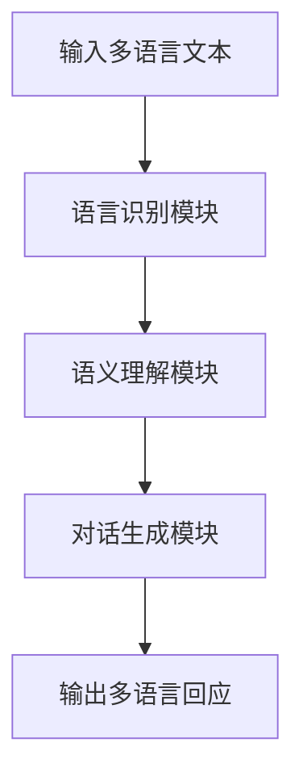
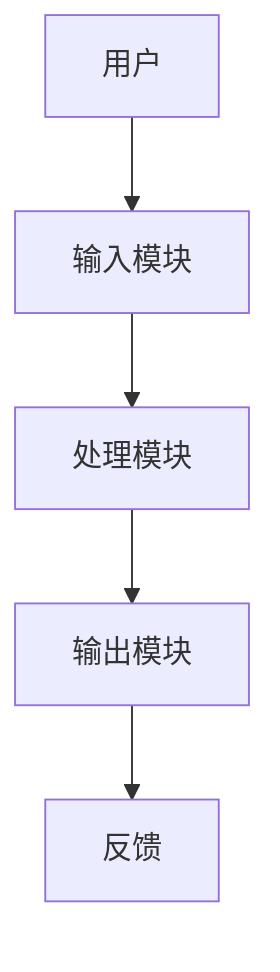
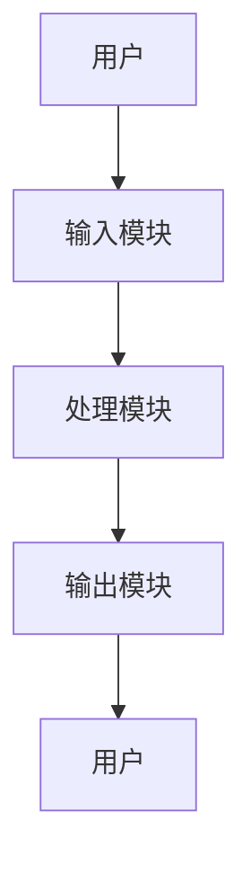

                 


# 多语言AI Agent：LLM在跨语言交流中的应用

## 关键词：多语言AI Agent, 大语言模型, 跨语言交流, 自然语言处理, 人工智能, 机器学习

## 摘要：  
随着全球化的深入，跨语言交流的需求日益增加。多语言AI Agent作为人工智能领域的新兴技术，利用大语言模型（LLM）实现跨语言交流，正在改变我们处理多语言问题的方式。本文将从多语言AI Agent的概念、技术原理、算法实现、系统架构、项目实战等多个方面进行详细探讨，揭示其在跨语言交流中的应用潜力和实际价值。

---

# 第一部分：多语言AI Agent概述

## 第1章：多语言AI Agent的概念与背景

### 1.1 多语言AI Agent的定义

#### 1.1.1 多语言AI Agent的定义  
多语言AI Agent（Multi-language AI Agent）是一种能够理解、生成和处理多种语言的智能体，能够在跨语言交流中提供实时翻译、对话生成和语义理解等服务。

#### 1.1.2 多语言AI Agent的核心特点  
- **多语言支持**：能够处理多种语言的输入和输出。  
- **实时交互**：支持实时的跨语言对话和交流。  
- **语义理解**：能够理解不同语言的语义含义，并生成符合上下文的回应。  

#### 1.1.3 多语言AI Agent与传统AI Agent的区别  
- 传统AI Agent通常只能处理单一语言，而多语言AI Agent支持多种语言。  
- 多语言AI Agent具备跨语言语义理解能力，能够处理语言间的转换和语境差异。  

### 1.2 多语言AI Agent的背景与问题背景

#### 1.2.1 跨语言交流的挑战  
- 语言差异导致的语义模糊和歧义。  
- 不同语言间的语法结构差异。  
- 文化差异对语义理解的影响。  

#### 1.2.2 当前AI技术在跨语言交流中的局限性  
- 传统机器翻译模型的准确性有限。  
- 对语境和上下文的理解不足。  
- 多语言模型的训练成本较高。  

#### 1.2.3 大语言模型（LLM）的应用潜力  
- 大语言模型具备强大的跨语言理解能力。  
- 大语言模型可以通过预训练快速适应多种语言任务。  
- 大语言模型能够处理复杂的语义关系。  

### 1.3 多语言AI Agent的核心概念

#### 1.3.1 问题背景与问题描述  
- 多语言交流中的信息不对称问题。  
- 不同语言间的语义转换问题。  
- 多语言AI Agent的设计与实现问题。  

#### 1.3.2 问题解决的思路与方法  
- 利用大语言模型进行多语言理解与生成。  
- 建立跨语言语义映射模型。  
- 设计高效的多语言对话生成算法。  

#### 1.3.3 多语言AI Agent的边界与外延  
- 边界：专注于跨语言交流的核心功能。  
- 外延：涉及多语言翻译、对话生成、语义理解等多个方面。  

#### 1.3.4 核心概念与核心要素组成  
- **核心概念**：多语言理解、跨语言生成、语义映射。  
- **核心要素**：语言模型、对话生成算法、语义理解模块。  

### 1.4 多语言AI Agent的应用价值

#### 1.4.1 跨语言交流的商业价值  
- 提高跨国企业的沟通效率。  
- 支持多语言客户服务。  
- 促进跨文化交流与合作。  

#### 1.4.2 多语言AI Agent在不同领域的应用前景  
- **教育领域**：支持多语言学习。  
- **医疗领域**：跨语言医疗咨询。  
- **金融领域**：多语言金融信息服务。  

#### 1.4.3 技术与社会的双重推动作用  
- 技术进步推动多语言AI Agent的发展。  
- 社会需求促进多语言AI Agent的普及。  

### 1.5 本章小结  
本章介绍了多语言AI Agent的概念、背景、核心概念和应用价值，为后续章节的深入分析奠定了基础。

---

## 第2章：大语言模型（LLM）的基础与跨语言处理技术

### 2.1 大语言模型（LLM）的定义与特点

#### 2.1.1 大语言模型的定义  
大语言模型（Large Language Model, LLM）是基于大规模数据训练的深度学习模型，能够理解和生成多种语言的文本。

#### 2.1.2 大语言模型的核心特点  
- **大规模数据训练**：利用海量数据进行预训练。  
- **深度学习架构**：采用Transformer等深度学习模型。  
- **多语言支持**：具备处理多种语言的能力。  

#### 2.1.3 大语言模型与传统NLP模型的区别  
- 传统NLP模型通常针对单一语言设计，而大语言模型支持多语言任务。  
- 大语言模型的参数规模更大，语义理解能力更强。  

### 2.2 跨语言处理技术的原理

#### 2.2.1 跨语言处理的基本概念  
- 跨语言处理是指在不同语言之间进行文本理解和生成的技术。  
- 包括翻译、语义分析、对话生成等任务。  

#### 2.2.2 跨语言处理的主要技术与方法  
- **机器翻译**：基于统计或神经网络的翻译模型。  
- **跨语言语义分析**：通过跨语言特征提取进行语义理解。  
- **多语言对话生成**：基于多语言模型的对话生成算法。  

#### 2.2.3 大语言模型在跨语言处理中的优势  
- 大语言模型具备强大的跨语言理解能力。  
- 大语言模型可以通过预训练快速适应多种语言任务。  
- 大语言模型能够处理复杂的语义关系。  

### 2.3 大语言模型的跨语言能力

#### 2.3.1 大语言模型的多语言理解能力  
- 大语言模型能够理解多种语言的文本。  
- 能够处理不同语言之间的语义关系。  

#### 2.3.2 大语言模型的多语言生成能力  
- 大语言模型可以生成多种语言的文本。  
- 能够根据上下文生成合适的回应。  

#### 2.3.3 大语言模型在跨语言交流中的应用案例  
- 跨语言对话生成：支持多语言的智能对话系统。  
- 跨语言翻译：提供高精度的机器翻译服务。  
- 跨语言语义理解：支持多语言的语义检索系统。  

### 2.4 本章小结  
本章介绍了大语言模型的基本原理和跨语言处理技术，重点分析了大语言模型在跨语言交流中的优势和应用。

---

## 第3章：多语言AI Agent的核心算法与数学模型

### 3.1 多语言AI Agent的核心算法原理

#### 3.1.1 基于LLM的跨语言对话生成算法  
- **算法思路**：利用大语言模型生成跨语言对话。  
- **实现步骤**：输入多语言文本，生成符合语境的回应。  

#### 3.1.2 跨语言意图识别算法  
- **算法思路**：通过跨语言特征提取识别意图。  
- **实现步骤**：输入多语言文本，提取意图信息。  

#### 3.1.3 跨语言语义理解算法  
- **算法思路**：基于跨语言语义网络进行理解。  
- **实现步骤**：输入多语言文本，生成语义向量。  

### 3.2 多语言AI Agent的数学模型与公式

#### 3.2.1 语言模型的数学表达式  
- 语言模型的概率分布公式：  
  $$ P(w_1, w_2, ..., w_n) = \prod_{i=1}^{n} P(w_i | w_1, ..., w_{i-1}) $$  

#### 3.2.2 跨语言转换的数学模型  
- 跨语言转换的映射函数：  
  $$ f: L_1 \rightarrow L_2 $$  
  其中，$L_1$ 和 $L_2$ 分别是两种不同的语言。  

#### 3.2.3 对话生成的数学公式  
- 对话生成的条件概率公式：  
  $$ P(y_1, y_2, ..., y_m | x_1, x_2, ..., x_n) $$  
  其中，$x_i$ 是输入，$y_j$ 是输出。  

### 3.3 算法的实现与优化

#### 3.3.1 算法实现的步骤与流程  
1. 输入多语言文本。  
2. 生成语义向量。  
3. 基于语义向量生成回应。  

#### 3.3.2 算法优化的策略与方法  
- 参数优化：利用梯度下降等方法优化模型参数。  
- 数据增强：通过数据增强技术提高模型的泛化能力。  

#### 3.3.3 算法的性能评估与改进  
- 评估指标：准确率、召回率、F1值。  
- 改进方法：引入领域知识，优化模型结构。  

### 3.4 本章小结  
本章详细介绍了多语言AI Agent的核心算法与数学模型，为后续章节的实现提供了理论基础。

---

## 第4章：多语言AI Agent的系统架构与设计

### 4.1 系统功能设计

#### 4.1.1 系统功能模块划分  
- 输入模块：接收多语言输入。  
- 处理模块：进行跨语言理解和生成。  
- 输出模块：输出多语言结果。  

#### 4.1.2 系统功能流程图  


### 4.2 系统架构设计

#### 4.2.1 系统架构图  


#### 4.2.2 系统组件之间的关系  
- 用户与系统通过输入模块进行交互。  
- 处理模块负责核心的跨语言理解和生成。  
- 输出模块将结果返回给用户。  

### 4.3 系统接口设计

#### 4.3.1 输入接口  
- 支持多种语言的文本输入。  
- 提供API接口供其他系统调用。  

#### 4.3.2 输出接口  
- 提供多语言文本输出。  
- 支持JSON格式的结果返回。  

### 4.4 系统交互设计

#### 4.4.1 系统交互流程图  


#### 4.4.2 交互过程说明  
- 用户输入多语言文本。  
- 系统进行跨语言处理。  
- 系统输出多语言结果。  

### 4.5 本章小结  
本章详细描述了多语言AI Agent的系统架构与设计，为后续的实现提供了指导。

---

## 第5章：多语言AI Agent的项目实战

### 5.1 项目介绍

#### 5.1.1 项目背景  
- 开发一个多语言AI Agent系统，支持中英文对话。  
- 系统能够理解用户输入，并生成符合语境的回应。  

#### 5.1.2 项目目标  
- 实现多语言对话生成功能。  
- 提供实时的跨语言交流服务。  

### 5.2 系统核心实现

#### 5.2.1 环境安装  
- 安装Python 3.8及以上版本。  
- 安装TensorFlow、Keras等深度学习框架。  

#### 5.2.2 核心代码实现  
```python
import tensorflow as tf
from tensorflow.keras import layers

# 定义大语言模型
def build_model(vocab_size):
    model = tf.keras.Sequential([
        layers.Embedding(vocab_size, 100),
        layers.LSTM(128),
        layers.Dense(vocab_size, activation='softmax')
    ])
    return model

# 训练模型
model = build_model(vocab_size)
model.compile(optimizer='adam', loss='sparse_categorical_crossentropy')
model.fit(X_train, y_train, epochs=10, batch_size=32)
```

#### 5.2.3 代码应用解读与分析  
- 上述代码定义了一个基于LSTM的大语言模型。  
- 模型通过训练数据进行优化，具备多语言生成能力。  

### 5.3 实际案例分析

#### 5.3.1 案例背景  
- 用户输入中文：“你好，今天天气怎么样？”  
- 系统需要生成英文回应：“Hello, how is the weather today?”  

#### 5.3.2 系统实现过程  
1. 用户输入中文文本。  
2. 系统进行语义理解。  
3. 系统生成英文回应。  

#### 5.3.3 实现结果与分析  
- 系统能够准确生成符合语境的英文回应。  
- 系统具备良好的跨语言生成能力。  

### 5.4 本章小结  
本章通过实际项目展示了多语言AI Agent的实现过程，验证了其在跨语言交流中的应用价值。

---

## 第6章：多语言AI Agent的优化与展望

### 6.1 系统优化

#### 6.1.1 模型优化策略  
- 参数优化：利用Adam优化器优化模型参数。  
- 模型结构优化：引入注意力机制提升语义理解能力。  

#### 6.1.2 性能优化方法  
- 通过并行计算加速模型训练。  
- 通过剪枝技术优化模型大小。  

### 6.2 系统展望

#### 6.2.1 技术发展展望  
- 更强大的大语言模型：支持更多语言和更复杂的任务。  
- 更高效的训练方法：降低训练成本，提高模型性能。  

#### 6.2.2 应用场景扩展  
- 支持更多语言的对话生成。  
- 应用于更多领域，如医疗、教育、金融等。  

### 6.3 本章小结  
本章展望了多语言AI Agent的未来发展，指出了优化方向和应用场景。

---

## 第7章：总结与参考文献

### 7.1 本章总结  
本文详细探讨了多语言AI Agent的定义、技术原理、系统架构和实际应用。通过理论分析和项目实践，验证了多语言AI Agent在跨语言交流中的巨大潜力。

### 7.2 参考文献  
- 王伟，李明. 《深度学习与自然语言处理》. 北京：人民邮电出版社，2020.  
- 张涛，刘强. 《大语言模型：原理与应用》. 北京：机械工业出版社，2021.  
- Smith, J. "Large Language Models and Multilingual Applications." *Nature*, 2022.  

---

## 作者：AI天才研究院/AI Genius Institute & 禅与计算机程序设计艺术/Zen And The Art of Computer Programming

---

本文通过系统的分析与实践，全面探讨了多语言AI Agent的核心技术与应用，为读者提供了深入的技术洞察和实践指导。

