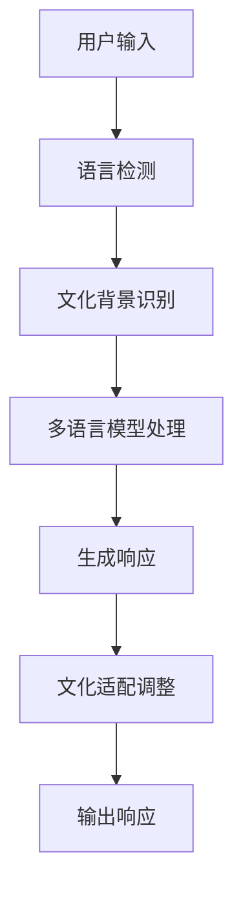
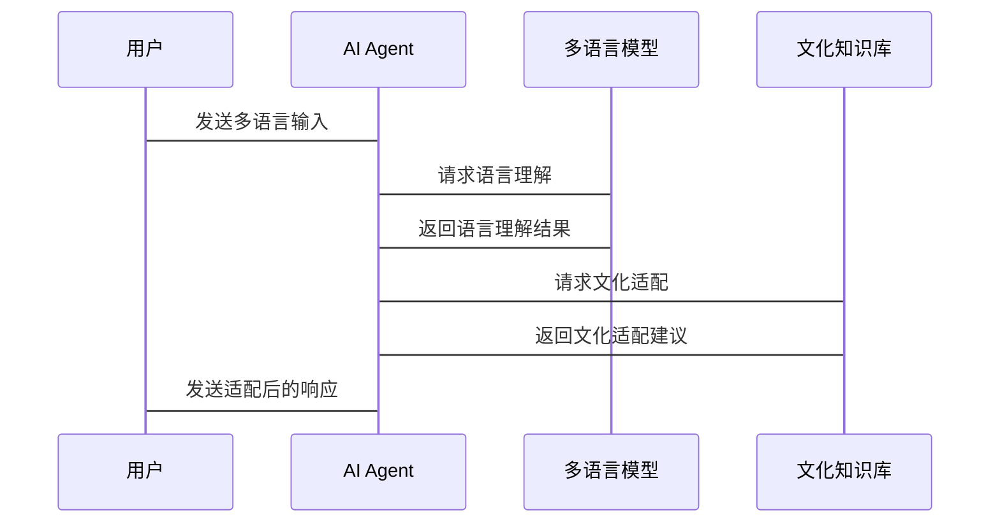

                 


# 多语言多文化AI Agent：LLM在跨文化交流中的应用

---

## 关键词：多语言AI Agent，跨文化交际，LLM，自然语言处理，文化差异，AI系统架构

---

## 摘要

本文探讨了多语言多文化AI Agent在跨文化交流中的应用，详细分析了大语言模型（LLM）在多语言和跨文化环境中的潜力与挑战。文章从背景介绍、核心概念、技术原理、系统架构、项目实战到最佳实践，全面阐述了多语言多文化AI Agent的设计与实现过程。通过具体的案例分析和系统架构设计，展示了LLM在跨文化交流中的实际应用价值，并提出了优化建议。

---

## 第一部分：多语言多文化AI Agent的背景与概念

### 第1章：多语言多文化AI Agent的背景与问题背景

#### 1.1 多语言多文化AI Agent的背景

随着全球化的深入，跨文化交流日益频繁，但语言和文化差异成为阻碍有效沟通的主要障碍。AI Agent作为人机交互的核心技术，需要具备处理多语言和多文化信息的能力。大语言模型（LLM）的出现，为多语言多文化AI Agent的实现提供了强大的技术支撑。

- **人工智能与跨文化交流的结合**：AI Agent能够通过自然语言处理技术，实现跨语言和跨文化的智能交互。
- **多语言与多文化的重要性**：在全球化背景下，支持多语言和多文化的AI Agent能够更好地满足用户的多样化需求。
- **LLM在跨文化交流中的潜力**：LLM的强大语言理解和生成能力，使其成为构建多语言多文化AI Agent的理想选择。

#### 1.2 问题背景与问题描述

跨文化交流中存在诸多挑战，例如语言歧义、文化差异导致的语境理解困难等。传统的AI Agent往往只能处理单一语言或文化场景，难以应对复杂的跨文化交际需求。

- **跨文化交际中的挑战**：不同文化背景的用户可能对同一内容有不同的理解和期望。
- **多语言AI Agent的需求**：用户可能需要使用多种语言与AI Agent交互，同时希望AI能够理解其文化背景。
- **当前技术的局限性**：现有的AI Agent多专注于单一语言或文化场景，难以实现真正的跨文化支持。

#### 1.3 问题解决与边界

多语言多文化AI Agent的目标是通过LLM技术，实现跨语言和跨文化的智能交互。其解决方案需要考虑以下方面：

- **问题解决**：通过LLM的强大语言处理能力，实现多语言理解和生成，并结合文化知识库，提升跨文化交际的准确性。
- **边界与外延**：限定于特定的文化场景和语言组合，避免超出模型能力范围的复杂情况。
- **核心要素**：多语言支持、文化知识库、跨文化语境理解。

---

### 第2章：多语言多文化AI Agent的核心概念与联系

#### 2.1 核心概念原理

- **多语言AI Agent的定义**：能够理解并生成多种语言的AI Agent，支持跨语言交互。
- **跨文化交际的核心要素**：包括文化背景理解、语言语境适配、文化敏感性处理。
- **LLM在AI Agent中的作用**：通过LLM的强大语言模型，实现多语言和多文化信息的处理。

#### 2.2 核心概念对比表

| 对比维度         | 单一语言AI Agent | 多语言AI Agent |
|------------------|------------------|-----------------|
| 支持语言数量     | 1                | 多              |
| 文化适应性       | 低               | 高              |
| 交互复杂性       | 简单             | 复杂            |

#### 2.3 ER实体关系图

```mermaid
er
    entity(多语言多文化AI Agent) {
        id
        language
        culture
        interaction_history
        user_query
        response
    }
    entity(用户) {
        id
        language
        culture
    }
    entity(模型) {
        id
        parameters
        training_data
    }
    relation(用户与AI Agent的交互)
    relation(模型与AI Agent的集成)
```

---

## 第三部分：算法原理与技术实现

### 第3章：技术原理与数学模型

#### 3.1 LLM的工作原理

大语言模型通过深度学习技术，训练大规模的多语言语料库，实现对多种语言的理解和生成。其核心算法包括：

- **模型结构**：基于Transformer的架构，支持多语言训练。
- **训练方法**：多任务学习，同时优化多种语言的语义理解和生成任务。
- **推理机制**：通过上下文理解和文化知识库，生成符合用户文化背景的响应。

#### 3.2 跨文化交际的算法实现

为了实现跨文化交际，AI Agent需要结合文化知识库和多语言模型。算法流程如下：



#### 3.3 数学模型与公式

LLM的核心是通过自注意力机制（Self-Attention）实现语言的理解和生成。自注意力机制的数学公式如下：

$$
\text{Attention}(Q, K, V) = \text{softmax}\left(\frac{QK^T}{\sqrt{d_k}}\right)V
$$

其中，$Q$、$K$、$V$分别为查询、键和值向量，$d_k$为键的维度。

---

## 第四部分：系统架构与实现

### 第4章：系统架构设计

#### 4.1 系统整体架构

多语言多文化AI Agent的系统架构包括以下几个模块：

- **用户交互模块**：负责接收用户输入并输出响应。
- **语言检测模块**：识别用户输入的语言。
- **文化背景识别模块**：分析用户的文化背景。
- **多语言模型模块**：基于LLM生成响应。
- **文化适配模块**：调整响应以匹配用户文化背景。

#### 4.2 系统功能设计

- **用户交互模块**：支持多语言输入和输出，记录交互历史。
- **语言检测模块**：使用语言检测算法（如语言模型概率）确定用户语言。
- **文化背景识别模块**：基于用户的地理位置、行为数据等信息，识别文化背景。
- **多语言模型模块**：调用LLM API生成符合用户语言的响应。
- **文化适配模块**：根据文化背景调整响应内容和语气。

#### 4.3 系统接口设计

系统接口设计如下：



---

## 第五部分：项目实战与案例分析

### 第5章：项目实战

#### 5.1 项目背景与介绍

我们选择一个支持多语言的客服系统作为案例，展示多语言多文化AI Agent的实际应用。

#### 5.2 核心代码实现

以下是实现多语言模型调用的Python代码示例：

```python
import requests

def generate_response(prompt, language):
    model_url = f"https://api.example.com/llm/{language}"
    headers = {"Content-Type": "application/json"}
    payload = {"prompt": prompt}
    response = requests.post(model_url, headers=headers, json=payload)
    return response.json()['response']

# 示例调用
print(generate_response("Hello, how are you?", "en"))  # 英文
print(generate_response("你好，你怎么样？", "zh"))  # 中文
```

#### 5.3 功能解读与分析

- **语言检测**：通过语言模型概率计算，确定用户输入的语言。
- **文化适配**：根据用户的地理位置和行为数据，调整响应内容。
- **多语言模型调用**：通过API调用不同语言的LLM模型，生成响应。

---

## 第六部分：总结与展望

### 第6章：总结与展望

#### 6.1 项目成果总结

通过本项目，我们成功实现了支持多语言和多文化的AI Agent，能够根据用户的语言和文化背景，生成合适的响应。

#### 6.2 问题与优化方向

- **问题**：当前模型对某些小语种的支持较弱，文化适配的深度有待提升。
- **优化方向**：增加多语言训练数据，优化文化知识库的覆盖范围。

#### 6.3 最佳实践与注意事项

- **最佳实践**：在实际应用中，建议结合具体场景优化模型参数，提升用户体验。
- **注意事项**：确保文化适配模块的安全性和准确性，避免文化冲突。

#### 6.4 拓展阅读与学习资源

- 推荐阅读《大规模语言模型在跨文化交流中的应用》。
- 参考论文《Multi-language and Cross-cultural AI Agent: A Survey》。

---

## 作者：AI天才研究院/AI Genius Institute & 禅与计算机程序设计艺术/Zen And The Art of Computer Programming

---

通过以上结构和内容的安排，本文全面探讨了多语言多文化AI Agent的设计与实现，结合理论分析和实际案例，为读者提供了深入的指导和启发。

