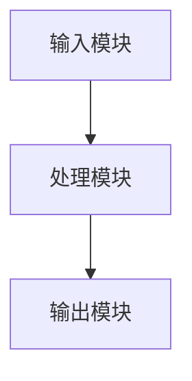
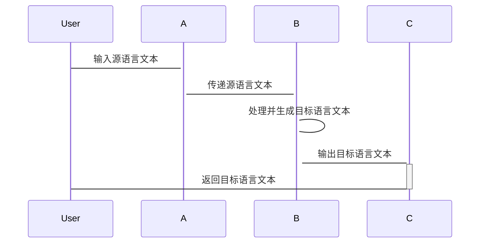

                 


# 多语言翻译 AI Agent：LLM 在跨语言交流中的应用

> 关键词：多语言翻译，AI Agent，LLM，跨语言交流，自然语言处理，人工智能

> 摘要：本文探讨了多语言翻译 AI Agent 在跨语言交流中的应用，详细分析了大语言模型（LLM）在多语言翻译中的核心原理、系统架构与设计、项目实战以及最佳实践。通过深入的技术分析和实际案例，本文展示了如何利用 LLM 构建高效的多语言翻译 AI Agent，以解决跨语言交流中的关键问题。

---

# 第1章：多语言翻译 AI Agent 的背景与问题描述

## 1.1 问题背景

### 1.1.1 当前跨语言交流的挑战

在全球化的背景下，跨语言交流变得越来越频繁。然而，语言障碍仍然是一个普遍存在的问题，尤其是在技术领域。传统的翻译工具和方法存在以下挑战：

- **准确性不足**：传统机器翻译技术在处理复杂语境和语义时常常出现错误。
- **实时性差**：跨语言交流需要快速响应，传统方法难以满足实时性要求。
- **定制化能力有限**：不同领域和场景对翻译的需求不同，传统工具难以灵活适应。

### 1.1.2 多语言翻译的描述

多语言翻译是指将一种语言的文本准确地转换为另一种或多种语言的过程。这一过程不仅需要理解源语言的语法和语义，还需要掌握目标语言的文化和表达习惯。实现高质量的多语言翻译需要结合先进的自然语言处理技术。

### 1.1.3 问题解决与边界

AI Agent（智能代理）在跨语言交流中的作用日益重要。通过结合大语言模型（LLM），AI Agent能够实现高效的多语言翻译。其功能边界包括：

- 提供实时的多语言翻译服务。
- 支持多种语言的交互。
- 理解上下文并生成自然语言回复。

### 1.1.4 核心概念与结构

多语言翻译 AI Agent 的概念模型包括以下几个核心要素：

- **输入**：源语言文本或语音。
- **处理**：通过 LLM 进行翻译、理解和生成。
- **输出**：目标语言的文本或语音。

通过这些核心要素的协同工作，AI Agent能够实现高质量的多语言翻译。

---

# 第2章：大语言模型与 AI Agent 的核心概念

## 2.1 大语言模型的定义与特点

### 2.1.1 大语言模型的基本概念

大语言模型（LLM）是一种基于深度学习的自然语言处理模型，能够理解和生成多种语言的文本。LLM 的核心特点包括：

- **大规模训练数据**：通过大量的多语言数据进行预训练。
- **强大的上下文理解**：能够处理复杂的语义和语法结构。
- **可扩展性**：支持多种任务和应用场景。

### 2.1.2 AI Agent 的定义与功能

AI Agent 是一种智能代理系统，能够通过自然语言处理技术与用户进行交互。其核心功能包括：

- **语言理解**：通过 LLM 理解用户输入的源语言文本。
- **翻译与生成**：将源语言文本翻译为目标语言，并生成自然语言回复。
- **多语言支持**：支持多种语言的输入和输出。

### 2.1.3 LLM 在 AI Agent 中的作用

LLM 在 AI Agent 中扮演着关键角色，包括：

- **语言理解引擎**：帮助 AI Agent 理解用户输入的源语言文本。
- **对话生成引擎**：生成自然流畅的目标语言回复。
- **跨语言支持**：通过多语言模型实现多种语言的翻译与交互。

---

# 第3章：多语言翻译 AI Agent 的核心原理

## 3.1 多语言翻译的基本原理

### 3.1.1 多语言翻译的实现方法

多语言翻译的实现方法包括：

- **基于规则的翻译**：通过语言学规则进行翻译，适用于简单场景。
- **统计机器翻译**：基于概率模型进行翻译，依赖大量的平行文本数据。
- **神经机器翻译**：基于深度学习的端到端模型，能够处理复杂的语言结构。

### 3.1.2 跨语言翻译的挑战与解决方案

跨语言翻译的挑战包括：

- **语义理解**：不同语言之间的语义差异。
- **文化差异**：目标语言中的文化表达习惯。

解决方案包括：

- **多语言模型**：通过预训练多语言模型实现跨语言理解。
- **上下文感知**：通过上下文理解生成更准确的翻译。

### 3.1.3 基于 LLM 的多语言翻译模型

基于 LLM 的多语言翻译模型具有以下特点：

- **预训练**：通过多语言数据进行预训练，具备强大的上下文理解能力。
- **微调**：针对特定领域或场景进行微调，提高翻译质量。
- **生成式**：能够生成自然流畅的目标语言文本。

## 3.2 AI Agent 的工作原理

### 3.2.1 AI Agent 的信息处理流程

AI Agent 的信息处理流程包括：

1. **接收输入**：获取源语言文本或语音。
2. **语言理解**：通过 LLM 理解输入内容。
3. **翻译与生成**：将源语言文本翻译为目标语言，并生成回复。
4. **输出结果**：返回目标语言的文本或语音。

### 3.2.2 基于 LLM 的对话生成机制

基于 LLM 的对话生成机制包括：

- **上下文理解**：通过 LLM 理解对话的上下文。
- **回复生成**：基于上下文生成自然流畅的回复。

### 3.2.3 多语言支持的技术实现

多语言支持的技术实现包括：

- **多语言模型**：使用支持多种语言的 LLM 进行翻译。
- **语言切换**：根据需求动态切换目标语言。

## 3.3 LLM 在多语言翻译中的应用

### 3.3.1 多语言模型的训练与优化

多语言模型的训练与优化包括：

- **预训练**：使用多语言数据进行预训练。
- **微调**：针对特定语言或领域进行微调。

### 3.3.2 基于 LLM 的翻译质量评估

翻译质量评估包括：

- ** BLEU 分数**：基于统计的翻译质量评估指标。
- **人工评估**：通过人工评估翻译的准确性和流畅性。

### 3.3.3 跨语言对话中的上下文理解

上下文理解在跨语言对话中的重要性包括：

- **语义一致性**：确保翻译后的内容保持原意。
- **对话连贯性**：保持对话的连贯性和逻辑性。

---

# 第4章：多语言翻译 AI Agent 的系统架构与设计

## 4.1 系统架构概述

### 4.1.1 系统整体架构设计

系统整体架构设计包括以下几个部分：

- **输入模块**：接收源语言文本或语音。
- **处理模块**：通过 LLM 进行翻译和生成。
- **输出模块**：返回目标语言的文本或语音。

### 4.1.2 各组件的功能与交互

各组件的功能与交互包括：

- **输入模块**：将源语言文本传递给处理模块。
- **处理模块**：通过 LLM 进行翻译和生成，返回目标语言文本。
- **输出模块**：将目标语言文本输出给用户。

### 4.1.3 系统的可扩展性与灵活性

系统的可扩展性与灵活性包括：

- **支持多种语言**：通过配置可以支持多种语言。
- **动态切换语言**：根据需求动态切换目标语言。

## 4.2 功能模块设计

### 4.2.1 多语言翻译模块

多语言翻译模块的功能包括：

- **语言检测**：自动检测输入语言。
- **翻译与生成**：将源语言文本翻译为目标语言，并生成自然语言回复。

### 4.2.2 AI Agent 交互模块

AI Agent 交互模块的功能包括：

- **接收输入**：获取用户的源语言输入。
- **处理输入**：通过 LLM 处理输入并生成回复。
- **输出回复**：将生成的回复返回给用户。

## 4.3 系统架构图



## 4.4 系统交互流程图



---

# 第5章：多语言翻译 AI Agent 的项目实战

## 5.1 环境安装

### 5.1.1 安装 Python

```bash
# 安装 Python
sudo apt-get install python3 python3-pip
```

### 5.1.2 安装 LLM 库

```bash
# 安装 LLM 库，例如 transformers
pip install transformers
```

### 5.1.3 安装其他依赖

```bash
# 安装其他依赖
pip install numpy matplotlib
```

## 5.2 核心代码实现

### 5.2.1 多语言翻译模块

```python
from transformers import AutoTokenizer, AutoModelForSeq2Seq
import torch

class MultiLanguageTranslator:
    def __init__(self, model_name):
        self.tokenizer = AutoTokenizer.from_pretrained(model_name)
        self.model = AutoModelForSeq2Seq.from_pretrained(model_name)
        self.model.to('cuda' if torch.cuda.is_available() else 'cpu')

    def translate(self, src_text, tgt_lang):
        inputs = self.tokenizer(src_text, return_tensors='pt')
        with torch.no_grad():
            outputs = self.model.generate(inputs['input_ids'].to(self.model.device), max_length=50)
        translated = self.tokenizer.decode(outputs[0], skip_special_tokens=True)
        return translated
```

### 5.2.2 AI Agent 交互模块

```python
class AIAgent:
    def __init__(self, translator):
        self.translator = translator

    def start_chat(self):
        while True:
            user_input = input("请输入源语言文本：")
            if not user_input:
                break
            tgt_lang = input("请输入目标语言：")
            translated = self.translator.translate(user_input, tgt_lang)
            print(f"翻译结果：{translated}")
```

## 5.3 实际案例分析

### 5.3.1 案例描述

假设用户输入的源语言是中文，目标语言是英文：

```python
translator = MultiLanguageTranslator("facebook/m2m100")
agent = AIAgent(translator)
agent.start_chat()
```

输入：
```
请输入源语言文本：你好，今天天气很好。
请输入目标语言：English
```

输出：
```
翻译结果：Hello, today's weather is very good.
```

### 5.3.2 代码解读与分析

上述代码实现了多语言翻译功能，通过预训练的 LLM 模型进行翻译。用户输入源语言文本和目标语言，系统自动进行翻译并输出结果。

---

# 第6章：最佳实践与总结

## 6.1 最佳实践 tips

### 6.1.1 模型选择与优化

- 选择适合特定任务的 LLM 模型。
- 根据需求进行微调以提高性能。

### 6.1.2 数据处理与管理

- 确保数据的多样性和代表性。
- 处理敏感数据时注意隐私保护。

### 6.1.3 系统优化与维护

- 定期更新模型和数据。
- 监控系统的性能和稳定性。

## 6.2 小结

本文详细探讨了多语言翻译 AI Agent 的核心原理、系统架构与设计、项目实战以及最佳实践。通过结合 LLM 技术，AI Agent 在跨语言交流中的应用变得更加高效和准确。

## 6.3 注意事项

- **数据隐私**：处理用户数据时需遵守相关法律法规。
- **模型性能**：确保模型在多语言翻译中的准确性和流畅性。
- **系统稳定性**：保证系统的稳定运行，避免因技术问题影响用户体验。

## 6.4 拓展阅读

- [1] 大语言模型的训练与优化
- [2] 多语言 NLP 技术的最新进展
- [3] AI Agent 在其他领域的应用

---

# 作者

作者：AI天才研究院/AI Genius Institute & 禅与计算机程序设计艺术 /Zen And The Art of Computer Programming

