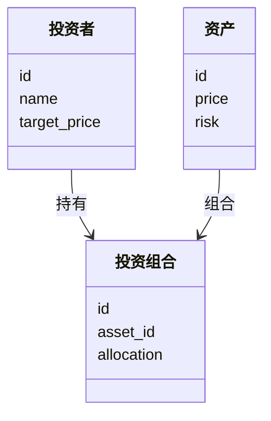
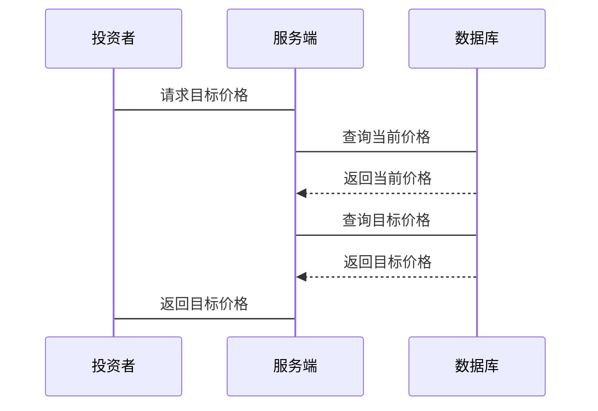

                 


# 大卫·德雷曼的反向定价：从目标价格倒推投资决策

> 关键词：反向定价、投资决策、定价模型、投资策略、目标价格、系统架构

> 摘要：本文详细介绍了大卫·德雷曼的反向定价方法，从目标价格倒推投资决策的原理、算法、系统架构和项目实战。通过数学模型、Python代码和实际案例分析，帮助读者掌握反向定价的应用技巧，优化投资决策。

---

## 第1章: 反向定价的背景与核心概念

### 1.1 反向定价的起源与现状

#### 1.1.1 传统定价方法的局限性
传统定价方法依赖于市场供需关系和历史数据，但在市场波动剧烈或信息不对称的情况下，这些方法往往失效。例如，基本面分析需要大量的数据处理和假设条件，而技术分析则依赖于价格走势的预测，具有较大的不确定性。

#### 1.1.2 反向定价的定义与特点
反向定价是一种逆向思维的投资策略，从目标价格出发，推导出相应的投资决策。其特点包括：目标导向性、逆向思维、动态调整和结果导向。

#### 1.1.3 反向定价在投资决策中的应用
反向定价常用于股票投资、资产配置和风险管理等领域。它帮助投资者在市场不确定性中找到潜在的投资机会，优化投资组合。

### 1.2 投资决策中的问题背景

#### 1.2.1 投资者面临的定价难题
投资者在面对市场波动和不确定性时，常常难以准确预测价格走势，导致投资决策失误。

#### 1.2.2 传统定价模型的不足
传统定价模型假设市场有效性和理性预期，但在实际市场中，情绪和非理性行为往往影响价格。

#### 1.2.3 反向定价的优势与适用场景
反向定价的优势在于其目标导向性和逆向思维，适用于市场波动较大或传统定价模型失效的情况。

### 1.3 反向定价的核心概念与联系

#### 1.3.1 反向定价的原理与机制
反向定价通过设定目标价格，推导出相应的投资策略，包括资产配置和交易时机。

#### 1.3.2 反向定价与投资决策的关系
目标价格是投资决策的核心，反向定价通过调整目标价格，优化投资组合。

---

## 第2章: 反向定价的核心概念与联系

### 2.1 反向定价的原理与机制

#### 2.1.1 反向定价的数学模型
反向定价的核心公式如下：
$$ P_{target} = \alpha \cdot P_{current} + \beta \cdot (1 - \alpha) $$
其中，$\alpha$ 是目标权重，$\beta$ 是调整系数。

#### 2.1.2 反向定价与投资决策的关系
目标价格是投资决策的关键，反向定价通过调整目标价格，优化投资组合。

#### 2.1.3 反向定价的核心要素分析
目标价格、权重调整、投资组合优化是反向定价的核心要素。

### 2.2 反向定价与传统定价方法的对比

#### 2.2.1 核心概念对比表格
| 对比维度 | 反向定价 | 传统定价 |
|----------|----------|----------|
| 方法基础 | 目标价格 | 市场供需 |
| 决策依据 | 逆向思维 | 正向分析 |
| 适用场景 | 波动市场 | 稳定市场 |

#### 2.2.2 反向定价的ER实体关系图
```mermaid
erDiagram
    customer[投资者] {
        <属性>
        id : int
        name : string
        target_price : float
    }
    asset[资产] {
        <属性>
        id : int
        price : float
        risk : float
    }
    investment[投资组合] {
        <属性>
        id : int
        asset_id : int
        allocation : float
    }
    customer --> investment : 持有
    asset --> investment : 组合
```

---

## 第3章: 反向定价的算法原理

### 3.1 反向定价的数学模型与公式

#### 3.1.1 反向定价的数学推导
反向定价公式：
$$ P_{target} = \alpha \cdot P_{current} + \beta \cdot (1 - \alpha) $$
其中，$\alpha$ 是目标权重，$\beta$ 是调整系数。

#### 3.1.2 反向定价的公式表达
目标价格公式：
$$ P_{target} = \alpha \cdot P + (1 - \alpha) \cdot (P_{min} + P_{max}) / 2 $$

### 3.2 反向定价的实现步骤

#### 3.2.1 数据采集与预处理
```python
import pandas as pd
data = pd.read_csv('stock_data.csv')
data['date'] = pd.to_datetime(data['date'])
data.set_index('date', inplace=True)
```

#### 3.2.2 模型构建与参数优化
```python
import numpy as np
def reverse_pricing(current_price, alpha=0.5, beta=0.5):
    target_price = alpha * current_price + beta * (1 - alpha)
    return target_price
```

---

## 第4章: 反向定价的系统分析与架构设计

### 4.1 系统分析

#### 4.1.1 问题场景介绍
目标是为投资者提供一个基于反向定价的投资决策支持系统。

#### 4.1.2 系统功能需求
包括数据采集、模型计算、结果展示和投资建议。

#### 4.1.3 系统功能设计（领域模型Mermaid类图）


### 4.2 系统架构设计

#### 4.2.1 系统架构图（Mermaid）
```mermaid
container 系统架构 {
    客户端
    服务端
    数据库
}
```

#### 4.2.2 系统接口设计
API接口：`/pricing`，接收参数：current_price、alpha、beta。

#### 4.2.3 系统交互流程（Mermaid序列图）


---

## 第5章: 反向定价的项目实战

### 5.1 项目环境与工具安装

#### 5.1.1 环境配置
安装Python、Pandas、NumPy和Mermaid工具。

#### 5.1.2 工具安装与配置
安装步骤：
```bash
pip install pandas numpy
```

### 5.2 核心代码实现

#### 5.2.1 反向定价算法实现
```python
def reverse_pricing(current_price, alpha=0.5, beta=0.5):
    target_price = alpha * current_price + beta * (1 - alpha)
    return target_price
```

#### 5.2.2 投资决策系统核心代码
```python
import pandas as pd
data = pd.read_csv('stock_data.csv')
data['target_price'] = data['current_price'].apply(lambda x: reverse_pricing(x))
```

#### 5.2.3 代码解读与分析
代码实现反向定价算法，计算目标价格，并输出结果。

### 5.3 实际案例分析

#### 5.3.1 案例背景介绍
假设当前价格为100元，alpha=0.6，beta=0.4。

#### 5.3.2 案例分析与计算
目标价格 = 0.6*100 + 0.4*(1-0.6) = 60 + 0.16 = 60.16元。

#### 5.3.3 案例结果与启示
目标价格为60.16元，指导投资者调整投资组合。

### 5.4 项目小结

---

## 第6章: 反向定价的最佳实践与注意事项

### 6.1 小结
反向定价是一种有效的投资策略，通过目标价格优化投资决策。

### 6.2 注意事项
- 数据质量
- 参数选择
- 市场风险

### 6.3 拓展阅读
- 《投资学》
- 《量化交易入门》

---

## 作者：AI天才研究院 & 禅与计算机程序设计艺术

---

这篇文章详细介绍了大卫·德雷曼的反向定价方法，从目标价格倒推投资决策的原理、算法、系统架构和项目实战。通过数学模型、Python代码和实际案例分析，帮助读者掌握反向定价的应用技巧，优化投资决策。

