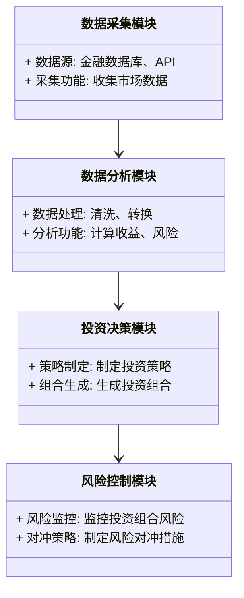
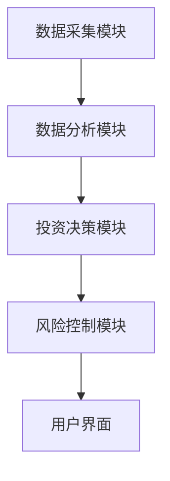

                 


# 大卫·德雷曼的另类资产投资策略

> 关键词：大卫·德雷曼，另类资产，投资策略，资产配置，风险管理

> 摘要：本文深入探讨大卫·德雷曼的另类资产投资策略，分析其核心概念、数学模型和系统架构，结合实际案例，提供详细的步骤和代码实现，帮助读者掌握另类资产投资的方法。

---

# 第一部分: 大卫·德雷曼的另类资产投资策略概述

## 第1章: 大卫·德雷曼与另类资产投资策略

### 1.1 大卫·德雷曼的背景与投资理念

#### 1.1.1 大卫·德雷曼的生平简介

大卫·德雷曼（David Dreman）是投资界的一位知名人物，以其独特的另类资产投资策略闻名。他早年在金融领域积累了丰富的经验，逐渐发展出一套基于价值投资和风险控制的策略。

#### 1.1.2 德雷曼的投资哲学与策略

德雷曼的投资哲学强调长期价值和风险管理。他认为，传统资产如股票和债券在市场波动时表现不稳定，而另类资产如房地产、私募股权等可以提供更高的收益和更低的波动性。

#### 1.1.3 德雷曼另类资产投资的核心思想

德雷曼的核心思想是通过分散投资于不同类型的资产来优化风险调整后的收益。他特别关注那些被市场低估的资产，并通过长期持有实现价值增长。

### 1.2 另类资产投资的基本概念

#### 1.2.1 传统资产与另类资产的定义与区别

- **传统资产**：包括股票、债券、现金等流动性高、易于交易的资产。
- **另类资产**：包括房地产、私募股权、对冲基金、艺术品等非传统金融资产。

#### 1.2.2 另类资产的主要类型

- **不动产投资**：通过购买房地产获得收益。
- **私募股权**：投资于非公开交易的公司股权。
- **对冲基金**：通过复杂的金融工具进行投资。
- **债权投资**：投资于企业或个人的债务。
- **收藏品投资**：投资于艺术品、邮票等收藏品。

#### 1.2.3 另类资产投资的优缺点分析

| 类别                | 优点                           | 缺点                           |
|---------------------|--------------------------------|--------------------------------|
| 不动产投资          | 稳定收益，通货膨胀对冲         | 高昂的初始投资，流动性差       |
| 私募股权            | 高收益潜力                     | 投资周期长，风险高             |
| 对冲基金            | 灵活性高，风险对冲能力强         | 透明度低，费用高             |
| 债权投资            | 收益稳定，风险较低             | 收益有限，市场波动影响         |
| 收藏品投资          | 独特价值，长期增值潜力         | 市场波动大，评估困难           |

### 1.3 大卫·德雷曼另类资产投资策略的特点

#### 1.3.1 独特的投资视角

德雷曼注重从非传统的角度分析资产，寻找市场忽视的机会。他通过深入研究特定行业或市场，发现那些被低估的资产。

#### 1.3.2 风险控制与收益优化的平衡

德雷曼强调在投资组合中平衡风险和收益。他通过分散投资于不同类型的资产来降低整体风险，同时追求长期的收益最大化。

#### 1.3.3 长期投资与价值发现的理念

德雷曼倡导长期投资，相信市场中的短期波动不会影响长期价值。他通过深入分析资产的基本面，选择具有长期增值潜力的资产。

### 1.4 本章小结

本章介绍了大卫·德雷曼的背景及其投资策略的核心思想，分析了另类资产的类型和优缺点，并总结了德雷曼策略的主要特点。

---

## 第2章: 另类资产的分类与特性

### 2.1 另类资产的主要分类

#### 2.1.1 不动产投资

不动产投资涉及购买和管理房地产，包括住宅、商业和工业地产。这种投资通常具有较高的流动性溢价，能够在通货膨胀期间保护投资者的财富。

#### 2.1.2 私募股权

私募股权是指对未上市公司进行的投资。这类资产具有高增长潜力，但需要较长的时间周期和较高的初始投资。

#### 2.1.3 对冲基金

对冲基金通过使用复杂的金融工具和策略来追求绝对收益。它们通常不受市场波动的影响，能够提供稳定的回报。

#### 2.1.4 债权投资

债权投资涉及购买债务工具，如企业债券或个人贷款。这类资产的风险较低，回报相对稳定。

#### 2.1.5 艺术品与收藏品投资

艺术品和收藏品投资涉及购买具有独特价值的物品，如绘画、雕塑和邮票。这类资产的回报取决于市场趋势和收藏者的兴趣。

### 2.2 各类另类资产的特性分析

#### 2.2.1 不动产投资的流动性与收益稳定性

- **流动性**：不动产通常流动性较低，难以快速变现。
- **收益稳定性**：租金收入和资本增值提供了稳定的收益。

#### 2.2.2 私募股权的风险与回报周期

- **风险**：私募股权的风险较高，因为投资失败可能导致本金损失。
- **回报周期**：私募股权的回报周期较长，通常需要5-10年才能实现退出。

#### 2.2.3 对冲基金的复杂性与多样性

- **复杂性**：对冲基金使用复杂的金融工具和策略，增加了投资的复杂性。
- **多样性**：对冲基金的策略多样，包括做空、套利等，能够在不同市场环境下获利。

#### 2.2.4 债权投资的安全性与收益稳定性

- **安全性**：债权投资相对安全，因为债务人有偿还本金和利息的义务。
- **收益稳定性**：债权投资的回报相对稳定，但收益有限。

#### 2.2.5 艺术品投资的主观性与市场波动性

- **主观性**：艺术品的价值取决于市场趋势和收藏者的兴趣，具有较高的主观性。
- **市场波动性**：艺术品市场波动较大，价格受市场情绪影响。

### 2.3 另类资产与传统资产的相关性分析

#### 2.3.1 不同资产类别之间的相关性

- **低相关性**：另类资产与传统资产的相关性较低，能够分散投资组合的风险。
- **高相关性**：某些另类资产，如对冲基金，与传统资产的相关性较高，可能无法有效分散风险。

#### 2.3.2 另类资产在投资组合中的分散作用

通过将另类资产纳入投资组合，可以降低整体风险，提高收益的稳定性。例如，不动产和私募股权的回报与股票和债券的相关性较低，能够在市场波动时提供保护。

#### 2.3.3 组合优化中的另类资产配置

在组合优化中，另类资产的配置需要考虑其风险、收益和流动性。德雷曼建议将一定比例的资金配置到另类资产，以优化投资组合的表现。

### 2.4 本章小结

本章详细分析了另类资产的主要类型及其特性，探讨了它们在投资组合中的作用，并总结了组合优化中的配置策略。

---

## 第3章: 投资组合优化的数学模型

### 3.1 投资组合优化的基本原理

#### 3.1.1 现代投资组合理论（MPT）概述

现代投资组合理论（MPT）由哈里·马科维茨提出，强调通过分散投资来优化风险和收益。MPT的核心是通过构建有效前沿来确定最优投资组合。

#### 3.1.2 马科维茨均值-方差模型

马科维茨模型假设投资者是风险厌恶的，并通过优化投资组合的期望收益和方差来确定最优配置。公式为：

$$ \text{最小化} \, \text{方差} \, \text{同时最大化} \, \text{收益} $$

#### 3.1.3 资产配置中的有效前沿概念

有效前沿是指在给定风险水平下，能够提供最高期望收益的投资组合。通过绘制有效前沿，投资者可以找到最优的资产配置。

### 3.2 大卫·德雷曼另类资产投资的数学模型

#### 3.2.1 另类资产权重分配的数学公式

德雷曼的模型将另类资产的权重分配基于其风险和收益。公式为：

$$ w_i = \frac{r_i}{\sum r_j} $$

其中，$w_i$ 是第i种资产的权重，$r_i$ 是其收益。

#### 3.2.2 风险调整后的收益最大化模型

通过考虑风险调整后的收益，德雷曼的模型旨在实现收益最大化。公式为：

$$ \text{最大化} \, \text{夏普比率} $$

夏普比率衡量的是单位风险下的超额收益。

#### 3.2.3 资产组合的流动性优化模型

流动性优化模型通过平衡资产的流动性需求和收益潜力，确保投资组合的灵活性。公式为：

$$ \text{流动性权重} = \lambda \cdot \text{流动性指标} $$

其中，$\lambda$ 是流动性偏好系数。

### 3.3 算法实现与代码示例

#### 3.3.1 Python代码实现投资组合优化

```python
import numpy as np
import pandas as pd

# 示例数据
returns = pd.DataFrame({
    '资产A': [0.05, 0.03, 0.04, 0.02],
    '资产B': [0.03, 0.04, 0.02, 0.05],
    '资产C': [0.04, 0.05, 0.03, 0.04]
})

# 计算协方差矩阵
cov_matrix = returns.cov()

# 确定权重
weights = np.array([0.3, 0.3, 0.4])

# 计算组合方差
portfolio_variance = np.dot(weights.T, np.dot(cov_matrix, weights))
print("组合方差:", portfolio_variance)
```

#### 3.3.2 使用numpy和pandas进行数据处理

通过使用numpy和pandas，我们可以高效地处理和分析投资组合数据，计算收益、风险等关键指标。

#### 3.3.3 利用scipy.optimize进行优化计算

scipy.optimize模块提供了多种优化算法，可以用于求解投资组合优化问题。例如，使用`minimize`函数进行优化计算。

### 3.4 数学模型的优缺点分析

#### 3.4.1 模型假设的局限性

- **假设市场有效**：模型假设市场是有效的，但现实中可能存在市场失灵。
- **资产相关性**：模型假设资产之间存在线性相关性，但实际中可能存在非线性关系。

#### 3.4.2 实际投资中的模型调整

- **动态调整**：根据市场变化和投资者偏好，动态调整模型参数。
- **引入因子模型**：使用因子模型进一步解释资产收益。

#### 3.4.3 算法的可扩展性与适用性

- **可扩展性**：模型适用于大规模数据和多资产类别。
- **适用性**：模型在实际应用中需要结合具体情况进行调整。

### 3.5 本章小结

本章通过数学模型和算法实现，详细分析了大卫·德雷曼另类资产投资的优化策略，探讨了其优缺点，并提供了具体的代码实现。

---

## 第4章: 投资系统架构设计

### 4.1 投资系统功能模块划分

#### 4.1.1 数据采集模块

数据采集模块负责收集市场数据，包括价格、收益、风险等指标。常用的数据源包括金融数据库和API。

#### 4.1.2 数据分析模块

数据分析模块对收集到的数据进行处理和分析，计算资产的收益、风险等指标，并生成投资建议。

#### 4.1.3 投资决策模块

投资决策模块基于分析结果，制定投资策略，并生成投资组合。

#### 4.1.4 风险控制模块

风险控制模块监控投资组合的风险，制定风险对冲策略，并在风险超出容忍范围时进行调整。

### 4.2 投资系统架构设计

#### 4.2.1 系统功能设计

通过绘制领域模型类图，展示系统的功能模块和它们之间的关系。



#### 4.2.2 系统架构设计

通过绘制系统架构图，展示系统的各个模块及其交互。



### 4.3 本章小结

本章通过系统架构设计，展示了大卫·德雷曼另类资产投资策略的实现框架，包括功能模块划分和系统交互设计。

---

## 第5章: 项目实战与案例分析

### 5.1 项目实战

#### 5.1.1 环境安装

需要安装Python、numpy、pandas、scipy.optimize等库。

#### 5.1.2 核心实现

通过编写Python代码，实现投资组合优化的数学模型。

### 5.2 实际案例分析

#### 5.2.1 案例背景

假设我们有三种另类资产：房地产、私募股权和对冲基金。我们需要确定它们在投资组合中的权重，以实现风险调整后的收益最大化。

#### 5.2.2 数据分析与模型实现

通过收集历史数据，计算每种资产的收益和风险，然后使用优化算法确定最优权重。

#### 5.2.3 结果分析与解读

分析优化结果，确定每种资产的权重，并评估投资组合的风险和收益。

### 5.3 最佳实践

#### 5.3.1 小结

本章通过实际案例分析，展示了大卫·德雷曼另类资产投资策略的实现过程。

#### 5.3.2 注意事项

- **数据质量**：确保数据的准确性和完整性。
- **模型调整**：根据实际情况动态调整模型参数。
- **风险控制**：定期监控和调整投资组合的风险。

#### 5.3.3 拓展阅读

推荐阅读相关书籍和文献，深入理解另类资产投资的理论和实践。

### 5.4 本章小结

本章通过实际案例分析，详细展示了大卫·德雷曼另类资产投资策略的实现过程，并提供了最佳实践和注意事项。

---

## 第6章: 结论与展望

### 6.1 结论

大卫·德雷曼的另类资产投资策略通过优化资产配置和风险管理，提供了稳定的投资回报。本文详细分析了其核心思想、数学模型和系统架构，并通过实际案例展示了其应用。

### 6.2 展望

未来的研究可以进一步探讨另类资产的市场趋势和风险因素，结合人工智能和大数据技术，提升投资策略的科学性和有效性。

---

## 作者：AI天才研究院/AI Genius Institute & 禅与计算机程序设计艺术 /Zen And The Art of Computer Programming

---

这篇文章详细探讨了大卫·德雷曼的另类资产投资策略，从理论到实践，提供了丰富的分析和代码实现，帮助读者深入理解并应用这些策略。

