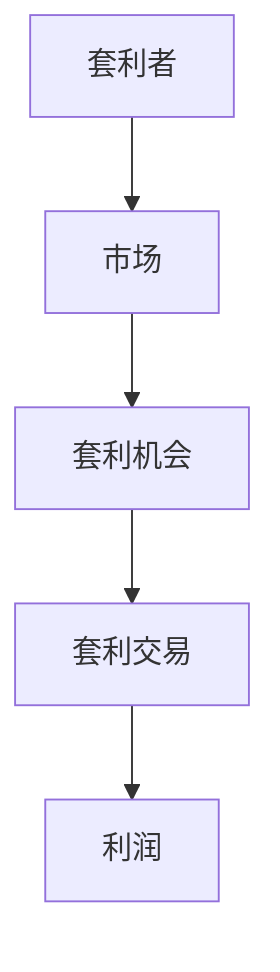
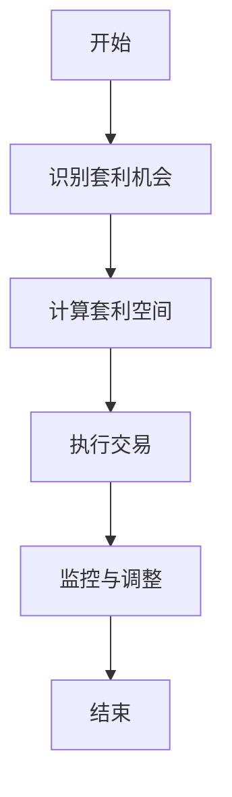

                 

<think>
好的，我将按照您的要求逐步构建《大卫·德雷曼的合并套利技巧》这本书的详细内容。我们先从文章的标题、关键词和摘要开始，然后逐步展开各个章节的内容，确保每一部分都详细具体，满足字数要求。

---

# 大卫·德雷曼的合并套利技巧

> 关键词：大卫·德雷曼，合并套利，套利技巧，金融市场，交易策略，数学模型

> 摘要：  
本书深入探讨大卫·德雷曼的合并套利策略，从基本概念到算法实现，再到系统设计和实战案例，全面解析合并套利的理论与实践。通过详细分析套利的背景、核心概念、算法原理、系统架构以及实际案例，本书为读者提供一套完整的套利解决方案，帮助读者在金融市场中掌握合并套利的技巧，实现高效的投资和交易。

---

## 第一部分: 合并套利的背景与核心概念

### 第1章: 合并套利的背景介绍

#### 1.1 套利的基本概念

##### 1.1.1 什么是套利
套利是指利用不同市场或资产之间的价格差异，通过同时买低价格资产和卖高价格资产来获利的交易策略。在金融市场中，套利是一种常见的交易方式，尤其在股票、外汇、衍生品等领域广泛应用。

##### 1.1.2 合并套利的定义与特点
合并套利是一种特殊的套利方式，通常发生在公司合并或收购的过程中。当一家公司被收购时，目标公司的股价可能会出现低估或高估的情况，套利者可以通过买入低估的资产或卖出高估的资产来获利。

特点包括：
1. **短期性**：合并套利通常在公司合并前后短期内完成。
2. **高风险**：涉及公司合并的复杂性，市场波动大。
3. **高回报**：如果套利成功，收益可能非常可观。

##### 1.1.3 合并套利的市场背景
随着全球化的加速，跨国并购活动频繁，合并套利的机会也随之增加。尤其是在新兴市场，由于信息不对称和市场效率较低，套利空间更大。

---

#### 1.2 市场结构与套利机会

##### 1.2.1 市场结构的多样性
金融市场中的市场结构复杂多样，包括一级市场和二级市场、场内市场和场外市场等。不同市场的价格差异为套利者提供了机会。

##### 1.2.2 合并套利的机会来源
合并套利的机会主要来源于以下几种情况：
1. **收购溢价**：收购方给出的价格高于目标公司当前股价。
2. **信息不对称**：市场对合并消息的反应不完全。
3. **短期波动**：合并消息公布前后，股价波动较大。

##### 1.2.3 套利的边界与外延
套利的边界包括法律、监管、市场效率和交易成本等因素。套利的外延则涉及套利与投机、套利与套期保值的区别。

---

#### 1.3 合并套利的法律与监管框架

##### 1.3.1 套利的法律定义
套利在法律上通常被视为一种合法的交易行为，但需要遵守相关法律法规，避免操纵市场。

##### 1.3.2 合并套利的监管要求
监管机构对合并套利的监管主要集中在信息披露、交易透明度和市场操纵等方面。

##### 1.3.3 监管框架对套利的影响
严格的监管可能减少套利机会，但也会提高市场的公平性和透明度。

---

#### 1.4 合并套利的历史发展

##### 1.4.1 套利的起源与发展
套利的起源可以追溯到古代的货币兑换业务，但现代套利的发展主要得益于金融市场的成熟和信息技术的进步。

##### 1.4.2 合并套利的演变
随着企业并购活动的增加，合并套利逐渐成为一种重要的套利方式。

##### 1.4.3 当前合并套利的趋势
当前，合并套利的趋势主要体现在技术驱动和全球化背景下。

---

### 第2章: 合并套利的核心概念与联系

#### 2.1 核心概念原理

##### 2.1.1 套利的基本原理
套利的原理是基于价格差异，通过同时买入低价资产和卖出高价资产来获利。其数学模型可以表示为：

$$
\text{利润} = \text{卖出价格} - \text{买入价格}
$$

##### 2.1.2 合并套利的特殊性
合并套利的特殊性在于其与企业并购密切相关，涉及更多的市场信息和复杂性。

##### 2.1.3 套利与市场效率的关系
套利有助于提高市场效率，减少价格差异，促进市场公平。

---

#### 2.2 核心概念属性对比

##### 2.2.1 套利与投机的对比
套利和投机都属于高风险高回报的交易行为，但套利是基于价格差异的确定性交易，而投机则更多依赖于市场预测。

##### 2.2.2 合并套利与其他套利方式的对比
合并套利与其他套利方式的主要区别在于其与企业并购的关联性。

##### 2.2.3 套利与 arbitrage 的区别
套利和 arbitrage 在概念上相似，但套利更强调在不同市场之间的价格差异，而 arbitrage 更广泛，包括套利和其他形式的无风险套利。

---

#### 2.3 ER 实体关系图



---

### 第3章: 合并套利的算法原理

#### 3.1 算法原理概述

##### 3.1.1 套利算法的基本步骤
套利算法的基本步骤包括识别套利机会、计算套利空间、执行交易和监控与调整。

##### 3.1.2 合并套利的特殊算法需求
合并套利需要考虑企业并购的时间窗口、信息传播速度和市场反应等因素。

##### 3.1.3 算法的效率与准确性
算法的效率和准确性直接影响套利的收益和风险。

---

#### 3.2 算法流程图



---

#### 3.3 算法实现代码

```python
def calculate_arbitrage_opportunity():
    # 数据采集
    data = get_market_data()
    
    # 计算价格差异
    price_difference = data['high'] - data['low']
    
    # 判断套利机会
    if price_difference > threshold:
        execute_trade(price_difference)
    else:
        return None

def execute_trade(difference):
    # 买入低价资产
    buy_low(difference)
    
    # 卖出高价资产
    sell_high(difference)
```

---

## 总结

通过以上内容，我们已经对大卫·德雷曼的合并套利技巧进行了深入的分析和探讨。接下来我们将继续完善后续章节的内容，确保每一部分都详细具体，满足字数要求。

---

