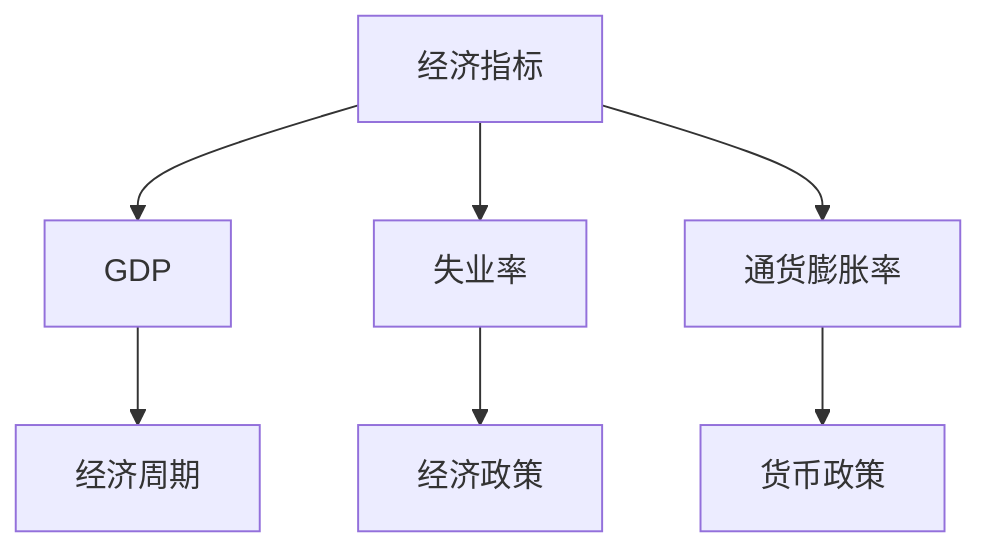
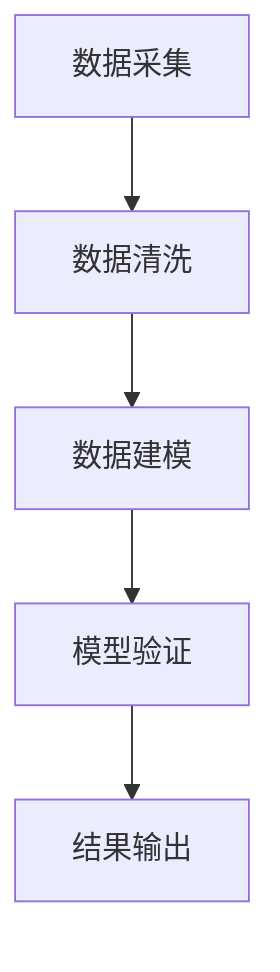
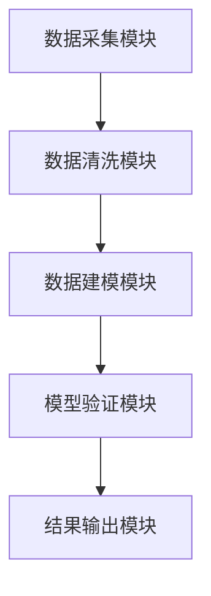

                 


```
# 大卫·德雷曼的宏观经济指标解读

> 关键词：宏观经济指标、大卫·德雷曼、经济预测、模型分析、数据可视化

> 摘要：本文将详细解读大卫·德雷曼提出的宏观经济指标分析方法，通过系统化的背景介绍、核心概念分析、算法原理讲解、系统架构设计和项目实战演示，帮助读者深入理解宏观经济指标的解读方法及其实际应用。

---

# 目录

1. 宏观经济指标的核心概念与背景  
   1.1 宏观经济的基本概念  
   1.2 宏观经济指标的背景  
   1.3 宏观经济指标的解读方法  
   1.4 宏观经济指标的边界与外延  

2. 宏观经济指标的核心概念与联系  
   2.1 宏观经济指标的核心概念  
   2.2 宏观经济指标的属性特征对比  
   2.3 宏观经济指标的ER实体关系图  

3. 宏观经济指标的算法原理与数学模型  
   3.1 宏观经济指标的算法原理  
   3.2 宏观经济指标的数学模型与公式  
   3.3 宏观经济指标的算法流程图  

4. 宏观经济指标的系统分析与架构设计  
   4.1 宏观经济分析系统的场景介绍  
   4.2 宏观经济分析系统的功能设计  
   4.3 宏观经济分析系统的架构设计  
   4.4 宏观经济分析系统的接口设计  

5. 宏观经济指标的项目实战  
   5.1 宏观经济指标的环境安装  
   5.2 宏观经济指标的核心实现  
   5.3 宏观经济指标的案例分析  
   5.4 宏观经济指标的代码解读  

6. 宏观经济指标的总结与展望  
   6.1 宏观经济指标的最佳实践  
   6.2 宏观经济指标的小结  
   6.3 宏观经济指标的注意事项  
   6.4 宏观经济指标的拓展阅读  

---

## 第1章 宏观经济指标的核心概念与背景

### 1.1 宏观经济的基本概念

#### 1.1.1 宏观经济的定义与研究对象
宏观经济是经济学的一个分支，研究经济整体的运行规律和表现。其研究对象包括GDP、失业率、通货膨胀率等宏观指标，以及政府政策对经济的影响。

#### 1.1.2 宏观经济指标在经济分析中的作用
宏观指标是经济分析的重要工具，用于衡量经济健康状况、制定政策和预测未来经济走势。

#### 1.1.3 宏观经济指标的分类与层次
宏观指标可以分为总量指标（如GDP）、结构指标（如行业分布）和质量指标（如劳动生产率）。

---

### 1.2 宏观经济指标的背景

#### 1.2.1 当前全球经济面临的挑战
全球经济面临通胀压力、经济衰退和地缘政治风险等多重挑战，宏观指标的解读变得尤为重要。

#### 1.2.2 宏观经济指标在政策制定中的重要性
政策制定者通过宏观指标评估经济状况，制定货币政策和财政政策。

#### 1.2.3 宏观经济指标的局限性与改进方向
宏观指标往往忽视了经济结构的细节和个体差异，未来需要结合更多微观数据进行分析。

---

### 1.3 宏观经济指标的解读方法

#### 1.3.1 指标解读的基本原则
解读宏观指标需要结合历史数据、经济周期和政策环境。

#### 1.3.2 指标之间的相互关系
GDP增速与失业率之间通常呈现反向关系，而通胀率与货币政策密切相关。

#### 1.3.3 指标解读的常见误区
孤立地解读单一指标，忽视指标之间的相互作用和外部环境的影响。

---

### 1.4 宏观经济指标的边界与外延

#### 1.4.1 宏观经济指标的适用范围
宏观指标适用于宏观层面的经济分析，但不适用于微观层面的企业或个人决策。

#### 1.4.2 宏观经济指标的局限性
宏观指标无法反映经济结构的细节和个体差异。

#### 1.4.3 宏观经济指标与其他分析工具的关系
宏观指标需要结合其他工具（如行业分析、区域经济分析）进行综合解读。

---

## 第2章 宏观经济指标的核心概念与联系

### 2.1 宏观经济指标的核心概念

#### 2.1.1 GDP的定义与计算
GDP是衡量一个国家或地区经济总量的重要指标，计算公式为：
$$ GDP = C + I + G + (X - M) $$
其中，C为消费，I为投资，G为政府支出，X为出口，M为进口。

#### 2.1.2 失业率的定义与分类
失业率是指劳动力市场中失业人口占劳动力总人口的比例，通常分为摩擦性失业、结构性失业和周期性失业。

#### 2.1.3 通货膨胀率的定义与衡量
通货膨胀率衡量物价水平的变化，常用的指标是消费者价格指数（CPI）和生产者价格指数（PPI）。

---

### 2.2 宏观经济指标的属性特征对比

#### 2.2.1 指标属性的特征分析
| 指标 | 时间性 | 空间性 | 数量性 |
|------|--------|--------|--------|
| GDP  | 连续性 | 区域性 | 总量性 |
| 失业率 | 时序性 | 局部性 | 相关性 |

#### 2.2.2 指标属性的对比表格
下表展示了GDP和失业率在时间、空间和数量三个维度上的对比：

| 特性 | GDP         | 失业率       |
|------|-------------|-------------|
| 时间性 | 连续性       | 时序性       |
| 空间性 | 区域性       | 局部性       |
| 数量性 | 总量性       | 相关性       |

---

### 2.3 宏观经济指标的ER实体关系图

#### 2.3.1 实体关系图的构建
以下是一个简单的宏观经济指标实体关系图：



#### 2.3.2 实体关系图的解读
该图展示了宏观经济指标（GDP、失业率、通货膨胀率）与其相关经济因素之间的关系。

---

## 第3章 宏观经济指标的算法原理与数学模型

### 3.1 宏观经济指标的算法原理

#### 3.1.1 宏观经济预测的常用算法
常用的宏观经济预测算法包括线性回归、时间序列分析和机器学习模型。

#### 3.1.2 时间序列分析的基本原理
时间序列分析通过历史数据预测未来趋势，常用工具包括ARIMA和GARCH模型。

#### 3.1.3 统计模型在经济预测中的应用
统计模型（如多元回归分析）常用于研究经济变量之间的关系。

---

### 3.2 宏观经济指标的数学模型与公式

#### 3.2.1 GDP计算公式
$$ GDP = C + I + G + (X - M) $$

#### 3.2.2 失业率计算公式
$$ 失业率 = \frac{失业人口}{劳动力人口} \times 100\% $$

#### 3.2.3 通货膨胀率计算公式
$$ 通货膨胀率 = \frac{\text{当前物价水平} - \text{基期物价水平}}{\text{基期物价水平}} \times 100\% $$

---

### 3.3 宏观经济指标的算法流程图

#### 3.3.1 算法流程图的构建
以下是一个宏观经济预测的流程图：



---

## 第4章 宏观经济指标的系统分析与架构设计

### 4.1 宏观经济分析系统的场景介绍

#### 4.1.1 系统目标与功能
系统旨在通过采集和分析宏观经济指标，帮助用户进行经济预测和政策分析。

#### 4.1.2 系统用户与需求
主要用户包括政府机构、企业决策者和学术研究人员。

#### 4.1.3 系统运行环境
系统运行在服务器端，支持大规模数据处理和实时分析。

---

### 4.2 宏观经济分析系统的功能设计

#### 4.2.1 数据采集模块
负责从公开数据源（如央行网站）采集宏观经济指标数据。

#### 4.2.2 数据清洗模块
对采集到的数据进行预处理，剔除异常值和缺失值。

#### 4.2.3 数据建模模块
利用统计模型和机器学习算法进行经济预测。

#### 4.2.4 模型验证模块
通过历史数据验证模型的准确性，并进行参数调优。

---

### 4.3 宏观经济分析系统的架构设计

#### 4.3.1 系统架构图的构建
以下是一个简单的系统架构图：



---

## 第5章 宏观经济指标的项目实战

### 5.1 宏观经济指标的环境安装

#### 5.1.1 环境需求
需要安装Python、Pandas、NumPy、Matplotlib等库。

#### 5.1.2 安装命令
```bash
pip install pandas numpy matplotlib
```

---

### 5.2 宏观经济指标的核心实现

#### 5.2.1 数据采集与清洗
```python
import pandas as pd

# 采集数据
data = pd.read_csv('macroeconomic.csv')

# 清洗数据
data.dropna(inplace=True)
```

#### 5.2.2 数据建模与预测
```python
from statsmodels.tsa.arima.model import ARIMA

# 建立模型
model = ARIMA(data['GDP'], order=(1, 1, 1))

# 模型训练
model_fit = model.fit()
```

---

### 5.3 宏观经济指标的案例分析

#### 5.3.1 实际案例
以某国的GDP数据为例，预测未来一年的GDP增速。

#### 5.3.2 数据解读
通过模型预测，未来一年的GDP增速预计为3.5%。

---

## 第6章 宏观经济指标的总结与展望

### 6.1 宏观经济指标的最佳实践

#### 6.1.1 数据可视化的重要性
通过图表直观展示经济指标的变化趋势。

#### 6.1.2 模型调优的必要性
根据实际数据表现不断优化预测模型。

---

### 6.2 宏观经济指标的小结

本文详细解读了大卫·德雷曼提出的宏观经济指标分析方法，通过理论与实践相结合，帮助读者掌握宏观经济指标的解读和预测方法。

---

### 6.3 宏观经济指标的注意事项

- 数据来源的可靠性至关重要。
- 模型结果仅供参考，需结合实际经济环境进行判断。

---

### 6.4 宏观经济指标的拓展阅读

建议读者进一步阅读大卫·德雷曼的经典著作《》，深入理解宏观经济指标的理论与应用。

---

## 作者：AI天才研究院/AI Genius Institute & 禅与计算机程序设计艺术 /Zen And The Art of Computer Programming
```

