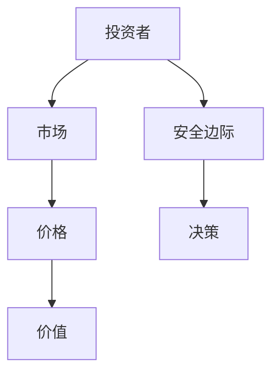
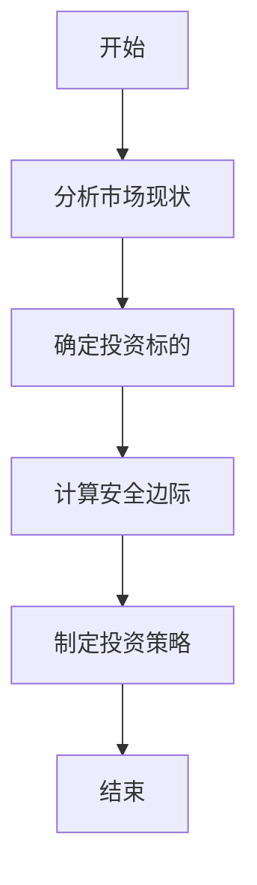
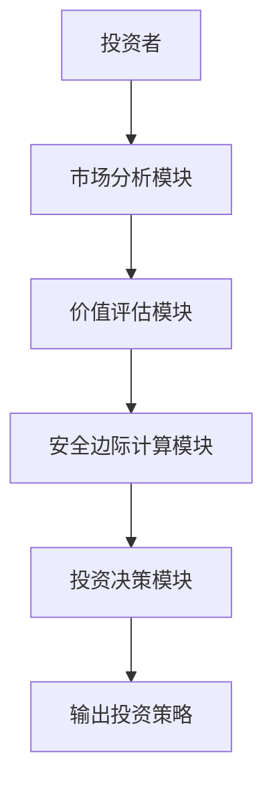

                 


# 大卫·德雷曼的对比优势：在市场低迷时逆向而行

## 关键词：大卫·德雷曼，对比优势，逆向思维，安全边际，市场心理，投资策略

## 摘要：大卫·德雷曼的对比优势理论是一种在市场低迷时期逆向投资的有效方法。该理论强调通过分析市场价格与内在价值的差异，利用安全边际的概念，在市场底部寻找投资机会。文章详细介绍了对比优势的核心概念、算法原理、数学模型、系统架构以及实际案例分析，帮助投资者在市场低迷时期做出明智的投资决策。

---

## 第一部分: 对比优势的背景与核心概念

### 第1章: 对比优势的背景介绍

#### 1.1 问题背景与问题描述

##### 1.1.1 市场低迷时期的经济特征
在市场低迷时期，投资者通常会面临以下问题：
- 市场情绪低迷，投资者信心不足。
- 资产价格被市场低估，但投资者却倾向于卖出资产。
- 投资者难以在市场底部找到投资机会。

##### 1.1.2 投资者行为的常见误区
投资者在市场低迷时期容易陷入以下误区：
- 过度恐慌，盲目抛售资产。
- 忽视长期价值，只关注短期价格波动。
- 缺乏耐心，急于求成。

##### 1.1.3 对比优势理论的提出动机
大卫·德雷曼提出对比优势理论的动机在于：
- 解决投资者在市场低迷时期的投资困境。
- 提供一种逆向思维的投资方法，帮助投资者在市场底部找到价值。
- 强调安全边际的重要性，降低投资风险。

#### 1.2 对比优势的核心概念

##### 1.2.1 对比优势的定义与内涵
对比优势是指在市场低迷时期，投资者通过分析市场价格与内在价值的差异，利用安全边际的概念，寻找被市场低估的投资标的。这种投资策略的核心在于逆向思维，即在市场低迷时买入，市场高涨时卖出。

##### 1.2.2 对比优势与传统投资理论的差异
对比优势与传统投资理论的主要差异在于：
- 传统投资理论注重市场趋势和短期价格波动，而对比优势注重长期价值和安全边际。
- 传统投资理论强调顺势而为，而对比优势强调逆向思维。

##### 1.2.3 对比优势的边界与外延
对比优势的边界包括：
- 仅适用于市场低迷时期。
- 适用于价值投资，不适用于投机性投资。
- 需要投资者具备一定的市场分析能力和价值评估能力。

#### 1.3 对比优势的核心要素组成

##### 1.3.1 市场周期性分析
市场周期性分析是对比优势理论的重要组成部分，包括以下几个方面：
- 市场周期的四个阶段：繁荣、衰退、复苏、成熟。
- 不同阶段的投资策略：在衰退阶段寻找投资机会，在成熟阶段规避风险。

##### 1.3.2 投资者心理与行为
投资者心理与行为对市场波动有重要影响。对比优势理论强调：
- 投资者心理的非理性行为会导致市场过度波动。
- 在市场低迷时期，投资者的恐慌情绪会导致资产价格被低估。

##### 1.3.3 价值评估与风险控制
价值评估是对比优势理论的核心，包括以下几个方面：
- 内在价值的计算：通过现金流折现法等方法评估资产的真实价值。
- 市场价格与内在价值的对比：找出市场价格低于内在价值的投资标的。

### 第2章: 对比优势的核心概念与联系

#### 2.1 对比优势的原理分析

##### 2.1.1 安全边际的概念与计算
安全边际是对比优势理论的重要组成部分，是指市场价格与内在价值之间的差异。计算公式为：
$$ \text{安全边际} = \text{内在价值} - \text{市场价格} $$

##### 2.1.2 逆向思维的逻辑框架
逆向思维的逻辑框架包括以下几个步骤：
1. 分析市场现状：判断市场是否处于低迷时期。
2. 寻找被低估的投资标的：计算市场价格与内在价值的差异。
3. 制定投资策略：在市场底部买入，在市场顶部卖出。

##### 2.1.3 市场心理与价格波动的关系
市场心理与价格波动的关系可以总结为：
- 投资者情绪会影响市场价格。
- 在市场低迷时期，恐慌情绪会导致资产价格被低估。
- 在市场繁荣时期，贪婪情绪会导致资产价格被高估。

#### 2.2 对比优势的核心概念对比表

| 概念         | 特性             | 描述                                                                 |
|--------------|------------------|----------------------------------------------------------------------|
| 安全边际     | 数量             | 投资价格与内在价值的差异，安全边际越大，投资风险越小。                   |
| 逆向思维     | 时间             | 在市场低迷时买入，在市场繁荣时卖出。                                   |
| 市场心理     | 影响             | 投资者情绪对价格波动的影响，恐慌情绪导致价格低估，贪婪情绪导致价格高估。 |

#### 2.3 对比优势的ER实体关系图


### 第3章: 对比优势的算法原理

#### 3.1 对比优势的算法流程

##### 3.1.1 算法步骤
1. 分析市场现状：判断市场是否处于低迷时期。
2. 确定投资标的：选择具有较高内在价值的资产。
3. 计算安全边际：市场价格与内在价值的差异。
4. 制定投资策略：在市场底部买入，在市场顶部卖出。

##### 3.1.2 算法流程图


#### 3.2 安全边际计算公式
$$ \text{安全边际} = \text{内在价值} - \text{市场价格} $$

#### 3.3 投资决策流程
```python
def investment_decision():
    market_analysis = analyze_market()
    intrinsic_value = calculate_intrinsic_value()
    margin_of_safety = intrinsic_value - market_price
    if margin_of_safety > 0:
        buy_asset()
    else:
        sell_asset()
```

---

## 第二部分: 对比优势的数学模型与系统架构

### 第4章: 对比优势的数学模型

#### 4.1 内在价值计算模型
$$ \text{内在价值} = \sum_{t=1}^{\infty} \frac{\text{现金流}}{(1 + r)^t} $$
其中，r为折现率，现金流为资产在未来各期的现金流。

#### 4.2 安全边际计算模型
$$ \text{安全边际} = \text{内在价值} - \text{市场价格} $$

#### 4.3 投资决策模型
$$ \text{投资决策} = \begin{cases}
\text{买入} & \text{安全边际} > 0 \\
\text{卖出} & \text{安全边际} < 0 \\
\text{观望} & \text{安全边际} = 0
\end{cases} $$

### 第5章: 对比优势的系统架构

#### 5.1 系统功能设计

##### 5.1.1 领域模型类图


##### 5.1.2 系统架构图


#### 5.2 系统接口设计
- 投资者输入：市场数据、资产信息
- 系统输出：安全边际计算结果、投资决策

#### 5.3 系统交互序列图


---

## 第三部分: 对比优势的项目实战与最佳实践

### 第6章: 项目实战

#### 6.1 实际案例分析

##### 6.1.1 案例背景
假设当前市场处于低迷时期，某资产的市场价格为$50，内在价值为$100，安全边际为$50。

##### 6.1.2 分析过程
1. 计算安全边际：$100 - $50 = $50。
2. 判断投资策略：由于安全边际大于0，投资者应该买入该资产。

##### 6.1.3 投资决策
在市场低迷时期，投资者应利用安全边际的概念，在市场价格低于内在价值时买入资产。

#### 6.2 代码实现

##### 6.2.1 安全边际计算代码
```python
def calculate_margin_of_safety(intrinsic_value, market_price):
    return intrinsic_value - market_price

# 示例
intrinsic_value = 100
market_price = 50
margin_of_safety = calculate_margin_of_safety(intrinsic_value, market_price)
print("安全边际为：", margin_of_safety)
```

##### 6.2.2 投资决策代码
```python
def investment_decision(intrinsic_value, market_price):
    margin_of_safety = intrinsic_value - market_price
    if margin_of_safety > 0:
        return "买入"
    elif margin_of_safety < 0:
        return "卖出"
    else:
        return "观望"

# 示例
intrinsic_value = 100
market_price = 50
decision = investment_decision(intrinsic_value, market_price)
print("投资决策为：", decision)
```

### 第7章: 最佳实践与小结

#### 7.1 最佳实践

##### 7.1.1 逆向思维的重要性
在市场低迷时期，投资者应保持冷静，利用逆向思维寻找投资机会。

##### 7.1.2 安全边际的应用
安全边际是投资决策的重要依据，投资者应优先选择安全边际较大的投资标的。

##### 7.1.3 市场心理的影响
投资者应关注市场心理，避免被市场情绪左右。

#### 7.2 投资策略总结

##### 7.2.1 投资策略
- 在市场低迷时期，寻找被低估的资产。
- 在市场繁荣时期，规避风险。

##### 7.2.2 投资组合管理
- 分散投资，降低风险。
- 定期调整投资组合，保持安全边际。

---

## 第四部分: 总结与展望

### 第8章: 总结

大卫·德雷曼的对比优势理论是一种在市场低迷时期逆向投资的有效方法。通过分析市场价格与内在价值的差异，利用安全边际的概念，投资者可以在市场底部找到投资机会，降低投资风险。

### 第9章: 展望

对比优势理论不仅适用于市场低迷时期，也可以在其他市场环境下应用。未来，随着市场环境的变化，投资者需要不断学习和调整投资策略，以应对新的挑战。

---

## 作者：AI天才研究院/AI Genius Institute & 禅与计算机程序设计艺术 /Zen And The Art of Computer Programming

