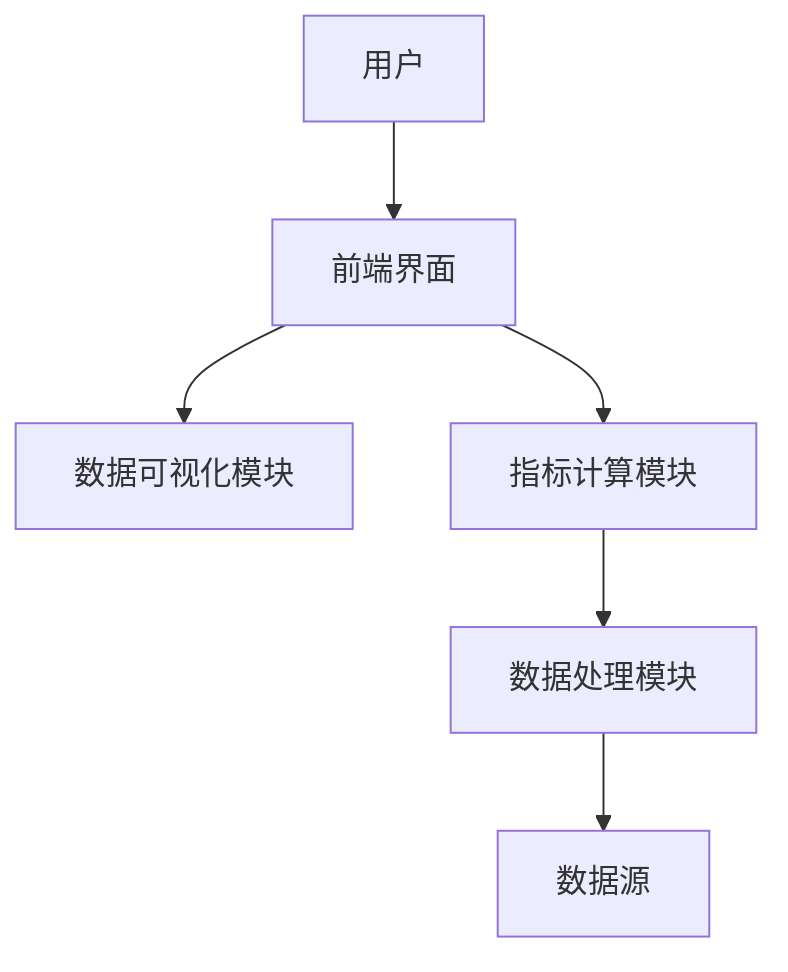

                 

# 大卫·德雷曼的资产负债表价值投资：深入分析财务状况

## 关键词：
资产负债表、价值投资、财务分析、投资策略、财务比率、资产分析、负债分析

## 摘要：
本文深入探讨了大卫·德雷曼在价值投资中对资产负债表的分析方法，从基础知识到高级策略，结合实际案例，帮助读者掌握如何通过分析财务报表做出明智的投资决策。

---

## 第一部分：资产负债表基础

### 第1章：资产负债表概述

#### 1.1 资产负债表的基本概念
- **1.1.1 资产负债表的定义**
  资产负债表是企业在某一特定日期内所有资产、负债和所有者权益的详细清单，反映了企业的财务状况。

- **1.1.2 资产负债表的构成要素**
  - 资产：企业拥有或控制的资源，包括流动资产和非流动资产。
  - 负债：企业由于过去的交易或事件而产生的债务，包括流动负债和非流动负债。
  - 所有者权益：企业资产扣除负债后的剩余价值，代表所有者对企业的剩余 claims。

- **1.1.3 资产负债表的重要性**
  资产负债表是投资者评估企业财务健康状况的重要工具，帮助识别企业的财务风险和投资潜力。

#### 1.2 价值投资的基本原理
- **1.2.1 价值投资的核心理念**
  价值投资强调购买低于其内在价值的股票，通过分析企业的财务状况、行业地位和管理团队来判断其长期潜力。

- **1.2.2 资产负债表在价值投资中的作用**
  资产负债表提供了企业的财务结构和健康状况，帮助投资者评估企业的偿债能力、盈利能力和发展潜力。

- **1.2.3 资产负债表分析的步骤与方法**
  包括收集数据、分析各项指标、评估财务健康状况和判断投资价值。

---

## 第二部分：深入分析财务报表

### 第2章：资产负债表的核心分析

#### 2.1 资产分析
- **2.1.1 流动资产的构成与质量**
  包括现金、应收账款、存货等，流动资产的质量直接影响企业的短期偿债能力。
- **2.1.2 非流动资产的评估与风险**
  包括长期投资、固定资产、无形资产等，非流动资产的风险主要体现在减值和流动性上。
- **2.1.3 资产周转率的计算与应用**
  资产周转率反映了资产的使用效率，周转率越高，说明资产利用效率越好。

#### 2.2 负债分析
- **2.2.1 流动负债的结构与管理**
  包括应付账款、短期借款、应付工资等，流动负债的管理直接影响企业的流动比率。
- **2.2.2 非流动负债的类型与影响**
  包括长期借款、应付债券等，非流动负债的结构影响企业的资本成本和财务风险。
- **2.2.3 负债期限的匹配与风险**
  负债的期限与资产的使用周期是否匹配，直接影响企业的财务稳定性。

#### 2.3 所有者权益分析
- **2.3.1 净资产的构成与变化**
  净资产包括股本、资本公积、盈余公积和未分配利润等，净资产的变化反映了企业的盈利能力和股利政策。
- **2.3.2 留存收益的积累与分配**
  留存收益是企业净利润中未分配的部分，其积累和分配直接影响企业的再投资能力和股东回报。
- **2.3.3 股东权益的保护与增长**
  股东权益的保护包括股息支付率、每股收益等指标，增长则体现在净资产收益率等指标上。

---

## 第三部分：财务比率与投资策略

### 第3章：财务比率分析

#### 3.1 盈利能力分析
- **3.1.1 净资产收益率（ROE）**
  公式：ROE = 净利润 / 净资产
  ROE越高，说明企业利用股东资产创造利润的能力越强。
- **3.1.2 资产回报率（ROA）**
  公式：ROA = 净利润 / 总资产
  ROA衡量了企业每单位资产的盈利能力。
- **3.1.3 毛利率与净利率**
  毛利率 = (营业收入 - 营业成本) / 营业收入
  净利率 = 净利润 / 营业收入

#### 3.2 偿债能力分析
- **3.2.1 资产负债率**
  公式：资产负债率 = 负债总额 / 资产总额
  资产负债率越低，企业的偿债压力越小。
- **3.2.2 速动比率**
  公式：速动比率 = 速动资产 / 流动负债
  速动资产包括现金、应收账款和存货等。
- **3.2.3 利息覆盖倍数**
  公式：利息覆盖倍数 = 息税前利润 / 利息支出
  该指标衡量了企业支付利息的能力。

#### 3.3 营运能力分析
- **3.3.1 存货周转率**
  公式：存货周转率 = 营业成本 / 平均存货
  反映了企业存货的管理效率。
- **3.3.2 应收账款周转率**
  公式：应收账款周转率 = 营业收入 / 平均应收账款
  反映了企业应收账款的回收效率。

---

## 第四部分：系统分析与架构设计

### 第4章：构建资产负债表分析系统

#### 4.1 系统功能设计
- **4.1.1 数据采集模块**
  负责收集企业的财务报表数据，包括资产负债表、利润表和现金流量表。
- **4.1.2 数据处理模块**
  对采集到的数据进行清洗、转换和标准化处理，确保数据的准确性和一致性。
- **4.1.3 指标计算模块**
  根据预设的财务指标公式，计算各项指标并生成分析结果。
- **4.1.4 可视化模块**
  将分析结果以图表形式展示，帮助用户直观理解数据。

#### 4.2 系统架构设计

#### 4.3 系统接口设计
- 数据接口：提供API，允许外部系统接入财务数据。
- 用户界面：设计友好的GUI，方便用户输入和查看分析结果。

---

## 第五部分：项目实战

### 第5章：公司财务报表分析案例

#### 5.1 实际案例分析
- **5.1.1 公司概况**
  选择一家上市公司，例如苹果公司，分析其2022年资产负债表。
- **5.1.2 资产分析**
  计算流动资产和非流动资产的比例，分析资产的构成和质量。
- **5.1.3 负债分析**
  计算流动负债和非流动负债的比例，评估企业的偿债能力。
- **5.1.4 所有者权益分析**
  分析所有者权益的变化，评估企业的盈利能力。

#### 5.2 投资决策分析
- **5.2.1 财务比率计算**
  计算ROE、ROA、速动比率等指标，评估企业的财务健康状况。
- **5.2.2 投资价值判断**
  根据分析结果，判断该公司的投资价值，提出投资建议。

---

## 第六部分：最佳实践与注意事项

### 第6章：最佳实践与投资策略

#### 6.1 投资策略
- **价值投资的核心要素**
  突出企业基本面分析、行业地位、管理团队和财务健康状况的重要性。
- **风险管理**
  分散投资、设置止损点和定期评估投资组合，以降低投资风险。

#### 6.2 注意事项
- 避免短期波动，关注长期趋势。
- 结合其他财务报表，如利润表和现金流量表，进行综合分析。
- 考虑宏观经济环境和行业周期，避免单一分析视角。

---

## 结语

通过系统的资产负债表分析，投资者可以更好地理解企业的财务状况，做出明智的投资决策。大卫·德雷曼的价值投资方法提醒我们，财务报表分析不仅是工具，更是投资决策的核心依据。

---

## 作者信息

作者：AI天才研究院/AI Genius Institute & 禅与计算机程序设计艺术 /Zen And The Art of Computer Programming

---

以上就是《大卫·德雷曼的资产负债表价值投资：深入分析财务状况》的完整目录和内容概述，希望对读者有所帮助！

