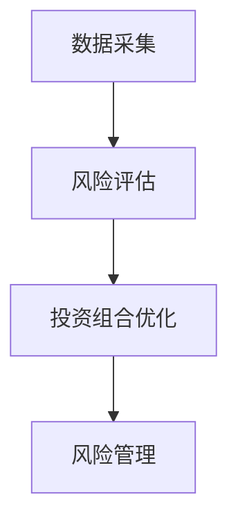

                 


# 大卫·斯文森的另类资产配置策略

## 关键词：大卫·斯文森，另类资产配置，投资策略，资产组合优化，风险管理，系统架构，投资哲学

## 摘要：
本文深入探讨了大卫·斯文森的另类资产配置策略，分析其核心概念、数学模型、系统架构及实际应用。从斯文森的投资哲学到另类资产的分类，再到风险调整后的收益模型和投资组合优化算法，文章详细解析了这一策略的理论基础和实践方法。通过实际案例分析和系统设计，本文为投资者提供了科学的投资决策支持。

---

## 第1章: 大卫·斯文森的生平与投资哲学

### 1.1 大卫·斯文森的生平简介
#### 1.1.1 早年经历与教育背景
大卫·斯文森（David F. Swensen）于1954年出生于美国俄亥俄州，早年在辉瑞制药公司工作，随后转向金融领域。他在耶鲁大学获得化学学士学位，并在哈佛大学获得应用数学博士学位，这为他后来在投资领域的成就奠定了基础。

#### 1.1.2 投资职业生涯的起点
1981年，斯文森加入耶鲁大学，负责管理耶鲁大学的捐赠基金。在他的领导下，耶鲁大学捐赠基金的规模从1.3亿美元增长至2020年的316亿美元，年均回报率超过10%。

#### 1.1.3 对耶鲁大学捐赠基金的贡献
斯文森通过引入另类资产（如私募股权、房地产信托等），显著提升了捐赠基金的收益。他的投资策略强调长期价值创造和风险管理，成为全球投资界的经典案例。

### 1.2 斯文森的投资哲学
#### 1.2.1 长期投资与价值创造
斯文森主张长期投资，避免短期市场波动的干扰。他相信通过深入研究和精选资产，可以获得超额收益。

#### 1.2.2 风险管理与资产配置
斯文森认为，资产配置是投资组合表现的核心驱动力。他通过分散投资和动态调整资产权重来降低风险。

#### 1.2.3 另类资产在投资组合中的作用
斯文森强调，另类资产能够提供与传统资产不同的风险收益特征，从而优化投资组合的整体表现。

---

## 第2章: 另类资产配置策略的核心概念

### 2.1 另类资产的定义与分类
#### 2.1.1 另类资产的定义
另类资产是指传统股票、债券和现金之外的资产类别，包括私募股权、房地产信托、对冲基金、 commodities 等。

#### 2.1.2 另类资产的主要分类
- 私募股权
- 房地产信托
- 对冲基金
- 商品和衍生品
- 另类债务

#### 2.1.3 另类资产与传统资产的区别
- 风险收益特征不同
- 流动性差异
- 市场相关性较低

### 2.2 斯文森另类资产配置策略的背景
#### 2.2.1 传统资产配置的局限性
传统资产配置（股票、债券）在市场波动时表现不稳定，且收益有限。

#### 2.2.2 另类资产配置的兴起
随着金融市场的复杂化，投资者开始关注非传统资产以分散风险和提高收益。

#### 2.2.3 斯文森策略的独特性
斯文森通过将另类资产纳入投资组合，实现了更高的风险调整后收益。

---

## 第3章: 斯文森另类资产配置策略的数学模型

### 3.1 风险调整后的收益模型
#### 3.1.1 风险调整后的收益公式
$$ \text{夏普比率} = \frac{E[r_i - r_f]}{\sigma_i} $$
其中，$E[r_i - r_f]$ 是资产的超额收益期望值，$\sigma_i$ 是资产收益的标准差。

#### 3.1.2 风险调整后的收益计算方法
通过计算各资产的夏普比率，确定其在投资组合中的权重。

#### 3.1.3 实际案例分析
假设有两个资产A和B，A的夏普比率为1.5，B的夏普比率为1.2，根据模型，A应占更大权重。

### 3.2 投资组合优化的数学模型
#### 3.2.1 均值-方差优化模型
$$ \text{最小化} \sigma^2 \quad \text{在约束} \quad E[r_p] = \text{目标收益} $$
其中，$\sigma^2$ 是投资组合的方差，$E[r_p]$ 是投资组合的期望收益。

#### 3.2.2 使用拉格朗日乘数法的优化过程
通过拉格朗日乘数法，求解上述优化问题，确定各资产的最优权重。

#### 3.2.3 约束条件下的最优解
在约束条件下，找到使风险最小化或收益最大化的投资组合。

---

## 第4章: 斯文森策略的实际应用与系统分析

### 4.1 投资组合构建的系统架构
#### 4.1.1 系统功能模块划分
- 数据采集模块
- 风险评估模块
- 投资组合优化模块
- 风险管理模块

#### 4.1.2 系统架构设计图


#### 4.1.3 系统接口设计
- 数据接口：连接金融数据源
- 优化接口：调用优化算法
- 风险管理接口：监控市场变化

### 4.2 投资组合风险管理方案
#### 4.2.1 风险识别与评估
- 识别市场风险、流动性风险等
- 评估风险对投资组合的影响

#### 4.2.2 风险对冲策略
- 使用衍生品对冲市场风险
- 通过分散化降低集中风险

#### 4.2.3 风险监控与调整机制
- 实时监控风险指标
- 根据市场变化动态调整投资组合

---

## 第5章: 斯文森策略的项目实战与案例分析

### 5.1 项目环境与工具安装
#### 5.1.1 环境搭建步骤
- 安装Python、NumPy、Pandas、Scipy
- 获取历史市场数据

#### 5.1.2 必要工具的安装与配置
- 安装PyPortfolioOpt库
- 配置数据接口（如Yahoo Finance）

#### 5.1.3 数据源获取与处理
- 从Yahoo Finance获取历史数据
- 清洗数据并计算收益矩阵

### 5.2 核心代码实现与解读
#### 5.2.1 投资组合优化的Python代码实现
```python
import numpy as np
from pypfolio import PyPortfo
import pandas as pd

# 假设data是资产的收益矩阵
data = pd.DataFrame(...)
port = PyPortfo(data)
port.min_variance()
```

#### 5.2.2 风险管理模块的代码实现
```python
def risk_assessment(returns):
    # 计算波动率
    volatility = returns.std()
    return volatility
```

#### 5.2.3 系统交互界面的设计与实现
- 使用Tkinter或Flask构建交互界面
- 实现数据输入、优化计算和结果展示功能

### 5.3 实际案例分析
#### 5.3.1 案例背景
假设我们有5种资产，目标是构建一个风险调整后的收益最大化投资组合。

#### 5.3.2 数据处理与分析
- 计算各资产的夏普比率
- 确定各资产的权重

#### 5.3.3 优化结果展示
- 输出各资产的权重
- 展示优化后的投资组合收益和风险

---

## 第6章: 斯文森策略的最佳实践与注意事项

### 6.1 最佳实践 tips
#### 6.1.1 投资组合构建的注意事项
- 确保数据的准确性和完整性
- 定期重新优化投资组合

#### 6.1.2 风险管理的关键点
- 实时监控市场变化
- 定期评估风险指标

#### 6.1.3 系统维护与优化建议
- 更新数据源
- 优化算法性能

### 6.2 小结与未来展望
#### 6.2.1 本章内容总结
斯文森的另类资产配置策略通过科学的数学模型和系统的风险管理，实现了长期稳定的超额收益。

#### 6.2.2 未来研究方向
- 研究机器学习在资产配置中的应用
- 探索更多另类资产的投资机会

#### 6.2.3 对投资者的建议
- 学习斯文森的投资哲学
- 结合实际情况优化自己的投资组合

---

## 第7章: 总结与拓展阅读

### 7.1 全书总结
#### 7.1.1 斯文森策略的核心要点
- 长期投资与风险管理并重
- 另类资产优化投资组合
- 科学的数学模型支持

#### 7.1.2 对投资界的启示
斯文森的策略为投资者提供了新的思路，尤其是在复杂市场环境下，另类资产配置的重要性日益凸显。

### 7.2 拓展阅读
- 《机构投资的成功之路》
- 《投资学》
- 《风险管理与金融创新》

---

## 作者：AI天才研究院/AI Genius Institute & 禅与计算机程序设计艺术 /Zen And The Art of Computer Programming

