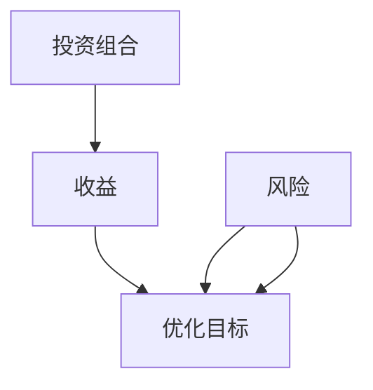
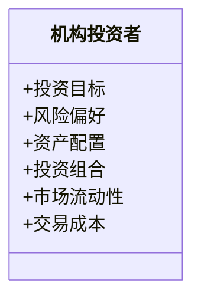
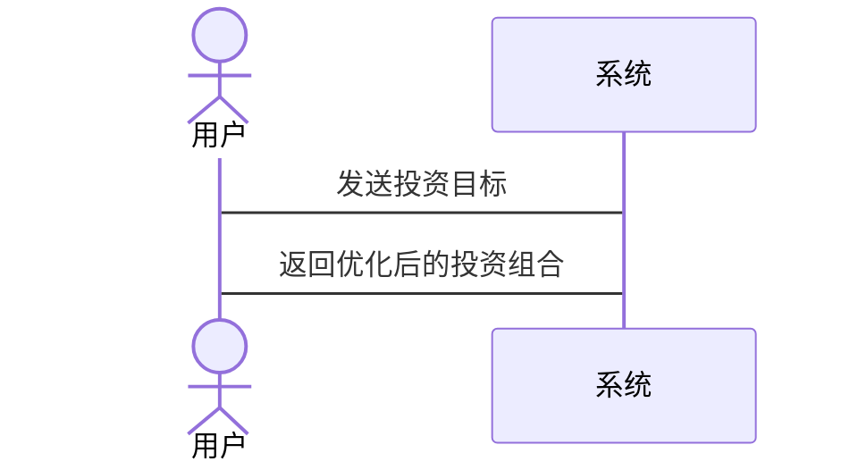

                 


# 大卫·斯文森的机构投资者长期价值创造

## 关键词：机构投资者、大卫·斯文森、长期价值、投资策略、数学模型、系统架构、最佳实践

## 摘要：本文深入探讨了大卫·斯文森的长期价值投资理念及其在机构投资中的应用。通过分析投资组合理论、资产配置策略和风险控制，结合数学模型和系统架构，展示了如何实现长期价值创造。文章最后给出了实际案例分析和最佳实践建议。

---

## 第一部分：机构投资者与长期价值创造的背景

### 第1章：机构投资者的基本概念与历史发展

#### 1.1 机构投资者的定义与分类

- **机构投资者的定义**：机构投资者是指由法人实体管理的大量资金，包括养老基金、保险公司、主权财富基金等。它们通过专业团队进行投资管理，追求长期稳健的收益。
- **机构投资者的分类**：
  - 公共养老基金
  - 保险公司
  - 对冲基金
  - 共同基金
- **机构投资者在金融体系中的地位**：机构投资者是金融市场的重要组成部分，通过大额投资影响市场波动，同时为实体经济提供资金支持。

#### 1.2 大卫·斯文森与机构投资的里程碑

- **大卫·斯文森的生平简介**：大卫·斯文森是耶鲁大学首席投资官，以其长期价值投资策略闻名。他强调基本面分析和长期持有优质资产。
- **斯文森在耶鲁大学的机构投资实践**：斯文森通过多元化投资策略，将耶鲁大学的捐赠基金从1980年代的不足1亿美元增长到数十亿美元。
- **机构投资领域的里程碑事件**：斯文森的策略被广泛采用，成为机构投资的重要参考。

#### 1.3 长期价值投资的理论基础

- **长期价值投资的核心理念**：投资于具有持续竞争优势和良好治理的企业，长期持有，忽略短期市场波动。
- **投资组合理论与长期收益**：通过分散投资降低风险，同时追求资产的长期增值。
- **长期价值投资与市场有效性的关系**：在有效市场中，长期价值投资仍能通过选择优质资产获得超额收益。

---

## 第二部分：机构投资者的核心概念与联系

### 第2章：机构投资者的核心概念与联系

#### 2.1 机构投资者的核心概念

- **投资目标与风险偏好**：明确的投资目标和风险偏好是制定投资策略的基础。
- **资产配置与投资组合管理**：通过合理的资产配置，优化投资组合的风险收益比。
- **市场流动性与交易成本**：流动性影响资产的买卖难度和交易成本，需综合考虑。

#### 2.2 核心概念的属性特征对比

- **投资目标与风险偏好的对比分析**：积极目标 vs 保守目标；高风险 vs 低风险。
- **资产配置与投资组合管理的对比**：主动管理 vs 被动管理；定期调整 vs 不定期调整。
- **市场流动性与交易成本的对比**：高流动性 vs 低流动性；低交易成本 vs 高交易成本。

#### 2.3 ER实体关系图架构

```mermaid
er
actor: 机构投资者
goal: 投资目标
risk: 风险偏好
asset: 资产配置
portfolio: 投资组合
market: 市场流动性
transaction: 交易成本
```

---

## 第三部分：算法原理与数学模型

### 第3章：现代投资组合理论与算法实现

#### 3.1 现代投资组合理论概述

- **投资组合理论的基本假设**：投资者理性，市场有效，资产收益符合正态分布。
- **风险与收益的权衡**：在给定风险下追求最大收益，或在给定收益下追求最小风险。
- **投资组合优化的目标**：最大化收益，最小化风险，或在两者之间找到平衡点。

#### 3.2 均值-方差优化算法



#### 3.3 数学模型与公式

- **投资组合收益公式**：$$E(r_p) = \sum w_i E(r_i)$$
- **投资组合风险公式**：$$\sigma_p^2 = \sum \sum w_i w_j \sigma_{ij}$$
- **优化目标函数**：$$\min w^T \Sigma w \quad \text{subject to} \quad \sum w_i = 1$$

#### 3.4 算法实现与代码示例

```python
import numpy as np

def portfolio_optimization(returns):
    n = len(returns)
    Sigma = np.cov(returns)
    ones = np.ones(n)
    # 最小方差组合
    w_min_var = np.linalg.solve(Sigma, ones) / np.transpose(ones @ np.linalg.solve(Sigma, ones))
    return w_min_var
```

---

## 第四部分：系统分析与架构设计

### 第4章：系统分析与架构设计方案

#### 4.1 问题场景介绍

- **目标**：构建一个机构投资者的投资管理系统，实现投资组合优化和风险控制。
- **项目介绍**：基于大卫·斯文森的投资理念，设计一个智能化的投资管理系统。

#### 4.2 系统功能设计

- **领域模型mermaid类图**：



- **系统架构设计mermaid架构图**：


- **系统接口设计**：API用于数据获取、投资组合优化和风险评估。
- **系统交互mermaid序列图**：



---

## 第五部分：项目实战

### 第5章：项目实战与案例分析

#### 5.1 项目环境安装

- **工具安装**：安装Python、NumPy、Matplotlib和相关库。

#### 5.2 系统核心实现源代码

```python
import numpy as np
import matplotlib.pyplot as plt

def plot_portfolio_weights(weights):
    plt.bar(range(len(weights)), weights)
    plt.title('投资组合权重分布')
    plt.xlabel('资产')
    plt.ylabel('权重')
    plt.show()

weights = portfolio_optimization(returns)
plot_portfolio_weights(weights)
```

#### 5.3 代码应用解读与分析

- 通过数学模型计算投资组合权重，并可视化展示。
- 分析权重分布，优化投资组合以实现长期价值创造。

#### 5.4 实际案例分析和详细讲解剖析

- **案例分析**：以斯文森在耶鲁大学的投资为例，分析其资产配置和风险控制策略。
- **详细讲解**：展示如何通过优化模型选择资产，实现长期收益目标。

#### 5.5 项目小结

- **项目总结**：通过项目实战，验证了大卫·斯文森投资理念的有效性。
- **经验教训**：强调理论与实践的结合，以及持续监控和调整的重要性。

---

## 第六部分：最佳实践与小结

### 第6章：最佳实践、小结、注意事项、拓展阅读

#### 6.1 最佳实践

- **持续学习与适应市场变化**：定期评估投资组合，根据市场变化调整策略。
- **注重风险控制**：建立完善的风险管理体系，避免重大损失。
- **长期视角**：坚持长期投资理念，避免短期波动干扰。

#### 6.2 小结

- 本文通过理论分析、算法实现和项目实战，全面探讨了大卫·斯文森的长期价值投资理念，并展示了其在机构投资中的实际应用。

#### 6.3 注意事项

- 风险管理：重视风险控制，避免过度杠杆和集中投资。
- 数据质量：确保数据的准确性和完整性，影响投资决策。
- 团队协作：构建专业团队，提升投资效率和质量。

#### 6.4 拓展阅读

- 推荐阅读大卫·斯文森的著作，深入理解其投资理念。
- 关注现代投资组合理论的最新发展，提升投资策略的有效性。

---

## 作者：AI天才研究院/AI Genius Institute & 禅与计算机程序设计艺术 /Zen And The Art of Computer Programming

