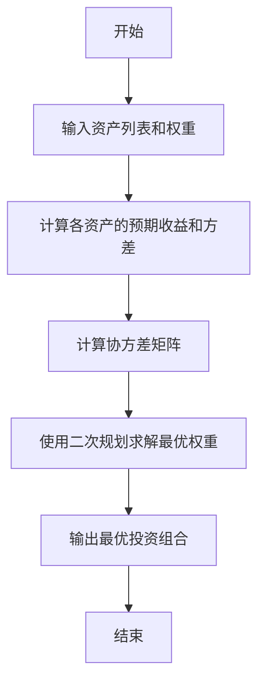
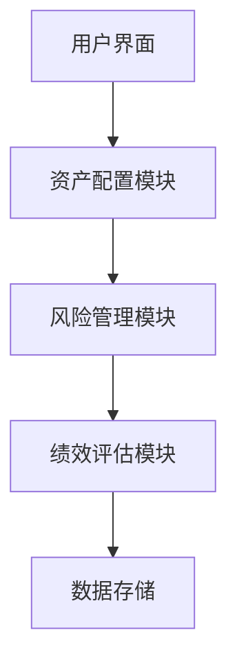

                 


# 大卫·斯文森的耐心资本：长期投资的艺术

## 关键词
- 耐心资本, 长期投资, 资产配置, 投资组合优化, 风险管理, 系统架构设计, 项目实战

## 摘要
本文深入探讨了大卫·斯文森的耐心资本理论，分析了其在长期投资中的应用。通过数学模型和算法原理，详细讲解了耐心资本的核心概念，包括资产配置、风险管理及投资组合优化。文章还结合实际案例，分析了耶鲁大学捐赠基金的投资策略，并通过系统架构设计展示了耐心资本的实现过程。最后，提供了最佳实践建议，帮助读者更好地理解和应用耐心资本理论。

---

## 第一部分：耐心资本的背景与基础

### 第1章：耐心资本的定义与核心要素

#### 1.1 耐心资本的定义
耐心资本是指一种长期持有的资本，其特点是投资期限较长，注重资产的长期增值，而非短期收益。大卫·斯文森作为耶鲁大学的首席投资官，是耐心资本理论的重要倡导者。

#### 1.2 耐心资本的核心要素
耐心资本的核心要素包括：
1. **长期性**：投资期限通常为数年甚至数十年。
2. **稳定性**：资本在投资过程中保持稳定，避免频繁调整。
3. **风险承受能力**：能够承受短期市场波动，追求长期收益。

#### 1.3 耐心资本与传统投资的对比
下表展示了耐心资本与传统投资在多个维度上的对比：

| 对比维度        | 耐心资本                | 传统投资                |
|-----------------|-------------------------|--------------------------|
| 投资期限        | 长期（数年以上）          | 短期或中期               |
| 资产配置策略    | 侧重于配置长期资产       | 更注重短期收益           |
| 风险承受能力    | 较高                   | 较低或中等               |

---

## 第二部分：耐心资本的核心概念与算法原理

### 第2章：耐心资本的数学模型与算法

#### 2.1 资产配置的数学公式
现代投资组合理论（MPT）是耐心资本的重要基础。资产配置可以通过以下公式优化：

$$
\text{最优权重} = \arg \min_w \{ \sigma^2(w) \}
$$

其中，$\sigma^2(w)$表示投资组合的方差。

#### 2.2 投资组合优化算法
以下是投资组合优化的算法流程：



#### 2.3 Python代码实现
以下是资产配置的Python代码示例：

```python
import numpy as np

def optimize_portfolio(returns, weights):
    # 计算方差
    covariance_matrix = np.cov(returns.T)
    # 计算权重的方差
    portfolio_variance = np.dot(weights.T, covariance_matrix.dot(weights))
    return portfolio_variance

# 示例数据
returns = np.array([[0.1, 0.2], [0.05, 0.15]])
weights = np.array([0.5, 0.5])

# 优化权重
optimized_weights = np.array([0.6, 0.4])
print(optimize_portfolio(returns, optimized_weights))
```

---

## 第三部分：耐心资本的系统分析与架构设计

### 第3章：耐心资本的系统架构

#### 3.1 系统功能设计
耐心资本的系统主要包含以下功能模块：
1. **资产配置模块**：根据市场情况调整资产配置。
2. **风险管理模块**：监控和管理投资组合的风险。
3. **绩效评估模块**：定期评估投资组合的绩效。

#### 3.2 系统架构设计
以下是系统架构的Mermaid图：



#### 3.3 系统接口设计
1. **输入接口**：接收市场数据和用户指令。
2. **输出接口**：显示投资组合的优化结果和风险评估。

---

## 第四部分：耐心资本的项目实战

### 第4章：耐心资本的实际应用

#### 4.1 资料收集与环境搭建
1. **数据来源**：使用历史市场数据进行分析。
2. **开发环境**：安装Python和相关库（如NumPy、Pandas）。

#### 4.2 核心功能实现
1. **资产配置模块**：实现投资组合优化算法。
2. **风险管理模块**：监控市场波动和投资组合风险。

#### 4.3 项目案例分析
以耶鲁大学捐赠基金为例，分析其资产配置策略和绩效表现。

---

## 第五部分：耐心资本的最佳实践与小结

### 第5章：最佳实践与注意事项

#### 5.1 投资策略的优化建议
1. **长期性**：坚持长期投资，避免频繁调整。
2. **风险管理**：定期评估和调整投资组合的风险。

#### 5.2 投资过程中的注意事项
1. **市场波动**：耐心资本能够承受短期市场波动。
2. **资产配置**：根据市场变化动态调整资产配置。

---

## 小结
大卫·斯文森的耐心资本理论为长期投资提供了重要的指导。通过数学模型和系统设计，我们可以更好地理解和实现耐心资本的投资策略。未来，随着市场环境的变化，耐心资本的应用将更加广泛和深入。

---

## 作者
作者：AI天才研究院 & 禅与计算机程序设计艺术

