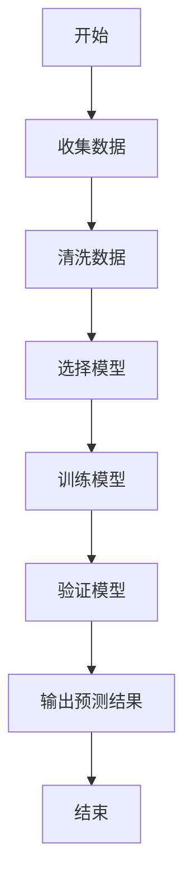
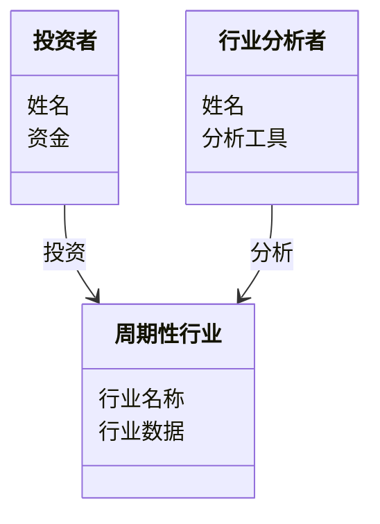

                 


# 大卫·温特斯的周期性行业价值投资

## 关键词：周期性行业，价值投资，大卫·温特斯，行业分析，投资策略

## 摘要：本文深入探讨大卫·温特斯的周期性行业价值投资策略，分析周期性行业的核心概念、预测模型、系统架构及实战案例。通过详细的技术分析和实际应用，帮助投资者理解周期性行业的投资机会和风险，掌握周期性行业的分析方法，制定有效的投资策略。

---

## 第一部分：周期性行业的基础与背景

### 第1章：周期性行业的定义与特点

#### 1.1 周期性行业的定义
周期性行业是指那些受到经济周期波动显著影响的行业。这类行业的表现与整体经济环境密切相关，在经济繁荣时表现良好，而在经济衰退时则可能遭受重大损失。

- **核心概念**：周期性行业的波动性与经济周期紧密相关，通常包括制造业、建筑业、材料等行业。
- **特点**：
  - 行业波动性高
  - 受宏观经济政策影响大
  - 周期性行业的供需关系不稳定

#### 1.2 周期性行业的运行规律
周期性行业通常经历复苏、增长、成熟和衰退四个阶段，每个阶段的特点和投资机会不同。

- **阶段分析**：
  - **复苏阶段**：行业开始复苏，需求逐步回升，价格逐渐稳定。
  - **增长阶段**：行业需求强劲增长，价格和利润同步上升。
  - **成熟阶段**：行业增长放缓，价格趋于稳定，竞争加剧。
  - **衰退阶段**：行业需求下降，价格下跌，企业盈利能力减弱。

- **驱动因素**：
  - 宏观经济政策：政府的财政和货币政策直接影响行业需求。
  - 市场供需：行业的供需关系波动导致价格和利润的变化。
  - 技术进步：技术创新可能改变行业的周期性特征。

#### 1.3 周期性行业的投资价值
尽管周期性行业波动较大，但其投资价值不可忽视。

- **投资机会**：
  - 在复苏阶段，企业估值较低，可能成为抄底的好时机。
  - 在增长阶段，企业盈利上升，股价可能有较大的上涨空间。
- **风险与挑战**：
  - 经济衰退时，周期性行业可能面临较大的亏损风险。
  - 周期性波动可能导致股价短期大幅波动，投资者需具备耐心和信心。

### 第2章：周期性行业的核心概念与联系

#### 2.1 周期性行业的核心要素
周期性行业的核心要素包括供需关系、价格波动和行业周期阶段。

- **供需关系**：周期性行业的供需关系受经济周期影响显著。在经济繁荣时，需求增加；在经济衰退时，需求下降。
- **价格波动**：周期性行业的价格波动较大，通常与供需关系和市场预期相关。
- **行业周期阶段**：行业的周期阶段决定了其投资价值和风险。

#### 2.2 周期性行业的特征对比
以下是周期性行业与非周期性行业的对比：

| 特性                | 周期性行业                        | 非周期性行业                      |
|---------------------|-----------------------------------|------------------------------------|
| 波动性              | 高                               | 低                                 |
| 经济周期影响         | 显著                             | 较小                               |
| 投资风险            | 高                               | 较低                               |
| 投资回报周期        | 较短或较长，取决于周期阶段       | 较稳定                             |

#### 2.3 周期性行业的ER实体关系图
以下是一个简单的ER实体关系图，展示了周期性行业、行业数据和投资策略之间的关系：

```mermaid
er
  actor 投资者
  actor 行业分析者
  entity 周期性行业
  entity 行业数据
  entity 投资策略
  actor 投资者 --> entity 周期性行业
  actor 行业分析者 --> entity 行业数据
  actor 行业分析者 --> entity 投资策略
```

---

## 第二部分：周期性行业的价值投资策略

### 第3章：周期性行业的预测模型

#### 3.1 周期性行业的预测方法
周期性行业的预测通常涉及时间序列分析、回归分析和机器学习模型。

- **时间序列分析**：用于预测行业的未来走势。
- **回归分析**：分析行业周期与宏观经济指标之间的关系。
- **机器学习模型**：如ARIMA、LSTM等模型用于预测行业波动。

#### 3.2 周期性行业的预测流程
以下是预测周期性行业的流程图：



#### 3.3 周期性行业的数学模型
以下是时间序列分析中常用的ARIMA模型：

$$ ARIMA(p, d, q) $$

其中：
- p：自回归阶数
- d：差分阶数
- q：移动平均阶数

---

## 第三部分：周期性行业的系统分析与架构设计

### 第4章：周期性行业的系统架构

#### 4.1 系统功能设计
以下是系统功能设计的类图：



#### 4.2 系统架构设计
以下是系统架构设计的架构图：


---

## 第四部分：周期性行业的项目实战

### 第5章：周期性行业的项目实战

#### 5.1 环境安装
以下是项目实战所需的环境安装步骤：

1. 安装Python
2. 安装Pandas、NumPy、Matplotlib等库

#### 5.2 核心代码实现
以下是Python代码示例：

```python
import pandas as pd
import matplotlib.pyplot as plt

# 数据加载
data = pd.read_csv('industry_data.csv')

# 数据可视化
data.plot()
plt.show()
```

#### 5.3 案例分析
以下是周期性行业的实际案例分析：

- **案例**：假设我们分析的是建筑材料行业。
- **步骤**：
  1. 收集建筑材料行业的历史数据。
  2. 使用ARIMA模型预测未来走势。
  3. 根据预测结果制定投资策略。

---

## 第五部分：周期性行业的总结与展望

### 第6章：周期性行业的总结与展望

#### 6.1 投资策略总结
周期性行业的投资需要结合宏观经济分析和行业数据，制定灵活的投资策略。

#### 6.2 注意事项
- 风险控制：避免过度集中投资周期性行业。
- 时间选择：选择合适的周期阶段进行投资。
- 持续学习：关注行业动态和宏观经济政策。

#### 6.3 拓展阅读
- 《投资学基础》
- 《周期性行业的风险管理》
- 《大卫·温特斯的投资策略》

---

## 作者：AI天才研究院 & 禅与计算机程序设计艺术

