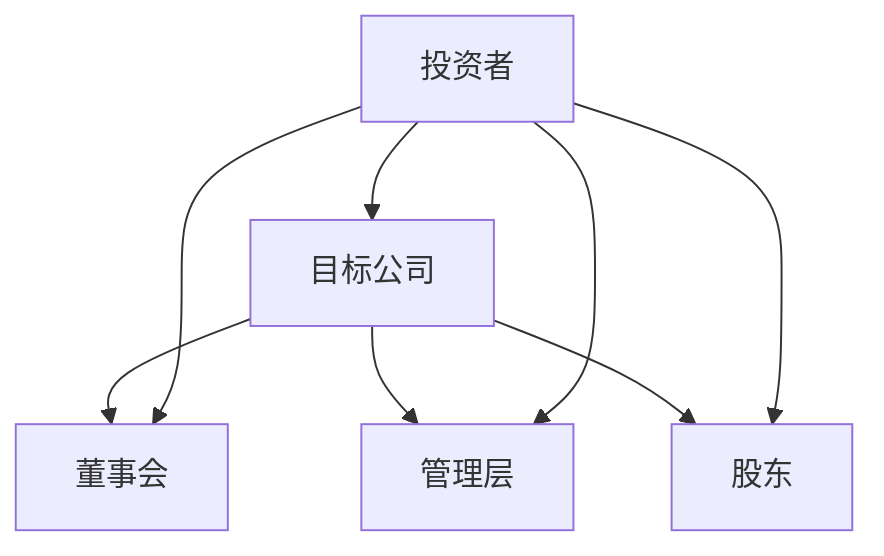
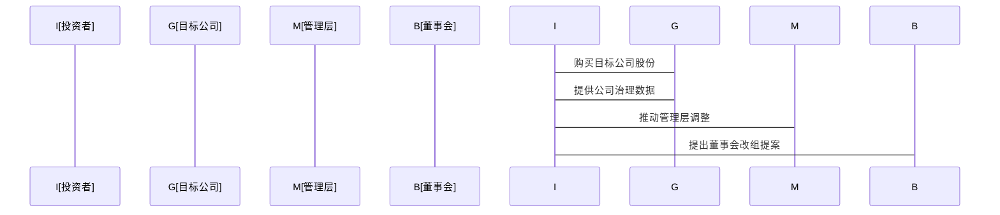

                 


# 大卫·艾伦·科恩的Activist投资策略

---

## 关键词：Activist投资策略、投资管理、风险管理、投资组合、大卫·艾伦·科恩

---

## 摘要：大卫·艾伦·科恩的Activist投资策略是一种以主动干预和积极参与为目标的企业投资策略，通过分析企业治理结构、股东权力和市场动态，制定激进的投资计划，以实现超额收益。本文将从背景介绍、核心概念、算法原理、系统分析、项目实战和风险管理等方面详细阐述该策略。

---

# 第一部分：背景介绍

## 第1章：Activist投资策略的定义与背景

### 1.1 Activist投资的基本概念

Activist投资策略是一种以主动干预和积极参与为目标的投资策略，投资者通过购买目标公司一定比例的股份，主动参与公司治理，推动管理层进行战略调整、资产重组或管理层变动，以实现投资收益的最大化。

- **定义**：Activist投资策略是指投资者通过持有目标公司一定比例的股份，积极参与公司治理，推动公司进行战略调整或资产重组，以实现投资收益最大化的一种投资策略。
- **与其他投资策略的区别**：
  - 与被动投资策略不同，Activist投资策略强调投资者的积极参与和干预。
  - 与短期交易策略不同，Activist投资策略注重长期价值的挖掘和创造。
- **发展历史**：Activist投资策略起源于20世纪70年代，随着机构投资者的兴起和股东权利意识的增强而逐渐发展成熟。

### 1.2 Activist投资的核心要素

- **投资目标的确定**：明确投资目标，包括推动公司战略调整、资产重组、管理层变动等。
- **投资策略的制定**：根据目标公司的具体情况，制定详细的干预计划，包括持股比例、干预时机、干预方式等。
- **投资工具与方法的选择**：选择合适的工具和方法，包括购买公司股份、发起股东提案、参与股东大会等。

### 1.3 Activist投资的背景与驱动因素

- **当前市场环境对Activist投资的影响**：市场波动加剧、企业并购活跃、股东权利意识增强等因素为Activist投资提供了有利条件。
- **投资者行为变化对Activist策略的需求**：机构投资者的兴起、散户投资者的参与意愿增强，推动了Activist投资策略的发展。
- **技术进步对Activist投资的推动**：大数据技术的应用、量化分析工具的普及，为Activist投资策略的实施提供了技术支持。

### 1.4 Activist投资的边界与外延

- **适用范围**：主要适用于成熟市场中的上市公司，尤其是那些治理结构松散、价值被低估的企业。
- **外延**：Activist投资策略不仅限于二级市场投资，还包括一级市场投资、私募股权投资等多种形式。

---

## 第2章：Activist投资的核心概念与联系

### 2.1 Activist投资的核心原理

- **治理结构分析**：通过对目标公司的治理结构进行分析，包括董事会结构、管理层权力分配、股东权利等，识别潜在的干预机会。
- **股东权力分析**：分析股东在公司治理中的权利，包括投票权、知情权、参与权等，制定干预计划。
- **市场动态分析**：结合市场环境、行业趋势、公司基本面等因素，制定干预策略。

### 2.2 Activist投资的核心要素对比

| 核心要素 | 定义 | 优势 | 劣势 |
|----------|------|------|------|
| 持股比例 | 投资者持有目标公司的股份比例 | 高持股比例可以增强干预能力 | 高持股比例需要大量资金投入 |
| 干预时机 | 投资者选择干预的时间点 | 适时干预可以提高成功率 | 干预时机不当可能导致失败 |
| 干预方式 | 投资者选择的干预手段 | 多种干预手段可以灵活应对不同情况 | 多种干预手段可能导致复杂性 |

### 2.3 Activist投资的核心概念ER实体关系图



---

## 第3章：Activist投资策略的算法原理

### 3.1 Activist投资策略的量化分析

- **多因子模型**：通过多个因子（如市盈率、市净率、ROE等）对目标公司进行综合评估，识别具有潜在投资价值的公司。
- **事件驱动策略**：根据公司事件（如并购、重组、管理层变动等）进行投资，捕捉短期收益。

### 3.2 Activist投资策略的数学模型

$$
\text{投资价值} = \sum_{i=1}^{n} w_i \cdot f_i
$$

其中，$w_i$ 是因子 $f_i$ 的权重，$f_i$ 是因子的具体数值。

### 3.3 Activist投资策略的Python代码实现

```python
def calculate_investment_value(factors, weights):
    return sum(w * f for w, f in zip(weights, factors))

# 示例因子和权重
factors = [15, 2.5, 0.8]
weights = [0.5, 0.3, 0.2]

investment_value = calculate_investment_value(factors, weights)
print("投资价值 =", investment_value)
```

---

## 第4章：Activist投资策略的系统分析

### 4.1 Activist投资策略的系统架构设计

- **功能模块划分**：
  - 数据采集模块：采集目标公司的基本面数据、市场数据、公司治理数据等。
  - 数据分析模块：对目标公司进行多维度分析，识别潜在的干预机会。
  - 决策支持模块：根据分析结果，制定具体的干预策略。

### 4.2 Activist投资策略的系统交互流程



---

## 第5章：Activist投资策略的项目实战

### 5.1 Activist投资策略的环境搭建

- **工具安装**：安装Python、Pandas、NumPy等工具，用于数据处理和分析。
- **数据获取**：通过API获取目标公司的历史数据、财务数据、公司治理数据等。

### 5.2 Activist投资策略的代码实现

```python
import pandas as pd
import numpy as np

# 示例数据
data = {
    '公司名称': ['公司A', '公司B', '公司C'],
    '市盈率': [15, 20, 25],
    '市净率': [2.5, 3.0, 3.5],
    'ROE': [8, 10, 12]
}
df = pd.DataFrame(data)

# 计算投资价值
def calculate_investment_value(row):
    factors = row[['市盈率', '市净率', 'ROE']]
    weights = [0.5, 0.3, 0.2]
    return sum(w * f for w, f in zip(weights, factors))

df['投资价值'] = df.apply(calculate_investment_value, axis=1)
print(df)
```

### 5.3 Activist投资策略的案例分析

- **案例选择**：选择具有代表性的目标公司，分析其治理结构、财务状况等，制定干预计划。
- **案例解读**：通过具体案例分析，展示Activist投资策略的实施过程和结果。

---

## 第6章：Activist投资策略的风险管理

### 6.1 Activist投资策略的主要风险

- **市场风险**：市场波动可能导致投资失败。
- **操作风险**：干预过程中的失误可能导致投资失败。
- **道德风险**：投资者的干预可能引发道德争议，影响公司声誉。

### 6.2 Activist投资策略的组合优化

- **分散投资**：通过分散投资降低风险。
- **风险对冲**：利用衍生工具对冲市场风险。

### 6.3 Activist投资策略的压力测试

- **情景分析**：模拟不同市场环境下的投资结果。
- **敏感性分析**：分析投资结果对不同因素的敏感性。

---

## 第7章：总结与展望

### 7.1 Activist投资策略的总结

- **核心要点**：通过积极参与公司治理，推动公司价值提升，实现投资收益最大化。
- **关键步骤**：目标选择、数据分析、策略制定、干预实施、风险控制。

### 7.2 Activist投资策略的未来展望

- **技术进步**：人工智能、大数据技术的进一步应用将提升Activist投资策略的实施效果。
- **市场变化**：全球经济形势的变化将为Activist投资策略提供新的机遇和挑战。

---

## 作者：AI天才研究院/AI Genius Institute & 禅与计算机程序设计艺术 /Zen And The Art of Computer Programming

---

这篇文章系统地介绍了大卫·艾伦·科恩的Activist投资策略，从背景介绍到算法原理，再到项目实战和风险管理，为读者提供了一个全面的视角。希望这篇文章能够帮助读者更好地理解和应用这一投资策略。

