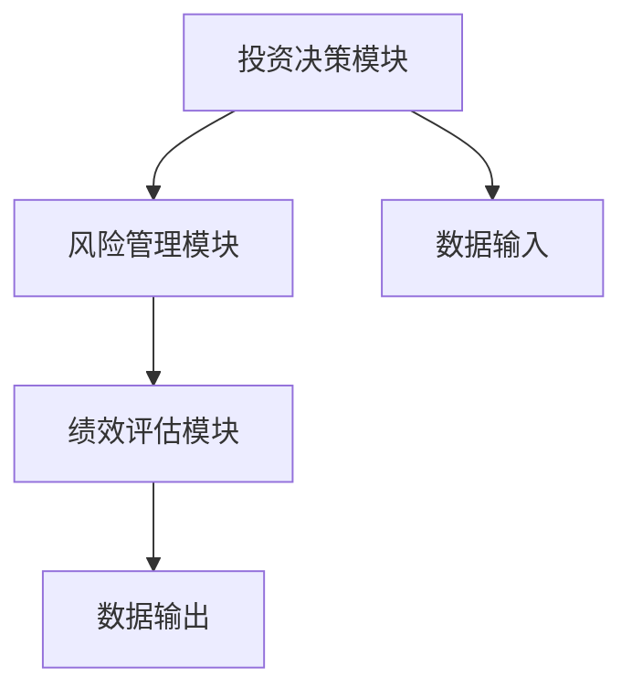

                 


# 大卫·艾伦·科恩的私募股权投资策略

> 关键词：私募股权，大卫·艾伦·科恩，投资策略，风险管理，系统架构

> 摘要：本文系统地介绍了大卫·艾伦·科恩的私募股权投资策略，从核心概念到数学模型，从系统架构到项目实战，全面剖析了该策略的实现细节与实际应用。文章通过详细的案例分析和代码实现，帮助读者深入理解大卫·艾伦·科恩的投资哲学，并掌握其策略在实际操作中的应用方法。

---

## 第一部分: 私募股权投资策略背景与核心概念

### 第1章: 私募股权投资概述

#### 1.1 私募股权投资的基本概念

私募股权（Private Equity）是指通过非公开市场进行的股权投资活动，主要投资于未上市公司或未公开上市的股权。与公募股权不同，私募股权具有高度的灵活性和定制化特点，投资者可以通过与目标企业协商，获得特定的股权比例和收益分配方式。

##### 1.1.1 私募股权的定义与特点

私募股权的定义可以概括为：一种通过非公开市场进行的股权投资活动，投资者通过购买目标企业的股权，获得企业的部分所有权，并在企业增值后通过股权转让实现收益。

私募股权具有以下特点：
- **高门槛**：私募股权通常要求较高的投资门槛，投资者需要具备一定的资金实力和投资经验。
- **高风险高回报**：私募股权的风险较高，但潜在回报也较高，尤其是在市场环境良好的情况下。
- **灵活性**：私募股权的投资方式灵活，投资者可以根据企业的具体情况定制投资方案。

##### 1.1.2 私募股权与公募股权的区别

| 特性 | 公募股权 | 私募股权 |
|------|----------|----------|
| 发行方式 | 公开发行 | 非公开发行 |
| 投资门槛 | 较低 | 较高 |
| 投资期限 | 短期 | 长期 |
| 投资对象 | 已上市公司 | 未上市公司 |
| 风险程度 | 较低 | 较高 |

##### 1.1.3 私募股权的核心要素与参与者

私募股权的核心要素包括：
- **目标企业**：私募股权的投资对象通常是具有较高增长潜力的企业。
- **投资者**：私募股权的投资者通常是机构投资者或高净值个人。
- **管理团队**：私募股权的管理团队负责制定和执行投资策略，监控投资风险。

参与者包括：
- 投资者：提供资金支持。
- 管理团队：负责投资决策和管理。
- 目标企业：接受投资的企业。

---

#### 1.2 大卫·艾伦·科恩的私募股权策略背景

##### 1.2.1 私募股权行业的现状与趋势

近年来，私募股权行业呈现出快速发展的趋势。随着全球经济的增长和企业融资需求的增加，私募股权逐渐成为企业融资的重要方式之一。大卫·艾伦·科恩作为私募股权领域的资深专家，其策略在行业中具有重要地位。

##### 1.2.2 大卫·艾伦·科恩的行业地位与影响力

大卫·艾伦·科恩是私募股权领域的权威人物，其策略以严谨和高效著称。他的策略不仅在理论上有重要贡献，在实践中也取得了显著成果。

##### 1.2.3 科恩策略的核心理念与目标

科恩策略的核心理念是通过科学的投资决策和严格的风险管理，实现投资收益的最大化。其目标是通过长期投资和价值创造，实现投资组合的稳健增长。

---

### 第2章: 私募股权投资策略的核心概念

#### 2.1 投资决策模型

##### 2.1.1 投资决策的三要素：价值、风险与流动性

投资决策的三要素包括：
- **价值**：目标企业的内在价值，是投资决策的核心依据。
- **风险**：投资过程中可能面临的不确定性。
- **流动性**：投资资金的流动性，影响投资的灵活性。

##### 2.1.2 科恩策略中的投资决策框架

科恩的投资决策框架包括以下几个步骤：
1. **目标企业筛选**：根据企业财务状况、行业地位等因素筛选目标企业。
2. **价值评估**：通过DCF模型等方法评估企业的内在价值。
3. **风险评估**：分析企业的财务风险、行业风险等。
4. **投资决策**：根据评估结果制定投资策略。

##### 2.1.3 投资决策的数学模型与公式

以下是科恩策略中常用的数学模型：

- **DCF模型（Discounted Cash Flow Model）**：
  $$ V = \frac{CF}{(1 + r)^n} $$
  其中，\( V \) 表示企业价值，\( CF \) 表示未来现金流，\( r \) 表示折现率，\( n \) 表示时间。

---

#### 2.2 风险管理与控制

##### 2.2.1 风险评估的核心指标与方法

风险评估的核心指标包括：
- **VaR（Value at Risk）**：衡量投资组合在给定置信水平下的最大可能损失。
- **波动率**：衡量资产价格的波动程度。
- **相关性**：衡量不同资产之间的风险相关性。

##### 2.2.2 科恩策略中的风险管理框架

科恩的风险管理框架包括：
1. **风险识别**：识别投资过程中可能面临的风险。
2. **风险量化**：通过数学模型量化风险。
3. **风险控制**：制定风险控制措施，降低风险敞口。

##### 2.2.3 风险控制的数学模型与公式

- **VaR模型**：
  $$ VaR = \mu + z \cdot \sigma $$
  其中，\( \mu \) 表示平均值，\( z \) 表示标准正态分布的分位数，\( \sigma \) 表示标准差。

---

### 第3章: 私募股权投资策略的数学模型

#### 3.1 投资组合优化模型

##### 3.1.1 Markowitz有效前沿理论

Markowitz有效前沿理论是投资组合理论的重要组成部分，其核心思想是通过优化投资组合的风险和收益，找到最优的投资组合。

##### 3.1.2 科恩策略中的投资组合优化方法

科恩的投资组合优化方法包括：
1. **目标函数设定**：设定投资组合的收益最大化或风险最小化目标。
2. **约束条件设定**：设定投资组合的约束条件，如流动性约束、风险约束等。
3. **优化求解**：通过数学优化方法求解最优投资组合。

##### 3.1.3 数学公式与模型推导

- **优化目标**：
  $$ \min_{w} w^T \Sigma w $$
  其中，\( w \) 表示权重向量，\( \Sigma \) 表示协方差矩阵。

---

#### 3.2 风险评估与量化模型

##### 3.2.1 VaR（Value at Risk）模型

VaR模型是风险评估的重要工具，其核心思想是通过统计方法估计投资组合在给定置信水平下的最大可能损失。

##### 3.2.2 科恩策略中的风险量化方法

科恩的风险量化方法包括：
1. **VaR模型**：通过统计方法量化投资组合的风险。
2. **情景分析**：通过情景分析方法评估不同市场条件下的风险。

##### 3.2.3 数学公式与模型应用

- **VaR模型**：
  $$ VaR = \mu + z \cdot \sigma $$
  其中，\( \mu \) 表示平均值，\( z \) 表示标准正态分布的分位数，\( \sigma \) 表示标准差。

---

### 第4章: 私募股权投资策略的系统架构设计

#### 4.1 系统功能设计

##### 4.1.1 投资决策模块

投资决策模块是系统的核心模块，负责根据目标企业的财务数据和市场数据，生成投资决策建议。

##### 4.1.2 风险管理模块

风险管理模块负责评估投资组合的风险，并制定风险控制措施。

##### 4.1.3 绩效评估模块

绩效评估模块负责评估投资组合的绩效，并生成绩效报告。

---

#### 4.2 系统架构图



---

#### 4.3 系统接口设计

##### 4.3.1 数据接口

系统需要与外部数据源（如金融市场数据源）进行数据交互。

##### 4.3.2 API接口

系统通过API接口与其他系统（如投资管理系统）进行数据交互。

##### 4.3.3 用户界面

系统提供友好的用户界面，供用户进行投资决策和风险管理。

---

### 第5章: 私募股权投资策略的项目实战

#### 5.1 环境安装与配置

##### 5.1.1 开发环境搭建

开发环境包括操作系统、编程语言（如Python）、开发工具等。

##### 5.1.2 数据源配置

需要配置金融市场数据源，如Yahoo Finance、 Bloomberg等。

##### 5.1.3 工具链安装

安装必要的工具，如Jupyter Notebook、Pandas、NumPy等。

---

#### 5.2 核心代码实现

##### 5.2.1 投资决策模型的代码实现

```python
import pandas as pd
import numpy as np

def calculate_value(target_company, market_data):
    # 计算目标公司的内在价值
    cash_flows = target_company.cash_flows
    discount_rate = market_data.discount_rate
    value = sum(cash_flows / (1 + discount_rate)**i for i in range(len(cash_flows)))
    return value
```

##### 5.2.2 风险管理模块的代码实现

```python
def calculate_v

