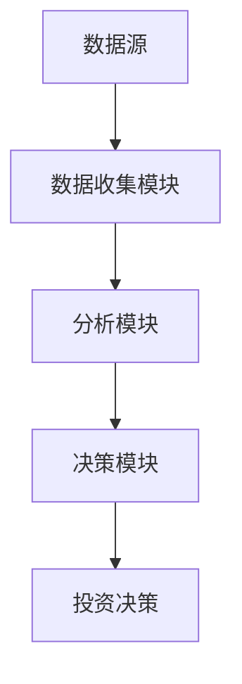
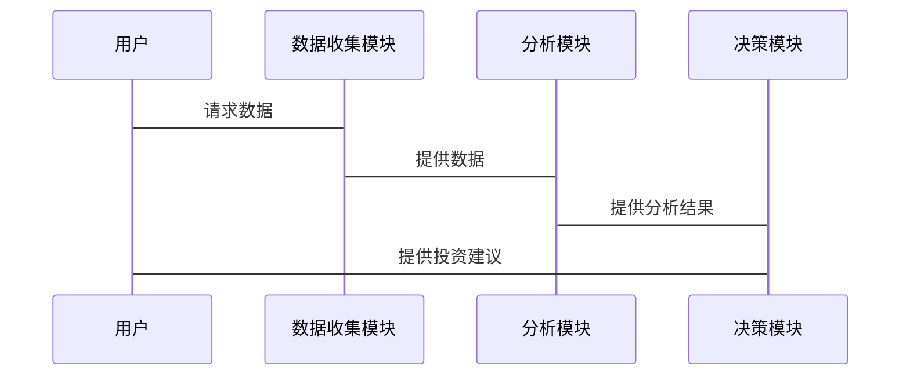

                 


# 大卫·艾伯特的极度低估价值投资：寻找市场的定价错误

## 关键词
价值投资，定价错误，基本面分析，安全边际，大卫·艾伯特，低估市场，投资策略

## 摘要
本文深入探讨大卫·艾伯特的极度低估价值投资策略，揭示如何通过寻找市场定价错误来实现长期投资收益。文章从价值投资的基本概念出发，分析定价错误的成因，详细介绍基本面分析和安全边际的应用，构建数学模型，设计系统架构，并通过实际案例展示投资策略的实施过程。最后，总结投资要点并提出风险管理建议。

---

## 第1章: 价值投资概述

### 1.1 价值投资的基本概念
#### 1.1.1 价值投资的定义
价值投资是一种长期投资策略，旨在通过购买被市场低估的资产，随着时间推移实现收益。它关注于资产的内在价值，而非短期市场波动。

#### 1.1.2 价值投资的核心理念
- **内在价值**：资产的真实价值，基于其未来现金流的现值。
- **安全边际**：内在价值与市场价格之间的差距，确保投资的安全性。

#### 1.1.3 价值投资与其它策略的区别
- **趋势投资**：关注价格走势，通常依赖技术分析。
- **成长投资**：侧重于高成长潜力的公司。
- **价值投资**：寻找价格低于内在价值的资产。

### 1.2 大卫·艾伯特的背景与投资理念
#### 1.2.1 大卫·艾伯特的生平简介
大卫·艾伯特是价值投资领域的权威，以其在低估市场中的成功投资闻名。

#### 1.2.2 艾伯特的价值投资方法
- **基本面分析**：评估公司财务状况、行业地位和竞争优势。
- **安全边际**：确保买入价格远低于内在价值，降低风险。

#### 1.2.3 艾伯特投资理念的核心要素
- **耐心**：等待合适的买入机会。
- **纪律**：严格遵守投资原则，避免情绪化决策。

### 1.3 价值投资的目标与意义
#### 1.3.1 价值投资的目标
- 实现长期稳定的收益。
- 通过低估资产的投资，获得超额回报。

#### 1.3.2 价值投资的意义
- 提供一种理性、系统化的投资方法。
- 降低投资风险，提高收益的确定性。

#### 1.3.3 价值投资的适用场景
- 经济低迷时期：更多低估资产出现。
- 初级市场或新兴行业：信息不对称可能导致定价错误。

---

## 第2章: 价值投资的核心概念

### 2.1 市场定价与定价错误
#### 2.1.1 市场定价的基本原理
市场定价由供需关系决定，但并非总是反映资产的真实价值。

#### 2.1.2 定价错误的定义与分类
- **低估**：市场价格低于内在价值。
- **高估**：市场价格高于内在价值。

#### 2.1.3 定价错误的产生原因
- **认知偏差**：投资者的非理性行为。
- **信息不对称**：市场参与者掌握的信息不一致。
- **情绪波动**：市场情绪影响定价。

### 2.2 基本面分析的核心要素
#### 2.2.1 财务指标分析
- **市盈率（P/E）**：股价与每股收益的比率。
- **市净率（P/B）**：股价与每股净资产的比率。
- **股息率**：股息与股价的比率。

#### 2.2.2 行业分析
- 行业周期：处于衰退期的行业可能有低估资产。
- 行业竞争格局：寡头垄断行业可能定价不公。

#### 2.2.3 公司竞争力分析
- 核心竞争力：公司是否具备长期竞争优势。
- 管理团队：管理层的能力和决策影响公司价值。

### 2.3 安全边际的概念与应用
#### 2.3.1 安全边际的定义
安全边际=内在价值-市场价格。

#### 2.3.2 安全边际的计算方法
- 使用DCF模型评估内在价值。
- 比较市场价格与内在价值的差异。

#### 2.3.3 安全边际在投资中的作用
- 降低投资风险。
- 提供价格波动的缓冲空间。

### 2.4 本章小结
价值投资通过基本面分析和安全边际评估，寻找被低估的资产，实现长期稳定的收益。

---

## 第3章: 极度低估市场的投资策略

### 3.1 极度低估市场的定义与特征
#### 3.1.1 极度低估市场的定义
市场价格远低于内在价值的市场。

#### 3.1.2 极度低估市场的特征
- 资产价格被市场忽视。
- 投资者情绪低落，市场关注度低。

#### 3.1.3 极度低估市场的投资机会
- 高收益潜力。
- 低竞争压力。

### 3.2 极度低估市场的识别方法
#### 3.2.1 通过财务指标识别
- 高市盈率或低市盈率的公司。
- 高负债率的公司。

#### 3.2.2 通过行业分析识别
- 处于周期底部的行业。
- 新兴行业中的早期公司。

#### 3.2.3 通过公司分析识别
- 具备竞争优势但被市场忽视的公司。
- 管理层稳定且有能力的公司。

### 3.3 极度低估市场的投资风险
#### 3.3.1 市场复苏风险
市场可能突然复苏，导致资产价格回升。

#### 3.3.2 信息风险
低估资产的信息可能不充分，导致评估误差。

#### 3.3.3 经营风险
公司基本面可能恶化，影响资产价值。

### 3.4 应对策略
#### 3.4.1 建立多元化的投资组合
分散投资，降低单一资产的风险。

#### 3.4.2 设定止损点
控制潜在损失，避免重大亏损。

#### 3.4.3 定期评估投资组合
及时调整，应对市场变化。

### 3.5 本章小结
识别和投资极度低估市场需要深入的分析和严格的风险管理。

---

## 第4章: 极度低估市场的数学模型与算法

### 4.1 定价错误的数学模型
#### 4.1.1 基于DCF的内在价值计算
$$ \text{内在价值} = \sum_{t=1}^{\infty} \frac{\text{现金流}_t}{(1 + r)^t} $$
其中，\( r \)为折现率。

#### 4.1.2 安全边际的计算
$$ \text{安全边际} = \text{内在价值} - \text{市场价格} $$

### 4.2 定价错误的算法实现
#### 4.2.1 数据收集与预处理
- 收集公司财务数据、行业数据和市场数据。

#### 4.2.2 计算财务指标
- 计算市盈率、市净率、股息率等指标。

#### 4.2.3 评估内在价值
- 使用DCF模型或其它方法评估公司内在价值。

#### 4.2.4 计算安全边际
- 比较市场价格与内在价值，计算安全边际。

### 4.3 算法实现的Python代码示例
```python
def calculate_intrinsic_value(cash_flows, discount_rate):
    intrinsic_value = 0
    for t, cash_flow in enumerate(cash_flows):
        intrinsic_value += cash_flow / (1 + discount_rate) ** t
    return intrinsic_value

def calculate_margin_of_safety(intrinsic_value, market_price):
    return intrinsic_value - market_price
```

### 4.4 本章小结
数学模型和算法为价值投资提供了科学的工具，帮助投资者准确评估资产的价值。

---

## 第5章: 极度低估市场的系统架构与设计

### 5.1 系统架构设计
#### 5.1.1 系统模块划分
- 数据收集模块：收集市场数据。
- 分析模块：进行基本面分析。
- 决策模块：评估安全边际，做出投资决策。

#### 5.1.2 系统架构图


### 5.2 系统功能设计
#### 5.2.1 数据收集模块
- 从多个来源收集数据，确保数据的准确性和全面性。

#### 5.2.2 分析模块
- 使用财务指标和DCF模型进行分析。
- 生成分析报告，供决策参考。

#### 5.2.3 决策模块
- 评估安全边际，确定投资标的。
- 生成投资策略，指导投资行为。

### 5.3 系统接口设计
#### 5.3.1 数据接口
- API接口与数据源对接。
- 数据清洗和预处理。

#### 5.3.2 用户接口
- 提供友好的用户界面，方便用户操作。
- 显示分析结果和投资建议。

### 5.4 系统交互流程


### 5.5 本章小结
系统架构设计为价值投资提供了高效、可靠的工具，支持投资者进行科学决策。

---

## 第6章: 极度低估市场的项目实战

### 6.1 项目背景与目标
#### 6.1.1 项目背景
选择一个具有代表性的市场或行业，进行深入分析。

#### 6.1.2 项目目标
寻找极度低估的资产，进行投资分析和策略制定。

### 6.2 项目实施步骤
#### 6.2.1 数据收集
收集目标公司的财务数据、行业数据和市场数据。

#### 6.2.2 数据分析
使用财务指标和DCF模型评估公司的内在价值。

#### 6.2.3 安全边际计算
比较市场价格与内在价值，计算安全边际。

#### 6.2.4 投资决策
根据安全边际和其它因素，做出投资决策。

### 6.3 项目案例分析
#### 6.3.1 案例选择
选择一家具有代表性的公司，如某初创科技公司。

#### 6.3.2 数据分析
计算市盈率、市净率，评估内在价值。

#### 6.3.3 投资建议
根据分析结果，给出买入或观望的建议。

### 6.4 项目总结
#### 6.4.1 项目成果
展示分析结果和投资建议。

#### 6.4.2 经验总结
总结项目实施过程中的经验教训，提出改进建议。

### 6.5 本章小结
通过实际案例分析，验证了大卫·艾伯特价值投资策略的有效性。

---

## 第7章: 极度低估价值投资的最佳实践与总结

### 7.1 最佳实践
#### 7.1.1 风险管理
- 设定止损点，控制潜在损失。
- 分散投资，降低单一资产的风险。

#### 7.1.2 持续学习
- 关注市场动态，及时调整投资策略。
- 学习新的分析方法，提升投资能力。

#### 7.1.3 长期视角
- 价值投资需要耐心，等待合适的买入机会。
- 避免短期市场波动的干扰。

### 7.2 投资总结
- 价值投资是一种科学的艺术，需要深入的分析和严格的风险管理。
- 大卫·艾伯特的策略为投资者提供了有效的工具，帮助他们在市场中寻找定价错误的机会。

### 7.3 未来展望
- 随着技术的进步，价值投资将更加依赖于数据和算法。
- 人工智能在投资分析中的应用将推动价值投资的发展。

### 7.4 本章小结
价值投资是一项长期的事业，需要投资者具备耐心、纪律和持续学习的精神。

---

## 作者：AI天才研究院/AI Genius Institute & 禅与计算机程序设计艺术 /Zen And The Art of Computer Programming

---

通过以上目录结构，您可以逐步完成文章的撰写。每一部分都需要详细展开，确保内容丰富、逻辑清晰。

