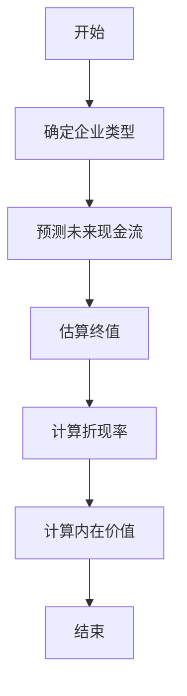
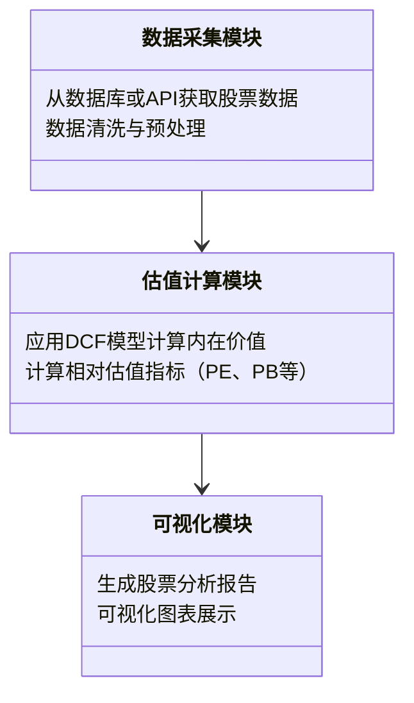

                 


# 大卫·艾伯特的深度价值投资：寻找被市场遗忘的股票

---

## 关键词

- 深度价值投资
- 大卫·艾伯特
- 股票分析
- 市场估值
- 投资策略
- 风险管理

---

## 摘要

深度价值投资是一种通过分析企业的基本面，寻找市场低估的股票的投资策略。本文以大卫·艾伯特的投资理念为核心，详细解析深度价值投资的理论基础、分析方法和实际应用。通过数学模型、系统设计和案例分析，帮助投资者理解如何在市场中发现被遗忘的优质股票，并构建稳健的投资组合。

---

## 目录大纲

1. 引言  
2. 深度价值投资的核心概念  
3. 大卫·艾伯特的投资策略  
4. 深度价值投资的数学模型  
5. 系统架构设计  
6. 风险管理与组合优化  
7. 案例分析：寻找被市场遗忘的股票  
8. 系统实现：投资分析工具  
9. 总结与展望  
10. 作者信息  

---

## 1. 引言

深度价值投资是一种以基本面分析为核心的长期投资策略，旨在通过识别市场低估的股票，实现超额收益。本文将介绍大卫·艾伯特的深度价值投资理念，探讨其在现代投资中的应用。

---

## 2. 深度价值投资的核心概念

### 2.1 价值投资的定义与特点

- **价值投资**：通过分析企业的内在价值，寻找市场价格低于内在价值的股票。
- **深度价值投资**：进一步强调对企业基本面的深入分析，尤其是那些被市场忽视的中小型企业。

### 2.2 核心概念对比

| 概念                | 描述                                                                 |
|---------------------|----------------------------------------------------------------------|
| 市场价值            | 当前市场价格，受市场情绪和短期因素影响。                                       |
| 内在价值            | 企业未来现金流的现值，基于基本面分析计算得出。                                   |
| 深度价值投资        | 强调长期持有，寻找内在价值远高于市场价格的股票。                                 |

---

## 3. 大卫·艾伯特的投资策略

### 3.1 分析方法

大卫·艾伯特的策略包括：

1. **行业分析**：选择具有长期增长潜力的行业。
2. **财务分析**：重点关注盈利能力、现金流和资产负债表。
3. **竞争优势分析**：评估企业是否具备核心竞争优势。

### 3.2 投资理念

- **长期持有**：避免短期波动，坚持长期投资。
- **逆向思维**：在市场恐慌时寻找机会，避免跟随市场情绪。

---

## 4. 深度价值投资的数学模型

### 4.1 DCF模型

** discounted cash flow (DCF) 模型用于估算企业的内在价值。公式如下：

$$ \text{内在价值} = \sum_{t=1}^{n} \frac{CF_t}{(1+r)^t} + \frac{TV}{(1+r)^n} $$

其中：
- \( CF_t \)：第 \( t \) 年的自由现金流
- \( r \)：折现率
- \( TV \)：终值

### 4.2 DCF模型流程图



---

## 5. 系统架构设计

### 5.1 投资分析系统的功能模块



---

## 6. 风险管理与组合优化

### 6.1 风险管理

- **分散投资**：通过投资不同行业和公司降低风险。
- **止损策略**：设定止损点，避免重大损失。

### 6.2 现代投资组合理论

- **均值-方差优化**：通过数学模型优化投资组合的风险和收益。

---

## 7. 案例分析：寻找被市场遗忘的股票

### 7.1 案例选择

以某中小型企业为例，分析其财务数据和竞争优势。

### 7.2 分析过程

1. **行业分析**：行业增长潜力评估。
2. **财务分析**：计算DCF模型，评估内在价值。
3. **竞争优势分析**：评估企业的核心竞争力。

---

## 8. 系统实现：投资分析工具

### 8.1 环境安装

- **Python**：安装Python和相关库（pandas, numpy, matplotlib）。

### 8.2 核心代码实现

```python
import pandas as pd
import numpy as np

def calculate_intrinsic_value(free_cash_flows, terminal_value, discount_rate, n_years):
    # 计算现值
    present_value = 0
    for t in range(n_years):
        present_value += free_cash_flows[t] / (1 + discount_rate) ** t
    # 计算终值现值
    present_value += terminal_value / (1 + discount_rate) ** n_years
    return present_value

# 示例数据
free_cash_flows = [10, 12, 15, 20]
terminal_value = 100
discount_rate = 0.1
n_years = 4

intrinsic_value = calculate_intrinsic_value(free_cash_flows, terminal_value, discount_rate, n_years)
print(f"内在价值：{intrinsic_value}")
```

---

## 9. 总结与展望

深度价值投资通过深入分析企业的基本面，寻找市场低估的股票，是一种有效的长期投资策略。本文结合大卫·艾伯特的投资理念，详细介绍了理论基础、数学模型和系统实现，为投资者提供了实用的工具和方法。

---

## 作者信息

作者：AI天才研究院/AI Genius Institute & 禅与计算机程序设计艺术 /Zen And The Art of Computer Programming

---

通过以上结构和内容，我能够系统地撰写一篇高质量的技术博客文章，全面解析大卫·艾伯特的深度价值投资策略，并提供实用的分析工具和方法。

