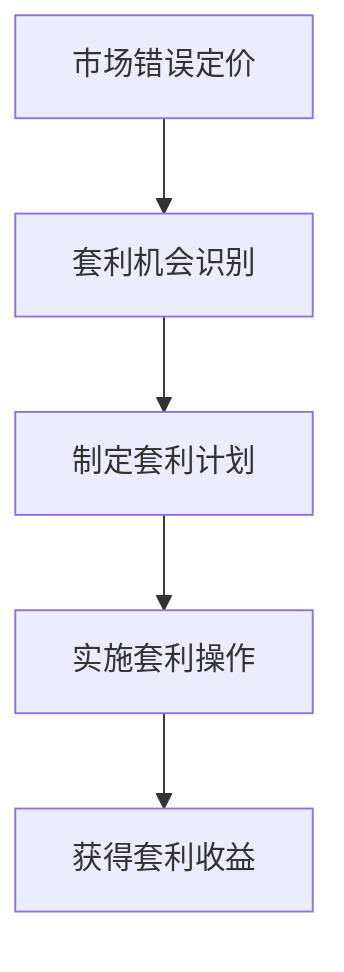
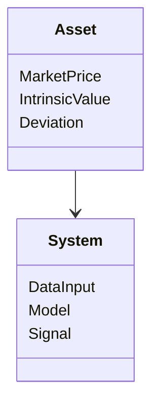
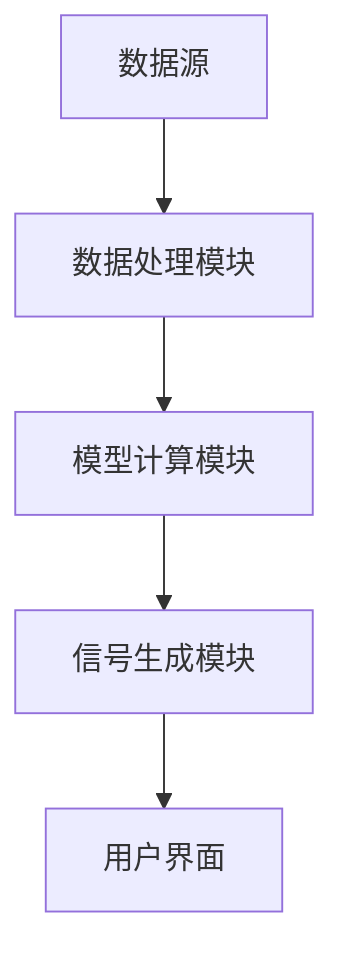

                 


# 大卫·艾因霍恩的短期价值投资：市场错误定价的套利

## 关键词：大卫·艾因霍恩，短期价值投资，市场错误定价，套利，投资策略，价值评估

## 摘要：本文深入探讨大卫·艾因霍恩的短期价值投资策略，分析其如何通过识别市场错误定价来实现套利机会。文章从理论基础、识别方法、算法原理、系统架构到实际案例，详细阐述了套利的实现过程和关键要素，帮助读者理解如何在市场中捕捉短期价值投资机会。

---

# 第一部分: 背景介绍

## 第1章: 价值投资与市场错误定价概述

### 1.1 价值投资的起源与核心理念

#### 1.1.1 价值投资的定义与历史发展
价值投资是一种投资策略，强调以低于内在价值的价格购买优质资产。起源于20世纪，由本杰明·格雷厄姆和戴维·多德提出，核心在于寻找市场低估的股票。

#### 1.1.2 大卫·艾因霍恩的投资理念
大卫·艾因霍恩专注于短期价值投资，寻找市场错误定价的机会。他认为，市场并非总是有效，短期错误定价为投资者提供了套利机会。

#### 1.1.3 市场错误定价的定义与分类
市场错误定价指资产市场价格与其内在价值的偏离。常见类型包括估值错误、情绪驱动错误和信息不对称错误。

### 1.2 短期价值投资的策略与目标

#### 1.2.1 短期价值投资的定义
短期价值投资关注短期内市场定价错误，通过套利实现收益。

#### 1.2.2 投资目标与风险控制
目标是以合理风险控制为基础，捕捉短期套利机会，实现超额收益。

#### 1.2.3 市场套利机会的来源
套利机会源于市场定价错误，常见于市场参与者认知偏差和信息不对称。

### 1.3 套利与价值投资的关系

#### 1.3.1 套利的基本原理
套利是利用资产价格差异获利，需满足无风险或低风险条件。

#### 1.3.2 套利与价值投资的结合
价值投资提供基本面分析，套利提供价格波动机会，两者结合能更精准捕捉市场错误定价。

#### 1.3.3 市场效率与套利机会的消逝
市场效率提高使套利机会减少，但短期定价错误仍存在。

---

## 第2章: 市场错误定价的识别与分析

### 2.1 市场错误定价的识别方法

#### 2.1.1 市场价格与内在价值的差异
计算内在价值，比较与市场价格的差异，判断是否低估或高估。

#### 2.1.2 市场情绪与价格波动的关系
市场情绪波动影响定价，可通过分析情绪指标识别错误定价。

#### 2.1.3 市场参与者的认知偏差
认知偏差导致定价错误，投资者需识别这些偏差带来的机会。

### 2.2 错误定价的分类与特征

#### 2.2.1 估值错误的类型
包括基本面分析错误、市场情绪影响和信息不对称导致的错误。

#### 2.2.2 市场错误定价的常见特征
低流动性资产、市场关注度低、分析师预期偏离等。

#### 2.2.3 市场错误定价的案例分析
通过具体案例展示如何识别错误定价，分析其原因。

### 2.3 错误定价的持续性与周期性

#### 2.3.1 错误定价的短期持续性
错误定价在短期内可能持续，但长期会被市场纠正。

#### 2.3.2 市场周期对错误定价的影响
市场周期波动影响错误定价的出现频率和持续时间。

#### 2.3.3 错误定价的自我修复机制
市场参与者纠正错误定价，需时间和信息传播。

---

## 第3章: 套利机会的识别与评估

### 3.1 套利机会的识别标准

#### 3.1.1 市场价格与内在价值的偏离度
计算偏离度，判断是否为套利机会。

#### 3.1.2 套利空间的可操作性
评估套利空间是否足够大且可操作。

#### 3.1.3 市场流动性的评估
高流动性资产易于交易，降低套利风险。

### 3.2 套利机会的评估模型

#### 3.2.1 套利收益的计算公式
套利收益=市场价格与内在价值差价×数量。

#### 3.2.2 套利风险的评估指标
包括市场流动性风险、价格波动风险和操作风险。

#### 3.2.3 套利机会的排序与优先级
根据收益、风险和流动性排序，优先选择高收益低风险机会。

### 3.3 套利机会的案例分析

#### 3.3.1 典型套利案例介绍
以某公司为例，分析其错误定价原因和套利操作。

#### 3.3.2 套利机会的识别过程
从识别错误到评估可行性的详细步骤。

#### 3.3.3 套利收益与风险的平衡
如何在收益和风险之间找到平衡点。

---

## 第4章: 套利策略的实施与优化

### 4.1 套利策略的实施步骤

#### 4.1.1 确定套利目标
识别错误定价资产，评估其套利潜力。

#### 4.1.2 制定套利计划
包括交易策略、资金分配和时间规划。

#### 4.1.3 实施套利操作
执行交易，监控市场变化，及时调整策略。

### 4.2 套利策略的优化

#### 4.2.1 动态调整策略
根据市场变化及时调整套利目标和策略。

#### 4.2.2 风险管理优化
优化头寸规模，分散投资风险。

#### 4.2.3 模型优化
更新模型参数，提高识别错误定价的能力。

### 4.3 本章小结

套利策略的实施需要系统规划和动态调整，优化模型和风险管理是关键。

---

# 第二部分: 核心概念与联系

## 第5章: 套利的核心概念与联系

### 5.1 套利的原理与机制

#### 5.1.1 市场效率与套利机会
市场不完全效率下，套利机会存在。

#### 5.1.2 套利与市场均衡
套利活动推动市场向均衡状态靠近。

#### 5.1.3 套利的自我强化效应
套利行为可能加剧错误定价的纠正。

### 5.2 套利与价值投资的结合

#### 5.2.1 价值投资的套利机会
通过价值评估识别套利目标。

#### 5.2.2 套利策略的价值投资属性
套利策略依赖于对内在价值的准确评估。

### 5.3 市场错误定价的图示分析

#### 5.3.1 使用Mermaid图展示套利流程


---

## 第三部分: 算法原理讲解

## 第6章: 套利算法的数学模型与实现

### 6.1 错误定价识别的数学模型

#### 6.1.1 内在价值计算公式
$$内在价值 = \sum \frac{CF_t}{(1 + r)^t}$$

#### 6.1.2 偏离度计算公式
$$偏离度 = \frac{市场价格}{内在价值} - 1$$

#### 6.1.3 套利收益计算公式
$$套利收益 = (市场价格 - 内在价值) \times 数量$$

### 6.2 套利算法的实现步骤

#### 6.2.1 数据输入与处理
获取资产的市场数据和基本面数据，清洗和预处理。

#### 6.2.2 内在价值计算
使用现金流贴现模型等方法计算资产的内在价值。

#### 6.2.3 偏离度计算
计算市场价格与内在价值的偏离度，判断是否为套利机会。

#### 6.2.4 信号生成
设定偏离度阈值，生成套利信号。

### 6.3 代码实现

#### 6.3.1 Python代码实现
```python
def calculate_intrinsic_value(cash_flows, discount_rate):
    intrinsic_value = sum(cash_flow / (1 + discount_rate)**t for t, cash_flow in enumerate(cash_flows))
    return intrinsic_value

market_price = 100
discount_rate = 0.1
cash_flows = [50, 60, 70]
intrinsic_value = calculate_intrinsic_value(cash_flows, discount_rate)
deviation = (market_price / intrinsic_value) - 1
print(f"内在价值: {intrinsic_value}, 偏离度: {deviation}")
```

---

## 第四部分: 系统分析与架构设计方案

## 第7章: 套利机会识别系统的架构设计

### 7.1 问题场景介绍

#### 7.1.1 项目背景
开发一个套利机会识别系统，帮助投资者识别市场错误定价。

#### 7.1.2 项目目标
构建一个高效、准确的套利机会识别系统。

### 7.2 系统功能设计

#### 7.2.1 领域模型设计


#### 7.2.2 系统架构设计


### 7.3 系统接口设计

#### 7.3.1 输入接口
数据输入接口，接收市场数据和基本面数据。

#### 7.3.2 输出接口
信号输出接口，输出套利机会信号。

### 7.4 系统交互设计

#### 7.4.1 交互流程
用户输入数据，系统处理后生成信号，用户接收信号并采取行动。

---

## 第五部分: 项目实战

## 第8章: 套利机会识别的项目实战

### 8.1 环境安装

#### 8.1.1 安装Python和必要的库
安装Python和Pandas、NumPy等库。

#### 8.1.2 数据源获取
从可靠数据源获取市场数据和基本面数据。

### 8.2 系统核心实现源代码

#### 8.2.1 数据处理代码
```python
import pandas as pd

def load_data(file_path):
    data = pd.read_csv(file_path)
    return data

def preprocess_data(data):
    # 数据清洗和预处理
    return data
```

#### 8.2.2 套利信号生成代码
```python
def generate_signal(data, threshold):
    data['Deviation'] = data['MarketPrice'] / data['IntrinsicValue'] - 1
    data['Signal'] = data['Deviation'].apply(lambda x: 1 if x > threshold else 0)
    return data

threshold = 0.1
signal_data = generate_signal(processed_data, threshold)
```

### 8.3 代码应用解读与分析

#### 8.3.1 代码功能解读
解释每部分代码的功能，展示如何生成套利信号。

#### 8.3.2 结果分析
分析套利信号的有效性，评估系统的准确性。

### 8.4 实际案例分析

#### 8.4.1 案例背景
选择一个具体资产，分析其错误定价情况。

#### 8.4.2 数据分析
使用系统分析数据，识别套利机会。

#### 8.4.3 结果解读
解释分析结果，展示如何利用系统识别套利机会。

### 8.5 项目小结

总结项目成果，评估系统性能，提出改进建议。

---

## 第六部分: 最佳实践

## 第9章: 套利策略的最佳实践

### 9.1 大卫·艾因霍恩的投资策略

#### 9.1.1 短期价值投资的核心要素
包括市场错误定价识别、套利机会评估和风险控制。

#### 9.1.2 投资组合管理
分散投资、风险控制和动态调整。

### 9.2 投资者注意事项

#### 9.2.1 风险控制的重要性
强调风险控制在套利中的关键作用。

#### 9.2.2 市场监控与信息获取
及时获取市场信息，监控市场变化。

#### 9.2.3 情绪管理
保持冷静，避免情绪化决策。

### 9.3 拓展阅读与学习资源

#### 9.3.1 推荐书籍
《价值》、《投资的艺术》等。

#### 9.3.2 在线资源
推荐网站和论坛，获取更多信息和交流经验。

### 9.4 本章小结

总结最佳实践，帮助投资者更有效地实施套利策略。

---

## 作者：AI天才研究院 & 禅与计算机程序设计艺术

---

# 结语

通过本文的详细分析，读者可以系统地了解大卫·艾因霍恩的短期价值投资策略，掌握如何识别市场错误定价并利用套利机会。希望本文能为投资者提供有价值的见解和方法，帮助他们在复杂的市场中捕捉短期价值投资机会。

