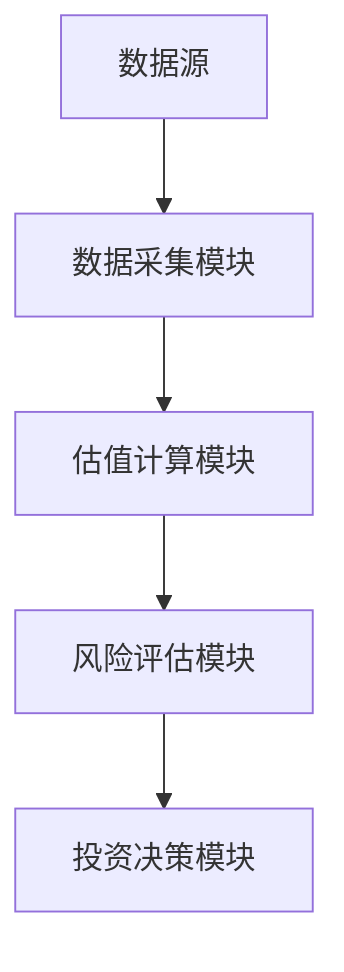

                 


# 大卫德雷曼的价值投资案例分析

> 关键词：价值投资，大卫·德雷曼，基本面分析，安全边际，投资策略，逆向思维

> 摘要：本文通过分析大卫·德雷曼的价值投资策略，结合技术化的分析方法，探讨如何将价值投资的哲学理念转化为可操作的投资策略。文章从价值投资的背景与基础、德雷曼的价值投资体系、投资系统的分析与设计、投资实战案例等方面展开，深入剖析价值投资的核心概念、算法原理、系统架构和实际应用。

---

## 第一部分: 价值投资的背景与基础

### 第1章: 价值投资概述

#### 1.1 价值投资的核心概念

##### 1.1.1 价值投资的定义与起源
价值投资是一种以公司基本面分析为基础，通过寻找市场价格低于其内在价值的证券进行投资的策略。其核心理念是“买入便宜的东西”，而非关注市场的短期波动。大卫·德雷曼（David Dreman）是价值投资领域的重要代表人物，他的研究和实践为价值投资提供了丰富的理论和实证支持。

##### 1.1.2 大卫·德雷曼的价值投资方法论
德雷曼的价值投资方法论强调以下几点：
1. **逆向思维**：在市场恐慌时寻找被低估的机会。
2. **安全边际**：买入价格远低于内在价值的证券。
3. **基本面分析**：通过财务报表和行业分析寻找具有竞争优势的企业。

##### 1.1.3 价值投资的核心要素与边界
价值投资的核心要素包括：
- **内在价值**：公司未来现金流的现值。
- **市场价格**：证券在市场上的交易价格。
- **安全边际**：内在价值与市场价格之间的差距。

价值投资的边界在于：
- 避免过度关注短期市场波动。
- 避免投资于缺乏竞争优势的企业。

#### 1.2 价值投资的哲学与原则

##### 1.2.1 价值投资的哲学基础
价值投资的哲学基础可以概括为：
1. 市场通常是非理性的，价格与价值的偏离是投资机会的来源。
2. 投资者应以长期视角看待投资，而非短期交易。

##### 1.2.2 德雷曼投资的三大原则
1. **安全边际**：买入价格低于内在价值。
2. **逆向思维**：在市场悲观时寻找机会。
3. **长期持有**：耐心等待价值实现。

##### 1.2.3 价值投资与市场周期的关系
价值投资与市场周期密切相关：
- 在市场高点时，价值投资者可能选择观望或卖出。
- 在市场低点时，价值投资者积极寻找被低估的机会。

### 第2章: 基本面分析的基础

#### 2.1 基本面分析的核心要素

##### 2.1.1 财务报表分析
财务报表是基本面分析的核心工具。主要包括：
1. **利润表**：评估企业的盈利能力和效率。
2. **资产负债表**：评估企业的资产结构和财务健康状况。
3. **现金流量表**：评估企业的现金流状况。

##### 2.1.2 行业分析与竞争优势
行业分析包括：
1. 行业生命周期分析。
2. 行业竞争结构分析。
3. 行业政策环境分析。

竞争优势包括：
1. 成本优势。
2. 品牌优势。
3. 技术优势。

##### 2.1.3 股价与内在价值的计算
内在价值的计算公式：
$$ V = \frac{CF}{r - g} $$
其中，\( CF \) 是未来现金流，\( r \) 是折现率，\( g \) 是增长率。

#### 2.2 价值评估的数学模型

##### 2.2.1 股票内在价值的公式
$$ V = \frac{CF}{r - g} $$

##### 2.2.2 市盈率与市净率的计算
- 市盈率（P/E）= 股价 / 每股收益。
- 市净率（P/B）= 股价 / 每股净资产。

##### 2.2.3 股息率与投资回报的评估
股息率 = 每股股息 / 股价。

### 第3章: 安全边际与风险控制

#### 3.1 安全边际的概念与应用

##### 3.1.1 安全边际的定义
安全边际 = 内在价值 - 市场价格。

##### 3.1.2 安全边际的计算方法
通过比较市场价格与内在价值的差距来确定安全边际的大小。

##### 3.1.3 安全边际在投资决策中的作用
安全边际越大，投资风险越小。

#### 3.2 风险控制的策略

##### 3.2.1 风险分散与资产配置
通过分散投资降低非系统性风险。

##### 3.2.2 估值风险的识别与管理
定期重新评估投资标的的内在价值。

##### 3.2.3 心理风险的控制
避免情绪化决策，坚持长期投资。

---

## 第二部分: 大卫·德雷曼价值投资策略

### 第4章: 德雷曼的逆向思维投资

#### 4.1 逆向思维的核心理念

##### 4.1.1 逆向思维的定义
逆向思维是指在市场普遍悲观时寻找机会，而非在市场乐观时盲目跟风。

##### 4.1.2 逆向思维在投资中的应用
案例：某行业困境反转的投资机会。

##### 4.1.3 逆向思维与市场周期的关系
逆向思维的核心是利用市场非理性波动带来的投资机会。

#### 4.2 逆向思维的实战案例

##### 4.2.1 案例一: 某行业困境反转的投资机会
通过基本面分析发现某行业因市场恐慌被低估，随后反转。

##### 4.2.2 案例二: 某公司重大利空事件的应对策略
在公司利空事件后，通过分析发现其内在价值未受影响，选择买入。

##### 4.2.3 案例三: 逆向思维在市场恐慌中的应用
在市场恐慌时，选择性地买入被市场错杀的优质股票。

### 第5章: 德雷曼的价值投资体系

#### 5.1 投资体系的构建

##### 5.1.1 投资目标的设定
明确投资目标，如追求长期稳定的收益。

##### 5.1.2 投资策略的制定
制定基于基本面分析和安全边际的投资策略。

##### 5.1.3 投资流程的优化
优化投资流程，包括数据采集、估值计算、风险评估等步骤。

#### 5.2 投资组合的管理

##### 5.2.1 投资组合的构建与调整
根据市场变化和企业基本面调整投资组合。

##### 5.2.2 绩效评估与优化
定期评估投资组合的绩效，进行优化调整。

##### 5.2.3 风险管理与再平衡
通过风险管理工具和再平衡策略控制投资组合的整体风险。

---

## 第三部分: 价值投资的系统分析与架构

### 第6章: 投资系统的分析与设计

#### 6.1 投资系统的功能设计

##### 6.1.1 数据采集模块
功能：从数据库中采集实时的股票数据。
输入：股票代码、时间范围。
输出：包含股价、财务数据等的历史数据。

##### 6.1.2 估值计算模块
功能：基于财务数据计算股票的内在价值。
输入：财务报表数据。
输出：股票的内在价值和安全边际。

##### 6.1.3 风险评估模块
功能：评估投资组合的整体风险。
输入：投资组合的构成。
输出：风险评估结果和优化建议。

#### 6.2 系统架构设计

##### 6.2.1 系统架构图（Mermaid）


#### 6.3 系统功能设计

##### 6.3.1 数据采集模块
- 数据源包括股票市场数据、财务报表数据等。
- 数据采集模块负责从多个数据源获取数据，并进行清洗和预处理。

##### 6.3.2 估值计算模块
- 使用基本面分析的方法计算股票的内在价值。
- 计算安全边际，确定投资机会。

##### 6.3.3 风险评估模块
- 评估投资组合的整体风险。
- 提供风险控制建议。

---

## 第四部分: 投资实战与案例分析

### 第7章: 投资实战与案例分析

#### 7.1 投资环境的配置

##### 7.1.1 投资工具的选择
- 数据获取工具：使用Python的pandas库和Yahoo Finance API。
- 数据分析工具：使用Jupyter Notebook进行分析。

#### 7.2 投资策略的实现

##### 7.2.1 Python代码实现
```python
import pandas as pd
import yfinance as yf

# 下载数据
msft = yf.download('MSFT', start='2020-01-01', end='2023-12-31')

# 计算简单平均市盈率
def calculate_pe(ticker):
    df = yf.download(ticker, start='2020-01-01', end='2023-12-31')
    pe = df['Close'] / df[' earnings'].mean()
    return pe

pe_msft = calculate_pe('MSFT')
print(f"MSFT的平均市盈率为: {pe_msft}")
```

##### 7.2.2 案例分析与解读
案例：某公司的基本面分析与投资决策。

#### 7.3 投资策略的优化

##### 7.3.1 优化策略的制定
根据历史数据分析优化投资策略。

##### 7.3.2 优化策略的实现
在代码中加入优化逻辑，如动态调整安全边际。

---

## 结论

大卫·德雷曼的价值投资策略为我们提供了一种基于基本面分析的长期投资方法。通过结合技术化的分析方法，我们可以更科学地评估股票的内在价值，制定更有效的投资策略。投资不仅是对市场的理解，更是对自身心理和决策能力的深刻认识。希望本文能够为投资者提供有价值的参考和启示。

---

**作者：AI天才研究院/AI Genius Institute & 禅与计算机程序设计艺术 /Zen And The Art of Computer Programming**

