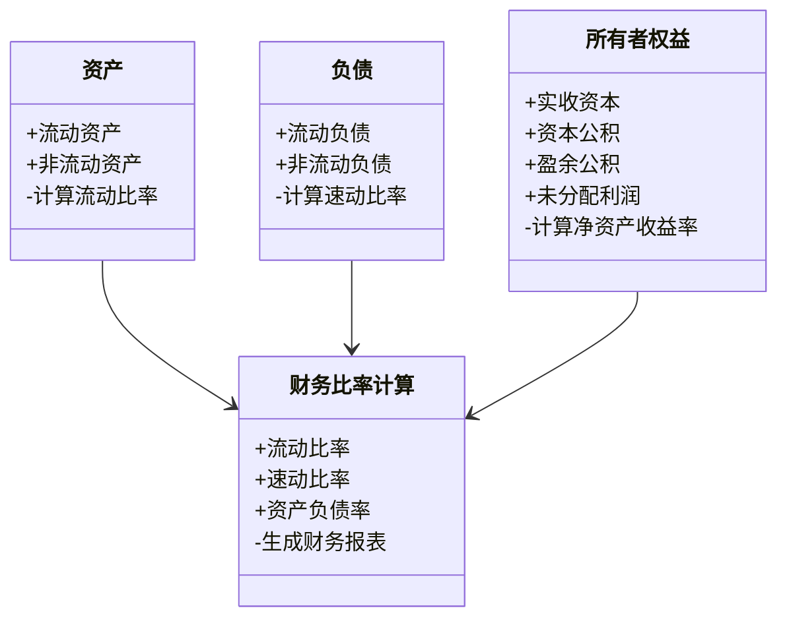
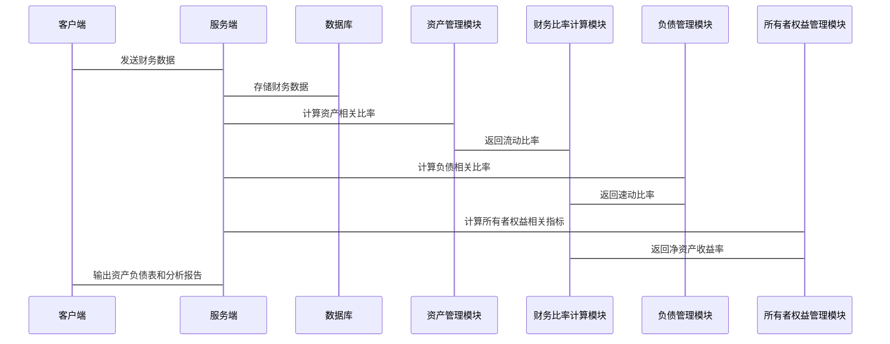

                 


# 《大卫德雷曼的资产负债表分析》

> 关键词：资产负债表分析、财务比率、资产分析、负债分析、所有者权益、财务健康状况

> 摘要：本文系统地分析了大卫德雷曼的资产负债表分析方法，从基本概念、核心要素到具体的分析方法和技巧，结合实际案例，详细阐述了如何通过资产负债表来评估企业的财务健康状况。文章还通过数学公式和Python代码，深入解析了财务比率的计算与应用，并结合系统架构设计，展示了如何将资产负债表分析应用于实际的企业管理中。

---

# 第一部分: 资产负债表分析基础

## 第1章: 资产负债表的基本概念与结构

### 1.1 资产负债表的定义与作用

#### 1.1.1 什么是资产负债表
资产负债表是企业财务报表的重要组成部分，反映了企业在某一特定日期的资产、负债和所有者权益的状况。它是企业财务健康状况的“晴雨表”，能够帮助投资者、债权人和企业管理者了解企业的财务状况。

#### 1.1.2 资产负债表的作用与意义
资产负债表的主要作用包括：
- 评估企业的偿债能力。
- 了解企业的资产构成和负债情况。
- 分析企业的财务杠杆和资本结构。
- 为投资决策提供参考依据。

#### 1.1.3 资产负债表的编制方法
资产负债表的编制需要遵循会计准则，主要包括以下几个步骤：
1. 收集和整理企业的财务数据。
2. 确保数据的准确性和完整性。
3. 根据会计恒等式“资产 = 负债 + 所有者权益”进行核对和调整。
4. 编制资产负债表并进行复核。

### 1.2 资产负债表的结构与内容

#### 1.2.1 资产、负债、所有者权益的定义
- **资产**：企业过去的交易或事项形成的，由企业拥有或控制的资源，预期会给企业带来经济利益。
- **负债**：企业过去的交易或事项形成的，预期会导致经济利益流出企业的现时义务。
- **所有者权益**：企业的资产减去负债后的剩余部分，代表所有者对企业净资产的要求权。

#### 1.2.2 资产负债表的平衡关系：资产 = 负债 + 所有者权益
资产负债表的核心是会计恒等式：
$$ 资产 = 负债 + 所有者权益 $$
这一等式反映了企业财务状况的基本平衡关系。

#### 1.2.3 资产负债表的列报要求
资产负债表的列报需要遵循会计准则，包括：
- 资产和负债按流动性分类列报。
- 所有者权益按组成部分分别列报。
- 数据的准确性和一致性。

### 1.3 资产负债表分析的意义

#### 1.3.1 企业财务健康状况的晴雨表
资产负债表分析可以帮助企业管理者了解企业的资产构成、负债情况和所有者权益的变动，从而评估企业的财务健康状况。

#### 1.3.2 投资者与债权人的决策工具
投资者和债权人可以通过分析资产负债表，评估企业的偿债能力和财务风险，从而做出投资和贷款决策。

#### 1.3.3 企业内部管理的参考依据
企业内部管理者可以利用资产负债表分析企业的资产使用效率、负债结构和资本结构，从而优化企业的财务管理和经营策略。

### 1.4 本章小结
本章从基本概念、结构和作用三个方面，详细介绍了资产负债表的基本知识，为后续的分析奠定了基础。

---

## 第2章: 资产负债表的核心要素分析

### 2.1 资产分析

#### 2.1.1 流动资产与非流动资产的分类
- **流动资产**：可以在一年内或一个正常营业周期内变现或耗用的资产，包括现金、应收账款、存货等。
- **非流动资产**：无法在一年内或一个正常营业周期内变现或耗用的资产，包括固定资产、无形资产、长期股权投资等。

#### 2.1.2 流动资产的构成与特征
流动资产的构成包括：
1. 现金及现金等价物。
2. 应收账款。
3. 存货。
4. 其他流动资产。

流动资产的特征是流动性高，能够快速变现，但风险也较大。

#### 2.1.3 非流动资产的构成与特征
非流动资产的构成包括：
1. 固定资产。
2. 无形资产。
3. 长期股权投资。
4. 其他非流动资产。

非流动资产的特征是流动性低，变现能力差，但稳定性高。

### 2.2 负债分析

#### 2.2.1 流动负债与非流动负债的分类
- **流动负债**：将在一年内或一个正常营业周期内偿还的债务，包括应付账款、短期借款、应交税费等。
- **非流动负债**：将在一年以上偿还的债务，包括长期借款、应付债券等。

#### 2.2.2 流动负债的构成与特征
流动负债的构成包括：
1. 应付账款。
2. 短期借款。
3. 应交税费。
4. 其他流动负债。

流动负债的特征是偿还期限短，风险相对较低。

#### 2.2.3 非流动负债的构成与特征
非流动负债的构成包括：
1. 长期借款。
2. 应付债券。
3. 其他非流动负债。

非流动负债的特征是偿还期限长，风险较高。

### 2.3 所有者权益分析

#### 2.3.1 所有者权益的构成
所有者权益包括：
1. 实收资本。
2. 资本公积。
3. 盈余公积。
4. 未分配利润。

#### 2.3.2 净资产收益率的计算与意义
净资产收益率（ROE）是衡量企业盈利能力的重要指标，计算公式为：
$$ ROE = \frac{净利润}{所有者权益} $$

#### 2.3.3 所有者权益变动表的分析
所有者权益变动表反映了所有者权益在一定会计期间内的增减变动情况，主要包括：
1. 实收资本的增减。
2. 资本公积的增减。
3. 盈余公积的增减。
4. 未分配利润的增减。

### 2.4 核心概念对比分析

#### 2.4.1 资产与负债的属性特征对比
| 属性 | 资产 | 负债 |
|------|------|------|
| 所有权 | 属于企业 | 属于债权人 |
| 流动性 | 可能高或低 | 一般高 |
| 风险 | 较高 | 较低 |

#### 2.4.2 流动资产与非流动资产的对比
| 属性 | 流动资产 | 非流动资产 |
|------|----------|------------|
| 流动性 | 高 | 低 |
| 变现能力 | 强 | 弱 |
| 风险 | 高 | 低 |

#### 2.4.3 流动负债与非流动负债的对比
| 属性 | 流动负债 | 非流动负债 |
|------|----------|------------|
| 偿还期限 | 短 | 长 |
| 风险 | 低 | 高 |

### 2.5 本章小结
本章详细分析了资产负债表的核心要素，包括资产、负债和所有者权益的分类、构成和特征，并通过对比分析，帮助读者更好地理解这些概念。

---

## 第3章: 资产负债表的分析方法与技巧

### 3.1 财务比率分析

#### 3.1.1 流动比率的计算与意义
流动比率是衡量企业短期偿债能力的重要指标，计算公式为：
$$ 流动比率 = \frac{流动资产}{流动负债} $$
流动比率越高，说明企业的短期偿债能力越强。

#### 3.1.2 速动比率的计算与意义
速动比率是流动比率的进一步细化，计算公式为：
$$ 速动比率 = \frac{速动资产}{流动负债} $$
速动资产包括现金、应收账款和存货。

#### 3.1.3 资产负债率的计算与意义
资产负债率是衡量企业财务杠杆的重要指标，计算公式为：
$$ 资产负债率 = \frac{总负债}{总资产} $$
资产负债率越高，说明企业的财务杠杆越高，风险也越大。

### 3.2 资产负债表的综合分析

#### 3.2.1 资产结构分析
资产结构分析主要是通过分析流动资产和非流动资产的比例，评估企业的资产构成和流动性风险。

#### 3.2.2 负债结构分析
负债结构分析主要是通过分析流动负债和非流动负债的比例，评估企业的负债构成和偿债压力。

#### 3.2.3 资本结构分析
资本结构分析主要是通过分析所有者权益和负债的比例，评估企业的资本结构和财务风险。

### 3.3 本章小结
本章通过财务比率分析和综合分析，详细介绍了如何利用资产负债表进行企业财务状况的全面评估。

---

## 第4章: 资产负债表分析的系统架构与实现

### 4.1 系统功能设计

#### 4.1.1 领域模型设计
领域模型设计包括以下几个方面：
1. 资产管理模块。
2. 负债管理模块。
3. 所有者权益管理模块。
4. 财务比率计算模块。

（Mermaid 类图）


### 4.2 系统架构设计

#### 4.2.1 系统架构图


### 4.3 系统接口设计

#### 4.3.1 数据输入接口
数据输入接口主要用于接收企业的财务数据，包括资产、负债和所有者权益的详细信息。

#### 4.3.2 数据处理接口
数据处理接口负责对输入的财务数据进行清洗、转换和存储。

#### 4.3.3 数据输出接口
数据输出接口负责将处理后的财务数据输出为资产负债表和财务比率分析报告。

### 4.4 系统交互流程

#### 4.4.1 系统交互序列图


### 4.5 本章小结
本章通过系统架构设计，详细介绍了如何将资产负债表分析应用于实际的企业管理中，并通过系统交互图展示了分析流程。

---

## 第5章: 项目实战——大卫德雷曼的资产负债表分析

### 5.1 环境安装与配置

#### 5.1.1 安装Python与Pandas库
需要安装Python 3.8及以上版本，并安装Pandas库：
```bash
pip install pandas
```

### 5.2 核心实现代码

#### 5.2.1 资产负债表数据的读取与处理
```python
import pandas as pd

# 读取资产负债表数据
df = pd.read_csv('balance_sheet.csv')

# 数据清洗与处理
df = df.dropna()
df = df.astype(float)
```

#### 5.2.2 财务比率的计算与输出
```python
# 计算流动比率
current_assets = df['流动资产'].sum()
current_liabilities = df['流动负债'].sum()
current_ratio = current_assets / current_liabilities

# 计算速动比率
quick_assets = current_assets - df['存货'].sum()
quick_ratio = quick_assets / current_liabilities

# 计算资产负债率
total_assets = df['总资产'].sum()
total_liabilities = df['总负债'].sum()
debt_ratio = total_liabilities / total_assets

print(f"流动比率: {current_ratio}")
print(f"速动比率: {quick_ratio}")
print(f"资产负债率: {debt_ratio}")
```

#### 5.2.3 财务分析报告的生成
```python
# 生成财务分析报告
report = f"""
财务分析报告
流动比率: {current_ratio}
速动比率: {quick_ratio}
资产负债率: {debt_ratio}
"""
print(report)
```

### 5.3 实际案例分析

#### 5.3.1 数据来源与处理
以某企业2022年的资产负债表为例，数据如下：
| 资产类别 | 金额（万元） |
|----------|-------------|
| 流动资产  | 500         |
| 非流动资产 | 300         |
| 总资产   | 800         |
| 流动负债  | 300         |
| 非流动负债 | 200         |
| 总负债   | 500         |
| 所有者权益 | 300         |

#### 5.3.2 财务比率计算
```python
current_assets = 500
current_liabilities = 300
quick_assets = current_assets - 150  # 假设存货为150万元
total_liabilities = 500
total_assets = 800

current_ratio = current_assets / current_liabilities  # 1.67
quick_ratio = quick_assets / current_liabilities      # 1.17
debt_ratio = total_liabilities / total_assets         # 0.625
```

#### 5.3.3 分析结果解读
- **流动比率**：1.67，说明企业的短期偿债能力较强。
- **速动比率**：1.17，说明企业的速动资产足以覆盖流动负债。
- **资产负债率**：62.5%，说明企业的财务杠杆较高，风险较大。

### 5.4 本章小结
本章通过实际案例，详细展示了如何利用Python代码进行资产负债表分析，并通过财务比率计算和报告生成，帮助读者更好地理解和应用这些知识。

---

## 第6章: 最佳实践与注意事项

### 6.1 最佳实践

#### 6.1.1 数据准确性的重要性
在进行资产负债表分析时，数据的准确性是关键。确保数据来源可靠，避免因数据错误导致分析结果偏差。

#### 6.1.2 分析方法的选择
根据企业的具体情况和分析目的，选择合适的分析方法和财务比率。

#### 6.1.3 结合其他财务报表进行综合分析
资产负债表分析应结合利润表和现金流量表，进行综合分析，以全面评估企业的财务状况。

### 6.2 小结

### 6.3 注意事项

#### 6.3.1 数据的时点性
资产负债表反映的是企业在某一特定日期的财务状况，因此需要关注数据的时点性。

#### 6.3.2 数据的可比性
在进行跨期比较时，需要确保数据的可比性，避免因会计政策变化导致的偏差。

#### 6.3.3 数据的合规性
在进行分析时，需确保数据的合规性，遵守相关会计准则和法律法规。

### 6.4 拓展阅读

#### 6.4.1 推荐书籍
- 《财务报表分析》
- 《企业财务分析实务》

#### 6.4.2 推荐在线资源
- 财务报表分析在线课程
- 专业财务分析论坛

---

# 作者：AI天才研究院/AI Genius Institute & 禅与计算机程序设计艺术/Zen And The Art of Computer Programming

