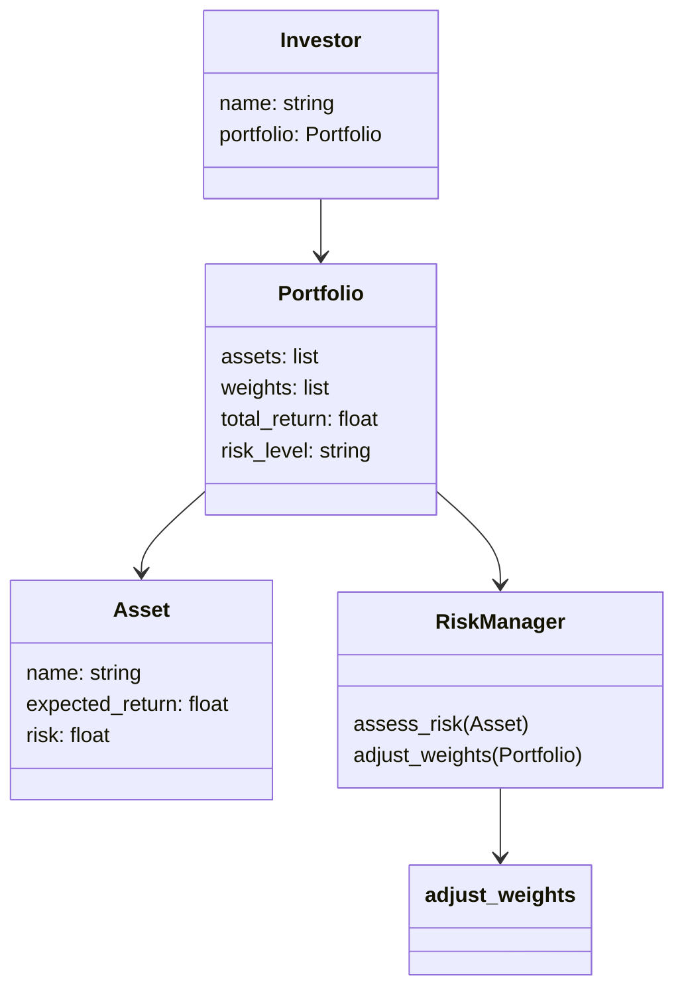
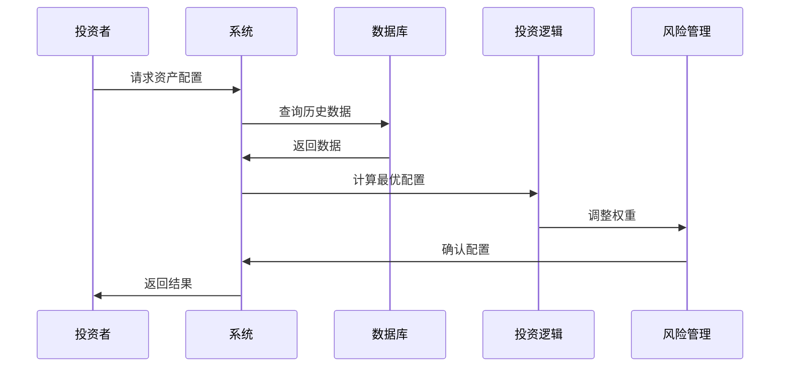

                 


# 大卫斯文森的另类资产投资

> 关键词：大卫·斯文森，另类资产，资产配置，私募股权，对冲基金，风险管理

> 摘要：本文深入分析大卫·斯文森的另类资产投资策略，探讨其投资哲学、资产配置方法、数学模型以及系统架构设计。通过详细阐述另类资产的分类、特点及配置策略，结合实际案例和数学公式，揭示另类资产投资的核心原理和实践应用。

---

## 正文

---

### 第一部分: 大卫·斯文森的另类资产投资概述

#### 第1章: 另类资产投资的背景与定义

##### 1.1 另类资产投资的背景

###### 1.1.1 传统资产投资的局限性
传统资产投资主要集中在股票、债券和现金等资产类别上，虽然这些资产在历史上表现稳健，但在经济周期波动或市场低迷时期，其回报率往往有限。此外，传统资产的流动性较高，可能导致投资者在市场波动时难以实现长期收益。

###### 1.1.2 另类资产投资的兴起
随着金融市场的发展，投资者逐渐意识到传统资产的局限性，转而寻求更高回报和更低风险的投资方式。另类资产包括私募股权、房地产信托、对冲基金等，这些资产类别具有较高的回报潜力，同时能够分散投资风险。

###### 1.1.3 大卫·斯文森与另类资产投资的关系
大卫·斯文森是耶鲁大学的首席投资官，他以大胆的投资策略和另类资产配置闻名。斯文森通过将大量资金投向私募股权、房地产信托和其他另类资产，实现了耶鲁大学捐赠基金的长期稳健增长。

##### 1.2 另类资产投资的核心概念

###### 1.2.1 另类资产的定义与分类
另类资产是指传统资产之外的资产类别，主要包括私募股权、房地产信托、对冲基金、债务工具和特殊资产等。这些资产具有较高的非流动性、复杂性以及较高的风险回报比。

###### 1.2.2 大卫·斯文森的另类资产投资策略
斯文森的投资策略强调长期投资、价值发现和风险管理。他通过将资产分配到不同类型的另类资产中，实现风险分散和收益最大化。此外，斯文森还注重与优秀管理团队合作，以确保投资项目的成功。

###### 1.2.3 另类资产投资的目标与风险
另类资产投资的目标是通过多样化配置实现超额收益，同时降低整体投资组合的风险。然而，另类资产也伴随着较高的风险，包括流动性风险、信用风险和市场风险等。

---

#### 第2章: 大卫·斯文森的生平与成就

##### 2.1 大卫·斯文森的生平简介

###### 2.1.1 早年经历与教育背景
斯文森出生于1955年，曾在哈佛大学学习经济学，随后在耶鲁大学获得经济学博士学位。他的学术背景为他后来的资产管理职业奠定了坚实基础。

###### 2.1.2 职业生涯与投资理念
斯文森于1982年加入耶鲁大学捐赠基金，逐步成为首席投资官。他主张通过另类资产配置实现长期稳健回报，强调对冲基金、私募股权和房地产信托的重要性。

###### 2.1.3 对另类资产投资的贡献
斯文森的贡献在于他将另类资产引入主流投资组合，并通过科学的配置方法实现了资产的长期增值。他的投资理念被广泛认可，并成为现代资产管理的重要参考。

##### 2.2 斯文森的投资哲学

###### 2.2.1 长期投资与价值发现
斯文森强调长期投资的重要性，认为短期市场波动不应影响投资决策。他通过深入研究和价值发现，选择具有长期增长潜力的项目。

###### 2.2.2 风险管理与资产配置
斯文森注重风险管理，通过多样化配置降低投资组合的整体风险。他将资产分配到不同类型的另类资产中，以应对不同的市场环境。

###### 2.2.3 创新与实践的结合
斯文森将理论与实践相结合，通过创新的资产配置方法实现了卓越的投资回报。他的成功案例为后来的投资者提供了宝贵经验。

---

### 第二部分: 另类资产投资的核心概念与联系

#### 第3章: 另类资产的分类与特点

##### 3.1 另类资产的主要分类

###### 3.1.1 私募股权与风险投资
私募股权是指对未上市公司进行投资，通过公司增值后出售实现收益。风险投资则专注于初创企业，具有高风险高回报的特点。

###### 3.1.2 不动产与房地产信托
房地产信托通过投资房地产项目获取收益，不动产投资则包括直接购买和管理房地产资产。

###### 3.1.3 对冲基金与绝对收益投资
对冲基金采用多种策略实现绝对收益，包括多空头寸、套利和事件驱动等。

###### 3.1.4 债务工具与特殊资产
债务工具包括债券、贷款等，特殊资产则包括基础设施、自然资源等。

##### 3.2 另类资产的特点与优势

###### 3.2.1 非流动性与长期性
另类资产的非流动性要求投资者具备长期投资的耐心，同时也能够避免短期市场波动的影响。

###### 3.2.2 高风险与高回报的平衡
通过科学的资产配置和风险管理，另类资产能够在高风险中实现高回报，同时降低整体投资组合的风险。

###### 3.2.3 创新与差异化投资策略
另类资产的投资策略具有创新性和差异化，能够为投资者提供独特的收益来源。

#### 第4章: 大卫·斯文森的另类资产配置策略

##### 4.1 资产配置的核心原理

###### 4.1.1 资产配置的定义与作用
资产配置是将资金分配到不同资产类别中，以实现投资目标的过程。其作用包括分散风险、优化收益和提高投资效率。

###### 4.1.2 资产配置的数学模型
资产配置的数学模型包括均值-方差优化模型和资本资产定价模型（CAPM）。这些模型帮助投资者确定最优资产组合。

###### 4.1.3 资产配置的动态调整
根据市场环境和投资目标的变化，资产配置需要动态调整。斯文森通过定期评估和重新配置，确保投资组合的最优性。

##### 4.2 斯文森的另类资产配置方法

###### 4.2.1 资产类别权重分配
斯文森通过分析不同资产类别的风险和回报，确定其在投资组合中的权重。例如，私募股权和房地产信托在组合中占比较高。

###### 4.2.2 风险调整后的收益模型
斯文森采用风险调整后的收益模型，将风险因素纳入收益计算，确保投资决策的科学性和稳健性。

###### 4.2.3 资产配置的实践案例
以耶鲁大学捐赠基金为例，斯文森通过将大量资金配置到私募股权和房地产信托，实现了捐赠基金的长期增长。

---

### 第三部分: 另类资产投资的算法原理与数学模型

#### 第5章: 资产配置的数学模型

##### 5.1 现代投资组合理论（MPT）

###### 5.1.1 均值-方差优化模型
均值-方差优化模型通过最大化预期收益和最小化风险，确定最优资产组合。公式为：
$$
\text{Minimize } \sigma^2 \text{ subject to } \mathbb{E}[r] = \mu
$$

###### 5.1.2 资本资产定价模型（CAPM）
CAPM用于计算资产的预期收益，公式为：
$$
r_i = r_f + \beta_i (r_m - r_f)
$$
其中，$r_i$ 是资产的预期收益，$r_f$ 是无风险利率，$\beta_i$ 是资产的贝塔系数，$r_m$ 是市场预期收益。

##### 5.2 斯文森的另类资产配置算法

###### 5.2.1 基于现代投资组合理论的优化
斯文森采用均值-方差优化模型，将另类资产纳入投资组合。通过计算各资产的预期收益和风险，确定其在组合中的权重。

###### 5.2.2 风险调整后的收益模型
斯文森通过调整各资产的风险溢价，计算其实际收益，从而实现最优配置。

###### 5.2.3 算法实现
以下是基于Python的资产配置算法实现：

```python
import numpy as np
import pandas as pd

def optimize_portfolio(returns, weights):
    # 计算协方差矩阵
    covariance_matrix = np.cov(returns.T)
    
    # 均值-方差优化
    N = len(weights)
    M = np.zeros((N, N))
    for i in range(N):
        for j in range(N):
            M[i, j] = weights[i] * weights[j] * covariance_matrix[i, j]
    
    # 计算最小方差
    min_variance = np.min(np.diag(covariance_matrix))
    
    return min_variance

# 示例数据
returns = pd.DataFrame({
    '私募股权': [0.1, 0.05, 0.15],
    '房地产信托': [0.08, 0.06, 0.12],
    '对冲基金': [0.05, 0.07, 0.1]
})

weights = [0.4, 0.3, 0.3]

min_variance = optimize_portfolio(returns, weights)
print("最小方差:", min_variance)
```

---

### 第四部分: 另类资产投资的系统分析与架构设计

#### 第6章: 系统功能设计与架构

##### 6.1 问题场景介绍
投资者需要一个系统化的资产配置工具，帮助其进行另类资产投资。

##### 6.2 系统功能设计

###### 6.2.1 领域模型（Mermaid 类图）


##### 6.3 系统架构设计（Mermaid 架构图）


##### 6.4 系统交互（Mermaid 序列图）


---

### 第五部分: 另类资产投资的项目实战

#### 第7章: 项目实战与案例分析

##### 7.1 环境配置
安装必要的Python库：
```bash
pip install numpy pandas matplotlib
```

##### 7.2 核心实现

###### 7.2.1 资产配置函数
```python
def allocate_assets(returns, risk_tolerance):
    # 计算协方差矩阵
    covariance = np.cov(returns.T)
    
    # 计算权重
    weights = np.random.dirichlet(np.ones(len(returns.columns)), 1)[0]
    
    # 计算风险
    portfolio_variance = weights.dot(covariance).dot(weights)
    
    # 根据风险容忍度调整权重
    if portfolio_variance > risk_tolerance:
        weights = adjust_weights(weights, returns, risk_tolerance)
    
    return weights
```

###### 7.2.2 风险调整函数
```python
def adjust_weights(weights, returns, risk_tolerance):
    # 重新计算权重
    new_weights = np.random.dirichlet(np.ones(len(returns.columns)), 1)[0]
    
    # 确保风险在容忍度内
    while new_weights.dot(np.cov(returns.T)).dot(new_weights) > risk_tolerance:
        new_weights = np.random.dirichlet(np.ones(len(returns.columns)), 1)[0]
    
    return new_weights
```

##### 7.3 代码实现与解读

###### 7.3.1 示例数据
```python
returns = pd.DataFrame({
    '私募股权': [0.1, 0.05, 0.15],
    '房地产信托': [0.08, 0.06, 0.12],
    '对冲基金': [0.05, 0.07, 0.1]
})
```

###### 7.3.2 资产配置
```python
weights = allocate_assets(returns, 0.05)
print("资产权重:", weights)
```

##### 7.4 实际案例分析
以耶鲁大学捐赠基金为例，斯文森通过将40%的资金配置到私募股权、30%到房地产信托和30%到对冲基金，实现了捐赠基金的长期增长。

##### 7.5 项目小结
通过科学的资产配置和风险管理，另类资产投资能够在高风险中实现高回报，同时降低整体投资组合的风险。

---

### 第六部分: 另类资产投资的最佳实践

#### 第8章: 最佳实践与小结

##### 8.1 小结
大卫·斯文森的另类资产投资策略通过科学的资产配置和风险管理，实现了长期稳健的回报。投资者可以借鉴其方法，结合自身情况制定投资策略。

##### 8.2 注意事项
- 风险管理是另类资产投资的核心，投资者需要具备长期投资的耐心。
- 另类资产的流动性较低，投资者需做好长期准备。
- 投资者应选择经验丰富、信誉良好的管理团队。

##### 8.3 未来趋势
随着金融市场的发展，另类资产投资将更加多元化。投资者需密切关注市场动态，及时调整投资策略。

##### 8.4 拓展阅读
- 大卫·斯文森的《机构投资的创新》
- 《另类资产投资指南》

---

## 作者

作者：AI天才研究院/AI Genius Institute & 禅与计算机程序设计艺术/Zen And The Art of Computer Programming

