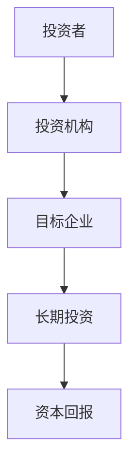

                 


# 大卫斯文森的耐心资本理念

> 关键词：耐心资本、长期投资、大卫斯文森、投资策略、机构投资、风险控制、财富管理

> 摘要：大卫·斯文森是耶鲁大学的首席投资官，他提出的耐心资本理念为机构投资者提供了一种独特的长期投资策略。本文将详细分析耐心资本的核心概念、算法原理、系统架构以及实际项目中的应用，帮助读者理解如何在复杂多变的市场环境中实现稳健的财富增长。

---

## 第一部分：耐心资本理念的背景与核心概念

### 第1章：耐心资本理念的背景介绍

#### 1.1 耐心资本的定义与核心要素

- **耐心资本的定义**：耐心资本是一种长期投资策略，强调通过长期持有优质资产来实现稳健的回报，而非频繁交易以追求短期收益。

- **核心要素**：
  - **长期视角**：投资期限通常为5年或更长，以捕捉复利效应。
  - **分散投资**：通过多样化投资组合降低风险。
  - **价值投资**：关注企业的基本面，寻找被低估的投资标的。
  - **低 turnover**：减少交易频率，降低交易成本和税务负担。

- **与其他资本形式的对比**：
  - 与风险投资相比，耐心资本更注重长期稳定回报而非高风险高回报。
  - 与私募股权相比，耐心资本更注重资产的持续增值而非短期退出。

#### 1.2 耐心资本的背景与问题背景

- **当前金融市场挑战**：
  - 市场波动加剧，短期投资风险上升。
  - 短期主义盛行，投资者倾向于追涨杀跌，导致市场波动加剧。

- **机构投资者面临的压力**：
  - 短期业绩压力导致投资决策短视。
  - 过度交易增加成本，影响长期收益。

- **耐心资本理念的提出背景**：
  - 应对短期主义的挑战。
  - 通过长期视角降低市场波动对投资组合的影响。

#### 1.3 耐心资本的目标与问题解决

- **目标**：
  - 实现资产的长期稳健增值。
  - 降低投资组合的波动性和风险。

- **如何解决问题**：
  - 通过长期持有优质资产，避免短期市场波动的影响。
  - 采用分散化策略，降低特定资产或行业风险。

- **边界与外延**：
  - 耐心资本主要应用于机构投资，但也可为个人投资者提供参考。
  - 外延包括养老基金、教育基金等长期资金的管理。

#### 1.4 耐心资本的核心概念结构

- **结构组成**：
  - **战略资产配置**：确定投资组合中各类资产的权重。
  - **风险管理**：通过分散投资和止损机制控制风险。
  - **定期再平衡**：定期调整投资组合以维持目标配置。

- **与其他资本形式的对比**：
  - 与短期资本相比，耐心资本更注重长期价值。
  - 与 leveraged buyout（杠杆收购）相比，耐心资本更注重资产的有机增长。

- **核心要素分析**：
  - **时间跨度**：长期投资策略的核心要素。
  - **资产质量**：选择优质资产是实现稳健回报的关键。
  - **风险管理**：分散投资和止损机制是控制风险的重要手段。

---

## 第二部分：耐心资本理念的核心概念与联系

### 第2章：耐心资本的核心原理

#### 2.1 耐心资本的原理分析

- **基本原理**：
  - 通过长期持有优质资产，捕捉复利效应，实现财富的稳步增长。
  - 避免频繁交易，降低交易成本和税务负担。

- **运作机制**：
  - 选择具有持续增长潜力的企业。
  - 长期持有，分享企业成长的成果。
  - 定期再平衡投资组合，维持目标配置。

- **核心策略**：
  - 价值投资：寻找被低估的资产。
  - 分散投资：降低特定资产或行业风险。
  - 长期持有：避免短期市场波动的影响。

#### 2.2 耐心资本的核心属性特征对比

- **核心属性分析**：
  - 时间跨度：长期 vs 短期。
  - 风险承受能力：较高 vs 较低。
  - 投资目标：稳健增长 vs 短期收益。

- **对比表格**：

| 特性                | 耐心资本                 | 短期资本                 |
|---------------------|--------------------------|--------------------------|
| 投资期限            | 5年以上                  | 1年以内                  |
| 风险承受能力        | 较高                     | 较低                     |
| 投资目标            | 稳健的长期回报           | 短期内的高收益           |
| 交易频率            | 低                      | 高                      |

- **与其他资本形式的对比**：
  - 与风险投资相比，耐心资本更注重长期稳定回报。
  - 与私募股权相比，耐心资本更注重资产的持续增值。

#### 2.3 耐心资本的ER实体关系图



---

## 第三部分：耐心资本理念的算法原理

### 第3章：耐心资本的算法原理

#### 3.1 耐心资本的数学模型

- **投资组合优化模型**：
  - 目标：最大化收益，最小化风险。
  - 约束条件：投资比例之和为1，满足风险承受能力。

- **风险调整后的收益模型**：
  - 计算每种资产的风险调整后收益，选择最优组合。

- **数学公式**：
  - 投资组合的方差公式：
  $$\sigma^2 = \sum_{i=1}^n w_i^2 \sigma_i^2 + 2 \sum_{i<j} w_i w_j \sigma_i \sigma_j \rho_{ij}$$
  - 其中，$\sigma_i$ 是第 $i$ 个资产的波动率，$\rho_{ij}$ 是第 $i$ 和 $j$ 个资产的相关系数。

- **代码实现**：
  ```python
  import numpy as np

  def portfolio_variance(weights, covariance_matrix):
      return (weights.T @ covariance_matrix @ weights).item()

  weights = np.array([0.6, 0.4])
  covariance_matrix = np.array([[0.16, 0.05], [0.05, 0.25]])
  variance = portfolio_variance(weights, covariance_matrix)
  print(variance)
  ```

#### 3.2 耐心资本的长期复利模型

- **复利计算公式**：
  $$A = P(1 + r)^t$$
  - $P$：初始本金。
  - $r$：年化收益率。
  - $t$：投资时间（年）。

- **代码实现**：
  ```python
  def compound_interest(P, r, t):
      return P * (1 + r) ** t

  P = 10000
  r = 0.07
  t = 30
  print(compound_interest(P, r, t))
  ```

#### 3.3 算法优化与实现

- **算法优化**：
  - 使用优化算法（如均值-方差优化）选择最优投资组合。
  - 通过历史数据验证模型的有效性。

- **代码实现**：
  ```python
  import numpy as np
  from scipy.optimize import minimize

  def optimize_portfolio(returns, covariance_matrix, target_return):
      n = covariance_matrix.shape[0]
      init_guess = np.array([0.25] * n)
      bounds = [(0, 1) for _ in range(n)]
      weights = None
      def objective(weights):
          return (weights.T @ covariance_matrix @ weights).item()
      result = minimize(objective, init_guess, method='SLSQP', bounds=bounds, constraints={
          'type': 'eq',
          'fun': lambda w: np.sum(w) - 1
      })
      if result.success:
          weights = result.x
      else:
          print("Optimization failed")
      return weights

  returns = np.array([0.05, 0.10, 0.15])
  covariance_matrix = np.array([[0.04, 0.02, 0.01], [0.02, 0.06, 0.03], [0.01, 0.03, 0.09]])
  weights = optimize_portfolio(returns, covariance_matrix, 0.10)
  print(weights)
  ```

---

## 第四部分：系统分析与架构设计

### 第4章：耐心资本的系统架构设计

#### 4.1 投资管理系统架构

- **模块划分**：
  - 数据采集模块：收集市场数据。
  - 模型计算模块：计算最优投资组合。
  - 界面展示模块：显示投资组合和收益。

- **系统架构图**：
  ```mermaid
  graph TD
      A[数据采集] --> B[模型计算]
      B --> C[界面展示]
      A --> C
  ```

- **交互流程**：
  - 用户输入初始资金。
  - 系统计算最优投资组合。
  - 展示投资组合的收益和风险。

#### 4.2 系统功能设计

- **领域模型**：
  ```mermaid
  classDiagram
      class 投资者 {
          资金: float
          风险偏好: string
      }
      class 投资组合 {
          资产配置: dict
          预期收益: float
          风险: float
      }
      投资者 --> 投资组合: 创建投资组合
  ```

- **系统架构设计**：
  ```mermaid
  architecture
      客户端 --> 数据采集模块
      数据采集模块 --> 数据存储模块
      数据存储模块 --> 模型计算模块
      模型计算模块 --> 界面展示模块
      界面展示模块 --> 客户端
  ```

- **接口设计**：
  - API接口：提供给其他系统调用。
  - 数据接口：与数据源对接。

---

## 第五部分：项目实战

### 第5章：耐心资本理念的项目实战

#### 5.1 环境配置与代码实现

- **环境安装**：
  - 安装必要的Python库：numpy、pandas、scipy。

- **核心代码实现**：
  ```python
  import numpy as np
  from scipy.optimize import minimize

  def calculate_portfolio_return(weights, returns):
      return np.sum(weights * returns)

  def calculate_portfolio_risk(weights, covariance_matrix):
      return np.sqrt(weights.T @ covariance_matrix @ weights)

  def optimize_portfolio(returns, covariance_matrix, target_return):
      n = covariance_matrix.shape[0]
      init_guess = np.array([1/n] * n)
      bounds = [(0, 1) for _ in range(n)]
      def objective(weights):
          return -calculate_portfolio_return(weights, returns)
      result = minimize(objective, init_guess, method='SLSQP', bounds=bounds, constraints={
          'type': 'eq',
          'fun': lambda w: np.sum(w) - 1
      })
      if result.success:
          return result.x
      else:
          return None

  returns = np.array([0.05, 0.10, 0.15])
  covariance_matrix = np.array([[0.04, 0.02, 0.01], [0.02, 0.06, 0.03], [0.01, 0.03, 0.09]])
  weights = optimize_portfolio(returns, covariance_matrix, 0.10)
  print(weights)
  ```

#### 5.2 案例分析与详细解读

- **案例分析**：
  - 投资组合：股票、债券、黄金。
  - 目标：实现7%的年化收益，风险承受能力为中等。

- **详细解读**：
  - 计算各资产的风险调整后收益。
  - 确定最优投资比例。
  - 定期再平衡投资组合。

---

## 第六部分：总结与展望

### 6.1 总结

- 耐心资本理念通过长期视角、分散投资和价值投资，帮助投资者实现稳健的长期回报。
- 算法优化和系统设计是实现耐心资本理念的重要手段。
- 通过实际项目实战，可以验证耐心资本理念的有效性。

### 6.2 注意事项

- 投资者需根据自身风险承受能力和投资目标选择合适策略。
- 定期再平衡投资组合，确保目标配置的实现。
- 避免过度交易，降低交易成本和税务负担。

### 6.3 拓展阅读

- 《机构投资的创新之路》：深入探讨机构投资的新策略。
- 《长期投资的艺术》：分析长期投资的成功案例。

---

## 作者

**作者：AI天才研究院/AI Genius Institute & 禅与计算机程序设计艺术 /Zen And The Art of Computer Programming**

---

通过本文的详细分析，读者可以全面理解大卫斯文森的耐心资本理念，并在实际投资中应用这些策略，实现稳健的财富增长。

