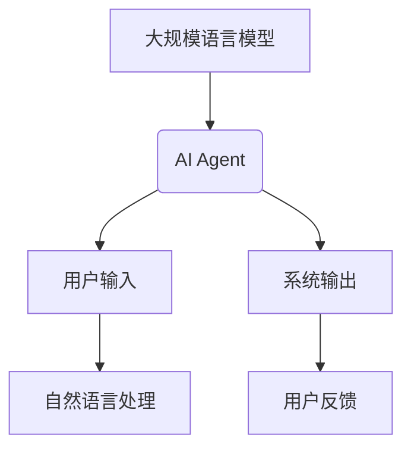
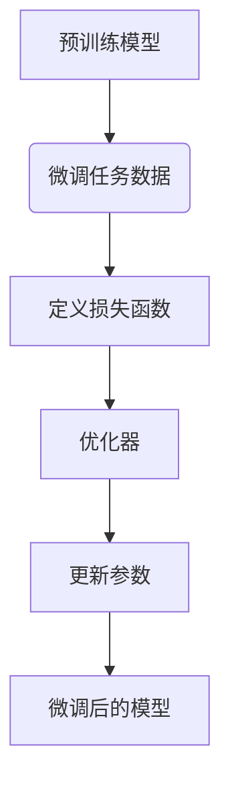
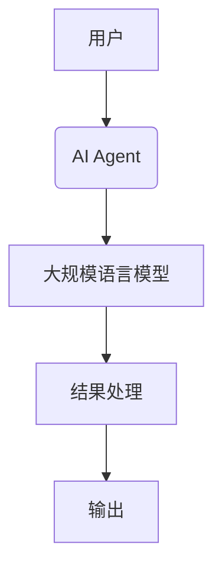

                 


# 大规模语言模型在AI Agent中的微调技巧

## 关键词：大规模语言模型, AI Agent, 微调, 机器学习, 深度学习, 自然语言处理, 强化学习

## 摘要：  
随着人工智能技术的快速发展，大规模语言模型（如GPT系列）在AI Agent中的应用越来越广泛。然而，如何有效地对大规模语言模型进行微调，以适应特定场景的需求，是一个具有挑战性的课题。本文将从背景与基础、核心概念与联系、算法原理、系统设计、项目实战等多个方面，详细探讨大规模语言模型在AI Agent中的微调技巧。通过对微调方法的分析与实践，本文旨在为读者提供一套系统化的方法论，帮助他们在实际应用中更好地利用大规模语言模型提升AI Agent的性能与智能水平。

---

# 第一部分: 大规模语言模型在AI Agent中的背景与基础

## 第1章: 大规模语言模型与AI Agent概述

### 1.1 大规模语言模型的定义与特点

#### 1.1.1 大规模语言模型的定义  
大规模语言模型（Large Language Models, LLMs）是指通过大量数据训练的深度学习模型，能够理解和生成人类语言。这些模型通常基于Transformer架构，具有强大的上下文理解和生成能力。

#### 1.1.2 大规模语言模型的核心特点  
- **参数量大**：通常包含 billions（十亿）级别的参数，如GPT-3、GPT-4等。  
- **多任务能力**：能够处理多种自然语言处理任务，如文本生成、问答、翻译等。  
- **上下文理解**：通过Transformer架构，能够捕捉长距离依赖关系，理解上下文。  
- **生成能力强**：能够生成高质量的文本，接近人类写作水平。  

#### 1.1.3 大规模语言模型的应用领域  
- **文本生成**：新闻、文章生成、对话系统等。  
- **问答系统**：智能客服、知识问答系统等。  
- **代码生成**：生成编程代码片段。  
- **文本摘要**：自动摘要、信息提取等。  

---

### 1.2 AI Agent的定义与特点

#### 1.2.1 AI Agent的定义  
AI Agent（人工智能代理）是指能够感知环境、执行任务、与用户交互的智能实体。它可以是一个软件程序，也可以是一个硬件设备，通过传感器和执行器与外部环境交互。

#### 1.2.2 AI Agent的核心特点  
- **智能性**：能够理解和处理复杂信息，做出决策。  
- **自主性**：能够在没有外部干预的情况下自主运行。  
- **交互性**：能够与用户或其他系统进行交互。  
- **适应性**：能够根据环境变化调整行为。  

#### 1.2.3 AI Agent的应用场景  
- **智能家居**：控制家电、管理日程等。  
- **智能助手**：如Siri、Alexa等，帮助用户完成日常任务。  
- **智能客服**：自动处理客户咨询、解决问题。  
- **自动驾驶**：通过感知环境，做出驾驶决策。  

---

### 1.3 大规模语言模型与AI Agent的关系

#### 1.3.1 大规模语言模型在AI Agent中的作用  
大规模语言模型可以作为AI Agent的核心组件，负责处理自然语言输入、生成自然语言输出，以及理解上下文信息。例如，在智能客服中，大规模语言模型可以用于理解用户的问题，并生成合适的回答。

#### 1.3.2 AI Agent如何利用大规模语言模型  
AI Agent可以通过调用大规模语言模型的API，利用其强大的自然语言处理能力来提升自身的智能化水平。例如，在对话系统中，AI Agent可以利用大规模语言模型生成更自然、更符合用户意图的回复。

#### 1.3.3 两者结合的优势与挑战  
- **优势**：  
  - 提高AI Agent的自然语言处理能力。  
  - 增强AI Agent的理解和生成能力。  
  - 提供更丰富、更智能的交互体验。  
- **挑战**：  
  - 大规模语言模型的计算资源需求较高。  
  - 微调大规模语言模型以适应特定场景的需求。  
  - 模型的可解释性和安全性问题。  

---

## 第2章: 大规模语言模型微调的背景与意义

### 2.1 微调的定义与作用

#### 2.1.1 微调的定义  
微调是指在预训练好的大规模语言模型的基础上，针对特定任务或场景进行进一步的训练。通过微调，可以将模型适应特定的数据分布和任务需求。

#### 2.1.2 微调的作用  
- **适应特定场景**：通过微调，模型可以更好地适应特定任务的需求，例如医疗领域的问答系统。  
- **提升性能**：在特定任务上，微调可以显著提升模型的准确性和生成质量。  
- **降低训练成本**：相比于从零开始训练，微调只需要对已有的模型进行小规模的调整，训练成本更低。  

---

### 2.2 大规模语言模型微调的背景

#### 2.2.1 大规模语言模型的局限性  
- **通用性与专用性的矛盾**：大规模语言模型虽然在通用任务上表现出色，但在特定领域或特定任务上可能不够精准。  
- **数据分布的差异**：模型在预训练阶段使用的数据分布可能与实际应用中的数据分布存在差异。  

#### 2.2.2 微调的必要性  
- 通过微调，可以缩小预训练模型与实际需求之间的差距。  
- 微调是实现模型适应性的重要手段。  

#### 2.2.3 微调的现状与趋势  
- 微调技术已经成为大规模语言模型应用的重要环节。  
- 随着模型的规模越来越大，微调的效率和效果也成为研究的热点。  

---

### 2.3 AI Agent中微调的意义

#### 2.3.1 提高AI Agent的智能化水平  
通过微调，AI Agent可以更好地理解和生成自然语言，从而提升其智能化水平。  

#### 2.3.2 适应特定场景的需求  
AI Agent的应用场景千差万别，通过微调，可以将模型适应特定领域的需求，例如医疗、法律、教育等。  

#### 2.3.3 优化用户体验  
微调可以使得AI Agent的输出更符合用户的期望，从而提升用户体验。  

---

## 第3章: 大规模语言模型与AI Agent的核心概念与联系

### 3.1 大规模语言模型的核心原理

#### 3.1.1 语言模型的训练原理  
语言模型的目标是学习文本中词的分布，通过最大化条件概率$P(w_i|w_{i-1},\ldots,w_{i-n})$来生成合理的文本序列。  

#### 3.1.2 常见的训练方法  
- **自监督学习**：通过预测词的上下文来学习词的表示。  
- **对比学习**：通过对比正样本和负样本来学习词的表示。  

#### 3.1.3 模型的结构特点  
- **Transformer架构**：通过自注意力机制捕捉长距离依赖关系。  
- **多层堆叠**：通过堆叠多层网络来提高模型的表达能力。  

---

### 3.2 AI Agent的核心原理

#### 3.2.1 感知与决策  
AI Agent通过传感器感知环境状态，利用模型进行决策，输出动作。  

#### 3.2.2 交互与反馈  
AI Agent与用户或环境进行交互，根据反馈调整自身的行为策略。  

#### 3.2.3 学习与优化  
通过强化学习或监督学习等方法，优化AI Agent的性能。  

---

### 3.3 两者结合的核心要素

#### 3.3.1 数据流  
- **输入**：自然语言指令或文本。  
- **处理**：通过大规模语言模型进行理解与生成。  
- **输出**：AI Agent的行动或反馈。  

#### 3.3.2 模型调用  
- **API调用**：AI Agent通过API调用大规模语言模型的服务。  
- **本地部署**：在特定场景下，AI Agent可以本地部署大规模语言模型的微调版本。  

---

### 3.4 实体关系图



---

## 第4章: 算法原理

### 4.1 微调方法概述

#### 4.1.1 全参数微调  
- **定义**：对模型的所有参数进行调整，以适应特定任务。  
- **优点**：模型的适应性强，能够在特定任务上表现优异。  
- **缺点**：计算资源需求高，训练时间长。  

#### 4.1.2 参数初始化微调  
- **定义**：仅调整模型的部分参数，通常是在预训练的基础上，对新增的参数进行训练。  
- **优点**：计算资源需求较低，训练时间较短。  
- **缺点**：模型的适应性可能有限。  

#### 4.1.3 Adapter微调  
- **定义**：在模型中插入Adapter模块，通过少量新增参数来调整模型的输出。  
- **优点**：计算资源需求低，适用于小规模任务。  
- **缺点**：模型的全局适应性可能不如全参数微调。  

---

### 4.2 微调算法的流程



---

### 4.3 具体算法实现

#### 4.3.1 全参数微调的Python代码示例

```python
import torch
import torch.nn as nn
from transformers import GPT2LMHeadModel, GPT2Tokenizer

# 加载预训练模型
model = GPT2LMHeadModel.from_pretrained('gpt2')
tokenizer = GPT2Tokenizer.from_pretrained('gpt2')

# 定义微调任务数据
input_text = "Given the context of a customer complaint, generate a response."
input_ids = tokenizer.encode(input_text, return_tensors='pt')

# 定义损失函数
criterion = nn.CrossEntropyLoss()
optimizer = torch.optim.Adam(model.parameters(), lr=1e-5)

# 微调训练
for _ in range(num_epochs):
    outputs = model(input_ids)
    loss = criterion(outputs.logits, labels)
    optimizer.zero_grad()
    loss.backward()
    optimizer.step()

# 保存微调后的模型
model.save_pretrained('fine-tuned-gpt2')
```

---

## 第5章: 系统分析与架构设计方案

### 5.1 系统架构设计

#### 5.1.1 系统功能设计  
- **输入处理**：接收用户的自然语言指令。  
- **模型调用**：调用大规模语言模型进行理解和生成。  
- **输出处理**：将模型的输出结果格式化为AI Agent的行动或反馈。  

#### 5.1.2 系统架构图  


---

## 第6章: 项目实战

### 6.1 智能客服对话系统案例

#### 6.1.1 环境安装  
```bash
pip install transformers torch
```

#### 6.1.2 核心代码实现

```python
from transformers import GPT2LMHeadModel, GPT2Tokenizer

# 加载微调后的模型
model = GPT2LMHeadModel.from_pretrained('fine-tuned-gpt2')
tokenizer = GPT2Tokenizer.from_pretrained('fine-tuned-gpt2')

# 定义对话函数
def chatbot_response(user_input):
    input_ids = tokenizer.encode(user_input, return_tensors='pt')
    output_ids = model.generate(input_ids, max_length=50)
    response = tokenizer.decode(output_ids[0], skip_special_tokens=True)
    return response

# 测试对话
print(chatbot_response("I am not satisfied with the product."))
```

---

## 第7章: 总结与展望

### 7.1 最佳实践 tips  
- 在实际应用中，建议根据具体需求选择合适的微调方法。  
- 对于资源有限的场景，可以考虑使用Adapter微调或参数初始化微调。  
- 微调过程中，建议使用合适的评价指标来评估模型的性能。  

### 7.2 小结  
本文详细探讨了大规模语言模型在AI Agent中的微调技巧，从背景与基础、核心概念与联系、算法原理、系统设计到项目实战，为读者提供了一套系统化的解决方案。  

### 7.3 注意事项  
- 微调过程中需要注意模型的过拟合问题。  
- 在实际应用中，建议对模型的输出进行内容过滤和安全检查。  

### 7.4 拓展阅读  
- [《Effective Pretrained Model Fine-tuning for Text Generation》](#)  
- [《Adapters for Large Language Models》](#)  

---

## 作者：AI天才研究院/AI Genius Institute & 禅与计算机程序设计艺术 /Zen And The Art of Computer Programming

