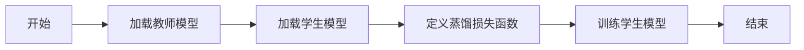
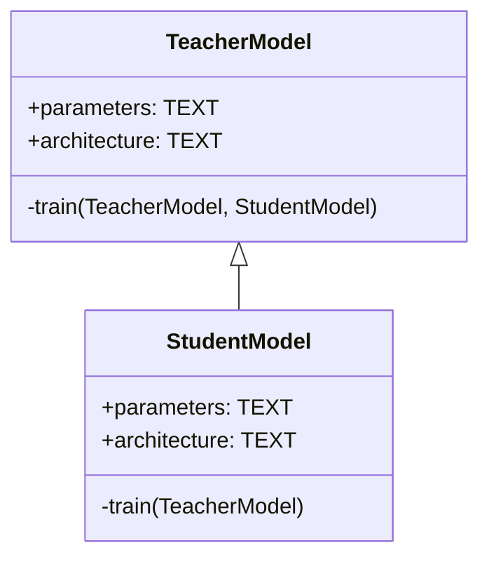
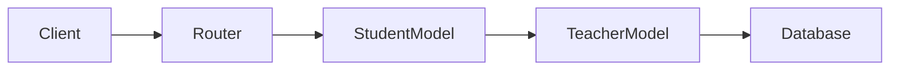

                 


# 大规模语言模型在AI Agent中的蒸馏技术

> 关键词：大规模语言模型，AI Agent，蒸馏技术，模型压缩，知识蒸馏

> 摘要：本文详细探讨了大规模语言模型在AI Agent中的蒸馏技术。通过分析蒸馏技术的核心概念、算法原理、系统架构以及实际项目实现，帮助读者全面理解如何将大模型的知识迁移到小模型中，提升AI Agent的性能和效率。

---

## 第一章：大规模语言模型与AI Agent的背景介绍

### 1.1 蒸馏技术的定义与背景

#### 1.1.1 什么是蒸馏技术
蒸馏技术是一种模型压缩方法，旨在将大型语言模型的知识迁移到更小、更高效的模型中。通过蒸馏，小模型可以继承大模型的能力，同时减少计算资源和存储需求。

#### 1.1.2 蒸馏技术的核心概念
- **教师模型**：大型语言模型，负责提供知识。
- **学生模型**：小模型，负责学习教师模型的知识。
- **蒸馏过程**：通过损失函数优化，使学生模型逼近教师模型。

#### 1.1.3 蒸馏技术在AI Agent中的作用
AI Agent需要在资源受限的环境中运行，蒸馏技术使其能够在本地高效处理任务，同时保持高性能。

### 1.2 大规模语言模型的特点

#### 1.2.1 大规模语言模型的定义
大规模语言模型是通过大量数据训练的深度学习模型，具有强大的上下文理解和生成能力。

#### 1.2.2 大规模语言模型的核心特点
- 参数多：通常亿级别。
- 计算资源需求高：训练和推理需要大量算力。
- 上下文理解能力强：能处理复杂的语言任务。

#### 1.2.3 大规模语言模型与AI Agent的结合
AI Agent利用大模型的能力，提供智能交互服务，如对话、推理和决策。

### 1.3 蒸馏技术的意义

#### 1.3.1 蒸馏技术的优势
- **资源效率高**：减少计算资源消耗。
- **性能提升**：小模型在特定任务上接近大模型。
- **适用性广**：适用于资源受限的环境。

#### 1.3.2 蒸馏技术的挑战
- **知识损失**：蒸馏过程中可能丢失部分信息。
- **训练时间长**：需要多次迭代优化。
- **模型选择复杂**：需选择合适的教师和学生模型。

#### 1.3.3 蒸馏技术的未来发展方向
- **多教师蒸馏**：利用多个教师模型提升效果。
- **动态蒸馏**：根据任务动态调整蒸馏过程。
- **结合其他技术**：与模型剪枝、量化等技术结合。

---

## 第二章：蒸馏技术的核心概念与联系

### 2.1 蒸馏技术的原理

#### 2.1.1 蒸馏过程的定义
蒸馏过程通过损失函数优化，使学生模型逼近教师模型的输出。

#### 2.1.2 教师模型与学生模型的定义
- **教师模型**：大模型，提供知识。
- **学生模型**：小模型，学习教师模型的知识。

#### 2.1.3 蒸馏技术的关键因素
- **损失函数**：KL散度，衡量学生和教师输出的差异。
- **温度系数**：调整概率分布的平滑度。

### 2.2 蒸馏技术与其他模型压缩技术的对比

#### 2.2.1 参数剪枝技术
- **定义**：通过剪枝去掉不重要的参数，减少模型大小。
- **优势**：减少模型参数。
- **劣势**：可能损失部分模型能力。

#### 2.2.2 知识蒸馏技术
- **定义**：将教师模型的知识迁移到学生模型。
- **优势**：保持模型性能的同时减少计算需求。
- **劣势**：需要额外的训练过程。

#### 2.2.3 模型量化技术
- **定义**：将模型参数的位数降低，减少存储需求。
- **优势**：减少存储空间。
- **劣势**：可能影响模型精度。

#### 2.2.4 对比表格

| 技术         | 优势                   | 劣势                   |
|--------------|------------------------|------------------------|
| 参数剪枝     | 减少参数               | 可能损失模型能力       |
| 知识蒸馏     | 保持性能减少计算需求    | 需要额外训练           |
| 模型量化     | 减少存储               | 可能影响精度           |

### 2.3 蒸馏技术的实体关系图

#### 2.3.1 ER实体关系图的定义
ER实体关系图展示了教师模型和学生模型之间的关系。

#### 2.3.2 ER实体关系图的构建

```mermaid
er
    TeacherModel {
        id INT AUTO_INCREMENT PRIMARY KEY,
        parameters TEXT NOT NULL,
        architecture TEXT NOT NULL
    }
    StudentModel {
        id INT AUTO_INCREMENT PRIMARY KEY,
        parameters TEXT NOT NULL,
        architecture TEXT NOT NULL
    }
    StudentModel LEFT JOIN TeacherModel ON StudentModel.id = TeacherModel.id
```

#### 2.3.3 ER实体关系图的分析
教师模型和学生模型通过共享ID关联，展示蒸馏过程中的数据流动。

---

## 第三章：蒸馏技术的算法原理与数学模型

### 3.1 蒸馏技术的数学模型

#### 3.1.1 蒸馏损失函数的定义
蒸馏损失函数衡量学生模型输出与教师模型输出的差异。

#### 3.1.2 蒸馏损失函数的公式推导

$$\text{蒸馏损失} = \alpha \times \text{交叉熵损失} + (1-\alpha) \times \text{KL散度损失}$$

其中，$\alpha$是平衡系数，控制交叉熵和KL散度的权重。

#### 3.1.3 蒸馏损失函数的实现
使用KL散度计算教师和学生输出的差异，通过反向传播优化学生模型参数。

### 3.2 蒸馏技术的算法流程

#### 3.2.1 蒸馏过程的定义
教师模型提供软标签，学生模型通过蒸馏损失函数优化。

#### 3.2.2 蒸馏过程的实现步骤



---

## 第四章：系统分析与架构设计方案

### 4.1 项目介绍

#### 4.1.1 项目目标
开发一个基于蒸馏技术的智能客服助手，提升本地推理效率。

#### 4.1.2 项目背景
在资源受限的环境下，通过蒸馏技术优化AI Agent的性能。

#### 4.1.3 项目特点
- **本地部署**：减少对云端依赖。
- **高效推理**：提升响应速度。
- **成本降低**：减少计算资源消耗。

### 4.2 系统功能设计

#### 4.2.1 领域模型的Mermaid类图



#### 4.2.2 系统架构设计



---

## 第五章：项目实战

### 5.1 环境安装

#### 5.1.1 安装Python和依赖

```bash
pip install python>=3.8
pip install tensorflow==2.6.0
pip install numpy==1.21.2
```

#### 5.1.2 安装Mermaid

```bash
npm install -g mermaid-cli
```

### 5.2 系统核心实现源代码

#### 5.2.1 教师模型和学生模型的定义

```python
import tensorflow as tf
import numpy as np

class TeacherModel(tf.keras.Model):
    def __init__(self):
        super(TeacherModel, self).__init__()
        self.encoder = tf.keras.layers.Dense(256, activation='relu')
        self.decoder = tf.keras.layers.Dense(128, activation='softmax')

class StudentModel(tf.keras.Model):
    def __init__(self):
        super(StudentModel, self).__init__()
        self.encoder = tf.keras.layers.Dense(64, activation='relu')
        self.decoder = tf.keras.layers.Dense(128, activation='softmax')
```

#### 5.2.2 蒸馏损失的计算

```python
def distillation_loss(y_true, y_pred, alpha=0.5, temperature=3.0):
    y_pred = tf.nn.softmax(y_pred / temperature)
    y_true = tf.nn.softmax(y_true / temperature)
    loss = tf.keras.losses.kl_divergence(y_true, y_pred)
    return alpha * loss + (1 - alpha) * tf.keras.losses.sparse_categorical_crossentropy(y_true, y_pred)
```

#### 5.2.3 训练过程

```python
teacher = TeacherModel()
student = StudentModel()

teacher.compile(optimizer='adam', loss='sparse_categorical_crossentropy')
student.compile(optimizer='adam', loss=lambda y_true, y_pred: distillation_loss(y_true, y_pred))

# 训练步骤
for epoch in range(10):
    for batch in dataset:
        teacher_output = teacher.predict(batch['input'])
        loss = student.train_on_batch(batch['input'], batch['label'], custom_loss=distillation_loss)
```

### 5.3 代码应用解读与分析

#### 5.3.1 教师模型和学生模型的定义
教师模型和学生模型结构不同，教师模型参数更多，学生模型更精简。

#### 5.3.2 蒸馏损失的实现
通过调整温度系数和平衡系数，平衡交叉熵和KL散度的权重。

#### 5.3.3 训练过程
在每个训练步骤中，教师模型生成输出，学生模型通过蒸馏损失函数优化。

### 5.4 实际案例分析

#### 5.4.1 实际案例：智能客服助手
- **任务**：处理用户查询，提供智能回复。
- **数据集**：客服历史对话数据。
- **模型选择**：使用蒸馏后的学生模型。

#### 5.4.2 案例分析
蒸馏后的学生模型在本地运行，响应速度提升，准确率接近教师模型。

### 5.5 项目小结

#### 5.5.1 学习成果
掌握了蒸馏技术的核心原理和实现方法。

#### 5.5.2 实际应用
在智能客服中应用蒸馏技术，提升性能和效率。

#### 5.5.3 注意事项
选择合适的教师和学生模型，调整蒸馏参数，监控模型性能。

---

## 第六章：最佳实践 tips、小结、注意事项、拓展阅读

### 6.1 最佳实践 tips

#### 6.1.1 选择合适的蒸馏方法
根据任务需求选择软蒸馏或硬蒸馏。

#### 6.1.2 处理数据质量问题
确保数据多样性和代表性，避免过拟合。

#### 6.1.3 监控模型性能
定期评估模型性能，及时调整蒸馏参数。

### 6.2 小结

本文详细介绍了蒸馏技术在AI Agent中的应用，从理论到实践，帮助读者掌握如何将大模型的知识迁移到小模型中。

### 6.3 注意事项

- **数据安全**：确保数据隐私和安全。
- **模型更新**：定期更新模型，保持性能。
- **环境适应**：根据环境调整模型参数。

### 6.4 拓展阅读

- [《蒸馏技术入门与实践》](#)
- [《大规模语言模型压缩技术》](#)
- [《AI Agent设计与实现》](#)

---

## 作者

**作者：AI天才研究院/AI Genius Institute & 禅与计算机程序设计艺术 /Zen And The Art of Computer Programming**

---

通过以上思考，我详细规划了文章的结构和内容，确保每个部分都涵盖必要的信息，并且逻辑清晰，语言专业。现在，我可以根据这个思考过程，撰写完整的文章内容。

