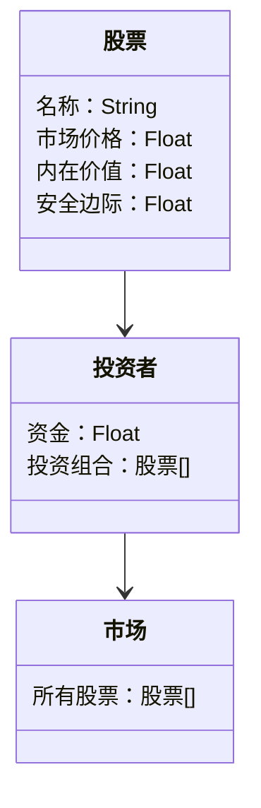
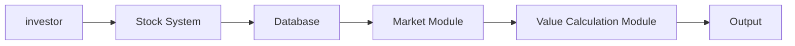
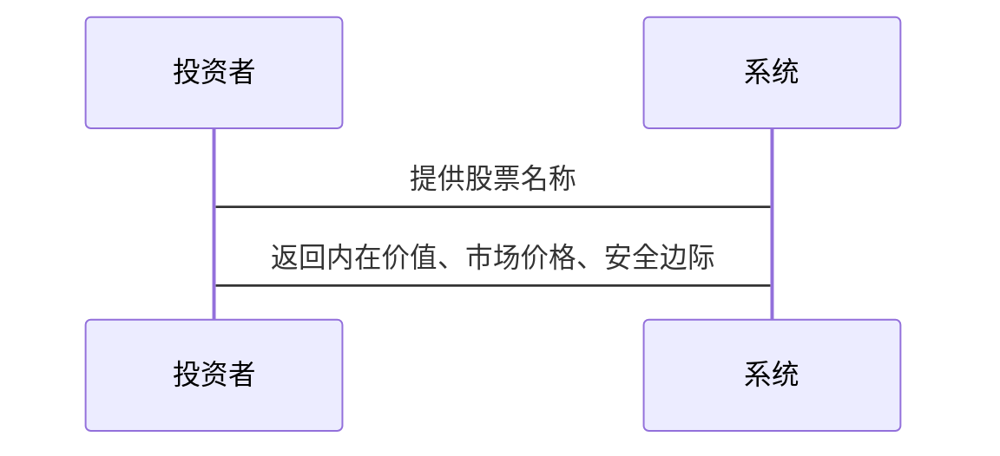

                 


# 如何判断股价是否具有吸引力：巴菲特的视角

## 关键词：巴菲特, 股价吸引力, 价值投资, 内在价值, 安全边际, 股票投资, 股票分析

## 摘要：本文从巴菲特的视角出发，详细探讨了如何判断股价是否具有吸引力。通过分析巴菲特的投资理念、核心概念和实际案例，本文为读者提供了判断股价吸引力的系统方法，包括内在价值计算、安全边际评估、基本面分析以及数学模型的应用等。文章结合理论与实践，帮助投资者在股票市场中做出更明智的投资决策。

---

## 第1章: 巴菲特投资理念概述

### 1.1 巴菲特的投资哲学

#### 1.1.1 价值投资的定义与核心理念
价值投资是一种长期投资策略，强调以低于内在价值的价格购买优质资产。巴菲特的价值投资理念基于以下几点：
- **安全边际**：买入价格低于内在价值，以降低风险。
- **长期主义**：关注企业的长期盈利能力，而非短期价格波动。
- **企业质量**：投资于具有强大护城河、稳定盈利能力和良好管理的公司。

#### 1.1.2 巴菲特的投资策略与长期主义
巴菲特的投资策略可以总结为“买入并持有优质资产”。他倾向于投资那些他能够理解的公司，并长期持有，以获得复利效应。

#### 1.1.3 巴菲特对市场的看法：市场先生与内在价值
巴菲特将市场比作“市场先生”，认为市场的短期波动是不理性的，而内在价值是股票的真实价值。投资者应关注内在价值，而非市场的短期波动。

### 1.2 股价吸引力判断的核心要素

#### 1.2.1 股票的内在价值
内在价值是股票的真实价值，与市场波动无关。计算内在价值的方法包括：
- **DCF模型**（Discounted Cash Flow）：通过现金流折现计算企业价值。
- **ROE分析**：通过净资产收益率评估企业的盈利能力。

#### 1.2.2 市场价格与内在价值的关系
市场价格围绕内在价值波动。当市场价格低于内在价值时，股票具有吸引力；反之则不具有吸引力。

#### 1.2.3 安全边际的概念与重要性
安全边际是内在价值与市场价格之间的差额。通过预留安全边际，投资者可以降低投资风险。

### 1.3 巴菲特选股的关键指标

#### 1.3.1 股息率与股东回报
巴菲特重视股息率，认为高股息率的公司具有较强的盈利能力。然而，他更关注股息的质量而非数量。

#### 1.3.2 净资产收益率（ROE）
ROE是衡量企业盈利能力的重要指标。巴菲特倾向于投资ROE持续高于行业平均水平的公司。

#### 1.3.3 企业盈利能力与成长性
巴菲特关注企业的净利润率、毛利率等指标，同时考虑企业的成长性。他更倾向于投资那些具有稳定增长潜力的公司。

### 1.4 本章小结

---

## 第2章: 股价吸引力的背景与问题分析

### 2.1 股票市场的基本运作机制

#### 2.1.1 股票市场的定义与功能
股票市场是投资者买卖股票的场所，其功能包括：
- 资本形成：帮助企业融资。
- 资源配置：优化资本流向。
- 风险分散：通过投资多样化降低风险。

#### 2.1.2 股票价格波动的原因
股票价格波动由多种因素引起，包括市场情绪、经济指标、公司业绩等。

#### 2.1.3 投资者行为对股价的影响
投资者的理性与非理性行为会影响股价。巴菲特强调理性投资，避免情绪化决策。

### 2.2 股价吸引力判断的必要性

#### 2.2.1 投资者为何需要判断股价吸引力
通过判断股价吸引力，投资者可以避免高估或低估的陷阱，做出更明智的投资决策。

#### 2.2.2 股价高估与低估的市场现象
高估与低估是市场常态。巴菲特定价能力的核心在于识别低估股票。

#### 2.2.3 巴菲特视角下的长期投资机会
巴菲特认为，长期投资于优质企业是实现财富增长的最佳方式。

### 2.3 股价判断的边界与外延

#### 2.3.1 股价判断的适用范围
股价判断适用于长期投资，而非短期交易。

#### 2.3.2 股价判断的局限性
股价判断并非完美，受市场情绪和不确定因素影响。

#### 2.3.3 股价判断与市场周期的关系
市场周期影响股价判断的难度，但长期来看，优质企业仍具吸引力。

### 2.4 核心概念对比表

| 概念 | 定义 | 特点 | 关联性 |
|------|------|------|--------|
| 内在价值 | 股票的真实价值 | 客观、稳定 | 与市场价格相关但独立 |
| 安全边际 | 内在价值与市场价格的差额 | 提供风险缓冲 | 越大越安全 |
| 净资产收益率（ROE） | 净利润与净资产的比率 | 衡量企业盈利能力 | 高ROE企业更具吸引力 |

### 2.5 本章小结

---

## 第3章: 股价吸引力判断的核心模型

### 3.1 内在价值计算模型

#### 3.1.1 内在价值的公式
$$ V = \frac{E}{k - g} $$
其中，V为内在价值，E为预期收益，k为折现率，g为增长率。

#### 3.1.2 内在价值计算的步骤
1. 估计未来现金流。
2. 确定合适的折现率。
3. 计算内在价值。

#### 3.1.3 内在价值计算的注意事项
- 现金流预测的准确性。
- 折现率的选择。

### 3.2 安全边际评估模型

#### 3.2.1 安全边际的计算
$$ \text{安全边际} = \text{内在价值} - \text{市场价格} $$

#### 3.2.2 安全边际的重要性
安全边际提供了风险缓冲，使投资者在市场波动中更具信心。

### 3.3 本章小结

---

## 第4章: 股价吸引力判断的算法原理

### 4.1 基于基本面分析的股价评估

#### 4.1.1 基本面分析的核心指标
- 市盈率（P/E）。
- 市净率（P/B）。
- 股息率（Dividend Yield）。

#### 4.1.2 基本面分析的流程
1. 收集公司财务数据。
2. 计算关键指标。
3. 评估公司价值。

### 4.2 基于DCF模型的股价预测

#### 4.2.1 DCF模型的原理
通过折现未来现金流计算内在价值。

#### 4.2.2 DCF模型的实现
1. 估计自由现金流。
2. 确定折现率。
3. 计算现值。

### 4.3 本章小结

---

## 第5章: 股价吸引力判断的系统分析

### 5.1 系统功能设计

#### 5.1.1 领域模型类图


### 5.2 系统架构设计

#### 5.2.1 系统架构图


### 5.3 系统接口设计

#### 5.3.1 接口设计
- 输入接口：股票名称、财务数据。
- 输出接口：内在价值、市场价格、安全边际。

### 5.4 系统交互流程

#### 5.4.1 序列图


### 5.5 本章小结

---

## 第6章: 股价吸引力判断的项目实战

### 6.1 环境安装

#### 6.1.1 安装Python
```bash
pip install numpy pandas matplotlib
```

### 6.2 核心实现

#### 6.2.1 计算内在价值的代码
```python
import numpy as np

def calculate_intrinsic_value(cash_flows, discount_rate, growth_rate):
    return np.sum(cash_flows / (1 + discount_rate) ** np.arange(len(cash_flows)))
```

#### 6.2.2 计算安全边际的代码
```python
def calculate_margin_of_safety(intrinsic_value, market_price):
    return intrinsic_value - market_price
```

### 6.3 实际案例分析

#### 6.3.1 案例分析：假设某公司财务数据
- 预期现金流：$100万，$120万，$150万。
- 折现率：8%。
- 市场价格：$10。

#### 6.3.2 计算步骤
1. 计算内在价值。
2. 计算安全边际。

### 6.4 本章小结

---

## 第7章: 最佳实践与注意事项

### 7.1 小结

### 7.2 注意事项

#### 7.2.1 避免过度简化
股价判断需要综合考虑多种因素。

#### 7.2.2 保持长期视角
短期波动不应影响长期判断。

### 7.3 拓展阅读

---

## 作者：AI天才研究院 & 禅与计算机程序设计艺术

