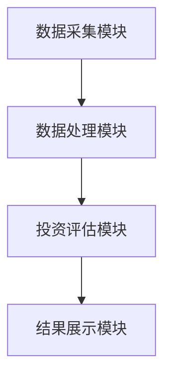
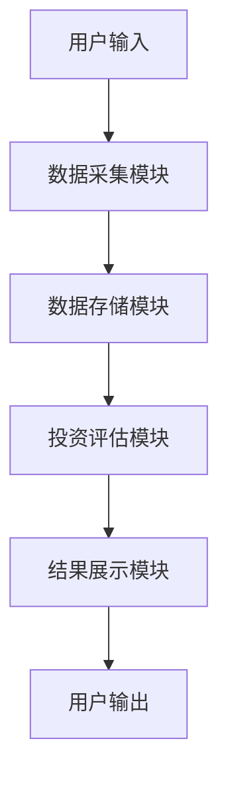
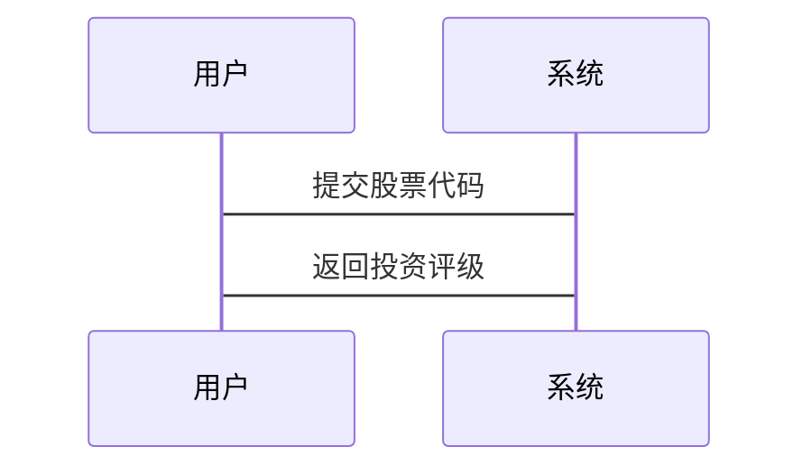

                 


# 如何实践彼得·林奇的投资策略

## 关键词：彼得·林奇，投资策略，价值投资，长期投资，基本面分析

## 摘要：本文详细探讨了如何实践彼得·林奇的投资策略，涵盖其核心理念、算法原理、系统架构及实战应用。通过背景介绍、核心概念、算法设计、系统实现和案例分析，帮助读者掌握这一策略，并在投资中取得成功。

---

## 第一部分：彼得·林奇投资策略背景介绍

### 第1章：彼得·林奇投资策略概述

#### 1.1 彼得·林奇及其投资理念

##### 1.1.1 彼得·林奇的生平简介

彼得·林奇（Peter Lynch）是美国著名的投资专家，被誉为“共同基金之王”。他在富达投资管理公司管理麦哲伦基金期间，取得了卓越的投资业绩，年平均回报率超过29%，为投资者创造了巨大价值。林奇的投资理念强调深入研究公司基本面，寻找具有长期增长潜力的公司，并进行长期投资。

##### 1.1.2 彼得·林奇的核心投资理念

彼得·林奇的投资策略以价值投资为核心，强调以下几点：
- **长期投资**：避免短期市场波动，关注公司长期增长潜力。
- **深入研究**：通过分析公司财务报表、行业地位、竞争优势等，评估其内在价值。
- **分散投资**：通过投资不同类型和行业的公司，降低风险。

##### 1.1.3 彼得·林奇与价值投资的关联

林奇的投资策略深受价值投资影响，但他在实践中发展了独特的选股方法。他强调公司基本面分析，寻找那些被市场低估但具有成长潜力的公司。这种方法结合了价值投资的估值理念和成长投资的增长潜力。

---

#### 1.2 彼得·林奇投资策略的核心要素

##### 1.2.1 价值投资的定义与特征

价值投资是一种投资策略，强调以低于内在价值的价格购买优质股票。其核心特征包括：
- **低市盈率（P/E）**：市盈率低于行业平均水平。
- **低市净率（P/B）**：市净率低于行业平均水平。
- **高股息率**：公司愿意分配更多利润给股东。

##### 1.2.2 长期投资的重要性

长期投资是彼得·林奇策略的核心，因为它允许投资者避免短期市场波动的影响，专注于公司的长期增长。长期投资的关键在于耐心和对市场的理解，避免频繁交易带来的成本和风险。

##### 1.2.3 深入研究公司的必要性

深入研究公司基本面是彼得·林奇策略的关键步骤。这包括分析公司的财务报表、行业地位、竞争优势、管理团队等。通过全面了解公司，投资者可以更好地评估其内在价值和潜在风险。

---

## 第二部分：彼得·林奇投资策略的核心概念

### 第2章：价值投资与成长投资的对比

#### 2.1 价值投资的核心概念

##### 2.1.1 价值投资的定义

价值投资是一种投资策略，强调以低于公司内在价值的价格购买股票。这种方法的核心是寻找市场低估的公司，长期持有，等待其价值回归。

##### 2.1.2 价值投资的关键指标

| 指标名称 | 定义 | 作用 |
|----------|------|------|
| 市盈率（P/E） | 每股价格 / 每股收益 | 评估公司估值 |
| 市净率（P/B） | 每股价格 / 每股净资产 | 评估公司资产价值 |
| 股息率 | 每股股息 / 每股价格 | 评估收益稳定性 |

#### 2.2 成长投资的核心概念

##### 2.2.1 成长投资的定义

成长投资是一种投资策略，关注那些具有高于平均水平营收和净利润增长的公司。这种方法的核心在于寻找能够持续增长的企业，即使其当前估值较高。

##### 2.2.2 成长投资的关键指标

| 指标名称 | 定义 | 作用 |
|----------|------|------|
| 营收增长率 | 营收同比增长率 | 评估公司成长潜力 |
| 净利润增长率 | 净利润同比增长率 | 评估公司盈利能力 |
| 毛利率 | 毛利 / 营收 | 评估公司产品盈利能力 |

#### 2.3 价值投资与成长投资的对比分析

##### 2.3.1 优缺点对比

| 指标 | 价值投资 | 成长投资 |
|------|----------|----------|
| 优点 | 稳定性高，风险低 | 高增长潜力，回报高 |
| 缺点 | 增长潜力有限 | 风险高，波动大 |

##### 2.3.2 适用场景分析

- **价值投资**适用于市场低迷、寻找低估股票的投资者。
- **成长投资**适用于高增长行业，如科技、生物技术等。

---

## 第三部分：彼得·林奇投资策略的算法原理

### 第3章：彼得·林奇投资模型的算法解析

#### 3.1 投资模型的基本原理

##### 3.1.1 投资模型的输入变量

| 变量名称 | 定义 | 示例 |
|----------|------|------|
| 市盈率（P/E） | 每股价格 / 每股收益 | 15 |
| 市净率（P/B） | 每股价格 / 每股净资产 | 2 |
| 营收增长率 | 营收同比增长率 | 20% |
| 净利润增长率 | 净利润同比增长率 | 10% |
| 股息率 | 每股股息 / 每股价格 | 2% |

##### 3.1.2 投资模型的输出结果

| 结果名称 | 定义 | 示例 |
|----------|------|------|
| 内在价值 | 公司股票的合理估值 | $50 |
| 投资评级 | 投资建议：买入、持有、卖出 | 买入 |

#### 3.2 投资模型的数学公式

##### 3.2.1 内在价值计算公式

$$
\text{内在价值} = \text{每股收益} \times (1 + \text{增长率}) / (\text{折现率} - \text{增长率})
$$

##### 3.2.2 投资评级计算公式

$$
\text{投资评级} = 
\begin{cases}
\text{买入} & \text{如果内在价值} > \text{市场价格} \\
\text{持有} & \text{如果内在价值} = \text{市场价格} \\
\text{卖出} & \text{如果内在价值} < \text{市场价格}
\end{cases}
$$

---

## 第四部分：彼得·林奇投资策略的系统架构设计

### 第4章：投资系统的设计与实现

#### 4.1 系统需求分析

##### 4.1.1 系统目标

开发一个基于彼得·林奇策略的投资管理系统，实现股票筛选、评估和投资建议功能。

##### 4.1.2 系统功能需求

- 数据采集：获取股票的基本面数据。
- 数据处理：清洗和预处理数据。
- 投资评估：计算内在价值和投资评级。
- 结果展示：以图表和报告形式展示评估结果。

##### 4.1.3 系统性能需求

- 处理速度：快速响应用户查询。
- 数据存储：支持大量历史数据的存储和查询。

#### 4.2 系统架构设计

##### 4.2.1 系统模块划分



##### 4.2.2 系统数据流图



##### 4.2.3 系统交互设计



---

## 第五部分：彼得·林奇投资策略的项目实战

### 第5章：投资策略的实战应用

#### 5.1 环境搭建

##### 5.1.1 数据源选择

使用Yahoo Finance获取股票数据。

##### 5.1.2 工具安装与配置

安装Python、Pandas、Matplotlib等工具。

#### 5.2 核心代码实现

##### 5.2.1 数据清洗与预处理

```python
import pandas as pd

# 读取数据
data = pd.read_csv('stock_data.csv')

# 删除缺失值
data.dropna(inplace=True)

# 标准化处理
data['市盈率'] = data['市盈率'].astype(float)
```

##### 5.2.2 投资模型实现

```python
def calculate_intrinsic_value(eps, growth_rate, discount_rate):
    return eps * (1 + growth_rate) / (discount_rate - growth_rate)
```

##### 5.2.3 模型评估与优化

通过回测分析模型的准确性和稳定性，优化参数和指标。

#### 5.3 实际案例分析

##### 5.3.1 案例选择

以苹果公司为例，分析其基本面指标和投资评级。

##### 5.3.2 投资评级计算

假设苹果公司每股收益为5元，营收增长率为10%，折现率为8%，计算其内在价值：

$$
\text{内在价值} = 5 \times (1 + 0.10) / (0.08 - 0.10) = 55 \text{元}
$$

如果苹果股价为50元，投资评级为“买入”。

---

## 第六部分：总结与最佳实践

### 第6章：最佳实践与小结

#### 6.1 总结

彼得·林奇的投资策略强调价值投资和长期投资，通过深入分析公司基本面，寻找具有长期增长潜力的股票。投资者应结合市场环境和公司情况，灵活调整投资策略。

#### 6.2 最佳实践 tips

- **持续学习**：保持对市场和行业的了解，关注公司动态。
- **分散投资**：避免过度集中，降低风险。
- **长期持有**：耐心持有优质股票，避免频繁交易。
- **风险管理**：设定止损点，控制投资风险。

#### 6.3 未来展望

随着市场环境的变化，彼得·林奇策略需要结合新的技术和工具进行优化，如大数据分析和机器学习，以提高投资效率和准确性。

---

## 作者

作者：AI天才研究院/AI Genius Institute & 禅与计算机程序设计艺术 /Zen And The Art of Computer Programming

