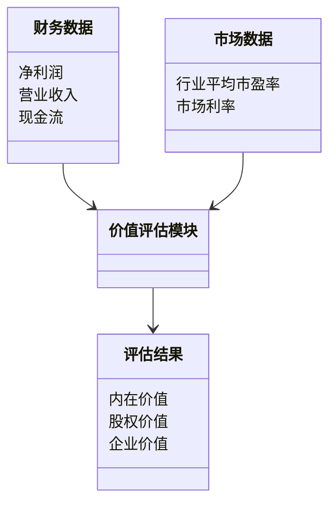
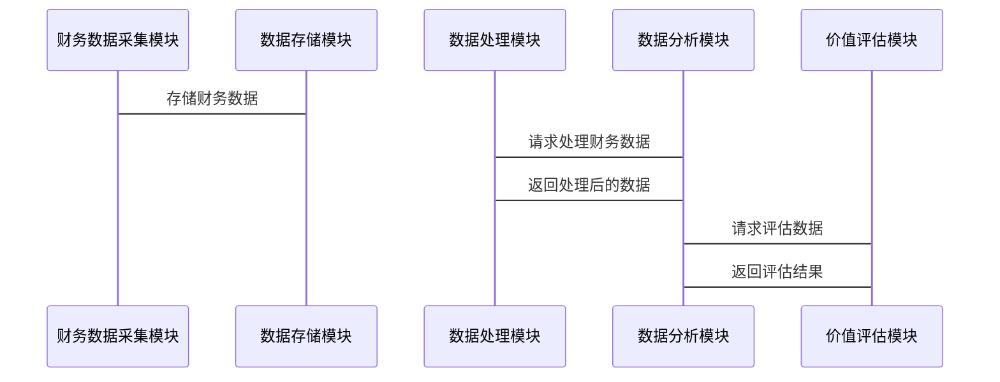

                 


# 如何计算一家公司的内在价值

> 关键词：公司内在价值，现金流折现法，市盈率法，市净率法，财务指标

> 摘要：本文将详细讲解如何计算一家公司的内在价值，涵盖多种方法如现金流折现法、市盈率法和市净率法，并结合实际案例进行分析，帮助读者掌握公司估值的核心技巧。

---

## 第一部分: 公司内在价值的定义与背景

### 第1章: 公司内在价值的定义与背景

#### 1.1 什么是公司内在价值

公司内在价值是指一家公司基于其未来现金流的现值所代表的公平市场价格。它反映了公司的真实价值，与市场估值不同，不受短期市场波动的影响。内在价值是投资者在进行投资决策时的重要参考，帮助他们判断一家公司的股票是否被高估或低估。

#### 1.2 内在价值计算的背景与意义

在金融市场中，股票价格经常受到短期因素如市场情绪、宏观经济环境等的影响，导致其偏离公司的实际价值。内在价值计算帮助投资者识别出那些被市场低估或高估的公司，从而做出更明智的投资决策。此外，企业也可以通过内在价值计算来评估自身的财务状况，优化资本结构，制定合理的股息政策。

---

## 第二部分: 内在价值计算的核心概念

### 第2章: 财务指标与价值评估

#### 2.1 财务报表基础

要计算公司的内在价值，首先需要了解公司的财务报表，包括利润表、资产负债表和现金流量表。这些报表提供了公司过去的财务状况和经营成果，是计算内在价值的重要依据。

#### 2.2 主要财务指标及其计算公式

以下是几种常用的财务指标及其计算公式：

- **净利润率**：净利润 / 营业收入  
- **总资产周转率**：营业收入 / 平均总资产  
- **ROE（净资产收益率）**：净利润 / 平均股东权益  

#### 2.3 财务指标在价值评估中的应用

财务指标可以帮助我们评估公司的盈利能力、资产使用效率和股东回报率。例如，高净利润率和高ROE通常意味着公司具有较强的盈利能力，可能具有较高的内在价值。

### 第3章: 现金流与折现模型

#### 3.1 现金流的基本概念

现金流是指公司在一定时期内产生的现金流入和流出。主要包括经营活动现金流、投资活动现金流和筹资活动现金流。

#### 3.2 现金流折现模型（DCF）的原理

现金流折现模型是计算公司内在价值的核心方法。其基本思想是将公司未来的所有现金流折现到现在，以反映其当前的内在价值。公式如下：

$$
\text{内在价值} = \sum_{t=1}^{n} \frac{\text{现金流}_t}{(1 + r)^t} + \frac{\text{残值}}{(1 + r)^n}
$$

其中，\( r \) 是折现率，\( n \) 是预测的年数，\( \text{现金流}_t \) 是第 \( t \) 年的现金流，残值是第 \( n \) 年后的剩余价值。

#### 3.3 折现率的确定与影响

折现率通常使用公司的加权平均资本成本（WACC）作为基准。WACC的计算公式为：

$$
\text{WACC} = w_d \times k_d + w_e \times k_e
$$

其中，\( w_d \) 和 \( w_e \) 分别是债务和股权的权重，\( k_d \) 和 \( k_e \) 分别是债务和股权的资本成本。

### 第4章: 股权价值与企业价值的关系

#### 4.1 股权价值的定义

股权价值是指公司所有股东权益的总价值，通常可以通过现金流折现法计算得出。

#### 4.2 企业价值的定义

企业价值是指公司整体的市场价值，包括股权价值和债务价值之和。

#### 4.3 股权价值与企业价值的差异

股权价值仅考虑股东的权益，而企业价值则涵盖了所有债权人的权益。因此，在计算企业价值时，需要考虑公司的债务结构和资本成本。

---

## 第三部分: 内在价值计算的方法

### 第5章: 市盈率法

#### 5.1 市盈率的定义与计算

市盈率（P/E）是股票价格与每股收益（EPS）的比率，公式为：

$$
\text{市盈率} = \frac{\text{股票价格}}{\text{每股收益}}
$$

#### 5.2 市盈率法的应用步骤

1. 计算公司每股收益（EPS）。
2. 找出同行业可比公司的平均市盈率。
3. 用可比公司的平均市盈率乘以公司的EPS，得出股票的理论价值。

#### 5.3 市盈率法的优缺点

优点：简单易用，适用于比较不同公司的相对价值。

缺点：受行业特性和公司具体情况的影响较大，可能无法准确反映公司的内在价值。

### 第6章: 市净率法

#### 6.1 市净率的定义与计算

市净率（P/B）是股票价格与每股净资产（BPS）的比率，公式为：

$$
\text{市净率} = \frac{\text{股票价格}}{\text{每股净资产}}
$$

#### 6.2 市净率法的应用步骤

1. 计算公司每股净资产（BPS）。
2. 找出同行业可比公司的平均市净率。
3. 用可比公司的平均市净率乘以公司的BPS，得出股票的理论价值。

#### 6.3 市净率法的优缺点

优点：适用于净资产较多的公司，尤其是在金融、房地产等行业。

缺点：同样受行业特性和公司具体情况的影响较大。

### 第7章: 现金流折现法

#### 7.1 DCF模型的基本原理

现金流折现法是通过预测公司未来现金流并折现到现在，来计算公司的内在价值。

#### 7.2 自由现金流的计算

自由现金流（FCF）是指公司在偿还债务和再投资所需资金后的剩余现金流。计算公式为：

$$
\text{自由现金流} = \text{净利润} + \text{折旧} + \text{摊销} - \text{资本支出}
$$

#### 7.3 折现率的确定与影响

折现率通常使用WACC作为基准，WACC的计算需要考虑公司的资本结构、债务成本、股权成本以及税率等因素。

---

## 第四部分: 内在价值计算的高级方法

### 第8章: 股权自由现金流模型

#### 8.1 股权自由现金流的定义

股权自由现金流是指公司扣除所有支出后，可用于股东分配的剩余现金流。

#### 8.2 股权自由现金流模型的构建

股权自由现金流模型的公式为：

$$
\text{股权内在价值} = \frac{\text{股权自由现金流}_1}{(r - g)} + \frac{\text{残值}}{(1 + r)^n}
$$

其中，\( r \) 是股权资本成本，\( g \) 是股权自由现金流的永续增长率，\( n \) 是预测期数。

#### 8.3 模型的应用与案例分析

通过实际案例分析，展示股权自由现金流模型的应用步骤和计算过程。

### 第9章: 企业整体价值评估模型

#### 9.1 企业整体价值的定义

企业整体价值是指公司全部资产的市场价值，包括股权价值和债务价值之和。

#### 9.2 整体价值评估模型的构建

整体价值评估模型的公式为：

$$
\text{企业内在价值} = \text{股权内在价值} + \text{债务价值}
$$

#### 9.3 模型的应用与案例分析

通过实际案例分析，展示整体价值评估模型的应用步骤和计算过程。

### 第10章: 股权分拆与价值重估

#### 10.1 股权分拆的定义与方法

股权分拆是指将公司整体价值分解为股权价值的过程。

#### 10.2 股权价值重估的步骤

1. 计算公司的整体价值。
2. 确定债务的市场价值。
3. 将整体价值减去债务价值，得到股权价值。

#### 10.3 股权分拆与价值重估的案例分析

通过实际案例分析，展示股权分拆与价值重估的过程和结果。

---

## 第五部分: 内在价值计算的系统架构

### 第11章: 价值评估系统的功能模块

#### 11.1 数据采集模块

数据采集模块负责收集公司的财务数据、市场数据和行业数据。

#### 11.2 数据处理模块

数据处理模块对收集到的数据进行清洗、转换和存储。

#### 11.3 价值评估模块

价值评估模块根据不同的方法计算公司的内在价值，并生成评估报告。

### 第12章: 系统架构设计

#### 12.1 领域模型（mermaid 类图）



#### 12.2 系统架构图（mermaid 架构图）


#### 12.3 系统交互图（mermaid 序列图）



---

## 第六部分: 项目实战

### 第13章: 环境安装与系统实现

#### 13.1 环境安装

安装所需的软件和工具，如Python、Pandas、NumPy、Matplotlib等。

#### 13.2 核心实现源代码

以下是一个简单的现金流折现模型的Python代码示例：

```python
import numpy as np

def calculate_intrinsic_value(cash_flows, discount_rate, residual_value, n):
    intrinsic_value = 0
    for t in range(1, n+1):
        cash_flow = cash_flows[t-1]
        intrinsic_value += cash_flow / (1 + discount_rate)**t
    intrinsic_value += residual_value / (1 + discount_rate)**n
    return intrinsic_value

# 示例数据
cash_flows = [100, 150, 200, 250, 300]
discount_rate = 0.1
residual_value = 500
n = 5

intrinsic_value = calculate_intrinsic_value(cash_flows, discount_rate, residual_value, n)
print(f"内在价值为：{intrinsic_value}")
```

#### 13.3 案例分析与代码解读

通过实际案例分析，解读代码的实现过程和结果。

### 第14章: 项目小结与注意事项

#### 14.1 项目小结

总结项目的主要内容和实现过程，强调内在价值计算的重要性和应用价值。

#### 14.2 注意事项

提醒读者在实际操作中需要注意的问题，如数据的准确性、模型的适用性等。

---

## 第七部分: 最佳实践与拓展阅读

### 第15章: 内在价值计算的最佳实践

#### 15.1 理论与实践的结合

建议读者在实际操作中结合多种方法，如DCF、市盈率法和市净率法，以获得更准确的估值。

#### 15.2 持续学习与知识更新

提醒读者持续关注财务和投资领域的最新动态，不断提升自己的专业知识和技能。

### 第16章: 拓展阅读与工具推荐

#### 16.1 拓展阅读

推荐一些经典的财务和投资书籍，如《投资学》（书籍名称）、《财务报表分析》（书籍名称）等。

#### 16.2 工具推荐

推荐一些常用的财务分析工具，如Excel、Python、Matplotlib等。

---

## 作者信息

作者：AI天才研究院/AI Genius Institute & 禅与计算机程序设计艺术 /Zen And The Art of Computer Programming

