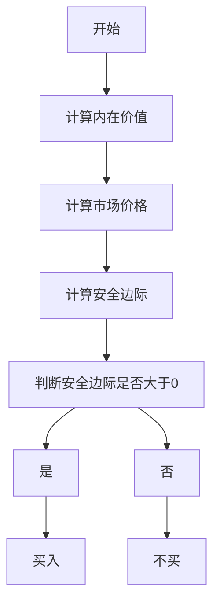
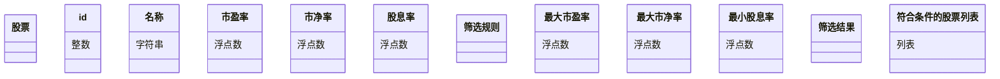

                 


# 如何识别被低估的股票：格雷厄姆的筛选方法

> **关键词**：股票分析、价值投资、格雷厄姆、筛选方法、投资策略

> **摘要**：本文详细介绍了如何利用格雷厄姆的筛选方法识别被低估的股票。从价值投资的基本概念到具体的筛选指标和数学模型，再到实际的系统设计和项目实战，本文为读者提供了全面的指导。通过本文，读者可以掌握格雷厄姆的选股方法，并在实际投资中应用这些策略。

---

## 第一部分：价值投资的背景与格雷厄姆理论

### 第1章：价值投资的背景与格雷厄姆理论概述

#### 1.1 价值投资的定义与核心理念

- **1.1.1 价值投资的定义**  
  价值投资是一种以企业内在价值为核心的投资策略，强调以低于内在价值的价格买入优质股票，长期持有，获得超额收益。

- **1.1.2 价值投资的核心理念**  
  格雷厄姆的价值投资理念强调安全边际、_margin of safety_，即以低于内在价值的价格买入股票，以降低投资风险并确保长期收益。

- **1.1.3 格雷厄姆在价值投资中的地位**  
  格雷厄姆被誉为价值投资之父，其理论奠定了现代价值投资的基础，影响了巴菲特等众多投资大师。

---

#### 1.2 格雷厄姆的投资理念

- **1.2.1 格雷厄姆的投资哲学**  
  格雷厄姆认为，市场先生是疯狂的，股价波动与企业价值无关，投资者应关注企业的内在价值而非市场情绪。

- **1.2.2 安全边际的概念**  
  安全边际 = 内在价值 - 市场价格，是格雷厄姆选股的核心原则之一，确保在买入股票时有足够的安全空间。

- **1.2.3 价值与价格的区分**  
  格雷厄姆强调区分股票的内在价值和市场价格，认为市场价格波动是暂时的，而内在价值是长期稳定的。

---

#### 1.3 格雷厄姆的选股方法

- **1.3.1 基本面分析的重要性**  
  格雷厄姆认为，基本面分析是选股的关键，重点关注企业的财务状况、盈利能力、成长性和分红能力。

- **1.3.2 企业内在价值的评估**  
  内在价值是企业未来现金流的现值，计算公式如下：
  $$ V = \frac{E}{(1 + r)^n} $$
  其中，\( V \) 为内在价值，\( E \) 为未来现金流，\( r \) 为折现率，\( n \) 为时间跨度。

- **1.3.3 如何避免投资陷阱**  
  格雷厄姆强调避免情绪化投资，注重数据和事实，选择那些市场先生情绪低落时被低估的股票。

---

## 第二部分：格雷厄姆的筛选方法与指标

### 第2章：格雷厄姆的筛选方法

#### 2.1 格雷厄姆筛选方法的核心步骤

- **2.1.1 确定投资目标**  
  明确投资目标，包括投资期限、风险承受能力和收益预期。

- **2.1.2 基本面分析**  
  通过财务报表分析企业的盈利能力、成长性、财务状况和分红能力。

- **2.1.3 估值与安全边际**  
  计算股票的内在价值，对比市场价格，寻找具有安全边际的股票。

---

#### 2.2 格雷厄姆的筛选指标

- **2.2.1 市盈率（P/E）分析**  
  市盈率 = 股价 / 每股收益，用于衡量股票价格相对于收益的高低。

- **2.2.2 市净率（P/B）分析**  
  市净率 = 股价 / 每股净资产，用于衡量股票价格相对于资产的高低。

- **2.2.3 股息率与股息支付率**  
  股息率 = 每股股息 / 股价，股息支付率 = 股息 / 净利润，用于衡量企业的分红能力。

---

#### 2.3 格雷厄姆的筛选公式与计算

- **2.3.1 内在价值计算公式**  
  $$ V = \frac{E}{(1 + r)^n} $$

- **2.3.2 安全边际计算方法**  
  安全边际 = 内在价值 - 市场价格。

- **2.3.3 其他辅助指标**  
  包括ROE（净资产收益率）、ROA（资产收益率）、债务率等。

---

## 第三部分：数学模型与算法原理

### 第3章：格雷厄姆筛选方法的数学模型

#### 3.1 内在价值的计算公式

$$ V = \frac{E}{(1 + r)^n} $$

其中，\( E \) 为未来现金流，\( r \) 为折现率，\( n \) 为时间跨度。

---

#### 3.2 安全边际的计算

$$ \text{安全边际} = V - P $$

其中，\( V \) 为内在价值，\( P \) 为市场价格。

---

#### 3.3 格雷厄姆筛选方法的流程图



---

## 第四部分：系统分析与架构设计

### 第4章：系统分析与架构设计方案

#### 4.1 项目介绍

- 项目名称：基于格雷厄姆筛选方法的投资系统。
- 项目目标：通过自动化筛选，识别被低估的股票。

---

#### 4.2 系统功能设计

- **领域模型（Mermaid 类图）**



---

#### 4.3 系统架构设计

- **架构图（Mermaid 架构图）**


---

## 第五部分：项目实战

### 第5章：项目实战

#### 5.1 环境安装

- 安装Python和相关库：
  ```bash
  pip install pandas numpy matplotlib
  ```

---

#### 5.2 核心实现源代码

```python
import pandas as pd

def calculate_intrinsic_value(earnings, discount_rate, years):
    return earnings / (1 + discount_rate) ** years

def greaham_screen(stocks, max_pe, max_pb, min_dividend):
    screened_stocks = []
    for stock in stocks:
        if (stock.pe <= max_pe and
            stock.pb <= max_pb and
            stock.dividend_yield >= min_dividend):
            screened_stocks.append(stock)
    return screened_stocks
```

---

#### 5.3 案例分析

- 数据来源：假设我们从某家数据供应商获取股票数据。
- 数据处理：计算每只股票的市盈率、市净率和股息率。
- 筛选过程：根据设定的筛选规则，筛选出符合条件的股票。
- 结果分析：分析筛选出的股票，评估其安全边际和投资潜力。

---

## 第六部分：最佳实践与小结

### 第6章：最佳实践与小结

#### 6.1 最佳实践

- 定期更新筛选规则，适应市场变化。
- 结合多种筛选指标，提高筛选结果的准确性。
- 长期持有，避免频繁交易。

---

#### 6.2 小结

格雷厄姆的筛选方法是一种行之有效的投资策略，通过基本面分析和安全边际筛选，帮助投资者识别被低估的股票，实现长期稳定的收益。

---

## 作者信息

作者：AI天才研究院/AI Genius Institute & 禅与计算机程序设计艺术 /Zen And The Art of Computer Programming

