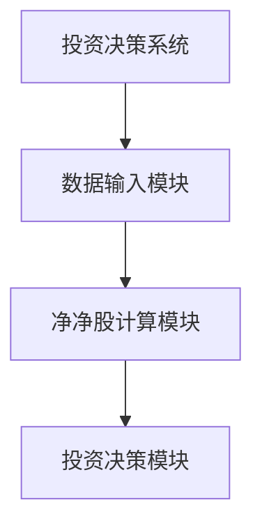

                 


# 如何运用格雷厄姆的净净股策略进行投资

> 关键词：格雷厄姆、净净股、价值投资、安全边际、股票估值、投资策略

> 摘要：本文详细介绍了格雷厄姆的净净股策略，从投资基础到策略的具体实施，结合数学模型、系统架构设计和实际案例，深入分析了如何运用这一策略进行投资。文章内容涵盖核心概念、计算方法、策略优化、系统分析以及实战应用，旨在为投资者提供全面的指导。

---

## 第1章: 投资基础与价值投资概述

### 1.1 投资的基本概念

#### 1.1.1 投资的定义与分类
投资是指将资金投入到某种资产或项目中，以期望在未来获得收益或资本增值。投资可以分为以下几类：
- **股票投资**：购买公司股份，成为股东。
- **债券投资**：购买政府或企业发行的债券，定期获得利息。
- **房地产投资**：购买土地或房产，用于出租或增值。
- **其他投资**：包括艺术品、黄金等。

#### 1.1.2 价值投资的起源与发展
价值投资是一种投资策略，强调以低于内在价值的价格购买优质资产。该策略由本杰明·格雷厄姆和戴维·多德共同提出，并在《证券分析》一书中首次系统阐述。价值投资的核心是寻找市场价格低于内在价值的股票。

#### 1.1.3 格雷厄姆与巴菲特的价值投资理念
格雷厄姆的学生巴菲特继承并发展了价值投资理论，强调长期持有优质股票，追求 compound growth。格雷厄姆的价值投资理念强调安全边际和企业基本面分析，而巴菲特则更注重企业的竞争优势和长期盈利能力。

### 1.2 格雷厄姆的生平与贡献

#### 1.2.1 格雷厄姆的学术背景
格雷厄姆（Benjamin Graham）是20世纪著名的投资学家，被誉为“价值投资之父”。他在哥伦比亚大学教授证券分析，并培养了包括巴菲特在内的众多投资大师。

#### 1.2.2 格雷厄姆的投资思想
格雷厄姆强调以低于企业净资产价值的价格购买股票，注重企业的基本面分析，尤其是企业的负债和资产状况。他提出的“净净股”概念是价值投资的核心工具之一。

#### 1.2.3 格雷厄姆与巴菲特的师徒关系
格雷厄姆的学生巴菲特将价值投资理念发扬光大，成为全球著名投资者。格雷厄姆的投资思想对巴菲特的影响深远，巴菲特后来总结道：“格雷厄姆教会我如何思考，而我则教会他如何行动。”

### 1.3 净净股策略的背景与意义

#### 1.3.1 什么是净净股
净净股是指在计算股票价值时，只考虑企业的核心资产（如现金、应收账款等）而不考虑其他资产的价值。通过净净股策略，投资者可以评估企业的真实价值，从而避免市场波动对投资决策的影响。

#### 1.3.2 净净股策略的核心思想
格雷厄姆认为，股票的内在价值是企业未来现金流的现值，而净净股策略则通过计算企业核心资产的价值来评估股票的最低合理价格。

#### 1.3.3 净净股策略在现代投资中的应用
尽管现代投资学引入了更多的评估方法，如市盈率和现金流折现法，但净净股策略仍然是价值投资的重要工具，尤其是在评估低增长企业的价值时表现尤为突出。

### 1.4 本章小结
本章介绍了投资的基本概念、价值投资的起源与发展，以及格雷厄姆的投资思想和净净股策略的背景与意义。通过这些内容，读者可以理解净净股策略在价值投资中的重要性。

---

## 第2章: 净净股策略的核心概念与原理

### 2.1 净净股的定义与计算方法

#### 2.1.1 净净股的定义
净净股是通过将企业的核心资产价值（如现金、应收账款等）除以发行在外的普通股股数计算得出的每股价值。公式为：
$$ \text{净净股} = \frac{\text{核心资产总值}}{\text{普通股股数}} $$

#### 2.1.2 净净股的计算公式
以下是净净股的计算步骤：
1. 确定企业的核心资产，如现金、应收账款、存货等。
2. 计算这些核心资产的总值。
3. 将总值除以普通股股数，得到每股净净股价值。

#### 2.1.3 净净股与账面价值的区别
净净股与账面价值的主要区别在于：
- 净净股只考虑核心资产的价值。
- 账面价值包括所有资产的价值。

通过表格对比，可以更清晰地理解两者的区别：

| 特性             | 净净股             | 账面价值         |
|------------------|--------------------|------------------|
| 计算基础         | 核心资产           | 所有资产         |
| 适用场景         | 评估低增长企业     | 评估企业整体价值 |
| 突出优势         | 突出核心资产价值   | 突出整体资产状况 |

### 2.2 净净股策略的理论基础

#### 2.2.1 格雷厄姆的价值评估模型
格雷厄姆的价值评估模型基于以下假设：
- 股票的内在价值是企业未来现金流的现值。
- 投资者应以低于内在价值的价格购买股票。

模型公式为：
$$ \text{内在价值} = \sum_{t=1}^{n} \frac{\text{未来现金流}}{(1 + r)^t} $$
其中，\( r \) 是折现率。

#### 2.2.2 净净股策略的数学模型
净净股策略的数学模型如下：
$$ \text{每股净净股} = \frac{\text{核心资产总值}}{\text{普通股股数}} $$

#### 2.2.3 净净股策略的经济学原理
净净股策略的核心经济学原理是价格与价值的背离。当市场价格低于净净股价值时，股票具有投资价值。

### 2.3 净净股策略的核心要素

#### 2.3.1 企业基本面分析
企业基本面分析包括：
1. 收入与利润分析
2. 资产与负债分析
3. 现金流量分析

#### 2.3.2 财务报表的关键指标
关键指标包括：
- 净利润
- 每股收益
- 资产负债率

#### 2.3.3 市场波动与安全边际
安全边际是指市场价格低于净净股价值的部分。公式为：
$$ \text{安全边际} = \text{净净股价值} - \text{市场价格} $$

#### 2.3.4 净净股策略与其他价值投资策略的对比
以下是几种常见价值投资策略的对比表格：

| 策略名称 | 适用场景       | 计算方法             |
|----------|----------------|----------------------|
| 净净股   | 低增长企业     | 核心资产 / 普通股股数 |
| 市盈率   | 成长型企业     | 市盈率 = 价格 / 每股收益 |
| 市净率   | 周期性行业     | 市净率 = 价格 / 每股净资产 |

### 2.4 本章小结
本章详细介绍了净净股的定义、计算方法以及与账面价值的区别，分析了格雷厄姆的价值评估模型，并比较了不同价值投资策略的优劣。

---

## 第3章: 净净股策略的数学模型与公式

### 3.1 净净股计算的数学公式

#### 3.1.1 净净股公式
$$ \text{净净股} = \frac{\text{核心资产总值}}{\text{普通股股数}} $$

#### 3.1.2 净净股与股价的关系
$$ \text{股价} \leq \text{每股净资产} \times (1 + \text{安全边际}) $$

### 3.2 格雷厄姆的价值评估模型

#### 3.2.1 内在价值公式
$$ \text{内在价值} = \sum_{t=1}^{n} \frac{C_t}{(1 + r)^t} $$
其中，\( C_t \) 是第 \( t \) 年的现金流，\( r \) 是折现率。

#### 3.2.2 安全边际的计算
$$ \text{安全边际} = \text{内在价值} - \text{市场价格} $$

### 3.3 净净股策略的优化与调整

#### 3.3.1 财务杠杆对净值的影响
$$ \text{杠杆效应} = \frac{\text{债务}}{\text{股东权益}} $$

#### 3.3.2 市场波动对股价的影响
$$ \text{股价波动} = \text{市场情绪} + \text{宏观经济因素} $$

#### 3.3.3 安全边际的动态调整
根据市场变化，动态调整安全边际：
$$ \text{调整后安全边际} = \text{原安全边际} \times \text{调整系数} $$

### 3.4 本章小结
本章通过数学公式详细解释了净净股策略的计算方法和内在逻辑，同时分析了如何通过动态调整安全边际来应对市场变化。

---

## 第4章: 净净股策略的系统分析与架构设计

### 4.1 投资系统的整体架构

#### 4.1.1 系统目标
- 计算企业核心资产价值
- 评估股票的内在价值
- 确定投资机会

#### 4.1.2 系统功能模块
- 数据输入模块
- 净净股计算模块
- 投资决策模块

#### 4.1.3 系统架构图（Mermaid）


### 4.2 投资决策的流程设计

#### 4.2.1 确定投资目标
- 确定投资期限和风险承受能力
- 明确投资目标企业类型

#### 4.2.2 企业基本面分析
- 收入与利润分析
- 资产与负债分析
- 现金流量分析

#### 4.2.3 估值与安全边际计算
- 计算净净股价值
- 确定市场价格
- 计算安全边际

### 4.3 系统接口设计

#### 4.3.1 数据输入接口
- 输入企业的财务数据
- 输入市场数据

#### 4.3.2 计算模块接口
- 计算净净股价值
- 计算安全边际

#### 4.3.3 结果输出接口
- 输出投资建议
- 输出投资风险评估

### 4.4 本章小结
本章通过系统架构设计和流程分析，详细介绍了如何运用净净股策略进行投资决策。

---

## 第5章: 净净股策略的项目实战

### 5.1 环境安装
- 安装Python编程环境
- 安装数据处理库（如Pandas、NumPy）

### 5.2 系统核心实现源代码

#### 5.2.1 净净股计算代码
```python
import pandas as pd

def calculate_net_net_value(asset_data, shares_outstanding):
    return asset_data.sum() / shares_outstanding
```

#### 5.2.2 安全边际计算代码
```python
def calculate_margin_of_safety(intrinsic_value, market_price):
    return intrinsic_value - market_price
```

### 5.3 代码应用解读与分析

#### 5.3.1 净净股计算
- 读取企业核心资产数据
- 计算每股净净股价值

#### 5.3.2 安全边际计算
- 确定市场价格
- 计算安全边际

### 5.4 实际案例分析

#### 5.4.1 案例背景
假设某企业核心资产价值为1000万元，普通股股数为100万股，市场价格为每股8元。

#### 5.4.2 计算过程
- 每股净净股价值：1000万 / 100万 = 10元
- 安全边际：10元 - 8元 = 2元

#### 5.4.3 投资决策
由于安全边际为2元，具有较高的投资价值。

### 5.5 本章小结
本章通过实际案例分析，详细展示了如何运用净净股策略进行投资决策。

---

## 第6章: 总结与展望

### 6.1 最佳实践 tips
- 确保计算数据的准确性
- 定期调整安全边际
- 长期持有优质股票

### 6.2 小结
本文详细介绍了格雷厄姆的净净股策略，从理论基础到实际应用，为投资者提供了全面的指导。

### 6.3 注意事项
- 避免过度依赖单一策略
- 注意宏观经济环境的影响
- 定期复盘投资组合

### 6.4 拓展阅读
- 《证券分析》——本杰明·格雷厄姆
- 《巴菲特传》——阿尔弗雷德·斯洛斯

---

## 作者：AI天才研究院/AI Genius Institute & 禅与计算机程序设计艺术 /Zen And The Art of Computer Programming

