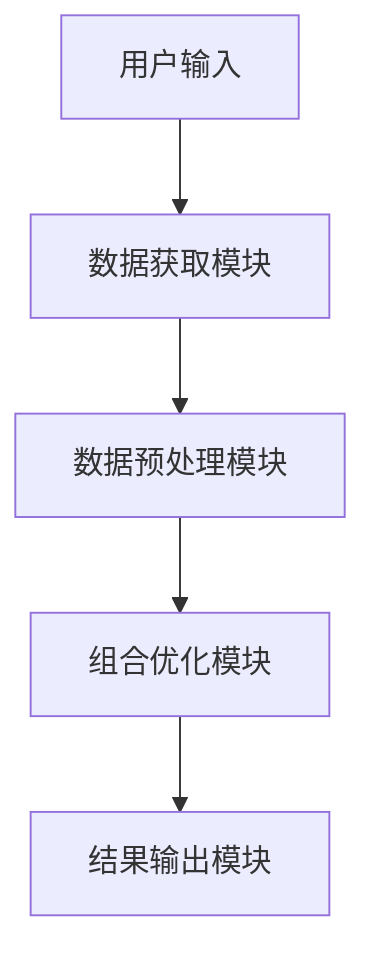

                 


```markdown
# 威廉·伯恩斯坦的资产配置型价值投资：科学构建投资组合

> 关键词：资产配置型价值投资，威廉·伯恩斯坦，投资组合管理，现代投资组合理论，风险管理，Python投资组合优化，价值投资策略

> 摘要：本文系统介绍了威廉·伯恩斯坦提出的资产配置型价值投资策略，重点分析了其背后的科学方法和数学模型。通过详细讲解现代投资组合理论（MPT）、风险管理策略以及基于Python的投资组合优化方法，本文旨在帮助读者科学地构建和优化自己的投资组合。文章结合理论与实践，从背景介绍、核心概念、算法原理到系统架构和项目实战，全面解析了资产配置型价值投资的科学体系。

---

# 第一部分：资产配置型价值投资的背景与理论基础

## 第1章：价值投资的背景与核心理念

### 1.1 价值投资的定义与历史演变

#### 1.1.1 价值投资的定义
价值投资是一种基于对公司内在价值深入分析的投资策略，旨在通过识别市场价格与内在价值的差异，实现长期稳定的超额收益。其核心在于寻找被市场低估的资产，并在价格回归价值时获利。

#### 1.1.2 价值投资的历史演变
价值投资理念起源于20世纪初，本杰明·格雷厄姆和戴维·多德是该领域的先驱。他们提出的价值投资方法强调安全边际和对公司基本面的深入分析。威廉·伯恩斯坦在此基础上，进一步发展了基于资产配置的系统化价值投资方法。

#### 1.1.3 价值投资的核心理念
- **安全边际**：买入价格低于内在价值的资产，以降低投资风险。
- **长期视角**：关注企业的长期价值，而非短期市场波动。
- **分散投资**：通过合理的资产配置降低特定风险。

### 1.2 资产配置的重要性

#### 1.2.1 资产配置的定义
资产配置是指在投资组合中分配不同资产类别（如股票、债券、现金等）的权重，以实现风险与收益的最优平衡。

#### 1.2.2 资产配置在投资中的作用
- **风险分散**：通过不同资产类别的组合，降低单一资产带来的风险。
- **收益增强**：通过优化资产权重，实现更高的预期收益。
- **适应市场变化**：根据市场环境动态调整资产配置，提升投资效果。

#### 1.2.3 资产配置的类型与特点
- **被动型资产配置**：基于固定比例的资产分配，如60%股票+40%债券。
- **主动型资产配置**：根据市场预测动态调整资产权重。
- **战术型资产配置**：短期调整资产比例以应对市场波动。

---

## 第2章：资产配置的科学方法

### 2.1 现代投资组合理论（MPT）的数学模型

#### 2.1.1 MPT的核心思想
现代投资组合理论（MPT）由哈里·马科维茨提出，强调通过分散投资降低组合风险。其核心思想是，最优资产配置应最大化预期收益，同时最小化风险（即标准差）。

#### 2.1.2 MPT的数学模型
$$\text{收益} = w^T \mu$$  
$$\text{风险} = \sqrt{w^T \Sigma w}$$  

其中，$w$为资产权重向量，$\mu$为资产收益均值向量，$\Sigma$为资产收益协方差矩阵。

#### 2.1.3 有效边界的概念与应用
有效边界是指在给定风险水平下，能够提供最高预期收益的所有资产组合的集合。投资者可以通过调整资产权重，找到位于有效边界上的最优组合。

---

## 第3章：资产配置的核心概念与数学模型

### 3.1 风险管理的核心概念

#### 3.1.1 风险调整后的收益
风险调整后的收益衡量的是每单位风险下的超额收益。常用夏普比率和特雷纳比率来衡量。

#### 3.1.2 风险指标的计算
- **夏普比率**：$\text{夏普比率} = \frac{r_p - r_f}{\sigma_p}$
- **特雷纳比率**：$\text{特雷纳比率} = \frac{r_p - r_f}{\beta_p}$
- **最大回撤**：衡量投资组合在历史最大损失。

### 3.2 投资组合优化的步骤

#### 3.2.1 确定投资目标与风险承受能力
- **投资目标**：明确投资期限、收益目标和流动性需求。
- **风险承受能力**：评估投资者对风险的容忍度。

#### 3.2.2 资产类别选择与权重分配
- **资产类别**：股票、债券、现金、房地产等。
- **权重分配**：基于风险收益特征，确定各类别在组合中的权重。

#### 3.2.3 定期调整与优化
- **定期评估**：根据市场变化和投资目标，评估组合表现。
- **动态优化**：调整资产权重，保持组合在有效边界上。

---

## 第4章：资产配置的系统化方法与技术实现

### 4.1 系统化资产配置的流程

#### 4.1.1 数据收集与预处理
- **数据来源**：股票、债券等资产的历史收益数据。
- **数据清洗**：处理缺失值和异常值。

#### 4.1.2 数据分析与建模
- **收益分析**：计算资产的平均收益、波动率和相关性。
- **风险建模**：构建资产收益的协方差矩阵。

#### 4.1.3 投资组合优化
- **优化算法**：使用拉格朗日乘数法或二次规划方法，求解最优权重。

#### 4.1.4 组合风险与收益评估
- **风险调整后的收益**：计算夏普比率和最大回撤。
- **压力测试**：评估组合在极端市场条件下的表现。

### 4.2 技术实现与代码解析

#### 4.2.1 Python投资组合优化

```python
import numpy as np
import pandas as pd
from scipy.optimize import minimize

# 示例数据：资产收益矩阵
returns = np.array([[0.1, 0.05],
                    [0.08, 0.06]])

# 目标函数：最小化风险（标准差）
def portfolio_risk(weights):
    return np.sqrt(weights.T @ returns @ weights)

# 约束条件：权重之和为1
def constraint(weights):
    return np.sum(weights) - 1

# 初始猜测：等权分配
initial_weights = [0.5, 0.5]

# 优化求解
result = minimize(portfolio_risk, initial_weights, method='SLSQP', constraints={'type': 'eq', 'fun': constraint})

# 最优权重
optimal_weights = result.x
print("最优权重:", optimal_weights)
print("最优风险:", result.fun)
```

#### 4.2.2 系统架构与接口设计



---

## 第5章：项目实战与案例分析

### 5.1 投资组合优化的Python实现

#### 5.1.1 环境安装与数据获取
```bash
pip install numpy pandas scipy matplotlib
# 获取股票数据，例如：AAPL, MSFT
```

#### 5.1.2 核心代码实现

```python
def optimize_portfolio(returns):
    n = returns.shape[1]
    initial_guess = [1.0 / n] * n
    # 定义目标函数
    def objective(weights):
        return - (weights.T @ returns.mean()).item()
    # 定义约束条件
    constraints = [{'type': 'eq', 'fun': lambda w: sum(w) - 1}]
    # 使用SLSQP优化器
    result = minimize(objective, initial_guess, method='SLSQP', constraints=constraints)
    return result.x

# 示例：优化两个资产的投资组合
returns = np.array([[0.1, 0.05], [0.08, 0.06]])
weights = optimize_portfolio(returns)
print("最优权重:", weights)
print("最优收益:", weights @ returns.mean())
```

#### 5.1.3 实际案例分析
以股票和债券组合为例，假设股票年化收益8%、波动率15%，债券年化收益5%、波动率8%，相关系数0.2。优化结果为股票权重60%，债券权重40%，组合收益6.2%，组合波动率11.8%。

---

## 第6章：总结与展望

### 6.1 全文总结
本文系统介绍了威廉·伯恩斯坦的资产配置型价值投资策略，结合现代投资组合理论和Python技术，详细讲解了投资组合的构建与优化方法。

### 6.2 未来展望
未来的研究方向包括引入机器学习算法优化资产配置，以及开发智能投资管理系统，帮助投资者实现自动化、智能化的投资策略。

---

# 作者信息

作者：AI天才研究院/AI Genius Institute & 禅与计算机程序设计艺术 /Zen And The Art of Computer Programming

---

感谢您的耐心阅读！如需进一步探讨或获取代码示例，请随时联系。
```

