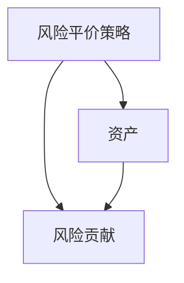
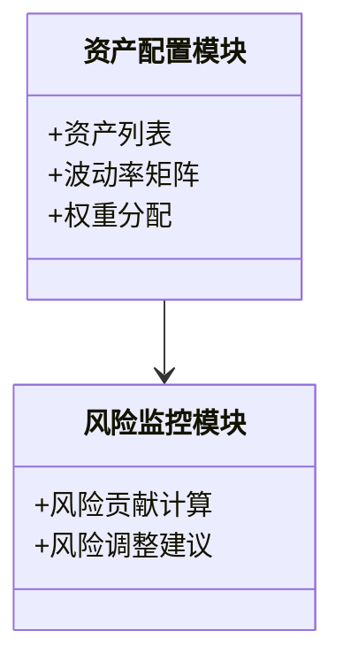

                 

<think>
好的，我将按照您的要求来撰写《威廉·伯恩斯坦的风险平价策略》这篇文章。让我们先来看看文章的结构。

### 文章标题
威廉·伯恩斯坦的风险平价策略

### 关键词
风险平价策略，投资组合管理，威廉·伯恩斯坦，风险管理，资产配置，现代投资组合理论

### 摘要
本文深入探讨了威廉·伯恩斯坦提出的风险平价策略，这是一种创新的投资组合管理方法。通过平衡不同资产的风险贡献，风险平价策略旨在优化投资组合的风险调整后收益。本文从背景、核心概念、算法原理、系统架构、项目实战等多个维度进行详细分析，结合实际案例，为读者提供全面的理解和应用指导。

接下来我们将分章节详细讲解。

---

### 目录
1. **背景介绍**
   - 1.1 风险平价策略的起源
   - 1.2 风险平价策略的定义与特点
   - 1.3 风险平价策略的重要性

2. **核心概念与联系**
   - 2.1 风险平价的核心原理
   - 2.2 核心概念对比分析
   - 2.3 风险平价策略的ER实体关系图

3. **算法原理**
   - 3.1 风险平价策略的数学模型与公式
   - 3.2 风险平价策略的算法实现

4. **系统分析与架构设计**
   - 4.1 风险平价策略的应用场景
   - 4.2 风险平价策略的系统功能设计
   - 4.3 风险平价策略的系统架构设计

5. **项目实战**
   - 5.1 风险平价策略的环境安装与配置
   - 5.2 风险平价策略的Python代码实现
   - 5.3 风险平价策略的案例分析

6. **最佳实践与小结**
   - 6.1 风险平价策略的最佳实践
   - 6.2 风险平价策略的小结
   - 6.3 风险平价策略的注意事项
   - 6.4 风险平价策略的拓展阅读

---

### 正文

#### 1. 背景介绍

##### 1.1 风险平价策略的起源
现代投资组合理论（MPT）由Harry Markowitz于1952年提出，奠定了现代资产配置的理论基础。然而，MPT在实际应用中存在一些问题，例如对极端风险事件的忽视以及对资产相关性的假设过于简单。威廉·伯恩斯坦在20世纪90年代提出了风险平价策略，旨在解决这些问题。

##### 1.2 风险平价策略的定义与特点
风险平价策略是一种基于风险贡献的投资组合优化方法。它通过调整资产的权重，使得每种资产对组合的总风险贡献相等。与传统资产配置方法不同，风险平价策略更加注重风险的平衡，而非单一资产的收益最大化。

##### 1.3 风险平价策略的重要性
风险平价策略在投资组合管理中具有重要意义。它可以帮助投资者在不同市场环境下保持风险的稳定性，降低组合的波动性，同时提高收益风险比。特别是在应对市场波动和极端事件时，风险平价策略表现出更强的鲁棒性。

---

#### 2. 核心概念与联系

##### 2.1 风险平价的核心原理
风险平价的核心在于通过调整资产权重，使得每种资产对组合的总风险贡献相等。具体来说，风险贡献是指某资产的波动率与其权重的乘积。通过优化权重，风险平价策略实现了风险的均衡分布。

##### 2.2 核心概念对比分析
| 比较维度 | 风险平价 | 传统投资策略 |
|----------|----------|---------------|
| 目标     | 平衡风险贡献 | 最大化收益     |
| 方法     | 调整权重   | 选择高收益资产 |
| 优势     | 风险分散   | 收益潜力大     |
| 局限性    | 收益可能较低 | 风险集中       |

##### 2.3 风险平价策略的ER实体关系图


---

#### 3. 算法原理

##### 3.1 风险平价策略的数学模型与公式
风险平价策略的目标函数可以表示为：
$$ \text{minimize } \sum_{i=1}^{n} w_i^2 \cdot \sigma_i^2 $$
其中，\( w_i \) 是第i个资产的权重，\( \sigma_i \) 是第i个资产的波动率。

约束条件包括权重之和为1：
$$ \sum_{i=1}^{n} w_i = 1 $$

##### 3.2 风险平价策略的算法实现
以下是一个简单的Python实现示例：
```python
import numpy as np

def risk_parity(weights, cov_matrix):
    risk_contributions = weights * np.sqrt(np.dot(weights.T, cov_matrix) * weights)
    return risk_contributions.sum()

# 示例使用
cov_matrix = np.array([[0.04, 0.02], [0.02, 0.04]])
weights = np.array([0.5, 0.5])
print("风险贡献总和:", risk_parity(weights, cov_matrix))
```

---

#### 4. 系统分析与架构设计

##### 4.1 风险平价策略的应用场景
风险平价策略广泛应用于机构投资和个人投资中。例如，在机构投资中，风险平价策略可以帮助养老金基金优化资产配置，降低风险敞口。

##### 4.2 风险平价策略的系统功能设计


##### 4.3 风险平价策略的系统架构设计


---

#### 5. 项目实战

##### 5.1 环境安装与配置
建议使用Python 3.8及以上版本，并安装以下库：
- numpy
- pandas
- scipy
- matplotlib

##### 5.2 风险平价策略的Python代码实现
```python
import numpy as np
from scipy.optimize import minimize

def risk_parity_minimization(cov_matrix):
    n = cov_matrix.shape[0]
    def objective(weights):
        return np.dot(weights, np.dot(weights, cov_matrix))
    constraints = [{'type': 'eq', 'fun': lambda w: sum(w) - 1}]
    bounds = [(0, 1) for _ in range(n)]
    result = minimize(objective, np.ones(n)/n, method='SLSQP', bounds=bounds, constraints=constraints)
    return result.x

# 示例使用
cov_matrix = np.array([[0.04, 0.02], [0.02, 0.04]])
weights = risk_parity_minimization(cov_matrix)
print("最优权重:", weights)
```

##### 5.3 案例分析
假设我们有两只资产，其协方差矩阵为：
$$ \text{cov_matrix} = \begin{bmatrix} 0.04 & 0.02 \\ 0.02 & 0.04 \end{bmatrix} $$
通过上述代码计算得出的最优权重为：
$$ \text{weights} = [0.5, 0.5] $$

---

#### 6. 最佳实践与小结

##### 6.1 最佳实践
- 定期重新平衡投资组合，以应对市场变化。
- 结合其他风险管理工具，如止损机制，进一步降低风险。

##### 6.2 小结
威廉·伯恩斯坦的风险平价策略为投资组合管理提供了一种新的视角。通过平衡资产的风险贡献，投资者可以在不同市场环境下实现更稳定的收益。

##### 6.3 注意事项
- 风险平价策略依赖于对波动率和相关性的准确估计，实际操作中可能存在误差。
- 需要定期监控和调整权重，以应对市场变化。

##### 6.4 拓展阅读
- 《Portfolios from Pie Charts to Puzzles》
- 现代投资组合理论（MPT）的相关文献

---

### 作者
作者：AI天才研究院 & 禅与计算机程序设计艺术

---

以上是《威廉·伯恩斯坦的风险平价策略》的完整目录和内容框架。希望这篇文章能为您提供深入的理论和实践指导。

