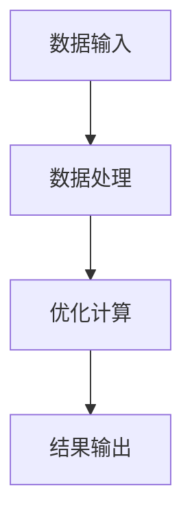
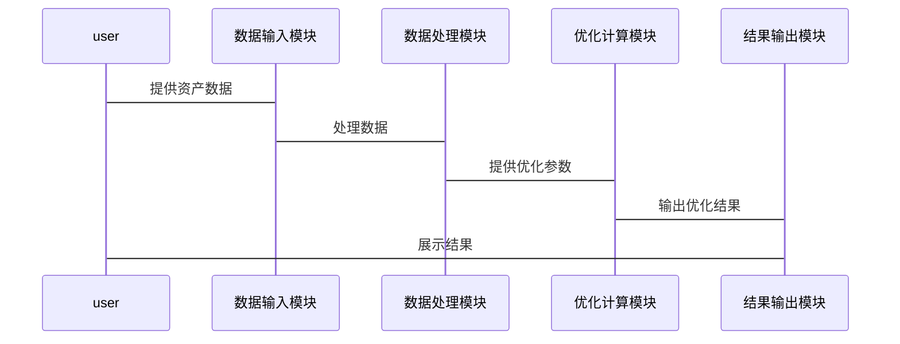

                 


# 威廉·伯恩斯坦的高效投资组合构建

> 关键词：投资组合，现代投资组合理论，优化算法，系统架构，风险管理

> 摘要：本文详细介绍了威廉·伯恩斯坦的高效投资组合构建方法，从理论基础到实际应用，结合数学模型和算法实现，系统地阐述了投资组合构建的全过程。通过本文的学习，读者可以掌握如何科学地构建高效的投资组合，实现风险可控下的收益最大化。

---

## 第一部分: 投资组合构建的背景与基础

### 第1章: 投资组合构建的背景与概念

#### 1.1 投资组合的基本概念
##### 1.1.1 什么是投资组合
投资组合是指将一定资金分配到不同的资产或资产类别中，以分散风险并实现收益最大化的一种投资方式。投资组合的核心在于通过资产配置和风险控制，平衡收益与风险。

##### 1.1.2 投资组合的目标与意义
投资组合的目标是实现资产的长期稳健增长，同时控制风险。通过合理配置不同资产，投资者可以在市场波动中保持资产的稳定性，避免单一资产带来的高风险。

##### 1.1.3 投资组合的核心要素
投资组合的核心要素包括：
1. **资产配置**：决定投资组合中各类资产的权重。
2. **风险控制**：通过分散投资降低非系统性风险。
3. **收益目标**：设定合理的收益预期并进行动态调整。

#### 1.2 投资组合构建的背景与发展
##### 1.2.1 投资组合的起源
投资组合的概念起源于20世纪30年代，Harry Markowitz提出的现代投资组合理论（MPT）奠定了投资组合构建的理论基础。

##### 1.2.2 现代投资组合理论（MPT）的提出
MPT的核心思想是通过优化资产配置，构建一个在既定风险下收益最大的投资组合，或在既定收益下风险最小的投资组合。

##### 1.2.3 投资组合构建的演变
随着金融市场的不断发展，投资组合构建逐渐从理论走向实践，引入了更多数学模型和优化算法。

---

### 第2章: 投资组合构建的核心概念与联系

#### 2.1 现代投资组合理论（MPT）原理
##### 2.1.1 MPT的核心假设
MPT假设市场参与者是理性的，市场是有效的，且资产收益服从正态分布。

##### 2.1.2 投资组合的优化目标
MPT的目标是最大化预期收益，同时最小化风险（方差）。

##### 2.1.3 有效前沿的概念与应用
有效前沿是指在给定风险下，能够提供最高预期收益的所有投资组合的集合。投资者应选择位于有效前沿上的投资组合。

#### 2.2 投资组合的风险与收益分析
##### 2.2.1 风险的定义与分类
风险包括系统性风险和非系统性风险。系统性风险是无法通过分散投资消除的风险，如市场波动、经济周期等。非系统性风险可以通过分散投资降低。

##### 2.2.2 收益的定义与期望值
收益是投资组合在一定时间内的回报，通常用期望值表示。

##### 2.2.3 风险-收益权衡的数学模型
投资组合的收益与风险可以通过以下公式表示：
$$ E[r_p] = \sum w_i E[r_i] $$
$$ \sigma_p^2 = \sum \sum w_i w_j \sigma_{ij} $$

其中，$E[r_p]$ 是投资组合的期望收益，$w_i$ 是第i种资产的权重，$E[r_i]$ 是第i种资产的期望收益，$\sigma_{ij}$ 是第i种资产和第j种资产之间的协方差。

#### 2.3 投资组合优化的数学模型
##### 2.3.1 均值-方差优化模型
均值-方差优化模型的目标是最小化投资组合的方差，同时满足收益目标：
$$ \min_w \sum_{i,j} w_i w_j \sigma_{ij} $$
$$ \text{subject to } \sum_i w_i = 1, \sum_i w_i E[r_i] \geq \text{target return} $$

##### 2.3.2 资本资产定价模型（CAPM）
CAPM用于确定每种资产的预期收益：
$$ E[r_i] = r_f + \beta_i (E[r_m] - r_f) $$

其中，$r_f$ 是无风险利率，$\beta_i$ 是第i种资产的贝塔系数，$E[r_m]$ 是市场预期收益。

##### 2.3.3 风险调整后的收益分析
风险调整后的收益通常通过夏普比率来衡量：
$$ \text{夏普比率} = \frac{E[r_p] - r_f}{\sigma_p} $$

---

### 第3章: 投资组合优化的算法实现

#### 3.1 基于数学优化的投资组合构建
##### 3.1.1 线性规划与二次规划算法
投资组合优化通常是一个二次规划问题，可以使用线性规划或二次规划算法求解。

##### 3.1.2 遗传算法在投资组合优化中的应用
遗传算法是一种启发式优化算法，适用于处理复杂的投资组合优化问题。

##### 3.1.3 最小方差优化算法
最小方差优化算法的目标是在给定收益下最小化投资组合的方差。

#### 3.2 基于Python的投资组合优化实现
##### 3.2.1 环境安装与配置
需要安装Python的科学计算库，如NumPy、Pandas和优化库，如CVXOPT。

##### 3.2.2 核心算法代码实现
以下是一个简单的投资组合优化代码示例：

```python
import numpy as np
from cvxopt import matrix, solvers

# 定义问题参数
n = 5  # 资产数量
mu = np.array([0.1, 0.15, 0.12, 0.08, 0.2])  # 各资产的期望收益
Sigma = np.array([[0.04, 0.02, 0.01, 0.03, 0.05],
                  [0.02, 0.05, 0.02, 0.04, 0.03],
                  [0.01, 0.02, 0.06, 0.01, 0.04],
                  [0.03, 0.04, 0.01, 0.08, 0.02],
                  [0.05, 0.03, 0.04, 0.02, 0.10]])  # 协方差矩阵

# 将矩阵转换为CVXOPT格式
mu = matrix(mu, n, 'd')
Sigma = matrix(Sigma, n, 'd')

# 解决最小方差优化问题
def solve_min_variance(mu, Sigma):
    n = mu.size
    # 构造优化问题
    # 目标函数：minimize 0.5 * w^T Sigma w
    # 约束条件：sum(w_i) = 1
    # 构造系数矩阵
    G = matrix(0.5 * Sigma, n)
    h = matrix(0.0, n)
    A = matrix(1.0, (1, n))
    b = matrix(1.0)
    # 求解
    sol = solvers_qp(-mu, G, h, A, b)
    return sol['x']

# 调用函数并输出结果
w = solve_min_variance(mu, Sigma)
print("最优权重为：", w)
```

##### 3.2.3 代码的功能解读与分析
上述代码使用CVXOPT库求解最小方差优化问题，输出的投资组合权重即为最优权重。

---

### 第4章: 投资组合构建的系统架构与设计

#### 4.1 系统架构设计
##### 4.1.1 投资组合构建系统的模块划分
系统分为数据输入、优化计算、结果输出三个模块。

##### 4.1.2 系统功能设计的领域模型
系统功能包括数据采集、资产配置、风险评估和结果展示。

##### 4.1.3 系统架构的Mermaid架构图



#### 4.2 系统接口与交互设计
##### 4.2.1 系统接口设计
接口包括数据输入接口、优化参数设置接口和结果展示接口。

##### 4.2.2 系统交互的Mermaid序列图



---

### 第5章: 投资组合构建的项目实战

#### 5.1 项目实战背景介绍
##### 5.1.1 项目目标与需求分析
本项目旨在通过Python实现一个高效的投资组合优化系统。

##### 5.1.2 数据收集与处理
数据包括各资产的历史收益率和协方差矩阵。

##### 5.1.3 数据分析与可视化
通过可视化工具展示投资组合的收益和风险。

#### 5.2 投资组合构建的核心实现
##### 5.2.1 数据预处理与特征提取
对历史数据进行标准化处理，提取有效特征。

##### 5.2.2 投资组合优化算法的实现
使用二次规划算法实现均值-方差优化。

##### 5.2.3 结果分析与优化调整
根据优化结果调整资产配置，确保风险可控。

---

### 第6章: 投资组合构建的最佳实践与小结

#### 6.1 投资组合构建的最佳实践
##### 6.1.1 投资组合优化的注意事项
定期重新优化投资组合，适应市场变化。

##### 6.1.2 风险管理的技巧与策略
分散投资，控制杠杆，定期评估风险。

##### 6.1.3 长期投资与短期调整的平衡
在长期投资目标下，定期进行小幅调整以应对市场变化。

#### 6.2 投资组合构建的总结与展望
##### 6.2.1 本书的核心内容回顾
本文系统地介绍了威廉·伯恩斯坦的高效投资组合构建方法，从理论到实践，提供了完整的解决方案。

##### 6.2.2 投资组合构建领域的未来趋势
未来，投资组合构建将更加依赖人工智能和大数据技术，实现更加精准的优化。

##### 6.2.3 对投资者的建议与展望
投资者应注重长期投资，合理配置资产，定期调整投资组合。

---

## 附录: 拓展阅读与参考文献

### 7.1 附录
##### 7.1.1 常用的投资组合优化工具
- Python库：CVXOPT、Scipy
- 其他工具：Matplotlib、Pandas

##### 7.1.2 相关的数学公式与模型
- 均值-方差优化公式
- 资本资产定价模型（CAPM）

##### 7.1.3 投资组合构建的常见问题解答
- 如何处理非正态分布的收益数据？
- 如何在实际应用中处理交易成本和税费？

### 7.2 拓展阅读
建议阅读以下书籍和论文：
1. Harry Markowitz的《Portfolio Selection》
2. William Bernstein的《The Four Pillars of Investment》
3.《Modern Portfolio Theory and Investment Analysis》

---

## 作者：AI天才研究院/AI Genius Institute & 禅与计算机程序设计艺术 /Zen And The Art of Computer Programming

