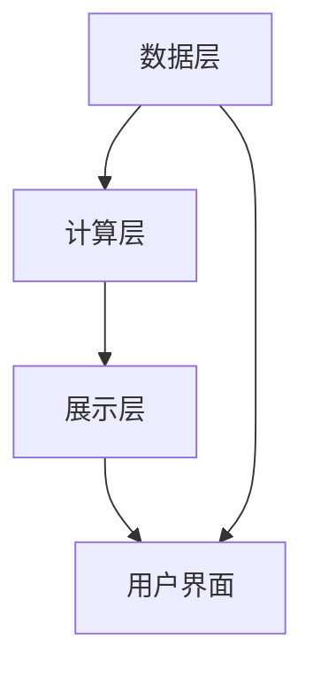
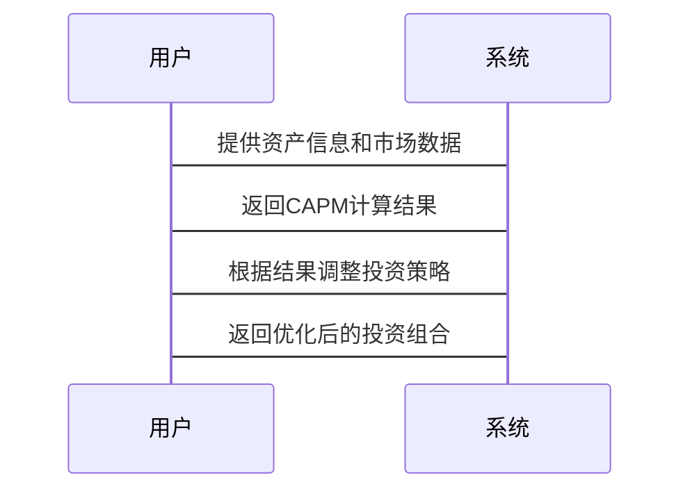

                 


# 威廉·夏普的资本资产定价模型(CAPM)在价值投资中的应用

## 关键词
威廉·夏普, CAPM, 资本资产定价模型, 价值投资, 股票定价, 投资组合优化, 风险管理

## 摘要
本文深入探讨了威廉·夏普提出的资本资产定价模型(CAPM)在价值投资中的应用。文章首先介绍了CAPM的基本理论和核心假设，然后分析了CAPM在资产定价和投资组合优化中的作用。接着，结合价值投资的理念，探讨了CAPM在评估资产内在价值和构建投资组合中的具体应用。通过实际案例分析和系统设计，本文展示了CAPM在价值投资中的实践价值，并提出了结合CAPM进行投资决策的最佳实践建议。

---

## 第1章: 引言

### 1.1 什么是威廉·夏普的CAPM
#### 1.1.1 资本资产定价模型的基本概念
资本资产定价模型（CAPM）是威廉·夏普在20世纪60年代提出的一种用于估计资产或投资组合期望收益的理论模型。它假设市场是有效的，并且投资者是理性的。

#### 1.1.2 CAPM的历史背景与发展
CAPM的提出基于现代投资组合理论（MPT），它在20世纪60年代被广泛接受，并成为金融学中的一个经典模型。

#### 1.1.3 CAPM在金融学中的重要性
CAPM为金融学家提供了一种量化风险和收益关系的方法，是金融学中最重要的工具之一。

### 1.2 CAPM的核心假设与局限性
#### 1.2.1 CAPM的基本假设
1. 投资者是理性的。
2. 市场是无摩擦的（无交易成本、无税收）。
3. 资产是可以完全流动的。
4. 无套利机会。

#### 1.2.2 CAPM的局限性与批评
1. 假设市场的无摩擦性和理性可能与现实不符。
2. 无法解释现实中的一些现象，如小盘股的高收益。

#### 1.2.3 CAPM在实际应用中的调整
在实践中，CAPM可以通过引入其他因素（如规模、价值等）进行扩展，形成多因子模型。

### 1.3 价值投资与CAPM的关系
#### 1.3.1 价值投资的基本理念
价值投资是一种投资策略，强调以低于内在价值的价格买入优质股票。

#### 1.3.2 CAPM在价值投资中的应用前景
CAPM可以帮助投资者量化资产的内在价值，并评估其相对于市场的公平性。

#### 1.3.3 价值投资与CAPP的结合点
价值投资者可以通过CAPM模型来评估市场的公平性，并寻找被低估的股票。

---

## 第2章: CAPM的理论基础

### 2.1 资本资产定价模型的推导
#### 2.1.1 投资者效用函数的构建
投资者追求效用最大化，即在给定风险下收益最大化，或在给定收益下风险最小化。

#### 2.1.2 无风险资产与风险资产的分离
无风险资产（如国债）的风险溢价为零，而风险资产的预期收益与其风险相关。

#### 2.1.3 风险溢价的计算
风险溢价是市场对承担系统性风险的补偿。

### 2.2 CAPM的核心公式
CAPM的公式为：
$$
E(R_i) = R_f + \beta_i (E(R_m) - R_f)
$$
其中：
- \(E(R_i)\) 是资产 \(i\) 的预期收益率。
- \(R_f\) 是无风险利率。
- \(\beta_i\) 是资产 \(i\) 的贝塔系数。
- \(E(R_m) - R_f\) 是市场风险溢价。

### 2.3 CAPM的假设与前提
#### 2.3.1 投资者理性假设
投资者追求效用最大化，并根据风险和收益做出决策。

#### 2.3.2 无摩擦市场假设
市场无交易成本、无税收，信息自由流动。

#### 2.3.3 资产完全流动性假设
所有资产都可以在市场上自由买卖。

#### 2.3.4 无税收与交易成本假设
假设无税收和交易成本。

---

## 第3章: CAPM在投资决策中的应用

### 3.1 资产定价与CAPM
#### 3.1.1 单个资产定价
通过CAPM模型计算单个资产的预期收益率，判断其是否被高估或低估。

#### 3.1.2 投资组合定价
通过CAPM模型计算投资组合的预期收益率，优化投资组合的风险收益比。

#### 3.1.3 市场指数的构建与应用
CAPM可以用于构建市场指数，并评估其风险和收益。

### 3.2 投资组合优化与CAPM
#### 3.2.1 投资组合理论基础
投资组合理论强调通过分散投资降低非系统性风险。

#### 3.2.2 CAPM在投资组合优化中的应用
通过CAPM模型优化投资组合的贝塔系数，降低系统性风险。

#### 3.2.3 风险调整后的收益评估
通过CAPM模型计算风险调整后的收益，评估投资组合的性价比。

### 3.3 CAPM在风险管理中的作用
#### 3.3.1 风险测度与评估
通过贝塔系数测度资产的系统性风险。

#### 3.3.2 风险调整后的资产配置
通过CAPM模型调整资产配置，优化风险收益比。

#### 3.3.3 风险对冲策略
通过CAPM模型设计风险对冲策略，降低投资组合的系统性风险。

---

## 第4章: CAPM与价值投资的结合

### 4.1 价值投资的基本原理
#### 4.1.1 价值投资的核心理念
价值投资强调以低于内在价值的价格买入优质股票，长期持有，获得超额收益。

#### 4.1.2 价值投资的选股策略
价值投资者关注低市盈率、低市净率等估值指标，寻找被市场低估的股票。

#### 4.1.3 价值投资的风险控制
价值投资强调安全边际，即买入价格远低于内在价值。

### 4.2 CAPM在价值投资中的应用
#### 4.2.1 通过CAPM评估资产的内在价值
CAPM可以用于计算资产的内在价值，判断其是否被市场低估或高估。

#### 4.2.2 CAPM在投资组合构建中的应用
通过CAPM模型优化投资组合的贝塔系数，降低系统性风险。

#### 4.2.3 CAPM与安全边际的关系
价值投资者可以通过CAPM模型计算资产的安全边际，即买入价格与内在价值的差距。

### 4.3 实际案例分析
#### 4.3.1 某公司股票的CAPM定价分析
以某公司股票为例，计算其CAPM预期收益率，判断其是否被低估。

#### 4.3.2 基于CAPM的投资组合优化案例
通过CAPM模型优化投资组合的贝塔系数，降低系统性风险。

#### 4.3.3 CAPM与价值投资结合的策略调整
通过CAPM模型调整投资策略，寻找被低估的股票，提高投资收益。

---

## 第5章: CAPM的系统分析与架构设计

### 5.1 系统分析
#### 5.1.1 问题场景介绍
本文研究的是如何将CAPM应用于价值投资中，优化资产定价和投资组合管理。

#### 5.1.2 系统功能设计
系统功能包括：
1. 数据获取与处理。
2. 模型计算与分析。
3. 投资决策支持。

#### 5.1.3 系统架构设计
系统架构包括：
1. 数据层：获取市场数据和资产信息。
2. 计算层：计算CAPM模型的参数。
3. 展示层：展示分析结果，支持投资决策。

### 5.2 系统架构设计


### 5.3 系统接口设计
系统接口包括：
1. 数据接口：获取市场数据和资产信息。
2. 计算接口：计算CAPM模型的参数。
3. 展示接口：展示分析结果。

### 5.4 系统交互设计


---

## 第6章: 项目实战

### 6.1 环境安装
需要安装Python和相关库（如Pandas、NumPy、Scipy等）。

### 6.2 核心实现源代码
以下是实现CAPM模型的Python代码：
```python
import pandas as pd
import numpy as np
from scipy.stats import linregress

def calculate_beta(risky_returns, market_returns):
    # 计算贝塔系数
    slope, _, _, _, _ = linregress(market_returns, risky_returns)
    return slope

def calculate_capm(risk_free_rate, beta, market_return):
    # 计算CAPM预期收益率
    return risk_free_rate + beta * (market_return - risk_free_rate)

# 示例数据
data = pd.DataFrame({
    '市场收益率': [0.05, 0.06, 0.04, 0.07, 0.05],
    '风险资产收益率': [0.08, 0.09, 0.06, 0.10, 0.07]
})

beta = calculate_beta(data['风险资产收益率'], data['市场收益率'])
capm_return = calculate_capm(0.02, beta, data['市场收益率'].mean())

print(f"贝塔系数: {beta}")
print(f"CAPM预期收益率: {capm_return}")
```

### 6.3 代码应用解读与分析
以上代码通过线性回归计算贝塔系数，并利用CAPM公式计算资产的预期收益率，判断其是否被高估或低估。

### 6.4 实际案例分析
以某公司股票为例，计算其CAPM预期收益率，并与实际收益率进行对比，判断其是否被低估。

### 6.5 项目小结
通过CAPM模型可以量化资产的内在价值，帮助投资者做出更明智的投资决策。

---

## 第7章: 总结与展望

### 7.1 总结
本文深入探讨了CAPM在价值投资中的应用，通过理论分析和实际案例，展示了CAPM在资产定价和投资组合优化中的重要作用。

### 7.2 展望
未来的研究可以进一步扩展CAPM模型，引入更多因子，提高其在实际投资中的应用效果。

### 7.3 最佳实践 tips
1. 在实际投资中，结合CAPM模型和其他因子模型进行综合分析。
2. 定期更新市场数据，重新计算CAPM模型的参数。
3. 结合市场环境和投资者自身风险偏好进行投资决策。

---

## 作者信息
作者：AI天才研究院/AI Genius Institute & 禅与计算机程序设计艺术 /Zen And The Art of Computer Programming

---

以上是文章的完整目录大纲和部分正文内容，您可以根据需要扩展每一部分的内容。

