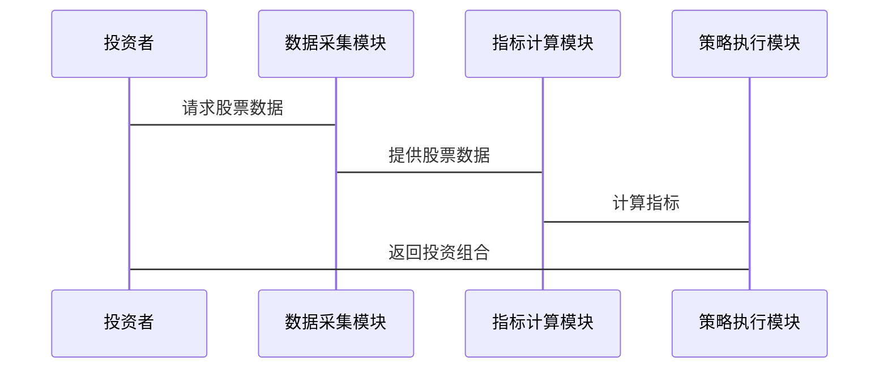

                 


# 威廉·欧奈尔的CANSLIM投资系统

> 关键词：CANSLIM投资系统，威廉·欧奈尔，股票投资，技术分析，基本面分析

> 摘要：本文深入分析了威廉·欧奈尔的CANSLIM投资系统，从系统的核心概念、技术分析方法、系统架构设计到实际应用案例，进行了全面而详细的讲解。文章旨在帮助投资者理解并掌握这一经典的投资策略，从而在股票市场中做出更明智的投资决策。

---

## 第一部分: 威廉·欧奈尔CANSLIM投资系统概述

### 第1章: 投资的基础概念

#### 1.1 投资的基本概念

**1.1.1 什么是投资**

投资是指将资金投入到某种资产或项目中，以期在未来获得收益的行为。投资的本质是通过资源配置和价值发现，实现财富的增值。在股票市场中，投资的核心在于选择具有成长潜力的公司，并通过长期持有或适时买卖获利。

**1.1.2 投资的目的与意义**

投资的目的是为了实现资产的保值和增值。通过投资，个人或机构可以将闲置资金投入高回报的领域，从而提高资金的使用效率。投资的意义在于通过科学的分析和决策，降低风险，提高收益。

**1.1.3 投资的基本原则**

- **分散投资**：不要将所有资金投入单一资产，以降低风险。
- **长期投资**：避免频繁交易，降低交易成本。
- **价值投资**：选择具有成长潜力和良好基本面的公司。
- **风险管理**：合理评估风险，制定止损策略。

#### 1.2 证券市场的基本运作

**1.2.1 证券市场的定义与分类**

证券市场是进行股票、债券、基金等证券买卖的场所，分为一级市场和二级市场。一级市场是新证券发行的场所，二级市场是已发行证券交易的场所。

**1.2.2 股票、债券、基金的区别**

- **股票**：代表公司所有权，具有较高的风险和收益。
- **债券**：债务工具，具有较低的风险和收益。
- **基金**：通过汇集资金投资多种资产，分散风险。

**1.2.3 投资者在市场中的角色**

投资者是市场的核心参与者，通过购买和卖出证券，推动市场的流动性和价格发现。投资者的决策影响市场的供需关系和资产价格。

---

### 第2章: 威廉·欧奈尔CANSLIM投资系统的背景

#### 2.1 威廉·欧奈尔的生平简介

**2.1.1 威廉·欧奈尔的早年经历**

威廉·欧奈尔是一位著名的投资家和作家，他的投资理念以基本面分析和技术分析相结合而闻名。他通过长期的市场实践，总结出一套独特的股票筛选方法。

**2.1.2 他在投资领域的贡献**

欧奈尔提出了CANSLIM投资系统，这一系统通过量化分析和图表分析，帮助投资者筛选出具有成长潜力的股票。

**2.1.3 他的投资哲学**

欧奈尔的投资哲学强调长期增长、基本面分析和趋势跟踪。他认为，成功的投资需要结合公司基本面和市场趋势。

#### 2.2 CANSLIM投资系统的起源

**2.2.1 系统的提出背景**

20世纪60年代，欧奈尔通过分析大量股票数据，发现一些共同的规律，从而提出了CANSLIM系统。该系统旨在帮助投资者识别具有持续增长潜力的股票。

**2.2.2 系统的核心思想**

CANSLIM系统的核心思想是通过量化分析和趋势跟踪，选择那些具有强劲基本面和良好技术形态的股票。

**2.2.3 系统的目标与适用范围**

CANSLIM系统的目标是通过筛选出具有成长潜力的股票，帮助投资者在市场中获得超额收益。该系统适用于长期投资和价值投资。

#### 2.3 CANSLIM在现代投资中的地位

**2.3.1 系统与其他投资策略的对比**

与传统的价值投资和趋势投资相比，CANSLIM系统结合了基本面和技术面分析，具有较强的综合性和实用性。

**2.3.2 系统的优缺点分析**

优点：量化分析，易于操作；结合基本面和技术面，提高筛选效率。

缺点：需要长期跟踪，对市场波动敏感。

**2.3.3 系统的现代应用价值**

在现代投资中，CANSLIM系统仍然是一个重要的参考工具，尤其适用于那些希望通过量化方法进行投资的投资者。

---

## 第二部分: CANSLIM投资系统的核心概念与联系

### 第3章: CANSLIM系统的七个要素

#### 3.1 C - Current Interest Rate

**3.1.1 利率的定义与分类**

利率是指借款的成本，分为短期利率和长期利率。短期利率通常指一年以内的利率，长期利率指一年以上的利率。

**3.1.2 利率对股市的影响**

利率上升会增加企业的融资成本，抑制企业投资，进而影响股市表现。反之，利率下降会降低融资成本，刺激投资，提升股市表现。

**3.1.3 如何分析当前利率环境**

投资者需要关注央行的利率政策和市场利率的变化，结合经济周期进行分析。

#### 3.2 A - Number of Annual Earnings Earnings Per Share

**3.2.1 每股收益的计算方法**

每股收益（EPS）= 净利润 / 总股本

**3.2.2 盈利能力分析**

通过分析EPS的趋势，判断企业的盈利能力是否稳定增长。

**3.2.3 如何判断企业的盈利能力**

选择那些EPS持续增长的企业，避免选择EPS下降的企业。

#### 3.3 N - Number of New Highs in 52 Weeks

**3.3.1 新高次数的定义**

在过去52周内，股价创出新高的次数。

**3.3.2 新高次数与股价走势的关系**

新高次数越多，表明市场对股票的信心越强，股价可能继续上涨。

**3.3.3 如何通过新高次数筛选股票**

选择那些在过去52周内多次创出新高的股票。

#### 3.4 S - Strength of the Trend

**3.4.1 趋势强度的定义**

趋势强度是指股价在一定时期内的上升或下降幅度。

**3.4.2 如何判断趋势强度**

通过分析股价的波动幅度和成交量，判断趋势的强弱。

**3.4.3 强势股与弱势股的区别**

强势股表现为股价持续上涨，成交量放大；弱势股表现为股价震荡下跌，成交量萎缩。

#### 3.5 L - I.R. Ratio

**3.5.1 每股收益与股价比率的定义**

I.R.比率 = 每股收益 / 股价

**3.5.2 如何计算I.R.比率**

通过分析I.R.比率，判断股票的估值水平。

**3.5.3 比率对企业价值的影响**

I.R.比率越低，表明股票的估值越高；反之，I.R.比率越高，表明股票的估值越低。

#### 3.6 I - I.R. Ratio Rank

**3.6.1 I.R.比率排名的定义**

根据I.R.比率对股票进行排名，选择那些I.R.比率较低的股票。

**3.6.2 如何通过I.R.比率排名筛选**

选择I.R.比率排名靠前的股票，避免选择排名靠后的股票。

---

## 第三部分: 系统分析与架构设计

### 第4章: CANSLIM投资系统的分析与设计

#### 4.1 问题场景介绍

投资者需要通过CANSLIM系统筛选出具有成长潜力的股票，制定投资策略。

#### 4.2 系统功能设计

- **数据采集**：获取股票的基本面和技术面数据。
- **指标计算**：计算CANSLIM系统的各项指标。
- **策略执行**：根据指标结果，筛选出符合条件的股票。

#### 4.3 系统架构设计

**领域模型**：


**系统架构**：


**系统接口设计**：

- 数据采集模块接口：获取股票数据。
- 指标计算模块接口：计算CANSLIM指标。
- 策略执行模块接口：筛选股票，生成投资组合。

#### 4.4 系统交互设计



---

## 第四部分: 项目实战

### 第5章: 项目实战与案例分析

#### 5.1 环境安装

- 安装数据分析工具（如Python、Excel）。
- 获取股票数据（如Yahoo Finance）。

#### 5.2 系统核心实现源代码

```python
import pandas as pd
import yfinance as yf

# 下载股票数据
def get_stock_data(ticker, start, end):
    data = yf.download(ticker, start=start, end=end)
    return data['Close']

# 计算CANSLIM指标
def calculate_can_slim(stock_data):
    # 计算每股收益（假设EPS数据已获取）
    eps = stock_data['EPS']
    # 计算I.R.比率
    ir_ratio = eps / stock_data['Close']
    # 计算新高次数
    stock_data['NewHigh'] = stock_data['Close'].rolling(52).max() == stock_data['Close']
    new_highs = stock_data['NewHigh'].sum()
    return {
        'IR Ratio': ir_ratio,
        'New Highs': new_highs
    }

# 示例代码
if __name__ == '__main__':
    start = '2020-01-01'
    end = '2023-01-01'
    ticker = 'AAPL'
    stock_data = get_stock_data(ticker, start, end)
    stock_data['EPS'] = [1.0, 1.1, 1.2, 1.3, 1.4]  # 示例数据
    can_slim = calculate_can_slim(stock_data)
    print("IR Ratio:", can_slim['IR Ratio'])
    print("New Highs:", can_slim['New Highs'])
```

#### 5.3 实际案例分析

以苹果公司（AAPL）为例，通过代码计算其CANSLIM指标，分析其投资价值。

#### 5.4 代码应用解读与分析

- 代码实现数据采集和指标计算，帮助投资者筛选股票。
- 通过分析指标结果，制定投资策略。

---

## 第五部分: 总结与展望

### 第6章: 总结与最佳实践

#### 6.1 最佳实践 tips

- 定期更新股票数据，保持分析的准确性。
- 结合市场环境，灵活调整投资策略。

#### 6.2 小结

CANSLIM系统通过量化分析和趋势跟踪，帮助投资者筛选出具有成长潜力的股票，是一种有效的投资工具。

#### 6.3 注意事项

- 投资有风险，需谨慎操作。
- 避免过度依赖单一指标，结合多种因素进行分析。

#### 6.4 拓展阅读

- 《威廉·欧奈尔投资经典》
- 其他投资策略书籍

---

## 作者：AI天才研究院/AI Genius Institute & 禅与计算机程序设计艺术 /Zen And The Art of Computer Programming

