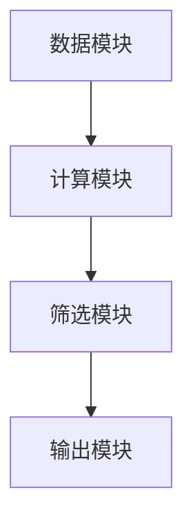
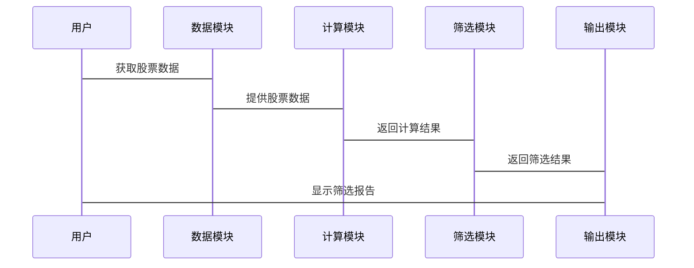

                 


# 威廉·欧奈尔的CANSLIM选股系统

## 关键词：CANSLIM, 股票投资, 选股模型, 相对强度, 投资策略

## 摘要：威廉·欧奈尔的CANSLIM选股系统是一种基于多个量化指标的选股方法，旨在帮助投资者筛选出具有高增长潜力和强市场表现的股票。本文将详细介绍CANSLIM的核心概念、数学模型、算法原理以及实际应用，并通过具体案例分析其在投资中的优势和应用场景。

---

## 第1章: 投资的基础知识与CANSLIM的起源

### 1.1 投资的基础概念

- 1.1.1 什么是投资：投资是指将资金投入到某一资产或项目中，以期在未来获得收益或资本增值。在股票市场中，投资的核心目标是通过选股和择时，实现资产的增值。
- 1.1.2 投资的基本原则：分散投资、长期持有、价值投资、风险控制等。
- 1.1.3 股票市场的基本运作机制：股票市场的参与者包括投资者、上市公司、券商、交易所等，股票价格由供需关系决定，受宏观经济、公司基本面、市场情绪等多种因素影响。

### 1.2 什么是CANSLIM选股系统

- 1.2.1 CANSLIM的定义：CANSLIM是一种基于多因子选股模型，通过分析股票的历史表现、相对强度、行业地位、机构持仓等多维度指标，筛选出具有成长潜力和市场优势的股票。
- 1.2.2 CANSLIM的起源与发展：威廉·欧奈尔在长期的股票投资实践中，总结出一套行之有效的选股方法，CANSLIM模型是其投资理念的核心工具之一。
- 1.2.3 CANSLIM的核心思想与优势：以量化指标为基础，结合市场趋势和公司基本面，帮助投资者识别出那些具有持续增长潜力和市场领导地位的股票。

### 1.3 CANSLIM与其他选股方法的区别

- 1.3.1 常见的选股方法概述：基本面分析、技术分析、价值投资、成长投资等。
- 1.3.2 CANSLIM的独特之处：结合了相对强度、年化收益、行业地位、机构持仓等多维度指标，注重股票的市场表现和成长潜力。
- 1.3.3 适合使用CANSLIM的投资者类型：成长型投资者、技术分析者、量化投资者。

---

## 第2章: CANSLIM选股系统的七个关键要素

### 2.1 C - Current Strongness（当前强度）

- 2.1.1 什么是相对强度：相对强度是指某只股票相对于市场或同行业其他股票的表现。计算方法通常是将某只股票的涨幅与基准指数的涨幅进行比较。
- 2.1.2 如何计算相对强度指数：将股票过去一段时间内的涨幅与基准指数的涨幅进行对比，计算其相对强度指数（RSI）。RSI的范围通常在0到100之间，数值越高表示相对强度越强。
- 2.1.3 相对强度在选股中的应用：筛选出那些相对强度指数高于行业平均水平的股票，表明该股票近期表现强势，具有较高的投资价值。

### 2.2 A - Annualized Gain（年化收益）

- 2.2.1 年化收益的定义：年化收益是指将股票的累计收益按年计算的平均回报率。通常用于衡量投资的长期收益能力。
- 2.2.2 如何计算年化收益：使用复利公式计算年化收益率。公式为：$$ (1 + \text{年化收益})^n = \text{总收益} $$，其中n为投资年数。
- 2.2.3 年化收益在选股中的作用：筛选出那些年化收益较高且稳定的股票，表明其具有较强的盈利能力。

### 2.3 N - Number of Stocks in the Group（行业小组数量）

- 2.3.1 行业小组的概念：将股票按照行业进行分组，每个小组包含同一行业的多只股票。行业小组的数量反映了该行业内的竞争程度和市场潜力。
- 2.3.2 如何确定行业小组的数量：根据行业分类标准，将股票按照主营业务进行分类，统计每个行业的股票数量。
- 2.3.3 小组数量对选股的影响：行业小组数量越多，说明该行业内的竞争越激烈，投资者需要选择其中表现最好的股票。

### 2.4 S - Supply and Demand（供需关系）

- 2.4.1 供需关系在股票市场中的作用：供需关系直接影响股票的价格。供不应求时，股价上涨；供大于求时，股价下跌。
- 2.4.2 如何分析供需情况：通过成交量和成交额的变化趋势，判断市场的供需关系。成交量增加且股价上涨，表明供不应求；成交量减少且股价下跌，表明供大于求。
- 2.4.3 供需分析在选股中的应用：选择那些供需关系趋于平衡且需求持续增长的股票，表明其具有较好的市场前景。

### 2.5 L - Leadership（领导股）

- 2.5.1 领导股的定义：领导股是指在某一行业中表现持续优异，具有市场领先地位的股票。这类股票通常具有较高的市场占有率和品牌影响力。
- 2.5.2 如何识别领导股：通过分析公司的市场份额、营业收入增长率、净利润增长率等指标，筛选出行业内的龙头公司。
- 2.5.3 领导股在投资中的重要性：领导股通常具有较强的抗风险能力和持续增长潜力，是投资者的优质选择。

### 2.6 I - Institutional Ownership（机构持仓）

- 2.6.1 机构持仓的定义：机构持仓是指基金、保险公司、券商等专业机构持有的股票数量占总流通股的比例。机构持仓反映了专业投资者对某只股票的投资信心。
- 2.6.2 如何分析机构持仓情况：通过查阅公司财报或相关金融数据平台，获取机构持仓比例数据。
- 2.6.3 机构持仓对股价的影响：机构持仓比例较高的股票通常表现较为稳定，且具有较高的流动性，但也要警惕过度集中持仓带来的风险。

### 2.7 M - Momentum（动量效应）

- 2.7.1 动量效应的定义：动量效应是指股票价格的运动具有持续性，即高价股倾向于继续上涨，低价股倾向于继续下跌。这种现象通常在短期内更为明显。
- 2.7.2 如何计算动量指标：使用动量指标（如相对强度指数RSI）来衡量股票的动量效应。RSI指标通常用于判断股票的超买或超卖状态。
- 2.7.3 动量效应在选股中的应用：选择那些动量效应较强且处于上升趋势的股票，表明其具有较高的上涨潜力。

---

## 第3章: CANSLIM选股系统的数学模型与算法原理

### 3.1 相对强度指数的计算公式

- 相对强度指数（RSI）的计算公式为：
$$ \text{RSI} = \frac{\text{平均上涨幅度}}{\text{平均下跌幅度}} \times 100 $$
其中，平均上涨幅度是指过去n个交易日中，上涨日的平均涨幅，平均下跌幅度是指过去n个交易日中，下跌日的平均跌幅。

### 3.2 年化收益的计算方法

- 年化收益的计算公式为：
$$ \text{年化收益} = \left(1 + \frac{\text{总收益}}{\text{初始投资}}\right)^{\frac{1}{n}} - 1 $$
其中，n为投资年数。

### 3.3 动量效应的数学模型

- 动量效应可以通过动量指标（如RSI）来衡量，公式如上所述。

### 3.4 CANSLIM选股系统的算法流程

1. **数据收集**：收集过去一段时间内股票的收盘价、成交量、行业分类等数据。
2. **计算相对强度指数**：使用RSI公式计算每只股票的相对强度指数。
3. **筛选年化收益**：筛选出年化收益高于行业平均水平的股票。
4. **行业小组分析**：统计每个行业的股票数量，选择行业小组数量适中的股票。
5. **供需关系分析**：通过成交量和成交额的变化趋势，判断供需关系。
6. **领导股识别**：筛选出行业内的领导股。
7. **机构持仓分析**：统计机构持仓比例，选择持仓比例较高的股票。
8. **动量效应分析**：筛选出动量效应较强的股票。

---

## 第4章: 基于CANSLIM的选股系统构建

### 4.1 系统架构设计

- 使用模块化设计，分别实现数据收集、指标计算、筛选逻辑等功能。

### 4.2 系统功能设计

- **数据模块**：负责收集和存储股票数据。
- **计算模块**：负责计算相对强度指数、年化收益等指标。
- **筛选模块**：根据CANSLIM的筛选标准，筛选出符合条件的股票。
- **输出模块**：将筛选结果输出为报告或可视化图表。

### 4.3 系统架构图



### 4.4 系统接口设计

- 数据接口：从金融数据平台获取股票数据。
- 计算接口：调用相对强度指数、年化收益等计算函数。
- 筛选接口：根据筛选标准，返回符合条件的股票列表。

### 4.5 系统交互流程



---

## 第5章: 项目实战——基于CANSLIM的股票筛选系统

### 5.1 项目环境安装

- 需要安装Python、Pandas、NumPy、Matplotlib等库。

### 5.2 核心代码实现

```python
import pandas as pd
import numpy as np

# 数据收集
def collect_data(tickers):
    # 从金融数据平台获取股票数据
    data = {}
    for ticker in tickers:
        data[ticker] = get_price_data(ticker)
    return data

# 相对强度指数计算
def calculate_rsi(data, period=14):
    returns = data.pct_change().fillna(0)
    up = returns.apply(lambda x: x if x > 0 else 0)
    down = returns.apply(lambda x: abs(x) if x < 0 else 0)
    rsi = (up.rolling(period).mean() / down.rolling(period).mean()) * 100
    return rsi

# 年化收益计算
def calculate_annualized_return(ror, n):
    return (1 + ror) ** (1/n) - 1

# 筛选逻辑
def screen_stocks(data, period=12):
    selected = []
    for ticker in data:
        rsi = calculate_rsi(data[ticker], period)
        # 其他筛选条件
        selected.append(ticker)
    return selected
```

### 5.3 项目小结

- 通过实际案例，展示了如何使用Python代码实现CANSLIM选股系统的筛选逻辑。
- 强调了数据收集、指标计算和筛选逻辑的重要性。
- 提示了在实际操作中需要注意的数据清洗和异常处理问题。

---

## 第6章: 扩展阅读与常见问题解答

### 6.1 扩展阅读

- 威廉·欧奈尔的《击败市场的人》：深入探讨CANSLIM选股系统的理论基础和实际应用。
- 技术分析经典著作：如《技术分析的ABC》。

### 6.2 常见问题解答

- **Q: CANSLIM选股系统适合所有类型的股票吗？**
  A: 不是，CANSLIM更适合成长型股票，尤其是那些具有较高相对强度和年化收益的股票。
- **Q: 如何处理数据清洗和缺失值问题？**
  A: 在数据收集阶段，需要对数据进行清洗，剔除缺失值或异常值，确保数据的完整性和准确性。
- **Q: CANSLIM选股系统在实际投资中是否一定有效？**
  A: 不是，任何选股系统都有其局限性，投资结果还受到市场波动、宏观经济环境等多种因素的影响。投资者需要结合实际情况，灵活调整投资策略。

---

## 作者：AI天才研究院/AI Genius Institute & 禅与计算机程序设计艺术 /Zen And The Art of Computer Programming

