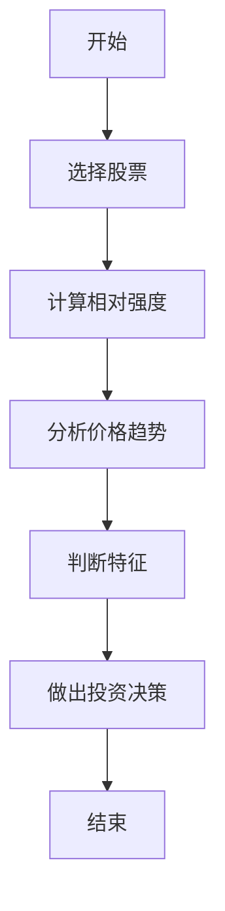
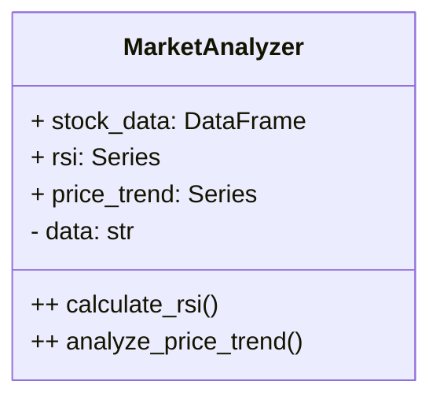
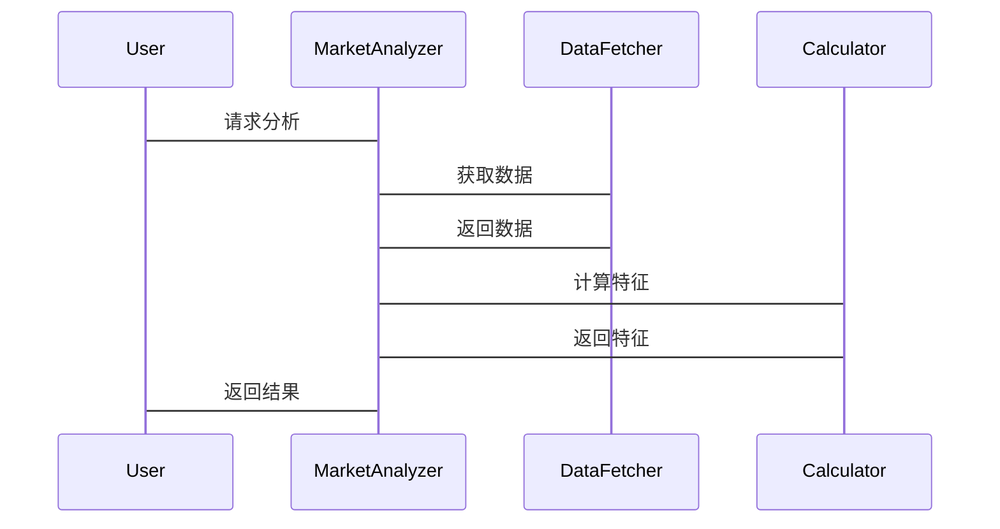

                 


# 威廉·欧奈尔的市场领导者特征分析

## 关键词：威廉·欧奈尔，市场领导者特征，投资策略，相对强度指数，市场分析

## 摘要：威廉·欧奈尔是投资领域的权威，提出了市场领导者特征的概念。本文深入分析这些特征，包括其背景、核心概念、算法原理、系统架构和项目实战，帮助读者掌握欧奈尔的投资方法。

---

## 第1章 威廉·欧奈尔与市场领导者特征概述

### 1.1 威廉·欧奈尔的生平与投资理念

#### 1.1.1 威廉·欧奈尔的生平简介

威廉·欧奈尔（William O'Neil）是一位著名投资专家，以其对市场趋势和股票分析的深入研究闻名。他创立了多种投资策略，强调通过数据分析来识别市场领导者。

#### 1.1.2 欧奈尔的投资哲学与方法

欧奈尔的投资哲学基于市场分析和数据驱动的方法。他认为，成功的投资者应关注市场趋势和股票的相对强度，而非仅仅依赖基本面分析。

#### 1.1.3 欧奈尔对市场的独特见解

欧奈尔认为，市场领导者往往表现出特定的特征，如高成交量、价格趋势和相对强度。这些特征帮助投资者识别出那些可能带来超额收益的股票。

---

### 1.2 市场领导者特征的基本概念

#### 1.2.1 市场领导者特征的定义

市场领导者特征是指那些能够在市场中持续表现优异的股票所具备的特质。这些特征包括高成交量、价格趋势和相对强度。

#### 1.2.2 市场领导者特征的核心要素

市场领导者特征的核心要素包括：

1. **相对强度**：股票相对于市场的表现。
2. **成交量**：交易量的高低反映了市场的兴趣。
3. **价格趋势**：价格走势是否呈现上升趋势。
4. **资金流动**：资金流入流出的情况。

#### 1.2.3 市场领导者特征的分类与对比

市场领导者特征可以分为短期、中期和长期特征。短期特征如价格波动，中期特征如相对强度，长期特征如持续增长。

---

## 第2章 市场领导者特征的背景与问题分析

### 2.1 市场领导者特征的背景介绍

#### 2.1.1 当前市场的复杂性

当前市场信息复杂，投资者需要依靠数据分析来识别市场领导者。

#### 2.1.2 市场领导者特征的重要性

识别市场领导者有助于投资者做出更明智的投资决策。

#### 2.1.3 欧奈尔理论的现实意义

欧奈尔的理论为投资者提供了实用的分析工具，帮助他们在复杂的市场中找到机会。

### 2.2 问题背景与问题描述

#### 2.2.1 市场领导者特征分析的核心问题

如何准确识别具备市场领导者特征的股票。

#### 2.2.2 问题的边界与外延

市场领导者特征分析不仅限于股票，还可应用于其他金融资产。

#### 2.2.3 问题解决的目标与方法

目标是提高投资决策的准确性，方法包括数据分析和模式识别。

---

## 第3章 市场领导者特征的核心概念与联系

### 3.1 核心概念的原理与特点

#### 3.1.1 市场领导者特征的原理

市场领导者特征的原理是通过分析股票的相对强度和价格趋势，识别出具有持续增长潜力的股票。

#### 3.1.2 市场领导者特征的特点

- 数据驱动
- 趋势导向
- 高度可量化

### 3.2 核心概念的对比分析

#### 3.2.1 不同市场领导者特征的对比

| 特征         | 短期特征       | 中期特征       | 长期特征       |
|--------------|----------------|----------------|----------------|
| 关注点       | 价格波动       | 相对强度       | 持续增长       |
| 时间跨度     | 几周           | 几个月         | 几年           |

#### 3.2.2 特征之间的相互作用

价格趋势和相对强度相互影响，共同决定股票的表现。

#### 3.2.3 特征对市场表现的影响

具备多个市场领导者特征的股票往往表现更优。

### 3.3 实体关系图与流程图

#### 3.3.1 实体关系图（ER图）

```mermaid
erd
    title 市场领导者特征 ER 图
    MarketLeader
    has
    Feature
    has
    Stock
```

#### 3.3.2 流程图（Mermaid）



---

## 第4章 市场领导者特征的算法原理与实现

### 4.1 算法原理概述

#### 4.1.1 算法的核心思想

通过计算相对强度指数（RSI）和分析价格趋势，识别市场领导者。

#### 4.1.2 算法的输入与输出

- 输入：股票价格数据
- 输出：市场领导者特征评估结果

#### 4.1.3 算法的步骤与流程

1. 收集数据
2. 计算RSI
3. 分析价格趋势
4. 综合评估特征

### 4.2 算法实现的代码示例

#### 4.2.1 Python代码实现

```python
import pandas as pd
import numpy as np

def calculate_rsi(data, period=14):
    diff = data['Close'].diff(periods=1)
    up = diff.where(diff > 0, 0)
    down = diff.where(diff < 0, 0)
    rs = up.rolling(period).mean() / down.rolling(period).mean()
    rsi = 100 - 20 * (1 - rs)
    return rsi

data = pd.read_csv('stock_data.csv')
rsi = calculate_rsi(data)
print(rsi)
```

#### 4.2.2 算法的优化与改进

优化计算效率，如并行计算和缓存技术。

#### 4.2.3 算法的测试与验证

通过历史数据验证算法的有效性，调整参数以提高准确性。

### 4.3 数学模型与公式

#### 4.3.1 核心公式推导

相对强度指数（RSI）计算公式：

$$ RSI = 100 - 20 \times (1 - \frac{AVG_{up}}{AVG_{down}}) $$

其中，$AVG_{up}$ 是上涨幅度的平均值，$AVG_{down}$ 是下跌幅度的平均值。

---

## 第5章 市场领导者特征的系统分析与架构设计方案

### 5.1 系统分析

#### 5.1.1 问题场景介绍

投资者需要一个工具来识别市场领导者特征。

#### 5.1.2 项目介绍

开发一个基于欧奈尔特征的市场分析系统，帮助投资者做出决策。

### 5.2 系统功能设计

#### 5.2.1 领域模型（Mermaid 类图）



#### 5.2.2 系统架构设计（Mermaid 架构图）

```mermaid
container MarketAnalyzer {
    MarketAnalyzer
    API接口
    数据源
}
```

#### 5.2.3 接口设计

接口包括数据输入、特征计算和结果输出。

#### 5.2.4 交互设计（Mermaid 序列图）



---

## 第6章 项目实战：基于欧奈尔特征的市场分析系统

### 6.1 项目环境安装

安装必要的库：

```bash
pip install pandas numpy matplotlib
```

### 6.2 系统核心实现源代码

#### 6.2.1 数据获取与预处理

```python
import pandas as pd

data = pd.read_csv('stock_data.csv')
data.head()
```

#### 6.2.2 计算相对强度指数

```python
def calculate_rsi(data, period=14):
    diff = data['Close'].diff(periods=1)
    up = diff.where(diff > 0, 0)
    down = diff.where(diff < 0, 0)
    rs = up.rolling(period).mean() / down.rolling(period).mean()
    rsi = 100 - 20 * (1 - rs)
    return rsi

rsi = calculate_rsi(data)
print(rsi)
```

#### 6.2.3 分析价格趋势

```python
def analyze_price_trend(data, window=50):
    sma = data['Close'].rolling(window).mean()
    trend = data['Close'] > sma
    return trend

trend = analyze_price_trend(data)
print(trend)
```

### 6.3 代码应用解读与分析

- 计算RSI并绘制图表：
  ```python
  import matplotlib.pyplot as plt
  plt.plot(rsi)
  plt.title('RSI Analysis')
  plt.xlabel('Time')
  plt.ylabel('RSI')
  plt.show()
  ```

- 综合评估特征：
  ```python
  def is_market_leader(rsi, trend):
      return rsi > 70 and trend

  leaders = is_market_leader(rsi, trend)
  print(leaders)
  ```

### 6.4 实际案例分析

分析某股票的历史数据，计算RSI和趋势，判断其是否为市场领导者。

### 6.5 项目小结

通过项目实战，验证了欧奈尔特征的有效性，并展示了如何将理论应用于实际。

---

## 第7章 最佳实践、小结、注意事项和拓展阅读

### 7.1 最佳实践

- 定期更新数据，保持模型准确性。
- 结合多种指标进行综合评估。

### 7.2 小结

威廉·欧奈尔的市场领导者特征分析提供了实用的工具，帮助投资者做出明智决策。

### 7.3 注意事项

- 数据质量影响结果，需谨慎处理数据。
- 模型需定期优化，适应市场变化。

### 7.4 拓展阅读

推荐阅读威廉·欧奈尔的原著，深入了解其理论和应用。

---

## 作者：AI天才研究院/AI Genius Institute & 禅与计算机程序设计艺术 /Zen And The Art of Computer Programming

