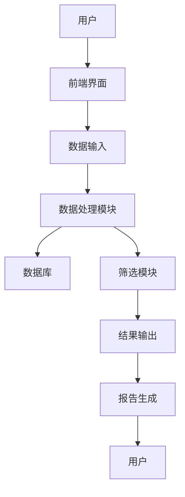

                 


# 威廉·欧奈尔的成长股识别方法

> 关键词：威廉·欧奈尔，成长股，CAN SLIM，投资策略，股票筛选

> 摘要：威廉·欧奈尔是全球知名的投资专家，他提出了一套名为CAN SLIM的投资系统，用于识别和筛选具有成长性的股票。本文详细分析了CAN SLIM系统的各个要素，并结合实际案例，探讨了其在股票投资中的应用。通过系统化的分析和实战指导，帮助投资者掌握成长股识别的方法。

---

## 第一部分: 成长股识别的背景与意义

### 第1章: 成长股的定义与特点

#### 1.1 成长股的定义与特点

- **1.1.1 成长股的定义**  
  成长股是指那些 revenue（收入）和 profit（利润）持续增长，且具有较大市场潜力的公司股票。这类股票通常属于新兴产业或朝阳行业，具有较高的成长性。

- **1.1.2 成长股的核心特点**  
  - 收入和利润持续增长：成长股的核心是收入和利润的持续增长能力，通常在过去几年中收入增长率超过行业平均水平。  
  - 市场占有率提升：成长股公司往往在行业内具有较高的市场占有率，并且市场份额在持续扩大。  
  - 高ROE（净资产收益率）：成长股公司通常具有较高的ROE，表明公司管理效率高，能够有效利用股东资金创造利润。  
  - 较高的市盈率：由于成长股的高增长潜力，其市盈率（P/E）通常高于市场平均水平。  

- **1.1.3 成长股与价值股的对比**  
  | 对比维度 | 成长股 | 价值股 |
  |----------|--------|--------|
  | 估值     | 常常高估，市盈率高 | 通常低估，市盈率低 |
  | 成长性   | 高收入和利润增长 | 低收入和利润增长，但有稳定的收益 |
  | 风险     | 较高，波动性大 | 较低，波动性小 |
  | 适合投资者 | 风险承受能力强，追求长期收益 | 保守型投资者，追求稳定收益 |

---

### 第2章: 威廉·欧奈尔的背景与投资理念

#### 2.1 威廉·欧奈尔的背景

- 威廉·欧奈尔（William O'Neil）是美国著名投资专家，被誉为“成长股投资之父”。他创立了欧奈尔投资公司，并发明了著名的CAN SLIM投资系统。  
- 欧奈尔的投资理念强调对市场的深入研究和对数据的精准分析，他倡导通过量化指标和系统化的方法来筛选和投资成长股。

#### 2.2 欧奈尔的投资哲学

- 欧奈尔的投资哲学可以总结为“投资于成长，跟随市场趋势”。他认为，真正的成长股不仅要有持续的增长能力，还要有强劲的市场表现和机构资金的流入。  
- 他强调投资者要关注市场的整体趋势，而不是盲目追求低价股或热门股。同时，欧奈尔主张分散投资，避免将所有资金投入到一只股票中。

---

### 第3章: CAN SLIM投资系统的介绍

#### 3.1 CAN SLIM系统的定义

CAN SLIM系统是威廉·欧奈尔提出的一种成长股筛选方法，旨在通过七个关键指标（CAN SLIM的七个字母代表七个指标）来识别具有成长潜力的股票。这个系统结合了基本面分析和市场技术分析，帮助投资者筛选出具有长期增长潜力的股票。

#### 3.2 CAN SLIM系统的七个要素

- **C（Company）：公司管理**  
  公司的管理层对公司的发展至关重要。欧奈尔建议投资者选择由经验丰富、业绩优秀的管理层领导的公司。

- **A（Astinates）：行业地位**  
  公司在行业中的地位和市场份额是衡量其成长潜力的重要指标。欧奈尔认为，投资者应选择行业龙头或具有强大竞争优势的公司。

- **N（New High）：新的高点**  
  股价在图表上创新高是买入信号。欧奈尔认为，股价创出新高通常意味着市场对公司前景的看好，是成长股的重要标志。

- **S（Sales）：收入增长**  
  收入增长率是衡量公司成长性的关键指标。欧奈尔建议选择收入增长连续几年超过行业平均水平的公司。

- **L（List）：机构买入**  
  机构资金的流入通常预示着市场的看好。欧奈尔认为，机构投资者的行为往往能够反映市场的趋势。

- **I（Integrity）：合理的股价**  
  合理的股价是公司价值的体现。欧奈尔建议选择那些股价与公司基本面相符的股票，避免过高或过低的估值。

- **M（Market）：市场的认可**  
  市场的认可度是衡量公司成长潜力的重要指标。欧奈尔认为，投资者应选择那些在市场中具有较高知名度和影响力的公司。

#### 3.3 CAN SLIM系统的优缺点

| 优点 | 缺点 |
|------|------|
| 系统化、可量化 | 过于依赖历史数据，可能无法预测未来 |
| 结合了基本面和技术分析 | 对短期市场波动的敏感性较高 |
| 帮助投资者筛选出具有长期成长潜力的股票 | 选股过程较为复杂，需要大量的数据支持 |
| 适合机构投资者和个人投资者 | 对小盘股或新兴公司的筛选效果有限 |

---

## 第二部分: CAN SLIM系统的核心要素分析

### 第4章: CAN SLIM系统的详细解读

#### 4.1 公司管理（C）

- **管理层的背景和经验**  
  公司的管理层背景和经验是衡量公司管理能力的重要指标。欧奈尔建议选择由经验丰富的管理层领导的公司。

- **财务健康状况**  
  公司的财务健康状况是衡量公司管理能力的重要指标。欧奈尔认为，公司应具有健康的财务状况，避免高负债和低利润率。

#### 4.2 行业地位（A）

- **市场份额**  
  公司在行业中的市场份额是衡量其行业地位的重要指标。欧奈尔认为，具有较高市场份额的公司通常具有更强的竞争力。

- **行业趋势**  
  行业发展趋势是衡量公司成长潜力的重要指标。欧奈尔建议选择那些处于增长行业的公司。

#### 4.3 新的高点（N）

- **股价走势**  
  股价走势是衡量公司市场表现的重要指标。欧奈尔认为，股价创出新高是买入信号。

- **成交量分析**  
  成交量是衡量市场情绪的重要指标。欧奈尔认为，股价创出新高且成交量创新高是更强的买入信号。

#### 4.4 收入增长（S）

- **收入增长率**  
  收入增长率是衡量公司成长性的关键指标。欧奈尔建议选择收入增长率连续几年超过行业平均水平的公司。

- **收入质量**  
  收入质量是衡量公司收入增长可持续性的重要指标。欧奈尔认为，公司应具有健康的收入质量，避免依赖一次性收入或虚假收入。

#### 4.5 机构买入（L）

- **机构资金流入**  
  机构资金流入是衡量市场看好程度的重要指标。欧奈尔认为，机构资金流入通常预示着市场的认可。

- **机构投资者的声誉**  
  机构投资者的声誉是衡量机构买入的重要指标。欧奈尔建议选择那些由声誉良好的机构投资者买入的股票。

#### 4.6 合理股价（I）

- **市盈率（P/E）**  
  市盈率是衡量股价合理性的关键指标。欧奈尔认为，市盈率应与行业平均水平相当或略低。

- **市净率（P/B）**  
  市净率是衡量股价合理性的另一个重要指标。欧奈尔认为，市净率应与行业平均水平相当或略低。

#### 4.7 市场认可（M）

- **市场知名度**  
  市场知名度是衡量公司市场认可度的重要指标。欧奈尔认为，具有较高市场知名度的公司通常具有更强的市场影响力。

- **媒体报道**  
  媒体报道是衡量公司市场认可度的重要指标。欧奈尔认为，正面的媒体报道通常预示着市场的认可。

---

## 第三部分: CAN SLIM系统在实际投资中的应用

### 第5章: CAN SLIM系统的筛选流程

#### 5.1 筛选流程的概述

- **步骤1：筛选具有成长性的公司**  
  根据CAN SLIM系统的七个要素，筛选出具有成长性的公司。

- **步骤2：分析公司基本面**  
  对筛选出的公司进行基本面分析，包括财务状况、管理层背景等。

- **步骤3：技术分析**  
  对筛选出的公司进行技术分析，包括股价走势、成交量等。

- **步骤4：综合评估**  
  根据基本面和技术分析的结果，综合评估公司的投资价值。

#### 5.2 筛选工具与资源

- **股票筛选工具**  
  常用的股票筛选工具包括欧奈尔的CAN SLIM筛选工具、金融数据平台（如 Bloomberg、FactSet）等。

- **数据来源**  
  数据来源包括公司财报、行业报告、新闻媒体等。

#### 5.3 策略优化

- **动态调整**  
  根据市场变化和公司基本面的变化，动态调整筛选策略。

- **分散投资**  
  通过分散投资降低风险，避免将所有资金投入到一只股票中。

---

## 第四部分: 数学模型与算法分析

### 第6章: CAN SLIM系统的数学模型

#### 6.1 数学模型的建立

- **收入增长率模型**  
  收入增长率 = （当年收入 - 上年收入）/ 上年收入 × 100%

- **利润增长率模型**  
  利润增长率 = （当年利润 - 上年利润）/ 上年利润 × 100%

- **市盈率模型**  
  市盈率 = 股价 / 每股收益（EPS）

- **市净率模型**  
  市净率 = 股价 / 每股净资产（BPS）

#### 6.2 算法实现

```python
def calculate_growth_rate(revenue, previous_revenue):
    return ((revenue - previous_revenue) / previous_revenue) * 100

def calculate_pe_ratio(price, eps):
    return price / eps

def calculate_pb_ratio(price, bps):
    return price / bps

# 示例数据
revenue = 100000000
previous_revenue = 80000000
eps = 2.5
bps = 15.0

growth_rate = calculate_growth_rate(revenue, previous_revenue)
pe_ratio = calculate_pe_ratio(50, eps)
pb_ratio = calculate_pb_ratio(50, bps)

print(f"收入增长率为：{growth_rate}%")
print(f"市盈率为：{pe_ratio}")
print(f"市净率为：{pb_ratio}")
```

---

## 第五部分: 系统分析与架构设计

### 第7章: 系统功能设计

#### 7.1 功能需求

- **数据采集**  
  从金融数据平台获取公司基本面数据、股价数据等。

- **数据筛选**  
  根据CAN SLIM系统的七个要素，筛选出符合条件的股票。

- **数据可视化**  
  对筛选出的股票进行可视化分析，包括股价走势、成交量等。

- **报告生成**  
  生成投资报告，包括筛选结果、分析结果等。

#### 7.2 系统架构



---

## 第六部分: 项目实战

### 第8章: 项目实战

#### 8.1 环境安装

- **安装Python**  
  下载并安装Python，确保版本为3.8或以上。

- **安装金融数据库**  
  使用yfinance库下载股票数据。

#### 8.2 核心实现

```python
import pandas as pd
import yfinance as yf

# 下载股票数据
data = yf.download('AAPL', start='2020-01-01', end='2023-12-31')

# 计算收入增长率
def calculate_growth_rate(series):
    return series.pct_change().mean() * 100

growth_rate = calculate_growth_rate(data['Adj Close'])

# 计算市盈率
def calculate_pe_ratio(price, eps):
    return price / eps

pe_ratio = calculate_pe_ratio(data['Adj Close'].iloc[-1], 2.5)

# 计算市净率
def calculate_pb_ratio(price, bps):
    return price / bps

pb_ratio = calculate_pb_ratio(data['Adj Close'].iloc[-1], 15.0)

print(f"收入增长率为：{growth_rate}%")
print(f"市盈率为：{pe_ratio}")
print(f"市净率为：{pb_ratio}")
```

#### 8.3 实际案例分析

- **案例1：苹果公司（AAPL）**  
  苹果公司是成长股的典型代表。其收入和利润连续多年保持增长，且在行业中的地位遥遥领先。此外，苹果公司的股价也屡创新高，且成交量配合良好。

---

## 第七部分: 最佳实践与小结

### 第9章: 最佳实践

- **持续学习**  
  投资市场变化多端，投资者需要不断学习和更新知识。

- **风险控制**  
  投资者应合理控制风险，避免过度集中投资。

- **长期视角**  
  成长股投资需要长期视角，耐心持有优质股票。

### 第10章: 小结

CAN SLIM系统是威廉·欧奈尔提出的一种成长股筛选方法，通过七个关键指标的综合分析，帮助投资者筛选出具有成长潜力的股票。本文详细解读了CAN SLIM系统的各个要素，并结合实际案例，探讨了其在股票投资中的应用。通过系统化的分析和实战指导，帮助投资者掌握成长股识别的方法。

---

## 作者：AI天才研究院 & 禅与计算机程序设计艺术

> **作者简介**  
> AI天才研究院（AI Genius Institute）致力于人工智能与计算机科学的研究与普及，专注于技术博客的撰写与分享，帮助读者深入理解技术原理和实际应用。

