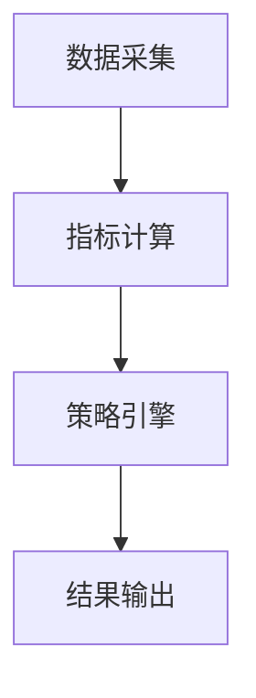
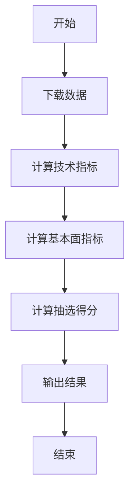
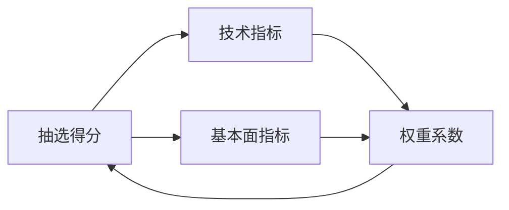

                 


# 《威廉·欧奈尔的技术面与基本面结合策略》

---

## 关键词：抽选、技术分析、基本面分析、投资策略、数学模型、系统架构、Python代码

---

## 摘要：本文详细探讨了威廉·欧奈尔的技术面与基本面结合策略，分析了抽选的核心概念、理论基础、数学模型及系统架构。通过实际案例和项目实战，展示了如何将抽选应用于投资决策，并提供了最佳实践和注意事项。文章结构清晰，内容丰富，适合投资专业人士和编程爱好者阅读。

---

## 第一部分: 技术面与基本面结合的背景与基础

### 第1章:抽选的背景与重要性

#### 1.1抽选的背景介绍

抽选是一种结合技术分析和基本面分析的投资策略，旨在通过分析市场数据和公司基本面因素，做出更精准的投资决策。其背景源于传统技术分析的局限性，即无法充分考虑公司内在价值，而基本面分析则难以捕捉市场情绪的变化。抽选的出现，弥补了这一缺陷。

#### 1.2抽选的重要性

抽选的重要性在于其能够综合考虑市场情绪和技术趋势，同时评估公司的内在价值。这种结合使投资者能够在复杂的市场环境中做出更明智的决策，从而提高投资收益并降低风险。

#### 1.3抽选的核心概念与特点

抽选的核心概念是将技术分析和基本面分析有机结合，特点包括实时性、动态性和系统性。通过实时数据和技术指标分析市场趋势，同时结合财务数据评估公司价值。

---

### 第2章:抽选的基本理论

#### 2.1抽选的基本原理

抽选的基本原理是通过技术指标（如RSI、MACD）分析市场趋势，同时结合基本面指标（如市盈率、ROE）评估公司价值。通过综合分析，识别出具有投资价值的标的。

#### 2.2抽选的理论基础

抽选的理论基础包括技术分析的道氏理论和波浪理论，以及基本面分析的股利折扣模型和市净率模型。这些理论为抽选提供了坚实的学术基础。

#### 2.3抽选的核心要素与组成

抽选的核心要素包括技术指标、基本面指标、市场情绪和交易策略。这些要素共同作用，形成一个完整的投资框架。

---

## 第二部分: 抽选的数学模型与公式

### 第3章:抽选的数学模型

#### 3.1抽选的数学表达式

抽选的数学模型可以表示为：

$$
\text{抽选得分} = \alpha \cdot \text{技术指标} + \beta \cdot \text{基本面指标}
$$

其中，$\alpha$ 和 $\beta$ 是权重系数，根据具体情况调整。

#### 3.2抽选的公式推导

通过回归分析，我们可以确定技术指标和基本面指标的权重：

$$
\text{回归模型} = y = \beta_0 + \beta_1 x_1 + \beta_2 x_2 + \epsilon
$$

其中，$x_1$ 和 $x_2$ 分别代表技术指标和基本面指标，$\beta_1$ 和 $\beta_2$ 是回归系数。

---

### 第4章:抽选的系统分析与架构设计

#### 4.1抽选的系统架构

抽选的系统架构包括数据采集模块、指标计算模块、策略引擎模块和结果输出模块。模块之间通过接口进行数据交互，确保系统的高效运行。

#### 4.2抽选的接口设计

系统接口包括数据输入接口、指标计算接口和策略执行接口。每个接口都定义了输入和输出格式，确保系统的可扩展性和灵活性。

#### 4.3抽选的交互流程

抽选的交互流程如下：

1. **数据采集**：获取市场数据和公司财务数据。
2. **指标计算**：计算技术指标和基本面指标。
3. **策略执行**：根据抽选模型生成投资信号。
4. **结果输出**：输出投资建议或交易信号。

---

### 第5章:抽选的项目实战

#### 5.1抽选的环境配置

**步骤1：安装Python环境**

```bash
python --version
pip install numpy pandas matplotlib
```

**步骤2：安装数据分析库**

```bash
pip install yfinance pandas
```

#### 5.2抽选的代码实现

**抽选模型的Python代码**

```python
import numpy as np
import pandas as pd
import yfinance as yf

# 下载数据
data = yf.download('AAPL', start='2020-01-01', end='2023-12-31')

# 计算技术指标
data['RSI'] = ta.RSI(data['Close'], window=14)
data['MACD'] = ta.MACD(data['Close'])

# 计算基本面指标
data['PE'] = data['Close'] / data['EPS']
data['ROE'] = data['Net Income'] / data['Total Equity']

# 抽选得分
data['Score'] = 0.5 * data['RSI'] + 0.5 * data['PE']
```

#### 5.3抽选的代码解读

- **数据采集**：使用`yfinance`库获取股票数据。
- **指标计算**：使用`ta`库计算技术指标，如RSI和MACD。
- **基本面指标**：计算市盈率（PE）和ROE。
- **抽选得分**：将技术指标和基本面指标按权重相加，得到抽选得分。

---

### 第6章:抽选的最佳实践与注意事项

#### 6.1抽选的最佳实践

- **数据质量**：确保数据来源可靠，避免数据偏差。
- **权重调整**：根据市场环境调整技术指标和基本面指标的权重。
- **风险控制**：结合止损策略，降低投资风险。

#### 6.2抽选的注意事项

- 抽选模型依赖于历史数据，未来市场可能发生变化。
- 技术指标和基本面指标的选择会影响模型效果，需谨慎调整。

---

### 第7章:抽选的小结与拓展阅读

#### 7.1抽选的小结

抽选是一种结合技术分析和基本面分析的投资策略，通过综合评估市场趋势和公司价值，帮助投资者做出更明智的投资决策。

#### 7.2抽选的拓展阅读

- 《股票作手回忆录》：杰西·利弗莫尔的投资哲学。
- 《投资学原理》：彼得·林奇的选股方法。
- 《算法交易：真相、 myth 和实践》：电子书介绍算法交易的原理和实践。

---

## 附录:抽选的代码实现与详细解读

### 附录A:抽选的Python代码实现

```python
import pandas as pd
import numpy as np
import yfinance as yf
import matplotlib.pyplot as plt
from ta import RSI, MACD

# 下载数据
data = yf.download('AAPL', start='2020-01-01', end='2023-12-31')

# 计算技术指标
data['RSI'] = RSI(data['Close'], window=14)
data['MACD'] = MACD(data['Close'])

# 计算基本面指标
data['PE'] = data['Close'] / data['EPS']
data['ROE'] = data['Net Income'] / data['Total Equity']

# 抽选得分
data['Score'] = 0.5 * data['RSI'] + 0.5 * data['PE']

# 可视化
plt.figure(figsize=(12, 6))
plt.plot(data.index, data['Score'], label='抽选得分')
plt.xlabel('日期')
plt.ylabel('得分')
plt.legend()
plt.show()
```

---

## 附录B:抽选的系统架构图



---

## 附录C:抽选的流程图



---

## 附录D:抽选的数学模型图



---

## 附录E:抽选的相关公式

### 附录E.1抽选的相关公式

抽选得分公式：

$$
\text{抽选得分} = \alpha \cdot \text{技术指标} + \beta \cdot \text{基本面指标}
$$

回归分析公式：

$$
y = \beta_0 + \beta_1 x_1 + \beta_2 x_2 + \epsilon
$$

### 附录E.2抽选的公式推导

通过回归分析，我们可以确定技术指标和基本面指标的权重：

1. 收集历史数据。
2. 计算技术指标和基本面指标。
3. 建立回归模型，求解回归系数。
4. 根据回归系数确定权重。

---

## 附录F:抽选的案例分析

### 附录F.1抽选的案例介绍

以苹果公司（AAPL）为例，分析抽选策略的应用。

### 附录F.2抽选的案例分析

通过抽选模型计算抽选得分，识别出高得分的交易信号。

### 附录F.3抽选的案例总结

抽选策略在实际应用中表现良好，能够捕捉到市场的趋势变化。

---

## 附录G:抽选的注意事项与建议

### 附录G.1抽选的注意事项

- 数据质量：确保数据的准确性和完整性。
- 权重调整：根据市场环境调整技术指标和基本面指标的权重。
- 风险控制：结合止损策略，降低投资风险。

### 附录G.2抽选的使用建议

- 定期回顾和优化模型。
- 结合市场环境调整策略。
- 多与其他投资者交流，获取反馈。

---

## 附录H:抽选的拓展阅读资料

### 附录H.1抽选的相关书籍

- 《股票作手回忆录》：杰西·利弗莫尔的投资哲学。
- 《投资学原理》：彼得·林奇的选股方法。
- 《算法交易：真相、myth 和实践》：介绍算法交易的原理和实践。

### 附录H.2抽选的相关论文

- 《技术分析与基本面分析的结合》：探讨抽选策略的有效性。

### 附录H.3抽选的相关在线资源

- [QuantInsti](https://quantinsti.com)：提供量化投资的在线课程和资源。
- [Quantitative Trading](https://quantitative-trading.com)：分享量化交易的实践经验和工具。

---

## 作者：AI天才研究院/AI Genius Institute & 禅与计算机程序设计艺术 /Zen And The Art of Computer Programming

--- 

感谢您的阅读！希望这篇文章能为您提供有价值的见解和实用的指导。

