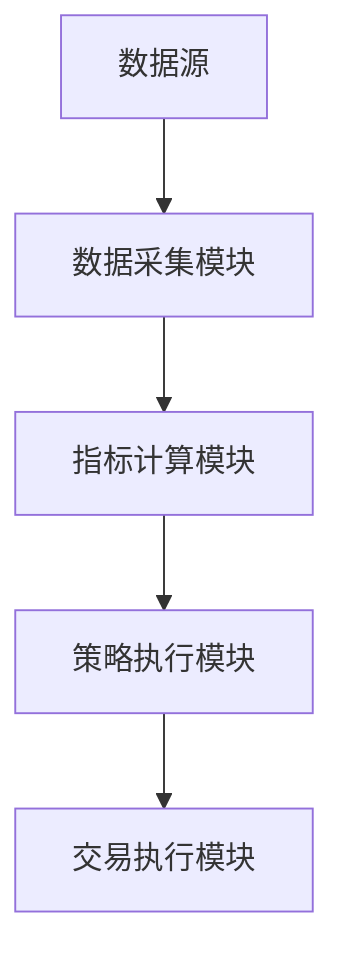

                 


# 威廉·欧奈尔的技术面与基本面结合策略

## 关键词：技术分析，基本面分析，投资策略，威廉·欧奈尔，股票交易，指标分析，风险管理

## 摘要：  
本文深入探讨了威廉·欧奈尔的技术面与基本面结合的投资策略，分析了其核心概念、算法原理、系统架构及实现，并通过实际案例展示了策略的应用。文章结合技术分析和基本面分析的优势，提供了从理论到实践的全面指导。

## 正文

### 第一部分：背景介绍

#### 第1章：技术分析与基本面分析

##### 1.1 技术分析基础
- **技术分析的定义**：通过研究历史价格数据来预测未来走势的方法。
- **技术分析的特点**：侧重价格形态、趋势线、技术指标等。
- **技术分析与基本面分析的对比**：技术分析更注重市场情绪和趋势，而基本面分析关注公司的财务状况和行业地位。

##### 1.2 基本面分析基础
- **基本面分析的定义**：通过研究公司财务报表、行业地位等基本面因素来评估股票价值。
- **基本面分析的特点**：关注公司的盈利能力、成长性等内在价值。
- **技术分析与基本面分析的优缺点对比表**

| 对比维度         | 技术分析                     | 基本面分析                   |
|------------------|------------------------------|------------------------------|
| 适用周期         | 短期到中期                   | 长期                         |
| 数据来源         | 历史价格数据                 | 财务报表、行业数据           |
| 优势             | 灵敏捕捉短期趋势             | 提供长期投资价值判断         |
| 局限             | 易受市场情绪影响             | 数据滞后，难以捕捉短期变化   |

##### 1.3 技术面与基本面结合的意义
- 结合两者可弥补单一分析的不足，提供更全面的投资决策依据。
- 技术面分析帮助识别入场时机，基本面分析确认投资标的的价值。

### 第二部分：技术面与基本面结合的核心概念

#### 第2章：技术面与基本面的结合原理

##### 2.1 技术面与基本面的互补关系
- 技术面分析用于捕捉市场趋势和短期波动，基本面分析用于评估长期投资价值。
- 例如，使用技术指标筛选出超跌股票，再通过基本面分析确认其潜在价值。

##### 2.2 结合策略的核心要素
- **技术指标**：如RSI、MACD等，用于筛选股票。
- **基本面数据**：如市盈率、ROE等，用于确认股票价值。
- **策略执行条件**：如价格突破趋势线并结合高ROE企业。

### 第三部分：策略开发与优化

#### 第3章：策略开发流程

##### 3.1 策略开发步骤
- **数据收集**：收集历史价格数据和财务报表数据。
- **指标计算**：计算技术指标（如RSI、MACD）和基本面指标（如市盈率、ROE）。
- **策略筛选**：根据设定的条件筛选出符合条件的股票。
- **策略测试**：对策略进行回测，评估其表现。

##### 3.2 策略优化方法
- **参数优化**：调整技术指标参数，如RSI的计算周期。
- **风险控制**：设置止损点，控制回撤幅度。
- **动态调整**：根据市场变化调整策略条件。

### 第四部分：系统分析与架构设计

#### 第4章：系统架构设计

##### 4.1 系统功能设计
- **数据采集模块**：负责收集股票的历史价格和财务数据。
- **指标计算模块**：计算技术指标和基本面指标。
- **策略执行模块**：根据策略条件生成买卖信号。

##### 4.2 系统架构图



### 第五部分：项目实战

#### 第5章：实战案例

##### 5.1 环境安装
- 安装Python和相关库（如Pandas、Matplotlib、Yahoo Finance API）。

##### 5.2 核心代码实现

```python
import pandas as pd
import yfinance as yf
import matplotlib.pyplot as plt

# 下载数据
data = yf.download('AAPL', start='2020-01-01', end='2023-12-31')

# 计算RSI
def calculate_rsi(data, period=14):
    delta = data['Close'].diff().dropna()
    up = delta.where(delta > 0, 0)
    down = delta.where(delta < 0, 0)
    rs = up.rolling(period).mean() / down.rolling(period).mean()
    rsi = 100 - (100 - rs.rolling(period).mean().fillna(0))
    return rsi

data['RSI'] = calculate_rsi(data)

# 计算MACD
def calculate_macd(data, fast_period=12, slow_period=26):
    ema_fast = data['Close'].ewm(span=fast_period, adjust=False).mean()
    ema_slow = data['Close'].ewm(span=slow_period, adjust=False).mean()
    macd = ema_fast - ema_slow
    return macd

data['MACD'] = calculate_macd(data)

# 绘制图表
plt.figure(figsize=(12, 6))
plt.subplot(3, 1, 1)
data['Close'].plot(title='AAPL Close Price')
plt.subplot(3, 1, 2)
data['RSI'].plot(title='RSI')
plt.subplot(3, 1, 3)
data['MACD'].plot(title='MACD')
plt.show()
```

##### 5.3 实战分析
- 使用RSI和MACD指标筛选出超卖股票，结合高ROE的企业进行投资。
- 示例代码展示了如何计算RSI和MACD指标，并绘制相关图表。

### 第六部分：总结与展望

#### 第6章：总结与建议

##### 6.1 策略总结
- 结合技术面和基本面分析，能够有效提高投资决策的科学性和准确性。
- 技术面分析提供短期交易信号，基本面分析确保投资标的长期价值。

##### 6.2 投资建议
- 根据市场环境调整策略参数，保持策略的灵活性。
- 定期进行策略回测，评估策略的有效性。

##### 6.3 注意事项
- 风险管理是投资成功的关键，设置止损点和止盈点。
- 避免过度依赖单一指标，结合多种指标进行综合分析。

##### 6.4 拓展阅读
- 推荐学习其他技术指标和基本面分析方法，如相对强弱指数（RSI）、移动平均收敛散度（MACD）、市盈率（P/E）等。

### 作者：AI天才研究院 & 禅与计算机程序设计艺术

---

通过以上步骤，威廉·欧奈尔的技术面与基本面结合策略得以全面阐述，从理论到实践，为投资者提供了科学的投资方法。

