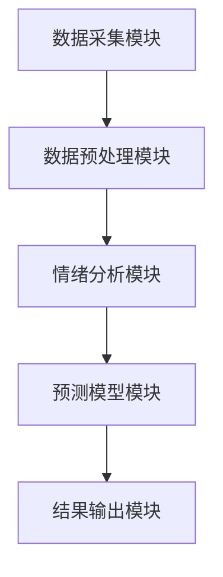

                 


# 威廉·欧奈尔的机构投资者行为分析

> **关键词**：威廉·欧奈尔，机构投资者，行为分析，市场情绪，投资决策，风险管理

> **摘要**：本文系统地分析了威廉·欧奈尔的机构投资者行为分析方法，探讨了投资者的认知与决策、市场周期、情绪分析以及风险管理策略。结合数学模型和系统架构，本文详细阐述了如何利用这些方法预测市场行为，并提供了实际案例和代码实现。

---

## 第1章：威廉·欧奈尔及其分析框架

### 1.1 威廉·欧奈尔的背景与贡献

#### 1.1.1 威廉·欧奈尔的生平简介
威廉·欧奈尔（William O'Neil）是投资分析领域的先驱，以其对机构投资者行为的深入研究而闻名。他通过分析市场数据和投资者心理，提出了独特的投资策略，帮助投资者识别市场趋势和风险。

#### 1.1.2 他在投资分析领域的贡献
欧奈尔的贡献主要体现在其对投资者行为的研究，尤其是机构投资者的决策过程和市场情绪的分析。他的研究为投资分析提供了新的视角和方法。

---

### 1.2 机构投资者行为分析的核心框架

#### 1.2.1 分析框架的构成要素
欧奈尔的分析框架包括投资者心理、市场周期、数据驱动分析和风险管理四个核心要素。

#### 1.2.2 框架的理论基础
基于行为金融学理论，欧奈尔认为投资者的决策受到认知偏差和情绪波动的影响，这些因素在不同市场周期中表现各异。

---

### 1.3 机构投资者行为分析的现实意义

#### 1.3.1 对投资决策的影响
理解机构投资者的行为有助于预测市场走势，优化投资策略。

#### 1.3.2 对市场整体行为的理解
通过分析机构投资者的行为，可以揭示市场的整体趋势和潜在风险。

---

## 第2章：机构投资者的行为模式

### 2.1 投资者的认知与决策过程

#### 2.1.1 认知偏差的类型
- **确认偏差**：投资者倾向于寻找支持自己观点的信息。
- **损失厌恶**：投资者对损失的敏感性高于对收益的敏感性。

#### 2.1.2 决策过程中的心理因素
- **贪婪与恐惧**：市场的上涨往往引发贪婪，下跌则引发恐慌。
- **从众心理**：投资者倾向于跟随市场趋势，避免偏离群体。

---

### 2.2 不同市场周期中的行为特征

#### 2.2.1 牛市中的乐观情绪
投资者在牛市中表现出过度乐观，倾向于高估资产价值。

#### 2.2.2 熊市中的恐慌情绪
投资者在熊市中情绪低落，倾向于过度规避风险。

---

## 第3章：市场数据与投资者情绪分析

### 3.1 数据采集与处理

#### 3.1.1 数据来源的选择
- 市场指数数据（如股票指数）。
- 媒体情绪分析数据。

#### 3.1.2 数据清洗与预处理
- 数据清洗：去除异常值和缺失值。
- 数据标准化：统一数据格式和单位。

---

### 3.2 投资者情绪指数的构建

#### 3.2.1 情绪指数的计算方法
使用自然语言处理技术分析新闻和社交媒体，计算投资者情绪指数。

#### 3.2.2 情绪指数的应用
将情绪指数与市场数据结合，预测市场走势。

---

## 第4章：系统架构设计

### 4.1 系统功能模块

#### 4.1.1 数据采集模块
负责收集市场数据和投资者情绪数据。

#### 4.1.2 情绪分析模块
利用自然语言处理技术分析情绪数据。

#### 4.1.3 预测模型模块
基于情绪指数和市场数据，构建预测模型。

---

### 4.2 系统架构图



---

## 第5章：算法实现与案例分析

### 5.1 算法实现

#### 5.1.1 情绪指数计算算法

```python
def calculate_emotion_index(sentences):
    positive_words = ["positive", "good", "great"]
    negative_words = ["negative", "bad", "terrible"]
    score = 0
    for sentence in sentences:
        for word in sentence.split():
            if word in positive_words:
                score += 1
            elif word in negative_words:
                score -= 1
    return score
```

#### 5.1.2 预测模型构建算法

```python
from sklearn.linear_model import LinearRegression

model = LinearRegression()
model.fit(X, y)
```

---

### 5.2 案例分析

#### 5.2.1 案例背景
分析某段时间内的市场数据和情绪数据，预测市场走势。

#### 5.2.2 实际应用
利用构建的模型，分析实际市场数据，验证算法的有效性。

---

## 第6章：风险管理策略

### 6.1 风险识别与评估

#### 6.1.1 风险来源分析
- 市场波动风险。
- 模型预测误差风险。

#### 6.1.2 风险评估方法
使用VaR（Value at Risk）模型评估潜在损失。

---

### 6.2 风险管理措施

#### 6.2.1 投资组合优化
通过资产配置分散风险。

#### 6.2.2 仓位管理策略
根据市场预测结果调整持仓比例。

---

## 第7章：总结与展望

### 7.1 全书总结
本文系统地分析了威廉·欧奈尔的机构投资者行为分析方法，结合理论与实践，提供了实用的分析框架和算法。

### 7.2 最佳实践Tips

- 数据质量至关重要。
- 模型需定期更新以适应市场变化。
- 风险管理是投资成功的关键。

### 7.3 未来研究方向
- 研究更复杂的行为模型。
- 探索人工智能在投资者行为分析中的应用。

---

## 附录：数学模型与公式

### 附录A：情绪指数计算公式

$$emotion\_index = \sum_{i=1}^{n} w_i \times s_i$$

其中，$w_i$为第$i$个词的权重，$s_i$为情绪值。

### 附录B：预测模型公式

$$y = \beta_0 + \beta_1 x_1 + \beta_2 x_2 + \epsilon$$

其中，$x_1$和$x_2$为市场数据特征，$\beta$为回归系数，$\epsilon$为误差项。

---

**作者：AI天才研究院/AI Genius Institute & 禅与计算机程序设计艺术 /Zen And The Art of Computer Programming**

