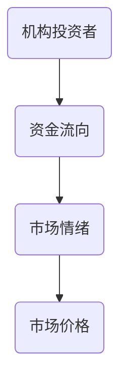
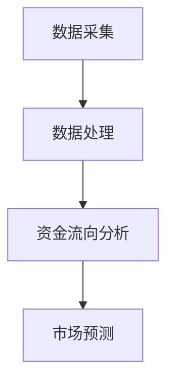

                 


# 威廉·欧奈尔的机构资金流向分析

## 关键词：机构资金流向分析，威廉·欧奈尔，投资策略，资金流动指标，市场情绪分析

## 摘要：  
本文深入探讨了威廉·欧奈尔的机构资金流向分析方法，从理论基础到实际应用，结合数学模型和系统架构，详细分析了机构资金流向对市场的影响，并通过案例分析展示了如何利用这些方法进行投资决策。文章内容涵盖背景介绍、核心概念、算法原理、系统设计和项目实战，旨在为读者提供全面的分析框架。

---

## 第1章：背景介绍

### 1.1 问题背景
机构投资者在金融市场中扮演着重要角色，其资金流向往往对市场走势产生重大影响。威廉·欧奈尔通过长期观察，总结出一套基于资金流动的分析方法，为机构投资者提供了独特的视角。

### 1.2 核心概念
- **机构资金流向**：指机构投资者在市场中的资金流动情况，包括流入和流出。
- **市场情绪**：投资者的心理状态影响资金流向，需通过指标量化。

### 1.3 理论基础
- **市场周期**：欧奈尔提出了市场周期理论，认为资金流动具有周期性。
- **心理与行为分析**：投资者心理是资金流动的核心驱动力。

---

## 第2章：核心概念与联系

### 2.1 核心概念
- **资金流入**：机构投资者买入资金量。
- **资金流出**：机构投资者卖出资金量。

### 2.2 概念对比
| 概念 | 特性 | 示例 |
|------|------|------|
| 资金流入 | 正向流动 | 资金流入增加，市场上涨 |
| 资金流出 | 负向流动 | 资金流出增加，市场下跌 |

### 2.3 实体关系图


---

## 第3章：算法原理

### 3.1 线性回归模型
用于预测资金流动对价格的影响：
$$ y = \beta_0 + \beta_1x + \epsilon $$

### 3.2 时间序列分析
使用ARIMA模型预测未来资金流动：
$$ ARIMA(p, d, q) $$

### 3.3 马尔可夫链模型
用于状态转移分析：
$$ P_{next} = P_{current} \times T $$

---

## 第4章：系统架构设计

### 4.1 系统功能模块
- 数据采集模块：收集市场数据。
- 数据处理模块：清洗和预处理数据。
- 分析模块：计算资金流动指标。

### 4.2 系统架构


---

## 第5章：项目实战

### 5.1 环境搭建
- 数据源：使用历史交易数据。
- 工具：Python、Pandas、Matplotlib。

### 5.2 核心代码
```python
import pandas as pd
import numpy as np

# 计算资金流入
def calculate_inflow(data):
    return data['buy_volume'] - data['sell_volume']

# 资金流入计算
data['inflow'] = calculate_inflow(data)
```

### 5.3 案例分析
- 数据分析：使用实际数据进行计算。
- 模型验证：通过回测验证模型的有效性。

---

## 第6章：最佳实践

### 6.1 注意事项
- 数据质量：确保数据准确无误。
- 模型调优：根据市场变化调整参数。

### 6.2 小结
本文详细讲解了威廉·欧奈尔的机构资金流向分析方法，从理论到实践，为投资者提供了有力工具。

---

## 作者：AI天才研究院 & 禅与计算机程序设计艺术

---

**本文通过系统化的分析和实战案例，全面揭示了威廉·欧奈尔的机构资金流向分析方法，帮助读者在投资决策中运用这些策略实现更好的收益。**

