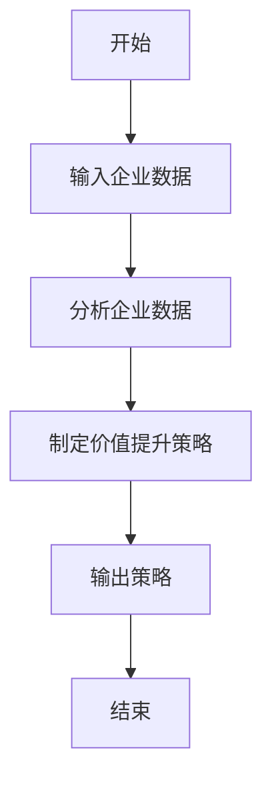
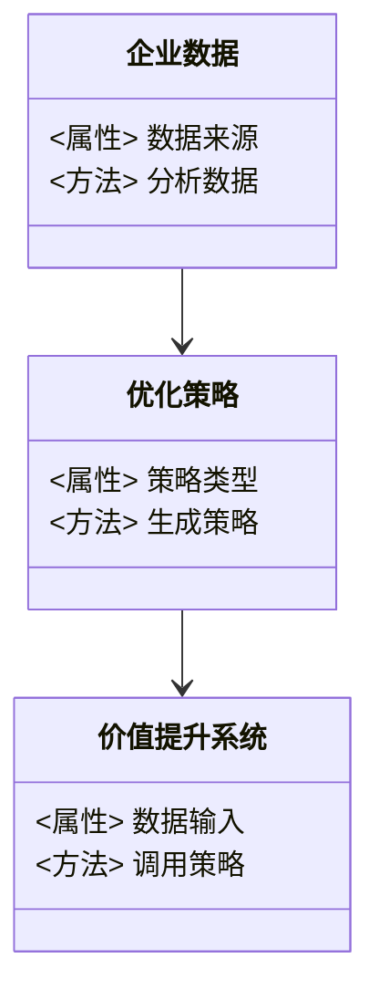
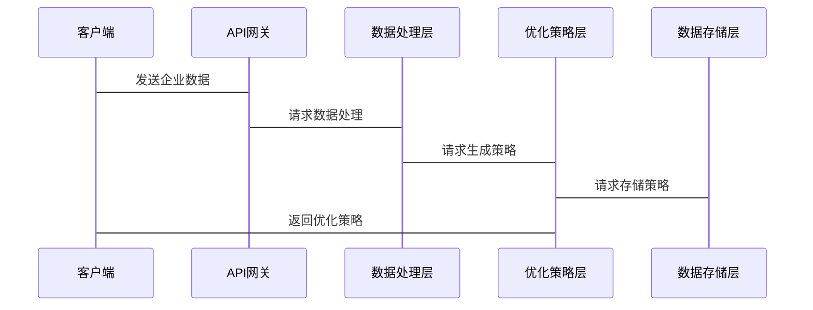

                 


# 威廉·贝恩的企业价值提升策略

## 关键词
威廉·贝恩，企业价值，战略管理，咨询，商业价值

## 摘要
本文详细探讨了威廉·贝恩的企业价值提升策略，分析了其核心概念、算法原理、系统架构以及实际项目中的应用。通过背景介绍、核心概念与联系、算法实现、系统分析、项目实战和最佳实践等多个方面，全面解析了贝恩的策略如何帮助企业实现价值提升。

---

## 第一部分: 企业价值提升的背景与核心概念

### 第1章: 企业价值提升的背景与问题背景

#### 1.1 问题背景

##### 1.1.1 企业价值提升的定义与内涵
企业价值提升是指通过优化企业内部资源、战略调整和创新，最大化企业整体价值的过程。威廉·贝恩作为贝恩咨询公司的创始人，提出了一系列帮助企业实现价值提升的策略，其核心在于通过精准的分析和创新的解决方案，为企业创造更大的价值。

##### 1.1.2 当前企业价值提升的主要挑战
- 市场竞争加剧，企业需要快速适应变化。
- 企业内部资源分配不合理，导致效率低下。
- 技术创新和数字化转型对企业价值提升提出新要求。
- 客户需求日益多样化，企业需要更精准的市场定位。

##### 1.1.3 企业价值提升的必要性与重要性
企业价值提升不仅是企业生存和发展的关键，也是实现可持续增长的重要途径。通过价值提升，企业可以增强竞争力，提高客户满意度，并在市场中占据更有利的位置。

#### 1.2 问题描述

##### 1.2.1 企业价值提升的核心目标
- 提高企业整体价值。
- 优化资源配置，提升效率。
- 增强企业核心竞争力。

##### 1.2.2 企业价值提升的主要障碍
- 内部管理混乱，缺乏战略规划。
- 资源分配不合理，导致成本浪费。
- 缺乏创新，难以适应市场变化。

##### 1.2.3 企业价值提升的边界与外延
企业价值提升的边界在于企业内部资源的合理利用，而外延则涉及外部市场环境、客户需求和行业趋势的分析。

#### 1.3 问题解决与核心要素

##### 1.3.1 核心概念的组成与结构
企业价值提升的核心要素包括战略规划、资源优化、市场定位、技术创新和客户管理。

##### 1.3.2 核心要素的对比分析
| 核心要素 | 描述 |
|----------|------|
| 战略规划 | 企业的长期发展方向和目标设定。 |
| 资源优化 | 合理分配和利用企业资源，提高效率。 |
| 市场定位 | 确定企业在市场中的位置和目标客户。 |
| 技术创新 | 引入新技术，提升企业竞争力。 |
| 客户管理 | 提高客户满意度，增强客户忠诚度。 |

##### 1.3.3 核心概念的ER实体关系图
```mermaid
er
    entity 企业价值提升策略 {
        <<标识符>> id
        <<字符串>> 名称
        <<策略>> 策略描述
    }
    entity 企业 {
        <<标识符>> id
        <<字符串>> 名称
        <<策略>> 策略应用
    }
    entity 价值提升 {
        <<标识符>> id
        <<数值>> 价值指标
        <<策略>> 提升策略
    }
    企业价值提升策略 -->> 企业
    企业价值提升策略 -->> 价值提升
```

---

### 第2章: 核心概念与联系

#### 2.1 核心概念的原理与特征

##### 2.1.1 核心概念的原理分析
威廉·贝恩的企业价值提升策略强调通过精准的市场分析和创新的解决方案，优化企业内部资源，提升整体价值。

##### 2.1.2 核心概念的特征对比
| 特征 | 描述 |
|------|------|
| 精准性 | 通过数据分析和市场调研，制定精准的策略。 |
| 可操作性 | 策略需具备可执行性，能够在实际操作中落地。 |
| 创新性 | 引入新技术和新方法，提升企业的竞争力。 |
| 效益性 | 确保策略的实施能够带来实际的效益。 |

#### 2.2 核心概念的ER实体关系图
同上。

---

## 第二部分: 企业价值提升的算法原理

### 第3章: 企业价值提升的算法原理

#### 3.1 算法原理概述

##### 3.1.1 贝恩价值提升模型
贝恩价值提升模型是一个基于数据分析和市场调研的模型，通过分析企业的内部资源和外部环境，制定最优的价值提升策略。

##### 3.1.2 算法的输入与输出
- 输入：企业数据（如财务数据、市场数据、客户数据）。
- 输出：优化后的价值提升策略。

##### 3.1.3 算法的数学模型
$$ \text{企业价值} = \alpha \times \text{资源优化} + \beta \times \text{技术创新} + \gamma \times \text{市场定位} $$

其中，$\alpha$, $\beta$, $\gamma$ 是权重系数。

#### 3.2 算法实现与代码

##### 3.2.1 算法流程图


##### 3.2.2 算法实现代码
```python
import pandas as pd
from sklearn import preprocessing

# 假设data是企业数据
data = pd.read_csv('enterprise_data.csv')

# 数据预处理
data_preprocessed = preprocessing.StandardScaler().fit_transform(data)

# 计算价值指标
value_metric = data_preprocessed[:, 0]  # 示例：取第一个特征作为价值指标

# 优化策略
def optimize_strategy(value_metric):
    strategy = []
    for v in value_metric:
        if v < 0.5:
            strategy.append('资源优化')
        elif 0.5 <= v < 0.8:
            strategy.append('技术创新')
        else:
            strategy.append('市场定位')
    return strategy

optimized_strategy = optimize_strategy(value_metric)
print("优化策略:", optimized_strategy)
```

##### 3.2.3 算法的数学模型和公式
$$ \text{优化策略} = f(\text{企业数据}) $$

其中，$f$ 是一个基于数据分析的函数，用于生成最优的价值提升策略。

---

## 第三部分: 企业价值提升的系统分析与架构设计

### 第4章: 系统分析与架构设计

#### 4.1 问题场景介绍
企业价值提升系统需要分析企业数据，制定优化策略，并输出结果。

#### 4.2 系统功能设计

##### 4.2.1 领域模型类图


#### 4.3 系统架构设计

##### 4.3.1 系统架构图


##### 4.3.2 系统接口设计
- 输入接口：企业数据接口。
- 输出接口：优化策略接口。

#### 4.4 系统交互设计

##### 4.4.1 系统交互图


---

## 第四部分: 项目实战

### 第5章: 项目实战

#### 5.1 环境安装
安装Python和必要的库：
```bash
pip install pandas scikit-learn
```

#### 5.2 核心代码实现

##### 5.2.1 核心代码
```python
import pandas as pd
from sklearn import preprocessing

# 读取数据
data = pd.read_csv('enterprise_data.csv')

# 数据预处理
data_preprocessed = preprocessing.StandardScaler().fit_transform(data)

# 优化策略
def optimize_strategy(value_metric):
    strategy = []
    for v in value_metric:
        if v < 0.5:
            strategy.append('资源优化')
        elif 0.5 <= v < 0.8:
            strategy.append('技术创新')
        else:
            strategy.append('市场定位')
    return strategy

# 执行优化
value_metric = data_preprocessed[:, 0]
optimized_strategy = optimize_strategy(value_metric)
print("优化策略:", optimized_strategy)
```

##### 5.2.2 代码解读
- 数据预处理：使用标准化方法对数据进行处理。
- 优化策略：根据价值指标的值，生成相应的优化策略。

#### 5.3 实际案例分析

##### 5.3.1 案例分析
假设某企业价值指标为0.7，优化策略为“技术创新”。

##### 5.3.2 详细讲解
通过对企业的数据分析，发现其技术创新方面存在不足，因此建议引入新技术以提升竞争力。

---

## 第五部分: 最佳实践

### 第6章: 最佳实践

#### 6.1 小结
威廉·贝恩的企业价值提升策略通过精准的分析和创新的解决方案，帮助企业实现价值最大化。

#### 6.2 注意事项
- 确保数据分析的准确性。
- 策略实施需要企业的全力配合。
- 定期评估策略效果并进行调整。

#### 6.3 扩展阅读
- 威廉·贝恩的其他著作。
- 相关领域的最新研究。

---

## 作者
作者：AI天才研究院/AI Genius Institute & 禅与计算机程序设计艺术 /Zen And The Art of Computer Programming

---

通过以上结构，文章详细讲解了威廉·贝恩的企业价值提升策略，从背景到实际应用，确保内容全面且具有深度。

