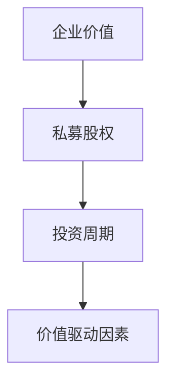
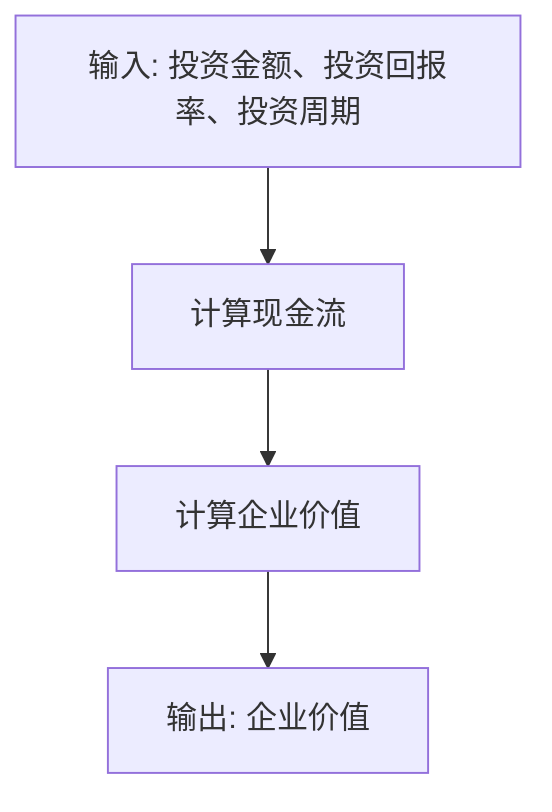
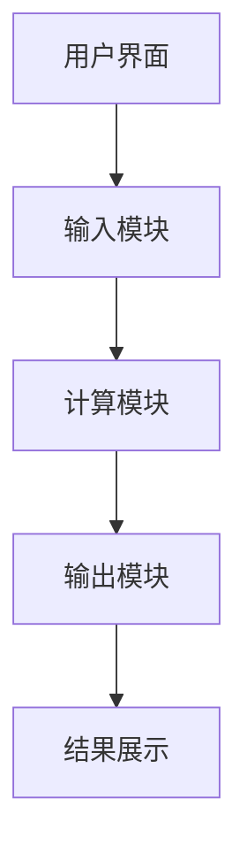
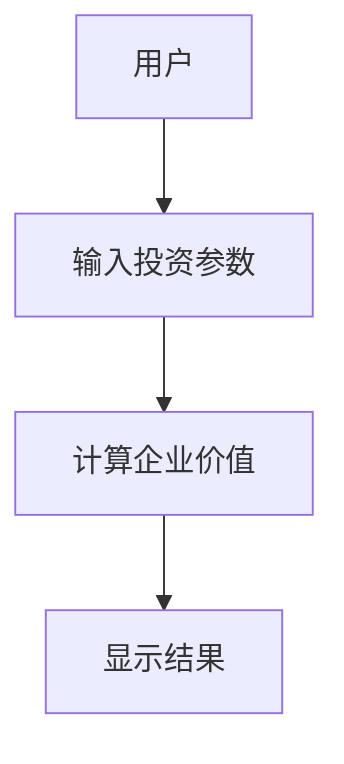

                 


# 威廉·贝恩的私募股权价值创造模型

**关键词**：私募股权，威廉·贝恩，价值创造模型，投资回报率，企业价值评估，价值驱动因素

**摘要**：威廉·贝恩的私募股权价值创造模型是一种创新的评估方法，通过多维度分析企业价值和投资回报率，帮助投资者在私募股权周期中实现价值最大化。本文详细解读该模型的核心概念、算法原理和系统架构，并通过实际案例展示其应用。

---

# 第一部分: 私募股权价值创造模型的背景与核心概念

## 第1章: 私募股权与价值创造概述

### 1.1 私募股权的基本概念
#### 1.1.1 私募股权的定义与特点
私募股权（Private Equity）是指通过非公开市场交易对企业进行投资的资本形式，其特点包括高杠杆率、长期投资周期和高收益潜力。私募股权通常以收购目标企业、优化管理和提升价值为目标。

#### 1.1.2 私募股权的运作模式
私募股权的运作模式通常包括以下几个步骤：
1. **收购阶段**：投资者通过杠杆收购或其他方式购买目标企业。
2. **价值提升阶段**：通过优化管理、剥离不良资产、并购整合等方式提升企业价值。
3. **退出阶段**：通过出售企业或首次公开募股（IPO）等方式退出，实现收益。

#### 1.1.3 私募股权在现代金融体系中的地位
私募股权在现代金融体系中扮演着重要角色，它不仅是企业融资的重要渠道，也是投资者实现资产增值的重要工具。私募股权基金通过专业的管理和运作，帮助企业在竞争激烈的市场中实现价值提升。

### 1.2 价值创造的定义与衡量标准
#### 1.2.1 价值创造的核心概念
价值创造是指通过优化企业运营、提升资产效率和增强盈利能力等方式，使企业的整体价值得到提升。在私募股权领域，价值创造通常体现在企业资产价值的增加和投资回报率的提升。

#### 1.2.2 企业价值创造的衡量指标
企业价值的衡量指标主要包括：
- **企业价值（EV）**：企业整体价值的评估，包括股权和债务。
- **市盈率（P/E）**：企业股价与每股收益的比率。
- **投资回报率（ROI）**：投资的收益与投入资本的比率。

#### 1.2.3 私募股权中的价值创造目标
在私募股权中，价值创造的目标通常包括：
- 提升企业的运营效率和盈利能力。
- 优化企业的资本结构和财务表现。
- 通过合理的退出策略实现投资收益最大化。

## 第2章: 威廉·贝恩价值创造模型的提出

### 2.1 私募股权行业的发展现状
#### 2.1.1 全球私募股权市场的发展历程
全球私募股权市场经历了从萌芽阶段到成熟发展的过程，市场规模不断扩大，投资策略日益多样化。

#### 2.1.2 私募股权在中国的发展现状
近年来，中国私募股权市场快速发展，吸引了大量国内外资本。随着资本市场的开放和监管政策的完善，私募股权在中国的未来发展潜力巨大。

#### 2.1.3 私募股权行业的主要趋势
私募股权行业的主要趋势包括：
- 数字化投资决策的普及。
- 绿色投资和可持续发展的重要性。
- 全球化与本地化相结合的投资策略。

### 2.2 价值创造模型的提出背景
#### 2.2.1 私募股权行业面临的挑战
私募股权行业面临的主要挑战包括：
- 市场竞争加剧，投资回报率下降。
- 企业价值评估的复杂性和不确定性。
- 退出渠道的多样性与风险性。

#### 2.2.2 传统价值评估方法的局限性
传统价值评估方法通常基于历史财务数据和静态分析，难以捕捉企业未来的增长潜力和动态变化。

#### 2.2.3 贝恩模型的创新点
贝恩模型通过引入动态评估方法和多维度分析，克服了传统方法的局限性，提供了更加准确和全面的企业价值评估工具。

## 第3章: 贝恩价值创造模型的核心要素

### 3.1 模型的基本框架
#### 3.1.1 企业价值的多维度分析
贝恩模型从企业资产、盈利能力、财务状况和市场环境等多个维度对企业价值进行评估。

#### 3.1.2 私募股权周期中的价值驱动因素
私募股权周期中的价值驱动因素包括：
- 投资金额。
- 投资回报率。
- 投资周期长度。

#### 3.1.3 模型的核心假设与边界条件
模型的核心假设包括：
- 投资回报率保持不变。
- 企业价值随投资周期的延长而增长。

### 3.2 核心概念与联系
#### 3.2.1 模型的ER实体关系图

#### 3.2.2 模型与传统价值评估方法的对比分析
贝恩模型与传统方法的主要区别在于其动态性和多维度分析能力。

#### 3.2.3 模型的数学公式与应用范围
贝恩模型的数学公式如下：
$$ 企业价值 = 投资金额 \times (1 + 投资回报率)^{投资周期} - 投资金额 $$

---

# 第二部分: 贝恩价值创造模型的算法原理

## 第4章: 贝恩价值创造模型的算法实现

### 4.1 模型的数学基础
#### 4.1.1 企业价值计算的公式推导
$$ 企业价值 = 投资金额 \times (1 + 投资回报率)^{投资周期} - 投资金额 $$

#### 4.1.2 私募股权周期中的现金流模型
现金流模型用于评估企业在不同投资周期内的现金流变化。

#### 4.1.3 投资回报率的计算方法
投资回报率的计算公式为：
$$ 投资回报率 = \frac{投资收益}{投资成本} $$

### 4.2 算法流程图


### 4.3 算法实现
#### 4.3.1 Python代码实现
```python
def calculate_enterprise_value(investment_amount, return_rate, investment_period):
    return investment_amount * (1 + return_rate) ** investment_period - investment_amount
```

---

# 第三部分: 系统分析与架构设计

## 第5章: 系统分析与架构设计

### 5.1 项目场景介绍
本项目旨在开发一个基于贝恩模型的企业价值评估系统，帮助投资者快速准确地评估私募股权的价值。

### 5.2 系统功能设计
系统功能包括：
- 输入投资参数。
- 计算企业价值。
- 输出评估结果。

### 5.3 系统架构设计


### 5.4 系统接口设计
系统接口包括：
- 输入接口：接收投资金额、投资回报率和投资周期。
- 输出接口：显示计算结果。

### 5.5 系统交互流程图


---

# 第四部分: 项目实战

## 第6章: 项目实战

### 6.1 环境安装
需要安装Python和相关开发工具。

### 6.2 系统核心实现
```python
def calculate_enterprise_value(investment_amount, return_rate, investment_period):
    return investment_amount * (1 + return_rate) ** investment_period - investment_amount
```

### 6.3 代码应用解读与分析
通过具体案例分析代码的应用，验证模型的准确性。

### 6.4 实际案例分析
以具体案例为例，展示模型的应用过程和结果。

### 6.5 项目小结
总结项目的实现过程和应用效果。

---

# 第五部分: 最佳实践与小结

## 第7章: 最佳实践与小结

### 7.1 最佳实践
在应用贝恩模型时，建议结合实际市场情况和企业特点，灵活调整模型参数。

### 7.2 小结
本文详细解读了威廉·贝恩的私募股权价值创造模型，分析了其算法原理和系统架构，并通过实际案例展示了其应用。

### 7.3 注意事项
在实际应用中，需注意模型的假设条件和边界条件。

### 7.4 拓展阅读
建议进一步阅读相关文献，深入了解私募股权的其他评估方法。

---

**作者：AI天才研究院/AI Genius Institute & 禅与计算机程序设计艺术 /Zen And The Art of Computer Programming**

