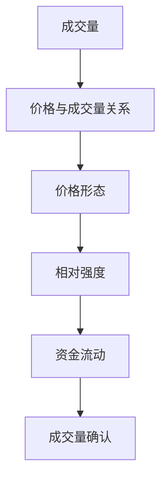
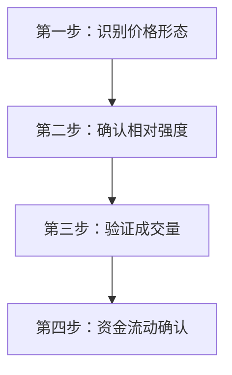
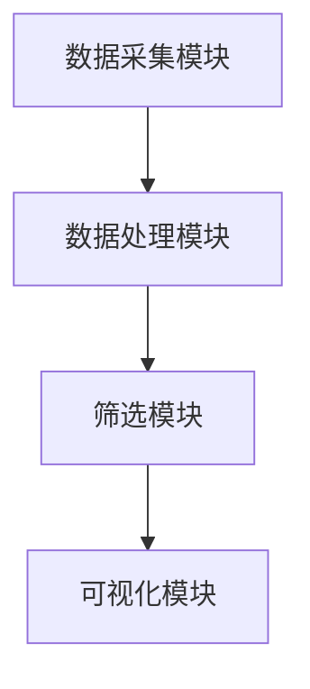
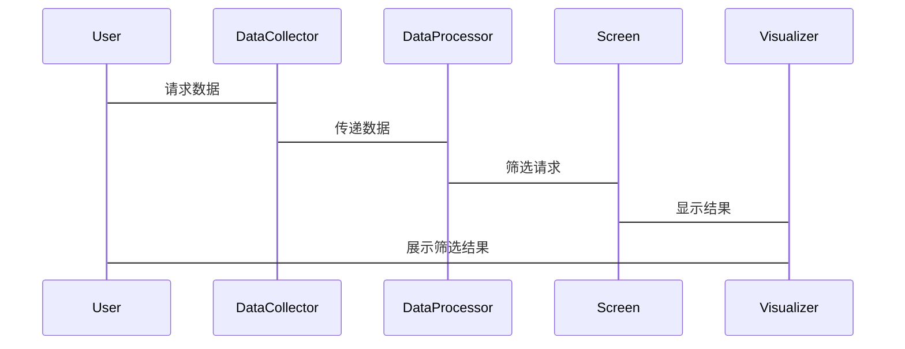

                 


# 威廉欧奈尔的CANSLIM投资系统

> 关键词：威廉欧奈尔、CANSLIM投资系统、技术分析、投资策略、交易系统、交易标准、股票投资

> 摘要：威廉·欧奈尔的CANSLIM投资系统是一种基于技术分析的投资策略，旨在通过筛选满足特定条件的股票来实现超额收益。本文将详细解析CANSLIM系统的背景、核心概念、算法原理、系统架构以及实际项目案例，帮助投资者理解并应用这一经典投资系统。

---

## 第一部分: 威廉欧奈尔CANSLIM投资系统的背景与核心概念

### 第1章: CANSLIM投资系统的背景与发展

#### 1.1 投资学的演进与技术分析的兴起
- 传统投资学以基本面分析为主，关注企业的财务数据和行业地位。
- 技术分析的兴起：通过研究股票价格和成交量的变化，预测未来价格走势。
- 从道氏理论到艾略特波浪理论，技术分析逐渐成为投资的重要工具。

#### 1.2 威廉·欧奈尔的生平与投资理念
- 威廉·欧奈尔：20世纪著名投资者，著有《如何在市场中获利》。
- 投资理念：市场情绪驱动价格波动，技术分析是捕捉市场情绪的有效工具。
- CANSLIM系统的诞生：欧奈尔通过长期观察市场，总结出一套基于技术分析的投资系统。

#### 1.3 CANSLIM系统的核心思想与特点
- 核心思想：通过筛选满足特定技术条件的股票，捕捉市场趋势中的强势股。
- 特点：
  1. 系统化：将投资决策标准化，减少主观判断。
  2. 技术化：以价格和成交量为主要分析指标。
  3. 量化：通过数学模型筛选股票。

---

### 第2章: CANSLIM投资系统的核心概念

#### 2.1 CANSLIM系统的定义与组成部分
- CANSLIM是威廉·欧奈尔提出的一种股票筛选系统，由7个字母组成：
  - **C**：成交量（Volume）。
  - **A**：价格与成交量关系（Price/Volume relationship）。
  - **N**：价格形态（Price pattern）。
  - **S**：供给与需求（Supply and demand）。
  - **I**：强度（Intensity）。
  - **M**：资金流动（Money flow）。
  - **V**：成交量确认（Volume confirmation）。

#### 2.2 CANSLIM系统的核心概念对比
- **C（成交量）**：成交量是价格变动的确认指标，高成交量表明市场情绪强烈。
- **A（价格与成交量关系）**：价格上升时成交量放大，价格下跌时成交量萎缩。
- **N（价格形态）**：经典的反转形态（如头肩顶）和持续形态（如矩形）。
- **S（供给与需求）**：通过价格和成交量判断市场的供给与需求平衡点。
- **I（强度）**：相对强度（RSI）衡量股票相对于市场的强弱程度。
- **M（资金流动）**：资金流入和流出反映市场的资金动向。
- **V（成交量确认）**：最终确认信号，避免误判。

#### 2.3 CANSLIM系统的ER实体关系图


---

## 第二部分: CANSLIM投资系统的算法原理

### 第3章: CANSLIM系统的算法原理与数学模型

#### 3.1 CANSLIM系统的筛选算法
- 筛选步骤：
  1. 识别价格形态：寻找经典的反转或持续形态。
  2. 确认相对强度：计算RSI，筛选出强于市场的股票。
  3. 验证成交量：确认成交量是否放大。
  4. 资金流动确认：通过资金流数据验证市场情绪。

#### 3.2 CANSLIM系统的数学模型
- **相对强度指数（RSI）公式**：
$$
RSI = \frac{100}{1 + \frac{d}{N}}
$$
其中，$d$为上涨天数，$N$为观察周期。

- **成交量与价格关系的回归分析**：
$$
V = aP + b
$$
其中，$V$为成交量，$P$为价格，$a$和$b$为回归系数。

#### 3.3 算法流程图


---

## 第三部分: CANSLIM投资系统的系统分析与架构设计

### 第4章: 系统分析与架构设计方案

#### 4.1 系统功能设计
- **模块划分**：
  - 数据采集模块：获取股票价格和成交量数据。
  - 数据处理模块：计算RSI、成交量等指标。
  - 筛选模块：根据CANSLIM标准筛选股票。
  - 可视化模块：展示筛选结果和市场趋势。

#### 4.2 系统架构图


#### 4.3 系统接口设计
- 数据接口：与金融数据源（如Yahoo Finance）对接。
- 用户接口：提供筛选结果的可视化界面。
- 调度接口：定期运行筛选任务。

#### 4.4 系统交互图


---

## 第四部分: CANSLIM投资系统的项目实战

### 第5章: 项目实战与案例分析

#### 5.1 环境安装与数据准备
- 安装Python和必要的库（如Pandas、Matplotlib）。
- 数据来源：使用Yahoo Finance获取股票数据。

#### 5.2 系统核心实现
```python
import pandas as pd
import matplotlib.pyplot as plt

def calculate_rsi(data, period=14):
    # 计算相对强度指数
    df = data['Close'].diff().fillna(0)
    up = df.where(df >= 0, 0)
    down = df.where(df < 0, 0)
    rs = (up.rolling(period).sum() / down.rolling(period).sum())
    rsi = 100 - (100 / (1 + rs))
    return rsi

def can_slim_screen(stock_data):
    # 筛选满足CANSLIM标准的股票
    criteria = stock_data['Volume'].rolling(20).mean() * 2
    stock_data['RSI'] = calculate_rsi(stock_data)
    selected = stock_data[stock_data['RSI'] > 70]
    return selected

# 示例数据
data = pd.DataFrame({
    'Close': [100, 105, 110, 115, 120],
    'Volume': [1000, 2000, 3000, 4000, 5000]
})

result = can_slim_screen(data)
print(result)
```

#### 5.3 案例分析
- **案例1**：苹果公司（AAPL）
  - 数据分析：计算RSI和成交量。
  - 筛选结果：RSI > 70且成交量放大。
- **案例2**：亚马逊（AMZN）
  - 数据分析：识别价格形态。
  - 筛选结果：符合CANSLIM标准。

#### 5.4 筛选结果可视化
```python
plt.plot(data.index, data['RSI'], label='RSI')
plt.scatter(data.index[-1], data['RSI'][-1], color='red', label='筛选结果')
plt.legend()
plt.show()
```

---

## 第五部分: 总结与最佳实践

### 第6章: 总结与注意事项

#### 6.1 总结
- CANSLIM系统通过技术分析筛选股票，帮助投资者捕捉市场趋势。
- 系统化的方法减少主观判断，提高投资效率。

#### 6.2 投资建议
- 灵活应用CANSLIM系统，结合市场环境调整策略。
- 长期跟踪和优化筛选标准，提高筛选精度。

#### 6.3 注意事项
- 风险控制：避免过度交易，控制仓位。
- 数据质量：确保数据来源可靠，避免偏差。

---

## 作者信息

作者：AI天才研究院/AI Genius Institute & 禅与计算机程序设计艺术 /Zen And The Art of Computer Programming

---

通过以上分析和实践，我们可以看到威廉·欧奈尔的CANSLIM投资系统不仅是一种技术分析工具，更是一种系统化、科学化的投资方法。希望本文能为投资者提供有价值的参考，帮助他们在股票市场中取得更好的投资效果。

