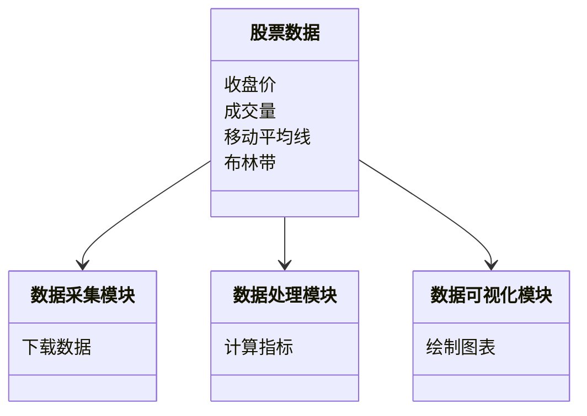
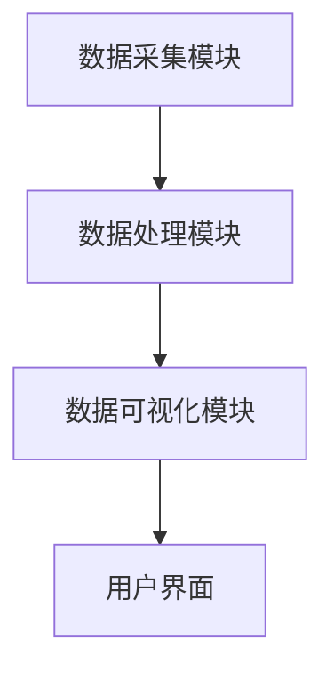

                 


# 威廉欧奈尔的图表分析技巧

## 关键词：威廉欧奈尔、图表分析、CANSLIM系统、股票投资、技术指标

## 摘要：  
威廉·欧奈尔是全球著名的投资专家，他的CANSLIM系统和图表分析技巧在金融界享有盛誉。本文将详细解析威廉欧奈尔的图表分析方法，探讨其背后的数学模型和算法原理，结合实际案例，展示如何通过技术手段实现图表分析的自动化与智能化。文章内容涵盖背景介绍、核心概念、系统架构、项目实战等，旨在帮助读者全面理解和掌握威廉欧奈尔的图表分析技巧。

---

# 第一部分: 威廉欧奈尔的图表分析技巧概述

## 第1章: 威廉欧奈尔与图表分析的背景

### 1.1 威廉欧奈尔的生平与投资理念

#### 1.1.1 威廉欧奈尔的早年经历
威廉·欧奈尔（William O'Neil）是美国著名投资专家，出生于1925年，毕业于纽约大学商学院。他在20世纪50年代开始涉足股票交易，逐渐发展出一套独特的投资分析方法，即CANSLIM系统。欧奈尔的职业生涯始于证券研究，他曾担任《巴伦周刊》的编辑，并在1963年创立了“欧奈尔投资俱乐部”，专注于股票筛选和投资策略的研究。

#### 1.1.2 欧奈尔投资理论的核心思想
欧奈尔的投资理论以“顺势而为”为核心，强调通过分析市场趋势和个股表现来捕捉投资机会。他认为，市场的波动性可以通过对价格和成交量的分析来预测，而CANSLIM系统正是基于这一思想构建的。

#### 1.1.3 欧奈尔对现代投资学的贡献
欧奈尔的CANSLIM系统将技术分析与基本面分析相结合，为现代投资学提供了新的思路。他的研究成果被广泛应用于机构投资和个人投资领域，并被写入多本经典投资书籍。

### 1.2 图表分析在金融投资中的地位

#### 1.2.1 图表分析的定义与特点
图表分析是一种通过研究价格和成交量的走势图来预测市场走势的技术分析方法。其特点在于直观、实时性强，能够帮助投资者快速捕捉市场信号。

#### 1.2.2 图表分析在股票投资中的应用
图表分析在股票投资中主要用于判断买入和卖出的时机，识别市场趋势，评估风险等。

#### 1.2.3 欧奈尔对图表分析的独特贡献
欧奈尔的CANSLIM系统将图表分析与股票筛选相结合，提出了独特的市场强度指标和成交量分析方法。

### 1.3 威廉欧奈尔的CANSLIM系统

#### 1.3.1 CANSLIM系统的定义
CANSLIM是威廉·欧奈尔提出的一种股票筛选系统，旨在通过分析股票的价格、成交量和市场趋势来识别具有上涨潜力的股票。

#### 1.3.2 CANSLIM系统的核心要素
- **C（Consistent）**：一致的市场趋势
- **A（Above Average Volume）**：高于平均水平的成交量
- **N（New High）**：创新高
- **S（Supply and Demand）**：供需关系
- **L（Line）**：趋势线
- **I（Institutional Support）**：机构支持
- **M（Market Strength）**：市场强度

#### 1.3.3 CANSLIM系统与其他投资系统的对比
与传统技术分析相比，CANSLIM系统更加注重股票的市场强度和机构动向，具有更强的实战性和可操作性。

### 1.4 本章小结
本章介绍了威廉·欧奈尔的生平、投资理念以及CANSLIM系统的核心思想，为后续的图表分析技巧奠定了基础。

---

## 第2章: 图表分析的核心概念与技巧

### 2.1 市场趋势的识别

#### 2.1.1 趋势线的定义与作用
趋势线是连接价格波动的主要趋势的直线，用于判断价格的支撑位和阻力位。

#### 2.1.2 支撑线与阻力线的分析
- **支撑线**：价格下跌时遇到支撑的水平线，通常被视为买入机会。
- **阻力线**：价格上涨时遇到阻力的水平线，通常被视为卖出机会。

#### 2.1.3 趋势强度的衡量方法
趋势强度可以通过价格波动幅度和成交量变化来衡量。

### 2.2 成交量分析

#### 2.2.1 成交量在图表分析中的重要性
成交量是价格变动的确认指标，反映了市场的活跃程度和资金流动情况。

#### 2.2.2 成交量与价格变动的关系
- 高成交量伴随价格上涨，表明市场看涨。
- 低成交量伴随价格下跌，表明市场看跌。

#### 2.2.3 成交量的形态分析
- **上升成交量**：价格上升，成交量也上升，表明市场买力强劲。
- **下降成交量**：价格下降，成交量也下降，表明市场卖压减弱。

### 2.3 相反的交易信号

#### 2.3.1 相反信号的定义
相反信号是指价格和成交量的变化方向相反，通常被视为趋势反转的信号。

#### 2.3.2 相反信号的类型
- **价格创新高，成交量创新低**：趋势反转信号。
- **价格创新低，成交量创新高**：趋势反转信号。

#### 2.3.3 相反信号的应用场景
相反信号通常出现在趋势的中期或末端，用于判断趋势的强弱和反转的可能性。

### 2.4 威廉欧奈尔的特殊图形

#### 2.4.1 杯形和柄形的定义
- **杯形**：价格在一段时间内形成一个杯状形态，表明市场底部。
- **柄形**：杯形之后出现一个较短的下降趋势，表明市场即将反转。

#### 2.4.2 其他特殊图形的分析
- **头肩形**：价格形成头肩形态，通常被视为趋势反转的信号。
- **双重顶**：价格形成双重顶形态，通常被视为趋势反转的信号。

#### 2.4.3 特殊图形的交易策略
特殊图形的交易策略通常包括在形态确认后介入，设置止损点，根据成交量变化调整仓位。

### 2.5 本章小结
本章详细介绍了图表分析的核心概念，包括趋势线、支撑线、阻力线、成交量分析以及特殊图形的识别和交易策略。

---

## 第3章: 图表分析的数学模型与算法原理

### 3.1 图表分析的数学基础

#### 3.1.1 时间序列分析的基本概念
时间序列分析是一种研究数据随时间变化的方法，常用于股票价格分析。

#### 3.1.2 移动平均线的数学公式
移动平均线（MA）的计算公式为：
$$ MA_t = \frac{1}{n} \sum_{i=1}^{n} P_{t-i} $$
其中，$P_{t-i}$ 是第 $t-i$ 个交易日的价格，$n$ 是移动的天数。

#### 3.1.3 布林带的计算方法
布林带的计算公式为：
$$ BB_{upper} = MA_t + n \times SD $$
$$ BB_{lower} = MA_t - n \times SD $$
其中，$SD$ 是标准差，$n$ 是系数，通常为2。

### 3.2 成交量分析的算法实现

#### 3.2.1 成交量指标的计算公式
成交量指标可以通过以下公式计算：
$$ V_t = \sum_{i=1}^{n} Volume_{t-i} $$

#### 3.2.2 成交量与价格关系的回归分析
回归分析可以用于研究成交量与价格之间的关系，公式如下：
$$ y = a + bx + \epsilon $$
其中，$y$ 是价格，$x$ 是成交量，$a$ 是截距，$b$ 是回归系数，$\epsilon$ 是误差项。

#### 3.2.3 成交量算法的优缺点
- **优点**：能够反映市场的活跃程度。
- **缺点**：受市场情绪影响较大，难以量化。

### 3.3 市场趋势的算法实现

#### 3.3.1 趋势线的算法实现
趋势线的算法实现可以通过以下步骤：
1. 收集价格数据。
2. 计算移动平均线。
3. 绘制趋势线。

#### 3.3.2 支撑线与阻力线的算法实现
支撑线和阻力线的算法实现可以通过以下步骤：
1. 收集价格数据。
2. 确定价格的高点和低点。
3. 绘制支撑线和阻力线。

#### 3.3.3 趋势强度的算法计算
趋势强度可以通过以下公式计算：
$$ Trend Strength = \frac{最高价 - 最低价}{最高价} \times 100 $$

### 3.4 本章小结
本章详细介绍了图表分析的数学模型和算法原理，为后续的系统实现奠定了基础。

---

## 第4章: 图表分析的系统架构与实现

### 4.1 图表分析系统的功能设计

#### 4.1.1 数据采集模块
数据采集模块负责从数据源获取股票价格和成交量数据。

#### 4.1.2 数据处理模块
数据处理模块负责对数据进行清洗、转换和计算技术指标。

#### 4.1.3 数据可视化模块
数据可视化模块负责将数据以图表形式展示，帮助用户直观分析市场趋势。

### 4.2 系统架构设计

#### 4.2.1 分层架构设计
系统架构采用分层设计，包括数据层、业务逻辑层和表示层。

#### 4.2.2 模块化设计
系统功能模块化设计，包括数据采集、数据处理、数据可视化等模块。

#### 4.2.3 系统接口设计
系统接口设计采用RESTful API，方便与其他系统集成。

### 4.3 系统实现的代码示例

#### 4.3.1 数据采集的Python代码
```python
import pandas as pd
import yfinance as yf

# 下载股票数据
data = yf.download('AAPL', start='2020-01-01', end='2023-12-31')
# 保存数据
data.to_csv('aapl.csv')
```

#### 4.3.2 数据处理的算法代码
```python
import pandas as pd
import numpy as np

# 计算移动平均线
data['MA'] = data['Close'].rolling(window=20).mean()

# 计算布林带
data['SD'] = data['Close'].rolling(window=20).std()
data['BB_upper'] = data['MA'] + 2 * data['SD']
data['BB_lower'] = data['MA'] - 2 * data['SD']
```

#### 4.3.3 数据可视化的代码实现
```python
import matplotlib.pyplot as plt

# 绘制价格和移动平均线
plt.plot(data['Close'], label='Close')
plt.plot(data['MA'], label='MA')
plt.legend()
plt.show()
```

### 4.4 本章小结
本章详细介绍了图表分析系统的功能设计和实现方案，为后续的项目实战奠定了基础。

---

## 第5章: 项目实战——基于威廉欧奈尔图表分析的股票筛选系统

### 5.1 项目背景与目标

#### 5.1.1 项目背景
随着市场的波动加剧，投资者需要一种高效的技术分析工具来筛选股票。

#### 5.1.2 项目目标
开发一个基于威廉欧奈尔CANSLIM系统的股票筛选系统，帮助投资者识别具有上涨潜力的股票。

### 5.2 项目需求分析

#### 5.2.1 功能需求
- 数据采集模块：实时采集股票数据。
- 数据处理模块：计算技术指标。
- 数据可视化模块：展示分析结果。

#### 5.2.2 技术需求
- 数据源：使用Yahoo Finance API。
- 数据处理：使用Python和Pandas库。
- 数据可视化：使用Matplotlib库。

### 5.3 系统功能设计

#### 5.3.1 领域模型


#### 5.3.2 系统架构


### 5.4 项目实现

#### 5.4.1 数据采集模块的实现
```python
import yfinance as yf

# 下载股票数据
data = yf.download('AAPL', start='2020-01-01', end='2023-12-31')
```

#### 5.4.2 数据处理模块的实现
```python
import pandas as pd
import numpy as np

# 计算移动平均线
data['MA'] = data['Close'].rolling(window=20).mean()

# 计算布林带
data['SD'] = data['Close'].rolling(window=20).std()
data['BB_upper'] = data['MA'] + 2 * data['SD']
data['BB_lower'] = data['MA'] - 2 * data['SD']
```

#### 5.4.3 数据可视化模块的实现
```python
import matplotlib.pyplot as plt

# 绘制价格和移动平均线
plt.plot(data['Close'], label='Close')
plt.plot(data['MA'], label='MA')
plt.legend()
plt.show()
```

### 5.5 项目测试与优化

#### 5.5.1 测试数据的选取
选取2020-2023年的股票数据进行测试。

#### 5.5.2 系统性能优化
优化数据处理模块的效率，减少计算时间。

### 5.6 项目总结

#### 5.6.1 项目成果
成功开发了一个基于威廉欧奈尔CANSLIM系统的股票筛选系统。

#### 5.6.2 经验总结
- 数据处理模块的效率是关键。
- 数据可视化模块需要直观易用。

### 5.7 本章小结
本章通过一个实际项目展示了如何将威廉欧奈尔的图表分析技巧应用于股票筛选系统，为读者提供了实践参考。

---

## 第6章: 图表分析的最佳实践与小结

### 6.1 图表分析的核心要点

#### 6.1.1 技术指标的选择
选择合适的技术指标是图表分析的关键。

#### 6.1.2 市场趋势的判断
准确判断市场趋势是投资成功的关键。

#### 6.1.3 成交量分析的重要性
成交量是价格变动的确认指标，不可忽视。

### 6.2 图表分析的注意事项

#### 6.2.1 市场环境的影响
市场环境的变化会影响图表分析的准确性。

#### 6.2.2 交易策略的制定
制定合理的交易策略是图表分析成功的关键。

#### 6.2.3 交易纪律的遵守
遵守交易纪律，严格执行交易计划。

### 6.3 图表分析的未来展望

#### 6.3.1 人工智能在图表分析中的应用
人工智能技术可以提升图表分析的效率和准确性。

#### 6.3.2 大数据技术在图表分析中的应用
大数据技术可以提供更多的数据支持，帮助投资者做出更明智的决策。

### 6.4 本章小结
本章总结了图表分析的核心要点和注意事项，并展望了未来的发展方向。

---

# 作者：AI天才研究院/AI Genius Institute & 禅与计算机程序设计艺术 /Zen And The Art of Computer Programming

---

以上是《威廉欧奈尔的图表分析技巧》的技术博客文章的完整目录和内容概要，具体内容需要根据实际需求进一步展开和详细撰写。

