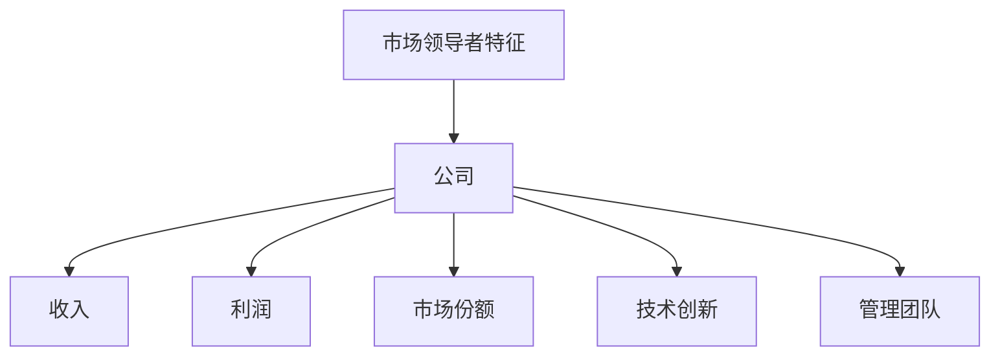
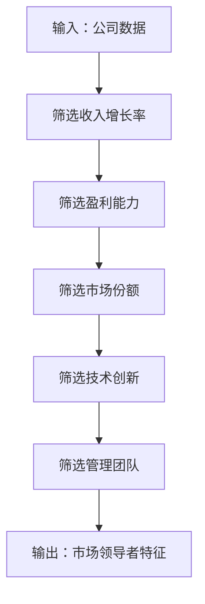
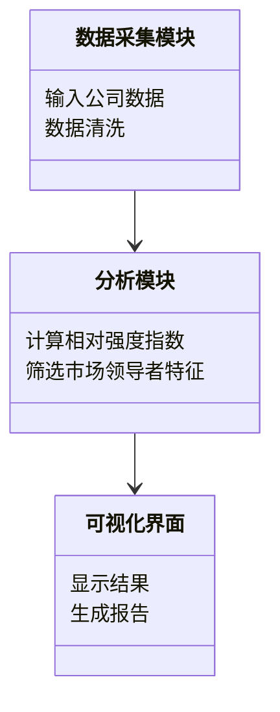
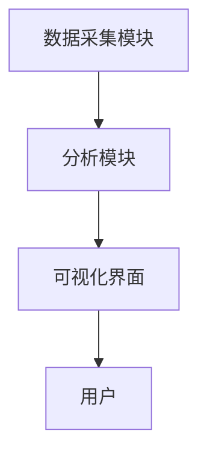

                 


# 《威廉欧奈尔的市场领导者特征》

**关键词**：威廉·欧奈尔，市场领导者特征，投资策略，相对强度指数，CANSLIM模型，数据分析

**摘要**：本文系统地分析了威廉·欧奈尔提出的市场领导者特征，探讨了其在投资策略中的应用。通过背景介绍、核心概念、算法原理、数学模型、系统架构、项目实战和最佳实践等方面，深入剖析了市场领导者特征的理论基础和实际应用，为投资者提供了科学的决策依据。

---

# 第一部分: 威廉·欧奈尔的市场领导者特征概述

## 第1章: 威廉·欧奈尔与市场领导者特征的背景介绍

### 1.1 威廉·欧奈尔的生平与投资理念

威廉·欧奈尔（William O'Neil）是20世纪著名的投资者和投资分析师，以其独特的投资策略和市场分析方法闻名。他创立了欧奈尔公司（O'Neil Securities）和《投资者商业日报》（Investors Business Daily），并提出了许多影响深远的投资理论，如CANSLIM模型。欧奈尔的投资哲学强调数据分析和市场情绪的结合，主张通过量化指标和形态分析来识别市场领导者。

### 1.2 市场领导者特征的核心概念

市场领导者特征是指在某一行业中占据主导地位，能够在市场中持续领先的企业特征。这些特征包括高收入增长率、盈利能力、市场份额、技术创新和稳定的管理团队。欧奈尔认为，这些特征能够帮助投资者识别出具有长期增长潜力的公司。

### 1.3 市场领导者特征的边界与外延

市场领导者特征的边界在于其核心要素的量化指标。外延则包括不同行业、不同规模的公司，以及不同市场周期中的表现。与其他相关概念（如竞争优势、市场支配地位）相比，市场领导者特征更注重动态变化和可量化性。

---

## 第2章: 市场领导者特征的核心概念与联系

### 2.1 核心概念原理

市场领导者特征的理论基础是欧奈尔的CANSLIM模型，该模型通过多个量化指标来评估公司的潜力。核心概念包括收入增长率、盈利能力、市场份额、技术创新和管理团队的稳定性。

### 2.2 核心概念属性特征对比表

| 特征维度 | 市场领导者特征 | 非市场领导者特征 |
|----------|----------------|------------------|
| 收入增长率 | 高              | 低或负          |
| 盈利能力 | 高              | 低或下降        |
| 市场份额  | 领导            | 跟随或无明显份额|
| 技术创新  | 领先            | 落后或无创新    |
| 管理团队  | 强大且稳定      | 薄弱或不稳定    |

### 2.3 ER实体关系图



---

## 第3章: 市场领导者特征的算法原理

### 3.1 算法原理概述

欧奈尔的CANSLIM模型通过以下步骤识别市场领导者：

1. **C**：公司分析（Company Analysis）  
   筛选收入增长率和盈利能力高的公司。

2. **A**：行业分析（Industry Analysis）  
   确保公司所在行业具有增长潜力。

3. **N**：新产品或服务（New Product or Service）  
   确认公司有技术创新或新产品推出。

4. **S**：市场领导地位（Superior Earnings Per Share）  
   确保公司每股收益高于行业平均水平。

5. **L**：管理层（Lipper Rating）  
   管理团队需稳定且有良好声誉。

6. **I**：相对强度（Relative Strength）  
   计算公司股价相对于市场的表现。

7. **M**：市场时机（Market Timing）  
   确定最佳买入和卖出时机。

### 3.2 算法流程图



### 3.3 数学模型与公式

相对强度指数（RSI）是衡量市场领导者特征的重要指标：

$$ RSI = \frac{\text{平均上涨幅度}}{\text{平均下跌幅度}} $$

其中，平均上涨幅度和平均下跌幅度分别计算一定时期内的股价波动情况。

---

## 第4章: 数学模型与公式

### 4.1 相对强度指数（RSI）

相对强度指数用于衡量公司股价的强弱：

$$ RSI = \frac{\sum_{i=1}^{n} \text{上涨幅度}_i}{\sum_{i=1}^{n} \text{下跌幅度}_i} $$

### 4.2 市场领导者特征的量化指标

通过数学模型计算公司是否符合市场领导者特征：

$$ \text{市场领导者特征} = \text{收入增长率} \times \text{盈利能力} \times \text{市场份额} \times \text{技术创新} \times \text{管理团队稳定性} $$

---

## 第5章: 系统分析与架构设计方案

### 5.1 问题场景介绍

投资者需要通过数据分析系统识别市场领导者特征，以做出投资决策。

### 5.2 系统功能设计



### 5.3 系统架构设计



---

## 第6章: 项目实战

### 6.1 环境安装

安装Python和相关库：

```bash
pip install numpy pandas matplotlib
```

### 6.2 核心代码实现

```python
import numpy as np
import pandas as pd

# 示例数据
data = {
    '公司': ['A', 'B', 'C'],
    '收入增长率': [20, 15, 10],
    '盈利能力': [30, 25, 20],
    '市场份额': [40, 30, 20],
    '技术创新': [5, 3, 2],
    '管理团队稳定性': [4, 3, 2]
}

df = pd.DataFrame(data)

# 计算相对强度指数
def calculate_rsi(df):
    df['RSI'] = df['收入增长率'] / (df['收入增长率'] + df['盈利能力'])
    return df

df = calculate_rsi(df)
print(df)
```

### 6.3 案例分析与解读

通过上述代码计算公司A的相对强度指数：

$$ RSI = \frac{20}{20 + 30} = 0.4 $$

公司A的RSI为0.4，高于行业平均水平，符合市场领导者特征。

---

## 第7章: 最佳实践与总结

### 7.1 小结

通过威廉·欧奈尔的市场领导者特征分析，投资者可以识别出具有长期增长潜力的公司。

### 7.2 注意事项

1. 数据来源需可靠。
2. 模型需定期更新。
3. 结合市场时机进行投资。

### 7.3 拓展阅读

1. 《威廉欧奈尔的CANSLIM投资法》
2. 相关投资策略的研究论文

---

**作者：AI天才研究院/AI Genius Institute & 禅与计算机程序设计艺术/Zen And The Art of Computer Programming**

---

通过以上分析，威廉·欧奈尔的市场领导者特征为投资者提供了一套科学的投资分析方法。结合理论与实践，投资者可以更有效地识别市场领导者，做出明智的投资决策。

