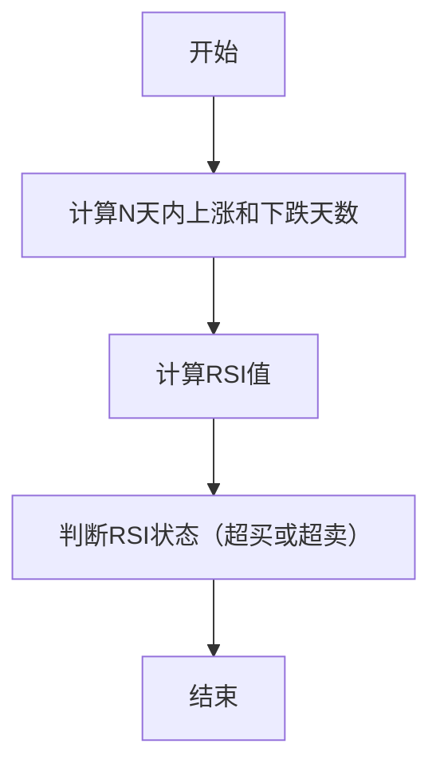
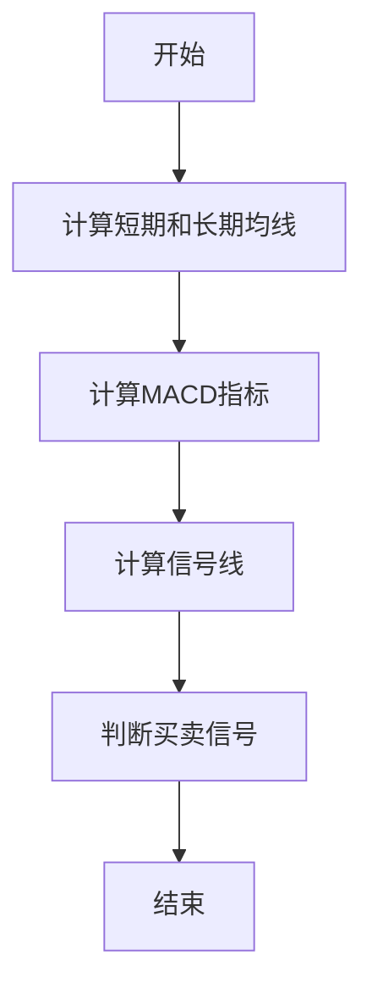
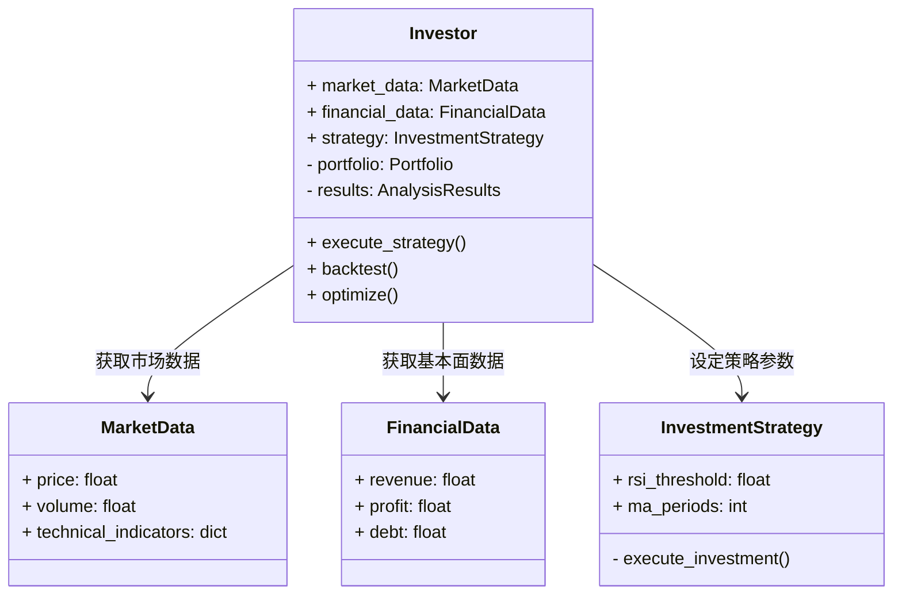

                 


```markdown
# 威廉欧奈尔的技术面与基本面结合

## 关键词：技术面分析、基本面分析、威廉·欧奈尔、RSI、MACD、投资策略、量化分析

## 摘要：  
本文探讨了威廉·欧奈尔的技术面分析方法与基本面分析的结合，分析了两者的核心概念、算法原理、数学模型，并通过系统架构设计和项目实战展示了结合的方法与优势。文章从背景介绍、核心概念、算法实现、系统设计、项目案例到最佳实践，全面解析了技术面与基本面结合的投资策略，为读者提供了一套理论与实践相结合的指导方案。

---

## 第一部分: 技术面与基本面结合的背景与基础

### 第1章: 技术面分析基础

#### 1.1 技术面分析的基本概念
- **技术面分析的定义**：通过分析价格走势、成交量等市场数据，预测未来价格变动的方法。
- **技术面分析的核心假设**：价格反映所有信息（弱有效市场假说）。
- **技术面分析的应用场景**：适用于高频交易、短期价格预测。

#### 1.2 技术面分析的常用指标
- **移动平均线（MA）**：显示价格趋势。
  - 短期：5日、10日MA。
  - 长期：50日、200日MA。
- **相对强弱指数（RSI）**：衡量超买或超卖状态，范围0-100。
  - RSI公式：$$RSI = \frac{\text{N天内上涨天数}}{\text{N天总交易天数}} \times 100$$
- **MACD指标**：由两条均线和一个柱状图组成，用于判断趋势强度。
  - MACD公式：$$\text{MACD} = \text{短期均线} - \text{长期均线}$$
  - 信号线公式：$$\text{Signal Line} = \text{MACD的N日移动平均线}$$

#### 1.3 技术面分析的方法
- **线形分析法**：绘制价格走势，识别趋势和支撑阻力位。
- **切线分析法**：使用趋势线、支撑线等工具。
- **指标分析法**：结合多个指标如RSI、MACD进行综合判断。

### 第2章: 基本面分析基础

#### 2.1 基本面分析的核心概念
- **基本面分析的定义**：通过分析公司财务报表、行业状况等因素，评估其内在价值。
- **基本面分析的关键指标**：市盈率（P/E）、市净率（P/B）、股息率等。
- **基本面分析的应用领域**：长期投资、价值投资。

#### 2.2 基本面分析的主要指标
- **财务报表分析**：利润表、资产负债表、现金流量表。
  - 利润表：评估盈利能力。
  - 资产负债表：评估资产和负债结构。
  - 现金流量表：评估现金流健康状况。
- **市盈率（P/E）**：股价与每股收益的比率，$$\text{P/E} = \frac{\text{股价}}{\text{每股收益}}$$
- **市净率（P/B）**：股价与每股净资产的比率，$$\text{P/B} = \frac{\text{股价}}{\text{每股净资产}}$$
- **股息率**：股息与股价的比率，$$\text{股息率} = \frac{\text{股息}}{\text{股价}} \times 100\%$$

#### 2.3 基本面分析的行业与公司分析
- **行业分析的基本方法**：行业生命周期、竞争结构、政策影响。
- **公司分析的关键点**：财务状况、管理团队、核心竞争力。
- **行业趋势对基本面的影响**：如科技行业受政策和技术进步影响较大。

### 第3章: 技术面与基本面的结合

#### 3.1 技术面与基本面结合的必要性
- **技术面与基本面的互补性**：技术面提供短期价格信号，基本面提供长期价值判断。
- **单一分析方法的局限性**：技术面可能忽视公司内在价值，基本面难以捕捉短期市场情绪。
- **综合分析的优势**：结合两者可以提高判断的准确性和全面性。

#### 3.2 技术面与基本面结合的策略
- **结合趋势分析与财务数据**：在技术面确认趋势后，基本面分析确认趋势的合理性。
- **寻找技术面信号与基本面支撑的双重机会**：如RSI超卖但公司基本面良好时，可能是买入机会。
- **动态调整分析框架**：根据市场变化，灵活调整技术面与基本面的权重。

---

## 第二部分: 技术面与基本面结合的核心概念与联系

### 第4章: 技术面与基本面的核心概念

#### 4.1 技术面与基本面的原理对比
| **技术面分析** | **基本面分析** |
|-----------------|----------------|
| 基于价格和成交量数据 | 基于公司财务、行业等基本面数据 |
| 短期价格预测为主 | 长期价值评估为主 |
| 忽略公司内在因素 | 忽略短期市场波动 |

#### 4.2 技术面与基本面的联系
- **价格反映基本面**：技术面价格走势反映基本面变化。
- **技术面作为信号**：基本面分析提供价值判断，技术面分析提供买卖时机。
- **结合使用**：技术面确认趋势，基本面确认趋势的合理性。

#### 4.3 技术面与基本面的ER实体关系图
```mermaid
er
  actor Investor
  entity MarketData {
    key: date
    << price, volume, technical_indicators
  }
  entity FinancialData {
    key: company
    << revenue, profit, debt
  }
  Investor -> MarketData: 使用技术面分析
  Investor -> FinancialData: 使用基本面分析
  MarketData <-|-> FinancialData: 数据关联
```

---

## 第三部分: 技术面与基本面结合的算法原理

### 第5章: 技术面分析的算法实现

#### 5.1 RSI算法实现


#### 5.2 Python代码实现
```python
def calculate_rsi(data, n=14):
    # 计算上涨和下跌幅度
    up = data['close'].diff().apply(lambda x: x if x > 0 else 0)
    down = data['close'].diff().apply(lambda x: abs(x) if x < 0 else 0)
    
    # 计算平均上涨和下跌幅度
    avg_up = up.rolling(n).mean()
    avg_down = down.rolling(n).mean()
    
    # 计算RSI
    rsi = 100 * (avg_up / (avg_up + avg_down))
    return rsi
```

#### 5.3 MACD算法实现


---

## 第四部分: 技术面与基本面结合的系统架构设计

### 第6章: 系统分析与架构设计

#### 6.1 系统功能设计


#### 6.2 系统架构设计


---

## 第五部分: 技术面与基本面结合的项目实战

### 第7章: 项目实战

#### 7.1 环境安装
- 安装Python和相关库：numpy、pandas、matplotlib、backtrader。

#### 7.2 核心代码实现
```python
import pandas as pd
import numpy as np

# 示例数据加载
data = pd.read_csv('stock_data.csv')

# 技术面分析
def calculate_rsi(df, n=14):
    up = df['close'].diff().apply(lambda x: x if x > 0 else 0)
    down = df['close'].diff().apply(lambda x: abs(x) if x < 0 else 0)
    avg_up = up.rolling(n).mean()
    avg_down = down.rolling(n).mean()
    rsi = 100 * (avg_up / (avg_up + avg_down))
    return rsi

rsi = calculate_rsi(data, 14)

# 基本面分析
def calculate_pe(data):
    pe = data['close'] / data['eps']
    return pe

pe = calculate_pe(data)

# 结合策略
combined_signal = (rsi > 70) & (pe < 15)
data['signal'] = combined_signal.astype(int)
```

#### 7.3 代码应用解读与分析
- **技术面信号**：RSI >70表示超买，可能为卖出信号。
- **基本面信号**：PE <15表示估值较低，可能为买入信号。
- **结合信号**：只有当两者同时满足时，才发出交易信号。

#### 7.4 实际案例分析
- 案例：某股票RSI为80，PE为12，结合信号为买入。

#### 7.5 项目小结
- 技术面与基本面结合提高了交易策略的科学性和可靠性。
- 通过量化分析，减少了人为情绪干扰。

---

## 第六部分: 技术面与基本面结合的最佳实践

### 第8章: 总结与展望

#### 8.1 总结
- 技术面与基本面结合是一种更全面的投资分析方法。
- 通过量化分析和系统架构设计，可以提高分析效率和准确性。

#### 8.2 最佳实践 tips
- **数据质量**：确保数据来源可靠，避免偏差。
- **模型调优**：根据市场变化，不断优化策略参数。
- **风险管理**：结合技术面和基本面信号，制定合理的风险管理策略。

#### 8.3 注意事项
- 避免过度依赖单一指标。
- 理解市场非理性波动的可能性。
- 定期回顾和评估策略的有效性。

#### 8.4 拓展阅读
- 《威廉·欧奈尔的选股方法》
- 《量化投资：技术分析的数学模型》
- 《投资学原理》

---

## 作者：AI天才研究院/AI Genius Institute & 禅与计算机程序设计艺术 /Zen And The Art of Computer Programming
```

