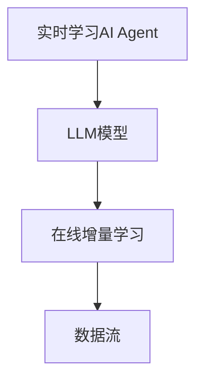
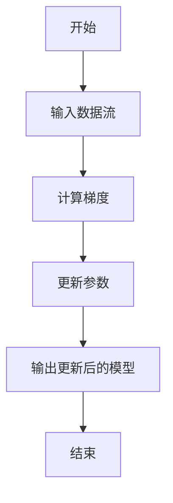
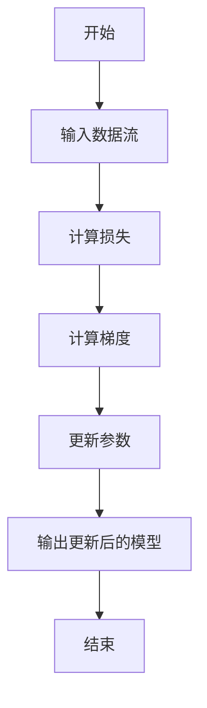
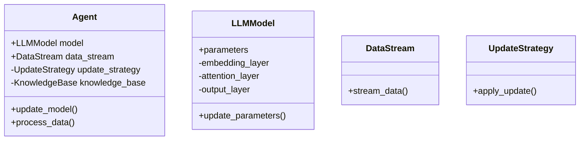
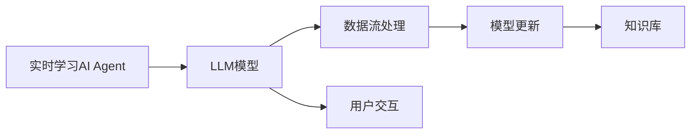
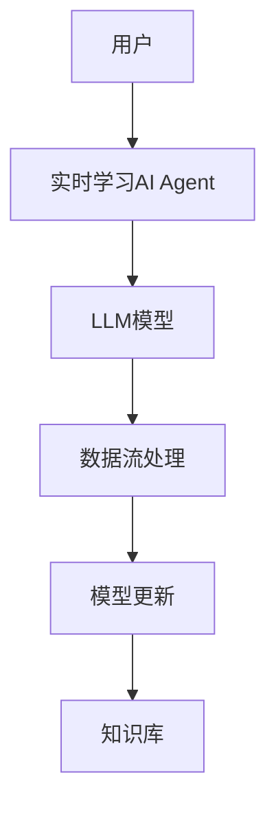

                 


# 实时学习AI Agent：LLM的在线增量学习

> 关键词：实时学习AI Agent, LLM, 在线增量学习, 梯度下降, 数据流处理, 系统架构设计

> 摘要：本文详细探讨了实时学习AI Agent的核心概念、在线增量学习的原理与实现、系统架构设计以及实际项目应用。通过数学公式、Mermaid图和代码示例的结合，深入分析了增量学习算法的数学模型、系统架构的类图与流程图，并展示了如何在实际项目中实现这些技术。

---

# 第一部分: 实时学习AI Agent与LLM的在线增量学习基础

# 第1章: 实时学习AI Agent概述

## 1.1 实时学习AI Agent的定义与背景

### 1.1.1 什么是实时学习AI Agent

实时学习AI Agent是一种能够实时感知环境变化、动态更新知识并做出响应的智能体。与传统AI模型不同，实时学习AI Agent具备在线增量学习的能力，能够在运行时不断吸收新的数据，更新自身的知识库和模型参数。

### 1.1.2 实时学习的背景与意义

在当前快速变化的信息环境中，传统的批量训练模型无法满足实时更新的需求。实时学习AI Agent通过在线增量学习，能够在数据流的实时变化中保持模型的准确性与相关性，从而更好地适应动态环境。

### 1.1.3 LLM在实时学习中的角色

大语言模型（LLM）作为实时学习AI Agent的核心组件，通过在线增量学习，能够实时更新其语言模型，适应新的语言数据和用户需求。这使得LLM在实时对话、实时信息检索等领域具备更强的实用价值。

---

## 1.2 LLM的在线增量学习

### 1.2.1 在线增量学习的基本概念

在线增量学习是一种机器学习范式，其特点是模型在接收到新的数据样本时，能够实时更新模型参数，而不必重新训练整个模型。这种学习方式适用于数据流环境，能够快速响应变化。

### 1.2.2 LLM的在线增量学习特点

- **实时性**：模型能够在接收到新数据后立即更新，快速响应环境变化。
- **高效性**：仅更新与新数据相关的参数，避免了全模型重新训练的高计算成本。
- **适应性**：能够适应数据分布的变化，保持模型的准确性。

### 1.2.3 LLM在线增量学习的应用场景

- **实时对话系统**：用户输入的数据能够实时更新语言模型，提升对话的流畅性和准确性。
- **实时信息检索**：根据最新的信息更新检索模型，提供更精准的结果。
- **动态知识库维护**：实时更新知识库，保持知识的最新性。

---

## 1.3 本章小结

本章介绍了实时学习AI Agent的基本概念，重点阐述了LLM的在线增量学习的特点和应用场景。通过对比传统批量学习，突出了在线增量学习的优势和重要性。

---

# 第二部分: 核心概念与联系

# 第2章: 增量学习的基本原理

## 2.1 增量学习的核心概念

### 2.1.1 在线学习与批量学习的对比

| 对比维度 | 在线学习 | 批量学习 |
|----------|----------|----------|
| 数据来源 | 实时数据流 | 离线数据集 |
| 训练效率 | 高频更新，计算成本低 | 低频更新，计算成本高 |
| 适应性 | 高 | 低 |

### 2.1.2 模型更新机制

模型更新机制是在线增量学习的核心，主要通过以下两种方式实现：

- **参数更新**：通过优化算法（如随机梯度下降）更新模型参数。
- **知识表示更新**：通过更新语言模型的词表或嵌入层，增加新知识。

### 2.1.3 数据流处理

数据流处理是在线增量学习的关键技术，主要包含以下步骤：

1. **数据接收**：实时接收新的数据样本。
2. **数据预处理**：清洗和格式化数据，确保数据质量。
3. **数据分片**：将数据分成小批量进行处理，降低计算复杂度。
4. **数据存储**：将处理后的数据存储在缓存或数据库中，供后续使用。

---

## 2.2 LLM增量学习的数学模型

### 2.2.1 概率分布的更新公式

在线增量学习中，模型参数的更新通常基于概率分布的优化。假设模型参数为$\theta$，更新公式如下：

$$\theta_{new} = \theta_{old} + \eta (y - \hat{y})$$

其中，$\eta$为学习率，$y$为目标值，$\hat{y}$为预测值。

### 2.2.2 参数更新的数学表达

随机梯度下降（SGD）是一种常用的在线增量学习算法，其更新公式为：

$$\theta_{t+1} = \theta_t - \eta \nabla J(\theta_t)$$

其中，$\nabla J(\theta_t)$为损失函数$J$在$\theta_t$处的梯度。

### 2.2.3 模型收敛性分析

在线增量学习的模型收敛性可以通过以下数学表达式分析：

$$\lim_{t \to \infty} \theta_t = \theta^*$$

其中，$\theta^*$为全局最优解。

---

## 2.3 核心概念之间的关系

### 2.3.1 实体关系图（ER图）



---

## 2.4 本章小结

本章详细阐述了增量学习的核心概念，包括在线学习与批量学习的对比、模型更新机制和数据流处理。通过数学公式和ER图，明确了核心概念之间的关系。

---

# 第三部分: 算法原理与实现

# 第3章: 增量学习算法原理

## 3.1 主流增量学习算法

### 3.1.1 随机梯度下降（SGD）

随机梯度下降是一种简单有效的在线增量学习算法，适用于大规模数据流环境。其算法流程图如下：



### 3.1.2 Ftrl算法

Ftrl算法是一种高效的在线增量学习算法，适用于稀疏数据环境。其核心思想是通过跟踪梯度累积来更新参数。

### 3.1.3 其他在线学习算法

其他常见的在线增量学习算法包括AdaGrad、Adam等，这些算法在不同场景下具有各自的优势。

---

## 3.2 算法流程图

### 3.2.1 SGD算法流程图



---

## 3.3 算法实现代码示例

### 3.3.1 SGD算法代码示例

```python
import numpy as np

def SGD(X, y, learning_rate=0.01, epochs=100):
    n_samples, n_features = X.shape
    theta = np.zeros(n_features)
    for epoch in range(epochs):
        for i in range(n_samples):
            y_pred = np.dot(X[i], theta)
            gradient = (y[i] - y_pred) * X[i]
            theta += learning_rate * gradient
    return theta
```

---

## 3.4 本章小结

本章重点介绍了主流的在线增量学习算法，包括随机梯度下降（SGD）和Ftrl算法，并通过代码示例展示了算法的实现过程。

---

# 第四部分: 系统分析与架构设计

# 第4章: 系统分析与架构设计

## 4.1 问题场景介绍

实时学习AI Agent的系统设计需要解决以下问题：

- 如何高效处理实时数据流？
- 如何保证模型更新的实时性和准确性？
- 如何设计系统的扩展性和容错性？

---

## 4.2 系统功能设计

### 4.2.1 领域模型（类图）



---

## 4.3 系统架构设计

### 4.3.1 系统架构图



---

## 4.4 系统接口设计

### 4.4.1 API接口

```python
interface AgentAPI {
    - update_model(data: list)
    - process_query(query: str)
    - get_result()
}
```

---

## 4.5 系统交互设计

### 4.5.1 序列图



---

## 4.6 本章小结

本章通过系统分析与架构设计，明确了实时学习AI Agent的系统组成、功能模块和交互流程。

---

# 第五部分: 项目实战

# 第5章: 项目实战

## 5.1 项目介绍

本项目旨在实现一个基于LLM的实时学习AI Agent，能够在实时数据流中动态更新语言模型。

---

## 5.2 核心代码实现

### 5.2.1 环境安装

```bash
pip install transformers mermaid4j
```

### 5.2.2 核心代码示例

```python
from transformers import AutoTokenizer, AutoModelForCausalLM
import torch

class RealTimeAgent:
    def __init__(self, model_name):
        self.tokenizer = AutoTokenizer.from_pretrained(model_name)
        self.model = AutoModelForCausalLM.from_pretrained(model_name)
    
    def update_model(self, new_data):
        # 数据预处理
        inputs = self.tokenizer(new_data, return_tensors="pt")
        # 模型更新
        outputs = self.model(**inputs)
        # 获取梯度并更新参数
        loss = outputs.loss
        loss.backward()
        # 更新模型参数
        self.model.parameters().backward()
        optimizer.step()
    
    def process_query(self, query):
        inputs = self.tokenizer(query, return_tensors="pt")
        with torch.no_grad():
            outputs = self.model(**inputs)
        return self.tokenizer.decode(outputs logits)
```

---

## 5.3 本章小结

本章通过实际项目案例，展示了如何实现一个基于LLM的实时学习AI Agent，并详细讲解了核心代码的实现过程。

---

# 第六部分: 高级主题与未来展望

# 第6章: 高级主题与未来展望

## 6.1 在线迁移学习

### 6.1.1 在线迁移学习的定义

在线迁移学习是一种结合了在线学习和迁移学习的技术，能够在实时数据流中快速适应新任务。

### 6.1.2 在线迁移学习的优势

- 知识复用能力强
- 适应性强
- 计算效率高

---

## 6.2 自适应学习

### 6.2.1 自适应学习的定义

自适应学习是一种能够根据环境变化自动调整学习策略的技术。

### 6.2.2 自适应学习的实现方法

- 动态调整学习率
- 自动选择模型参数
- 实时监控模型性能

---

## 6.3 未来研究方向

### 6.3.1 在线学习的优化算法

研究更高效的在线增量学习算法，如Adaptive SGD、Meta-Learning等。

### 6.3.2 分布式实时学习

研究分布式环境下的实时学习技术，提升系统的扩展性和容错性。

### 6.3.3 多模态实时学习

探索多模态数据流的实时学习方法，提升模型的感知能力和适应性。

---

## 6.4 应用趋势

随着实时数据流的广泛应用，实时学习AI Agent将在以下几个领域展现出更大的潜力：

- **实时推荐系统**：根据用户行为实时更新推荐模型。
- **实时监控系统**：实时检测异常数据并更新模型。
- **实时自然语言处理**：实现更智能的实时对话系统。

---

## 6.5 本章小结

本章探讨了实时学习AI Agent的高级主题，包括在线迁移学习和自适应学习，并展望了未来的研究方向和应用趋势。

---

# 作者

作者：AI天才研究院/AI Genius Institute & 禅与计算机程序设计艺术 /Zen And The Art of Computer Programming

---

通过以上内容，本文全面探讨了实时学习AI Agent的在线增量学习技术，从基础概念到算法实现，再到系统设计和实际应用，为读者提供了系统性的知识和实践指导。

