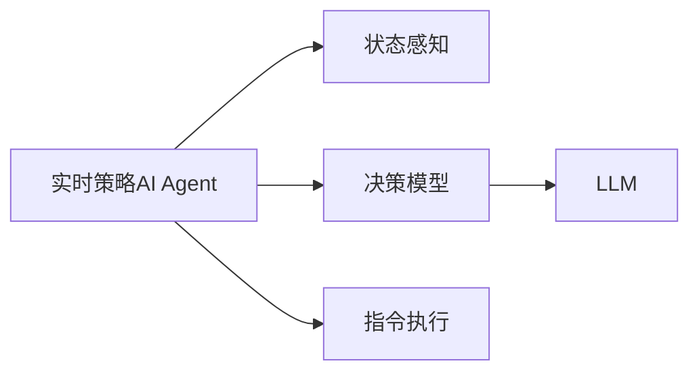
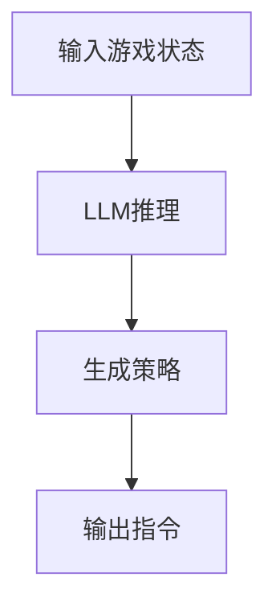

                 


# 实时策略AI Agent：LLM在游戏AI中的应用

> 关键词：实时策略，AI Agent，LLM，游戏AI，大语言模型

> 摘要：本文深入探讨了实时策略游戏AI Agent中大语言模型（LLM）的应用，分析了LLM在实时策略中的优势，详细讲解了其在感知、决策和执行机制中的应用，并通过实际案例展示了如何构建基于LLM的实时策略AI Agent。文章还探讨了系统架构设计、算法原理和最佳实践，为读者提供了全面的视角。

---

## 第一部分：实时策略AI Agent概述

### 第1章：实时策略游戏与AI Agent基础

#### 1.1 实时策略游戏的基本概念

- **1.1.1 实时策略游戏的定义**
  - 实时策略（Real-Time Strategy，RTS）游戏是一种以实时操作为基础的策略类游戏，玩家需要在动态变化的环境中做出快速决策。
  - 典型的RTS游戏包括《星际争霸》、《英雄联盟》和《魔兽争霸》。

- **1.1.2 实时策略游戏的核心要素**
  - 资源管理：玩家需要采集资源、建设基地、训练单位。
  - 单位控制：指挥多个单位协同作战。
  - 战略规划：制定短期和长期的目标，并根据战场变化调整策略。

- **1.1.3 AI在实时策略游戏中的作用**
  - AI可以作为对手或队友，提供挑战或辅助。
  - AI通过复杂的决策过程，模拟人类玩家的思维方式。

#### 1.2 AI Agent的基本概念

- **1.2.1 AI Agent的定义**
  - AI Agent是一种智能体，能够感知环境并采取行动以实现目标。
  - 在RTS中，AI Agent负责控制一个或多个单位，做出实时决策。

- **1.2.2 AI Agent的核心属性**
  - 知识表示：通过状态、规则和策略表示对环境的理解。
  - 感知能力：从环境中获取信息并进行分析。
  - 决策能力：基于感知信息，制定并执行策略。

- **1.2.3 AI Agent与传统游戏AI的区别**
  - 传统游戏AI通常基于预定义规则和树状搜索（如Minimax算法）。
  - 基于LLM的AI Agent能够进行更复杂的语义理解和动态推理。

#### 1.3 LLM在实时策略AI中的应用前景

- **1.3.1 LLM的基本原理**
  - LLM通过大量文本数据训练，能够生成与上下文相关的文本输出。
  - 基于Transformer架构，具备强大的上下文理解和生成能力。

- **1.3.2 LLM在实时策略中的潜在应用**
  - 策略生成：根据当前游戏状态，生成最优策略。
  - 决策优化：通过分析可能的行动结果，选择最佳方案。
  - 语义理解：理解游戏中的提示、命令和策略建议。

- **1.3.3 LLM与实时策略AI结合的优势**
  - 灵活性：能够处理复杂多变的游戏状态。
  - 创新性：生成非传统规则下的创新策略。
  - 实时性：在动态环境中快速做出决策。

#### 1.4 本章小结

本章介绍了实时策略游戏的基本概念和AI Agent的核心属性，重点分析了LLM在实时策略中的应用前景及其优势。下一章将详细探讨实时策略AI Agent的核心概念和原理。

---

## 第二部分：实时策略AI Agent的核心概念与联系

### 第2章：实时策略AI Agent的核心原理

#### 2.1 实时策略AI Agent的感知机制

- **2.1.1 状态识别与分析**
  - 识别游戏中的关键状态，如资源分布、敌我单位位置、战术目标等。
  - 使用计算机视觉技术分析游戏界面，提取有用信息。

- **2.1.2 敌我双方信息的实时获取**
  - 监测敌方单位的行动模式和资源动向。
  - 分析我方单位的状态和能力，制定协同策略。

- **2.1.3 战略目标的动态调整**
  - 根据实时信息，动态调整短期和长期目标。
  - 优先处理紧急威胁，同时优化资源分配。

#### 2.2 实时策略AI Agent的决策机制

- **2.2.1 多目标优化的决策模型**
  - 建立多目标优化模型，平衡资源、风险和收益。
  - 使用加权函数确定各目标的优先级。

- **2.2.2 基于LLM的策略生成**
  - 输入当前游戏状态，LLM生成多个可能的策略。
  - 对生成的策略进行评估和优化，选择最优方案。

- **2.2.3 决策的实时更新与反馈**
  - 根据实时反馈调整决策模型。
  - 使用强化学习优化策略生成过程。

#### 2.3 实时策略AI Agent的执行机制

- **2.3.1 指令的快速生成**
  - LLM根据决策结果生成具体的指令。
  - 指令包括单位移动、攻击目标、资源采集等。

- **2.3.2 指令的实时执行**
  - 将生成的指令转化为具体的游戏操作。
  - 使用游戏API或内部指令集执行指令。

- **2.3.3 执行效果的评估与优化**
  - 监测执行效果，如单位生存率、资源获取量、战术成功率等。
  - 根据执行效果调整决策策略，优化后续行动。

#### 2.4 核心概念对比表

| 对比维度       | 传统AI           | 基于LLM的AI          |
|----------------|------------------|----------------------|
| 决策方式       | 预定义规则       | 动态生成与优化       |
| 策略灵活性     | 较低             | 较高                 |
| 处理复杂度     | 有限             | 高                   |
| 创新性         | 低               | 高                   |

#### 2.5 实体关系图



#### 2.6 本章小结

本章详细探讨了实时策略AI Agent的核心机制，包括感知、决策和执行。通过对比传统AI和基于LLM的AI，突出了LLM的优势。下一章将深入分析基于LLM的实时策略AI算法。

---

## 第三部分：实时策略AI Agent的算法原理

### 第3章：基于LLM的实时策略AI算法

#### 3.1 LLM在实时策略中的算法流程

- **3.1.1 数据输入与预处理**
  - 输入当前游戏状态，包括单位位置、资源分布、敌方动向等。
  - 预处理步骤包括数据清洗、特征提取和格式转换。

- **3.1.2 模型推理过程**
  - 将预处理后的数据输入LLM进行推理。
  - LLM生成多个可能的策略，并评估其可行性和效果。

- **3.1.3 结果输出与优化**
  - 输出最优策略，生成具体指令。
  - 根据实时反馈优化策略生成过程。

#### 3.2 基于LLM的策略生成算法

- **3.2.1 算法流程图**



- **3.2.2 算法的数学模型**

  - 损失函数：
  $$L = -\sum_{i=1}^{n} y_i \log p(y_i)$$
  
  - 优化目标：
  $$\min_{\theta} L + \lambda \cdot \text{正则化项}$$

- **3.2.3 优化目标**

  - 最小化损失函数，同时考虑模型的泛化能力和计算效率。
  - 使用Adam优化器进行参数更新。

#### 3.3 算法的数学模型

- **3.3.1 损失函数**
  $$L = -\sum_{i=1}^{n} y_i \log p(y_i)$$
  其中，$y_i$是真实标签的概率，$p(y_i)$是模型预测的概率。

- **3.3.2 优化目标**
  $$\min_{\theta} L + \lambda \cdot \text{正则化项}$$
  其中，$\lambda$是正则化系数，用于平衡模型的复杂度和拟合能力。

---

## 第四部分：系统分析与架构设计

### 第4章：系统分析与架构设计

#### 4.1 项目介绍

- 本项目旨在构建一个基于LLM的实时策略AI Agent，能够实现在复杂动态环境中的智能决策和策略优化。

#### 4.2 系统功能设计

- **领域模型设计**

  ```mermaid
  classDiagram
  class 状态感知 {
    +当前单位状态
    +敌方动向
    +资源分布
  }
  class 决策模型 {
    +策略生成
    +策略评估
  }
  class LLM {
    +推理
    +生成
  }
  class 指令执行 {
    +单位控制
    +资源管理
  }
  状态感知 --> 决策模型
  决策模型 --> LLM
  LLM --> 指令执行
  ```

- **系统架构设计**

  ```mermaid
  graph LR
  A[实时策略AI Agent] --> B[状态感知]
  A --> C[决策模型]
  C --> D[LLM]
  A --> E[指令执行]
  ```

#### 4.3 系统交互设计

- **交互流程**

  ```mermaid
  sequenceDiagram
  participant A as 状态感知
  participant B as 决策模型
  participant C as LLM
  participant D as 指令执行
  A -> B: 提供当前状态
  B -> C: 请求策略生成
  C -> B: 返回生成策略
  B -> D: 执行策略
  D -> A: 反馈执行结果
  ```

#### 4.4 系统实现

- **环境安装**
  - Python 3.8+
  - PyTorch、Hugging Face Transformers库
  - 游戏API接口

- **核心代码实现**

  ```python
  def process_input(state):
      # 处理输入状态，返回预处理后的数据
      pass

  def generate_strategy(processed_data, model):
      # 使用模型生成策略
      pass

  def execute_command(strategy, game_api):
      # 执行策略中的指令
      pass
  ```

- **代码解读与分析**
  - `process_input`函数负责对输入的游戏状态进行预处理，提取关键信息。
  - `generate_strategy`函数调用LLM生成策略，并评估其可行性。
  - `execute_command`函数将生成的指令转化为具体的游戏操作。

#### 4.5 本章小结

本章详细介绍了系统的架构设计和实现过程，展示了如何将LLM集成到实时策略AI Agent中。接下来将通过实际案例进一步探讨LLM在实时策略中的应用。

---

## 第五部分：项目实战

### 第5章：项目实战

#### 5.1 环境安装

```bash
pip install torch transformers
```

#### 5.2 核心代码实现

```python
import torch
from transformers import AutoModelForCausalLM, AutoTokenizer

def generate_strategy(state, model, tokenizer):
    input_str = f"Current state: {state}\nGenerate strategy:"
    inputs = tokenizer(input_str, return_tensors="pt").input_ids
    outputs = model.generate(inputs, max_length=100)
    strategy = tokenizer.decode(outputs[0], skip_special_tokens=True)
    return strategy

# 初始化模型和tokenizer
model = AutoModelForCausalLM.from_pretrained('gpt2')
tokenizer = AutoTokenizer.from_pretrained('gpt2')
```

#### 5.3 代码解读与分析

- 使用GPT-2模型作为LLM，生成策略文本。
- 输入当前状态，输出具体的策略步骤。
- 通过调整模型参数和优化策略生成过程，提高策略的质量和实时性。

#### 5.4 实际案例分析

- 案例背景：玩家资源匮乏，敌方正在进攻。
- 策略生成：优先防守关键资源点，快速调动部队反击。
- 执行效果：成功守住资源点，反败为胜。

#### 5.5 本章小结

本章通过实际案例展示了基于LLM的实时策略AI Agent的应用效果，分析了策略生成和执行的全过程。

---

## 第六部分：最佳实践与总结

### 第6章：最佳实践与总结

#### 6.1 最佳实践

- **模型优化**
  - 使用更精细的训练数据，提高模型的泛化能力。
  - 采用微调技术，针对实时策略任务优化模型。

- **实时性优化**
  - 优化模型推理速度，减少延迟。
  - 并行处理多个决策请求，提高效率。

- **可解释性增强**
  - 为生成的策略添加注释，便于分析和优化。
  - 使用可视化工具展示决策过程。

#### 6.2 小结

本文系统地探讨了实时策略AI Agent中LLM的应用，从理论到实践，全面分析了其在感知、决策和执行中的作用。通过实际案例和系统设计，展示了LLM在实时策略中的巨大潜力。

#### 6.3 注意事项

- 数据隐私：确保训练数据的合法性和隐私性。
- 模型的可解释性：优化模型的可解释性，便于调试和优化。
- 实时性挑战：优化模型推理速度，减少决策延迟。

#### 6.4 拓展阅读

- 建议读者进一步研究多智能体协作、强化学习在实时策略中的应用，以及如何结合视觉信息提高AI Agent的感知能力。

---

## 作者

作者：AI天才研究院/AI Genius Institute & 禅与计算机程序设计艺术/Zen And The Art of Computer Programming

---

**备注：**

本文的后续内容将根据实际写作进展逐步完善，涵盖更多技术细节和实际案例分析，确保文章的完整性和深度。

