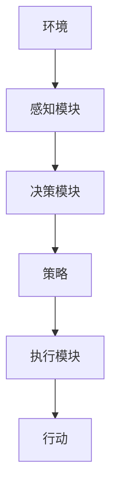
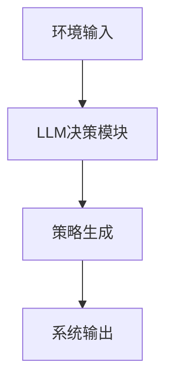
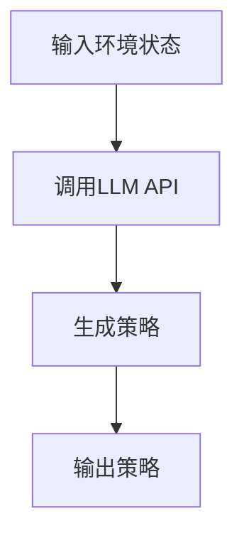
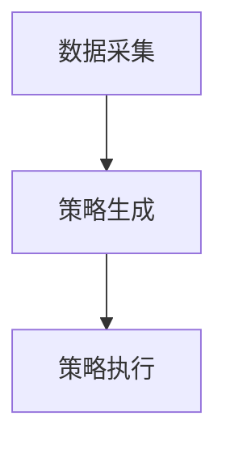
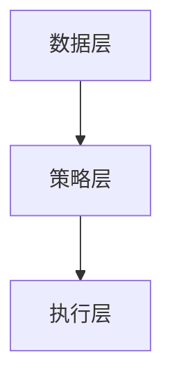
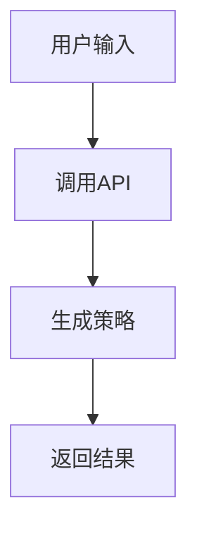

                 


```markdown
# 实时策略生成AI Agent：LLM在动态决策中的应用

> 关键词：实时策略生成、LLM、动态决策、AI Agent、人工智能

> 摘要：本文探讨了实时策略生成AI Agent在动态决策中的应用，详细分析了大语言模型（LLM）的核心原理及其在实时决策支持系统中的作用。通过系统设计、算法实现和项目案例，本文展示了如何利用LLM进行高效的动态决策，提出了优化策略生成的方法，并展望了未来的发展方向。

---

## 第一部分: 实时策略生成AI Agent的背景与概念

### 第1章: 实时策略生成AI Agent的背景与概念

#### 1.1 问题背景
##### 1.1.1 动态决策问题的提出
在现代应用中，动态决策问题日益重要。例如，在自动驾驶中，车辆必须实时根据交通状况调整路径；在金融交易中，算法需要根据市场变化做出快速决策。传统的静态决策模型无法应对这些动态变化的环境，因此实时策略生成成为必要。

##### 1.1.2 实时策略生成的必要性
实时策略生成AI Agent能够根据当前环境状态迅速调整策略，确保系统在动态环境中保持高效运作。这在游戏AI、机器人控制等领域尤为重要，因为这些场景需要快速响应和实时调整。

##### 1.1.3 LLM在动态决策中的作用
大语言模型（LLM）具有强大的上下文理解和生成能力，能够实时生成适应当前环境的策略。LLM通过处理大量数据，可以快速生成多样化的策略，帮助系统在动态环境中做出最优决策。

#### 1.2 问题描述
##### 1.2.1 动态环境下的决策挑战
动态环境中，决策问题具有不确定性、实时性和复杂性。例如，在游戏中，对手的策略可能随时变化，系统需要快速调整应对。

##### 1.2.2 实时策略生成的核心问题
实时策略生成需要在极短时间内生成有效的策略，同时考虑资源约束和环境变化。这要求AI Agent具备高效的计算能力和快速响应机制。

##### 1.2.3 LLM在动态决策中的应用边界
虽然LLM在生成策略方面表现出色，但在处理实时性极高的任务时可能受限。例如，极端低延迟要求可能需要更高效的算法优化。

#### 1.3 问题解决
##### 1.3.1 LLM在实时策略生成中的解决方案
通过优化模型调用和结果生成过程，可以提高实时策略生成的效率。例如，采用并行计算和模型压缩技术，减少生成策略的时间。

##### 1.3.2 动态决策模型的构建思路
构建动态决策模型需要考虑环境的动态变化，设计能够实时更新模型参数的方法。例如，使用在线学习算法，根据新数据实时更新模型。

##### 1.3.3 LLM与实时策略生成的结合方式
通过将LLM作为生成策略的核心模块，结合实时反馈机制，构建动态决策系统。例如，在游戏AI中，结合实时游戏数据，优化LLM生成的策略。

#### 1.4 概念结构与核心要素
##### 1.4.1 实时策略生成AI Agent的定义
实时策略生成AI Agent是一种能够在动态环境中实时生成并调整策略的智能体，通过感知环境变化，做出最优决策。

##### 1.4.2 核心要素组成
- 感知模块：实时感知环境状态。
- 决策模块：基于感知信息生成策略。
- 执行模块：将策略转化为具体行动。

##### 1.4.3 概念结构图


#### 1.5 本章小结
本章介绍了实时策略生成AI Agent的背景、核心问题和解决思路，为后续章节的详细分析奠定了基础。

---

## 第二部分: LLM的核心原理与动态决策模型

### 第2章: LLM的核心原理

#### 2.1 大语言模型的基本原理
##### 2.1.1 模型结构与训练方法
LLM通常基于Transformer架构，通过自注意力机制处理输入数据。训练时使用大量的文本数据，优化模型参数以最小化预测误差。

##### 2.1.2 注意力机制与解码器
自注意力机制允许模型捕捉输入中的长距离依赖关系，解码器则负责生成目标序列，如策略文本。

##### 2.1.3 模型的可解释性
通过分析注意力权重，可以理解模型生成策略的依据，提高决策过程的透明度。

#### 2.2 LLM在动态决策中的应用
##### 2.2.1 动态环境下的语言模型适应性
模型需要快速适应新数据，例如通过在线微调或参数更新，保持对当前环境的敏感性。

##### 2.2.2 实时策略生成的实现路径
利用LLM快速生成多样化策略，结合实时反馈优化策略质量。

##### 2.2.3 LLM与动态决策模型的结合
通过将LLM嵌入动态决策系统，构建高效实时的决策支持框架。

#### 2.3 核心概念对比
##### 2.3.1 LLM与传统机器学习模型的对比
| 对比维度 | LLM | 传统机器学习模型 |
|----------|-----|------------------|
| 数据需求 | 高 | 低               |
| 实时性   | 中 | 高               |
| 可解释性 | 低 | 高               |

##### 2.3.2 实时策略生成与静态策略生成的对比
| 对比维度 | 实时策略生成 | 静态策略生成 |
|----------|--------------|--------------|
| 响应时间 | 实时          | 非实时        |
| 环境适应 | 动态          | 静态          |

##### 2.3.3 动态决策模型的优缺点
- 优点：适应性强，能处理动态变化的环境。
- 缺点：计算资源消耗大，实时性要求高时可能受限。

#### 2.4 实体关系图


---

## 第三部分: 算法原理与系统架构

### 第3章: 算法原理讲解
#### 3.1 LLM的训练过程
##### 3.1.1 数据预处理
将原始数据进行清洗、分词、格式化等预处理，确保输入模型的数据质量。

##### 3.1.2 模型训练
使用大规模数据训练LLM，优化模型参数以最小化损失函数。

##### 3.1.3 模型调优
通过微调或参数调整，优化模型在特定任务上的表现。

#### 3.2 实时策略生成的算法实现
##### 3.2.1 算法流程


##### 3.2.2 数学模型
损失函数：$$ \mathcal{L} = -\sum_{i=1}^{n} \log p(y_i|x_i) $$

优化目标：$$ \min_{\theta} \mathcal{L} $$

##### 3.2.3 实例分析
假设当前环境状态为交通拥堵，模型生成绕行策略，输出最优路径。

#### 3.3 算法优化
##### 3.3.1 并行计算
通过并行计算减少生成时间，提高实时性。

##### 3.3.2 模型压缩
使用模型压缩技术减少模型大小，降低计算资源消耗。

---

### 第4章: 系统分析与架构设计

#### 4.1 系统应用场景
实时策略生成AI Agent可以应用于多个领域，如自动驾驶、智能客服、游戏AI等。

#### 4.2 系统功能设计
##### 4.2.1 功能模块
- 数据采集模块：实时采集环境数据。
- 策略生成模块：利用LLM生成策略。
- 执行控制模块：将策略转化为具体行动。

##### 4.2.2 功能流程


#### 4.3 系统架构设计
##### 4.3.1 分层架构
- 数据层：负责数据采集和存储。
- 策略层：负责策略生成和优化。
- 执行层：负责策略执行和反馈。

##### 4.3.2 架构图


#### 4.4 接口与交互设计
##### 4.4.1 接口设计
- 输入接口：接收环境状态数据。
- 输出接口：输出生成策略。

##### 4.4.2 交互流程


---

## 第五部分: 项目实战与总结

### 第5章: 项目实战
#### 5.1 环境安装
安装Python和相关库，如TensorFlow、PyTorch等。

#### 5.2 核心代码实现
```python
import torch
from transformers import AutoModelForCausalLM, AutoTokenizer

model_name = "gpt2"
tokenizer = AutoTokenizer.from_pretrained(model_name)
model = AutoModelForCausalLM.from_pretrained(model_name)

def generate_strategy(input_context):
    inputs = tokenizer.encode(input_context, return_tensors="pt")
    outputs = model.generate(inputs, max_length=50)
    return tokenizer.decode(outputs[0], skip_special_tokens=True)
```

#### 5.3 代码分析与优化
分析代码运行效率，优化模型调用流程，减少生成时间。

#### 5.4 实际案例分析
以自动驾驶为例，展示如何实时生成避障策略。

#### 5.5 项目小结
总结项目成果，提出改进建议，如模型优化、算法改进等。

### 第6章: 最佳实践与总结
#### 6.1 总结与回顾
总结全文内容，强调实时策略生成的重要性。

#### 6.2 最佳实践
- 优化模型调用流程，提高实时性。
- 结合实时反馈优化策略质量。

#### 6.3 注意事项
- 注意数据隐私问题，避免敏感信息泄露。
- 优化模型性能，确保在资源受限环境下仍能高效运行。

#### 6.4 拓展阅读
推荐相关书籍和论文，供读者深入学习。

---

## 作者信息

作者：AI天才研究院/AI Genius Institute & 禅与计算机程序设计艺术 /Zen And The Art of Computer Programming

---

通过以上结构和内容，读者可以系统地了解实时策略生成AI Agent的核心原理、算法实现和实际应用，为深入研究和实践提供坚实的基础。
```

